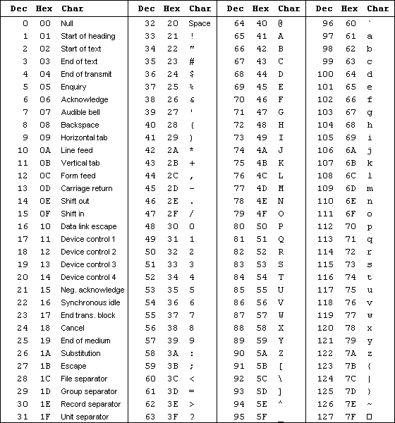
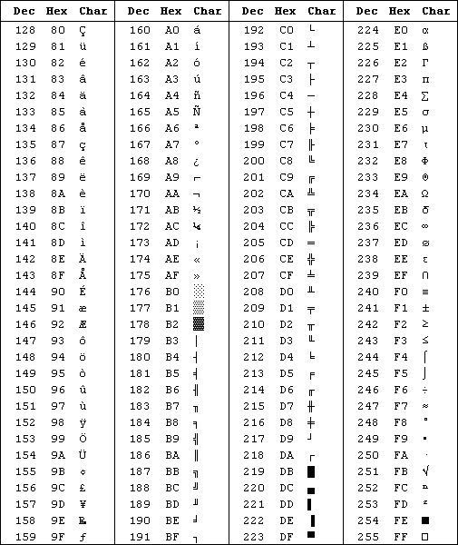

1. ASCII码 是现今最通用的单字节编码系统，并等同于国际标准ISO/IEC 646 。在这个页面，你可以找到8位的256个字符、ASCII码表和Windows-1252 (code page 1252，它是国际标准ISO 8859-1的一个扩展字符集) 标准保持一致;
2. ASCII码 是 American Standard Code for Information Interchange 的缩写，而不是ASCⅡ(罗马数字2)，有很多人在这个地方产生误解;
3. ASCII码 规范于1967年第一次发布，最后一次更新是在1986年，它包含了33个控制字符（具有某些特殊功能但是无法显示的字符）和95个可显示字符。  

**ASCII 控制字符 (字符编码: 0-31)**  
在ASCII码表中，前32个字符是不能用于打印控制的编码，而是用于控制像打印机一样的外围设备。  
第127个字符表示的是键盘上的删除命令。  

**ASCII 打印字符 (字符编码: 32-127)**  
32～126(共95个)是字符：32是空格，其中48～57为0到9十个阿拉伯数字，65～90为26个大写英文字母，97～122号为26个小写英文字母，其余为一些标点符号、运算符号等。

**ASCII扩展码 (字符编码: 128-255)**
后128个称为扩展ASCII码。许多基于x86的系统都支持使用扩展（或“高”）ASCII。扩展ASCII码允许将每个字符的第8位用于确定附加的128个特殊符号字符、外来语字母和图形符号。

