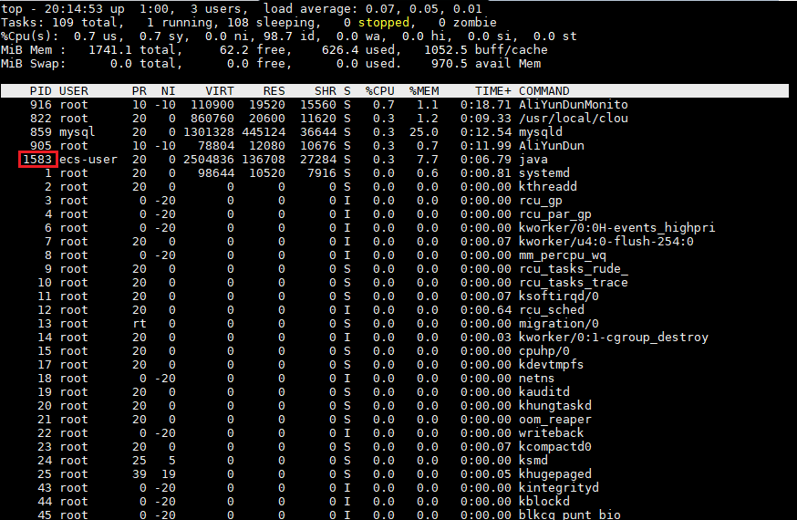
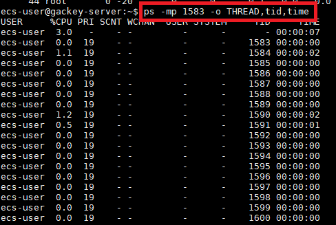
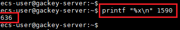
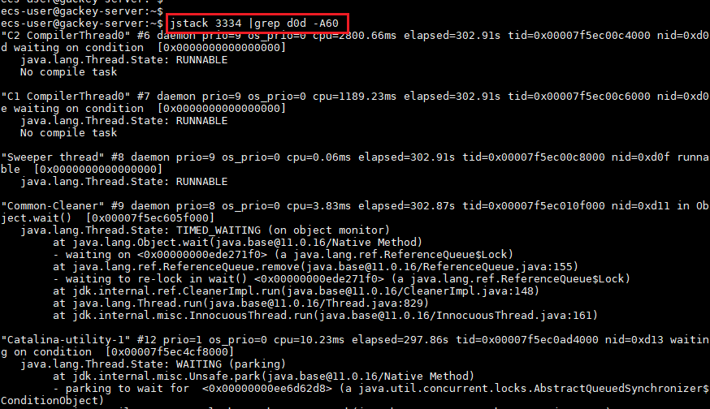
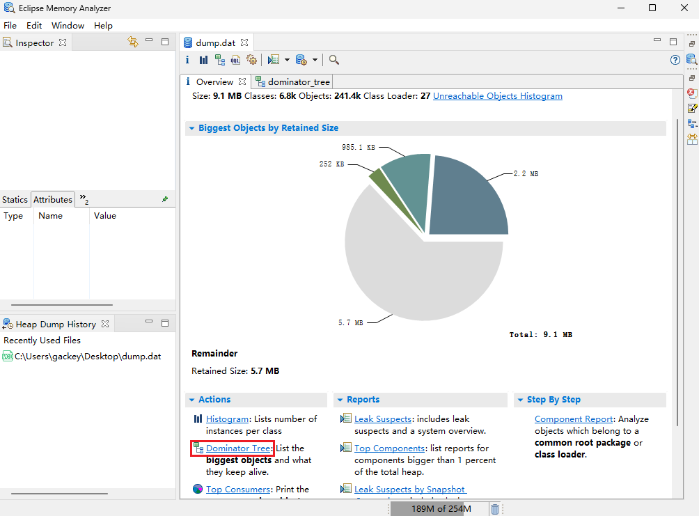

#### CPU与内存问题排查  

### CPU高占用定位
1.使用top命令，查看CPU占用情况，找到Java的pid(进程id)  
  
2.使用ps -mp命令将这个pid下线程占用cpu情况查出来，找到高占用的tid(线程id)，ps -mp 'pid' -o THREAD,tid,time  
  
3.使用printf "%x\n"将tid转换成16进制  
  
4.使用jstack通过pid和tid查找线程的运行状态，jstack 'pid' |grep 'tid' >> problem.log  
  

### 内存高占用定位
1.使用jmap命令手动生成堆转储快照(dump文件)。jmap -dump:format=b,file='dumpFileName' 'pid'  
    例：jmap -dump:format=b,file=/logFile/dump.dat 3334  
2.使用内存工具分析MAT、jvisualvm等进行分析。以MAT为例：  
File → Open Heap Dump... 打开dump.dat  
查看Overview中的Dominator Tree，确认内存占用高的线程对象，右键 → Java Basics → Thread Overview and Stacks，再通过内存占用情况和具体的对象值定位代码  
  
3.有内存溢出等问题时也可以查看Problem Suspect，See stacktrace可以查看打印的执行栈信息，Details可以查看对象占用内存的信息  

### 在OOM时自动dump快照
在JVM启动参数中加入如下参数：  
> -XX:+HeapDumpOnOutOfMemoryError  
> -XX:HeapDumpPath=/usr/local/app/oom

### JDK8启动常用参数模板
> -Xms4096M -Xmx4096M -Xmn3072M -Xss1M  -XX:MetaspaceSize=256M -XX:MaxMetaspaceSize=512M -XX:+UseParNewGC -XX:+UseConcMarkSweepGC -XX:CMSInitiatingOccupancyFaction=92 -XX:+UseCMSCompactAtFullCollection -XX:CMSFullGCsBeforeCompaction=0 -XX:+CMSParallelInitialMarkEnabled -XX:+CMSScavengeBeforeRemark -XX:+DisableExplicitGC -XX:+PrintGCDetails -Xloggc:gc.log -XX:+HeapDumpOnOutOfMemoryError  -XX:HeapDumpPath=/usr/local/app/oom