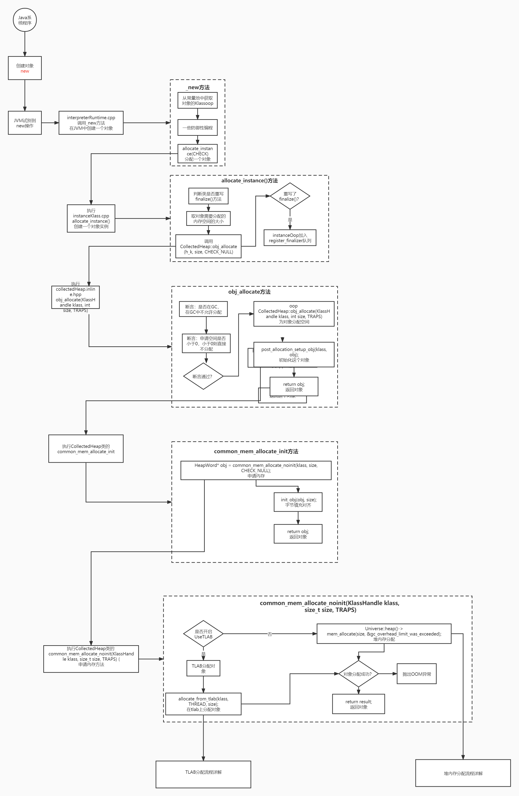
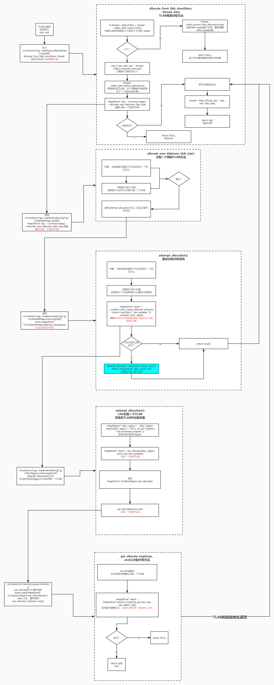
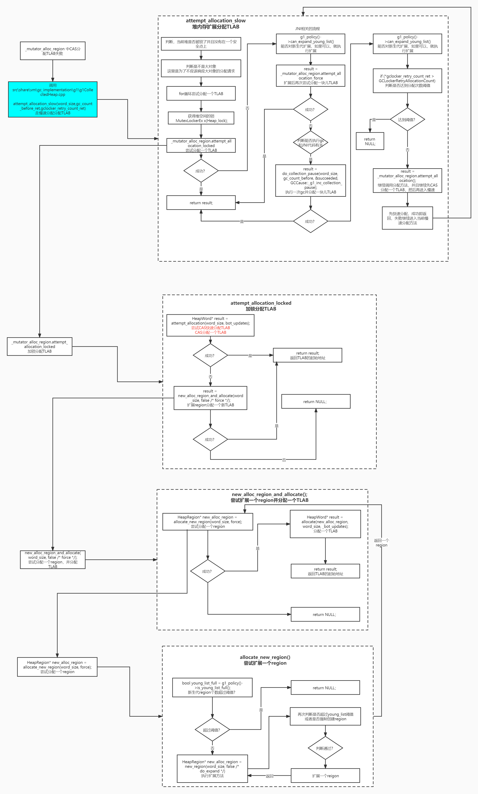
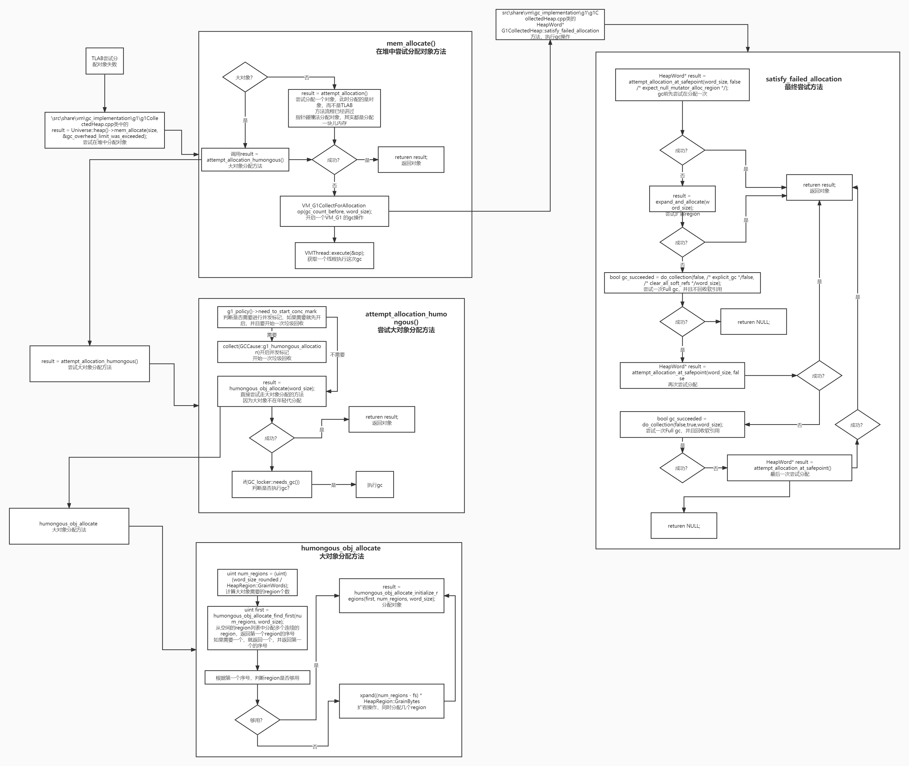

## G1垃圾回收器
G1：Garbage-First，这种垃圾回收器，会优先回收垃圾，不会等到空间全部占满，然后再进行回收。  
G1把分配的一整块内存切分成n个大小相同的分区（region），这种灵活可变的region机制，是G1能够做到控制停顿时间的核心设计。

#### HeapRegion
G1垃圾回收器内存管理的基本单位，也是最小单位。

#### G1设置HeapRegion的大小
1.通过JVM参数-XX:G1HeapRegionSize=n 来手动设置每个Region的大小  
2.启发式推断：G1根据内存（堆内存大小、分区的个数）的情况自动计算出region大小  
tips：region的大小只能在1-32M之间，并且是2的n次方（即1，2，4，8，16，32这几个值）。如果不是这几个值，G1会根据一定的算法规则动态调整region_size

#### 计算region的个数
**堆内存的大小**默认最小为0M，默认最大为96M。设置 InitialHeapSize 相当于设置 Xms ，设置 MaxHeapSize 相当于设置 Xmx  
设置堆内存大小的指令：-Xms8g -Xmx8g  

**堆分区的个数**会根据内存大小自动计算，默认2048个  

**计算公式：** heapRegionSize = max((InitialHeapSize+MaxHeapSize)/ 2 / 2048,1MB)[1,32]  
e.g.
- 指定region大小  
假如region大小设置为 2M，则G1的总内存大小为 2048 * 2MB = 4GB
- 指定堆内存大小  
假如设置 Xms = 32G，Xmx = 128G，那么 heapRegionSize = max((32GB+128GB)/2/2048,1MB) = 32MB；堆分区的个数最小为 32GB/32MB=1024，最大为 128GB/32MB=4096

### G1的内存模型分区
- 新生代分区： Young Heap Region（YHR）
- 老年代分区： Old Heap Region（OHR）
- 大对象分区： Humongous Heap Region（HHR）
- 自由分区： Free Heap Region（FHR）

G1也是基于分代模型来做的。使用逻辑分区的概念来完成整个G1的设计，region一部分属于新生代，一部分老年代，一部分大对象，还有一部分属于自由分区。对象分配时，先归属于新生代的eden区。

### 内存分配方式

#### 新生代内存分配
- 指定堆内存新生代的参数大小：NewSize、MaxNewSize  
如果只设置 Xmn 这一参数，相当于设置了MaxNewSize = NewSize = Xmn，这样新生代的大小就固定了。  
固定新生代内存大小可能导致在 young gc 时停顿预测模型没有办法生效（停顿预测模型+动态调整机制，是保障GC百分之九十能够保持在某个停顿时间内的关键）。

- 指定新生代占比：NewRatio  
这个参数用来设置老年代与新生代的比例，例如 -XX:NewRatio=4 代表老年代:新生代=4:1，如果只设置NewRatio，不管NewSize、MaxNewSize，则NewSize=MaxNewSize；如果设置了NewSize、MaxNewSize，同时又设置了NewRatio，那么NewRatio会被忽略。  
tips：不推荐直接自己指定新生代的大小，并且指定成一个固定值。

- G1启发式推断  
不指定NewSize和MaxNewSize，或只指定其中一个，G1会根据 G1MaxNewSizePercent（默认60%）和 G1NewSizePercent（默认5%）来计算新生代内存大小。  
一般来说，都是设定好堆内存的大小，然后新生代比例，新生代内存的大小，就让G1自动推断。

#### 老年代内存大小
设置了NewRatio，会间接设置老年代的大小，否则老年代没有固定大小。  
-XX:InitiatingHeapOccupancyPercent（默认是45%）是垃圾回收的出发阈值，这个参数代表老年代达到45%的内存占用时会触发mixedgc（混合回收）。

#### 为什么不推荐直接设置新生代大小和新生代占比？
为了满足动态扩展机制，结合GC和停顿预测模型，使得垃圾回收时间与程序运行时间达到平衡，才能够满足用户设定的期望停顿时间。

#### 扩展新分区的规则是什么？
根据-XX:GCTimeRatio控制，该参数表示GC与程序运行的耗费时间比，G1中的默认值是9。意思是，GC的时间与程序运行时间的比例不超过10%时，不需要动态扩展。

#### 扩展内存大小时分区数量有什么限制？
与G1ExpandByPercentOfAvailable（默认是20）的设置相关。每次扩展的时候都从未使用的内存中申请20%的空间，并且最小不能小于1M，最大不能超过已使用的内存大小。 1M < 未使用内存*20% < 已使用内存

### 停顿预测模型
通过GC前期的历史数据，预测垃圾回收的能力，估测期望停顿时间内一次可以回收的region数量，以满足用户对停顿时间的要求。

#### 衰减均值算法
每次执行垃圾收集时，都会记录下每个Region的回收耗时。耗时数据会用来计算一个衰减均值（Decaying Average），这是一个加权平均值，其中较旧的数据点权重较低。通过这种方式，衰减均值可以更关注近期的行为，而不是依赖于整个历史数据集。

#### 衰减标准差算法
在计算衰减均值的同时，也会计算每个Region回收耗时的标准偏差。标准偏差反映了数据点相对于平均值的分散程度，它是衡量未来成本不确定性的一个重要指标。G1也使用衰减标准差来表示对过去数据的信任度。如果标准差较大，说明数据点分散得比较广，预测的可信度就相对较低；反之，如果标准差较小，说明数据点分布较为集中，预测的可信度就较高。  
- **衰减因子**（Decay Factor）  
用 α 表示，作用是在每次混合模式垃圾回收后调整后续的新对象分配速率。衰减因子的值范围是0.0到1.0之间，默认值是0.6，其中0.0表示完全基于历史数据，而1.0则表示完全基于当前的数据。  
衰减平均计算公式（仅供参考，JVM中的算法更为复杂）：  
> davg(n) = Vn，n=1  
> davg(n) = (1-a)\*Vn + α\*davg(n-1)，n>1  

例如，α = 0.6，GC次数为3，第一次回收了2GB，耗时200ms，第二次回收了5GB，耗时300ms，第三次回收了3GB，耗时500ms，那么计算结果如下：  
> davg(1) = 2GB/200ms  
> davg(2) = (1-0.6)\*5GB/300ms + 0.6\*2GB/200ms  
> davg(3) = (1-0.6)\*3GB/500ms + 0.6\*((1-0.6)\*5GB/300ms + 0.6\*2GB/200ms)  

### Thread Local Allocation Buffer（TLAB）
TLAB是JVM为每个线程分配的私有内存区域，它位于堆内存中的年轻代（Eden）区域内。当分配线程对象时，就会在JVM的堆内存中分配一块固定大小的内存区域，并将它作为线程的私有缓冲区（TLAB）  

tips：在给线程分配TLAB时需要加锁，G1使用CAS来分配TLAB

#### TLAB的大小和数量
如果TLAB太小，则TLAB被填满，后面创建的对象无法分配到TLAB中，导致程序运行效率低；  
如果TLAB太大，会产生内存碎片，导致垃圾回收效率低。  

JVM会根据一些配置和运行时条件动态调整每个线程的TLAB大小，可以按照以下发放粗略估计TLAB的大小：
> 1. 确定Eden区的内存总大小
> 2. 选择TLAB所占Eden区的百分比，可以通过-XX:TLABWasteTargetPercent参数来指定，默认值通常是1%
> 3. TLAB的数量就是线程数量
> 4. 每个TLAB的大小 = Eden区大小 * TLAB所占Eden区的百分比 / 2 / 线程的数量  

G1通过 refill_waste 的值来判断TLAB的空间是否填满，可以通过 -XX:TLABRefillWasteFraction 来指定，表示TLAB中允许浪费的内存空间比例，默认值是64。  
默认情况，refill_waste的值 = TLAB的大小 / 64  
当TLAB空间不足时，如果新创建的对象大小大于 refill_waste，会在TLAB外的Eden区分配空间；如果新创建的对象大小小于 refill_waste，就重新申请一个TLAB，用来存放新创建的对象  
为了不在TLAB外的Eden区分配空间（就是由堆内存加锁分配），JVM会动态调节 refill_waste 和 TLAB 的大小

### 对象分配
- **快速分配**：当一个线程需要创建一个新的对象时，它首先尝试在其自己的TLAB中分配内存。由于每个线程都有自己的TLAB，所以大部分情况下，内存分配操作可以快速进行，而不需要获取全局锁或者使用原子指令（如CAS）。这样就降低了并发环境下的内存分配开销，提高了性能。
- **慢速分配**：如果一个线程的TLAB空间用完，那么该线程将从Eden区剩余的共享部分继续分配内存。这种情况下就需要进行同步处理，以确保多个线程同时分配内存时不会发生冲突。因此，这种方式被称为慢速分配。

#### 对象分配流程
  
1. TLAB剩余内存太小，无法分配对象，会有不同情况，要么是大于refill_waste，直接走堆内存分配，不走TLAB了，要么是小于refill_waste，但是TLAB剩余内存空间不够，这个时候会重新分配一个TLAB来用
2. 如果通过CAS分配新的TLAB后，就可以为对象分配空间，如果失败，就会进行堆加锁分配TLAB，如果分配TLAB成功，则可以为对象提供空间
3. 如果不能进行堆加锁分配TLAB，此时就会尝试去扩展分区，也就是再申请一些新的region。如果成功，就分配TLAB，为新创建的对象提供内存空间；如果不成功，就会进行垃圾回收
4. 如果分配尝试的次数超过了某个阈值（默认为2次），就会直接结束，OOM

#### 触发慢速分配的情况
1. TLAB空间用尽：当一个线程的TLAB空间用尽时，该线程需要从Eden区剩余的共享部分继续分配内存。这种情况下就需要进行同步处理，以确保多个线程同时分配内存时不会发生冲突。
2. 大对象分配：如果要创建的对象大小超过了-XX:PretenureSizeThreshold参数设置的阈值，那么这个对象将直接被分配到老年代。由于老年代是所有线程共享的区域，所以分配大对象时也需要进行同步处理。
3. 年轻代空间不足：当年轻代（包括Eden和Survivor区域）没有足够的空间来分配新对象时，垃圾收集器会被触发，清理不再使用的对象并释放内存。在垃圾回收过程中，新的对象分配操作可能需要等待垃圾收集完成，这也会导致分配速度变慢。

#### 大对象分配
判断一个对象是否是大对象通常依赖于以下条件：
1. 对象的大小超过了PretenureSizeThreshold参数设置的阈值
2. 对象的大小超过了某个特定的内部阈值（会根据堆内存的大小、应用的行为以及其他一些因素来动态确定，例如：大于heapRegionSize/2）  
这样G1会将其视为大对象并使用Humongous Region进行管理  

#### 最终分配尝试

### 对象分配的源码流程
#### new一个对象的流程

#### TLAB的快速分配流程

#### TLAB无法快速分配，进行重新分配流程

#### 堆内存加锁分配TLAB流程

#### 多次尝试分配TLAB失败，在eden中分配对象的流程
