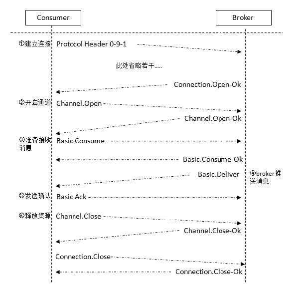

### 消息中间件的作用

- **解耦**：消息中间件在处理过程中间插入了一个隐含的、基于数据的接口层，两边的处理过程都要实现这一接口，这允许你独立地扩展或修改两边的处理过程，只要确保它们遵守同样的接口约束即可。
- **冗余（存储）**：消息中间件可以把数据进行持久化直到它们已经被完全处理，通过这一方式规避了数据丢失风险。在把一个消息从消息中间件中删除之前，需要你的处理系统明确地指出该消息已经被处理完成。
- **扩展性**：因为消息中间件解耦了应用的处理过程，所以提高消息入队和处理的效率是很容易的，只要另外增加处理过程即可，不需要改变代码，也不需要调节参数。
- **削峰**：如果以能处理峰值为标准而投入资源，无疑是巨大的浪费。使用消息中间件能够使关键组件支撑突发访问压力，不会因为突发的超负荷请求而完全崩溃。
- **可恢复性**：消息中间件降低了进程间的耦合度，所以即使一个处理消息的进程挂掉，加入消息中间件中的消息仍然可以在系统恢复后进行处理。
- **顺序保证**：在大多数使用场景下，数据处理的顺序很重要，大部分消息中间件支持一定程度上的顺序性。
- **缓冲**：消息中间件通过一个缓冲层来隔离各应用，帮助任务以最高效率执行，写入消息中间件的处理会尽可能快速。该缓冲层有助于控制和优化数据流经过系统的速度。
- **异步通信**：消息中间件提供了异步处理机制，允许应用把一些消息放入消息中间件中，但并不立即处理它，在之后需要的时候再慢慢处理。

### 消息中间件的传递模式
- **点对点（P2P，Point-to-Point）模式**：点对点模式是基于队列的，消息生产者发送消息到队列，消息消费者从队列中接收消息，队列的存在使得消息的异步传输成为可能。
- **发布/订阅（Pub/Sub）模式**：发布订阅模式定义了如何向一个内容节点发布和订阅消息，这个内容节点称为主题（topic），主题可以认为是消息传递的中介，消息发布者将消息发布到某个主题，而消息订阅者则从主题中订阅消息。

### 消息中间件常用的协议
#### AMQP
Advanced Message Queuing Protocol，高级消息队列协议。  
AMQP是一种开放标准的应用层网络协议，旨在为分布式系统提供统一的消息服务，实现可靠、高效的消息传递。AMQP的核心目标是为应用程序提供一种通用的消息中间件解决方案，允许不同的系统和组件之间通过消息传递的方式进行松耦合通信。

- **AMQP 协议本身包括三层**  

<table>
    <tr>
        <td style="width: 10%">Module Layer</td>
        <td>位于协议最高层，主要定义了一些供客户端调用的命令，客户端可以利用这些命令实现自己的业务逻辑。例如，客户端可以使用Queue.Declare 命令声明一个队列或者使用Basic.Consume 订阅消费一个队列中的消息</td>
    </tr>
    <tr>
        <td style="width: 10%">Session Layer</td>
        <td>位于中间层，主要负责将客户端的命令发送给服务器，再将服务端的应答返回给客户端，主要为客户端与服务器之间的通信提供可靠性同步机制和错误处理</td>
    </tr>
    <tr>
        <td style="width: 10%">Transport Layer</td>
        <td>位于最底层，主要传输二进制数据流，提供帧的处理、信道复用、错误检测和数据表示等</td>
  </tr>
</table>

#### STOMP
Simple (or Streaming) Text Oriented Messaging Protocol，简单（流）文本面向消息协议，设计用于在消息代理（Message Broker）和客户端应用程序之间进行异步消息传递。STOMP提供了一个标准化的、可互操作的连接格式，使得STOMP客户端可以通过任何支持该协议的消息中间件进行消息交互。  
STOMP协议的特点在于它的简单性，它是基于文本的，易于理解且容易实现。它支持多种消息模式，包括点对点（Point-to-Point）、发布/订阅（Publish/Subscribe）等，并允许客户端通过发送简单的命令（如SEND、SUBSCRIBE、UNSUBSCRIBE等）与消息代理进行通讯。  
STOMP的灵活性体现在它能够运行在多种底层传输协议之上，如TCP、HTTP和WebSocket，这使得STOMP客户端可以在多种网络环境和应用场景中使用。  

#### MQTT
Message Queuing Telemetry Transport，消息队列遥测传输，是IBM 开发的一个即时通信协议。  
MQTT协议是一种轻量级的、基于发布/订阅（publish/subscribe）模型的物联网（IoT）通信协议。它设计之初是为了在资源受限的设备（如传感器网络和移动设备）之间高效、可靠地传输数据。MQTT协议非常适合于远程位置、低带宽、不稳定网络条件下的设备连接和数据交换。

### AMQP 协议消息运转时序图
- **生产者发送消息时序图**  

- **消费者接收消息时序图**  

### AMQP主要命令概览
 名 称 | 是否包含内容体 | 对应客户端中的方法 | 简要描述 
 :---- | :----: | :---- | :----
Connection.Start | 否 | factory.newConnection | 建立连接相关
Connection.Start-Ok | 否 | 同上 | 同上
Connection.Tune | 否 | 同上 | 同上
Connection.Tune-Ok | 否 | 同上 | 同上
Connection.Open | 否 | 同上 | 同上
Connection.Open-Ok | 否 | 同上 | 同上
Connection.Close | 否 | connection.close | 关闭连接
Connection.Close-Ok | 否 | 同上 | 同上
Channel.Open | 否 | connection.openChannel | 开启信道
Channel.Open-Ok | 否 | 同上 | 同上
Channel.Close | 否 | channel.close | 关闭信道
Channel.Close-Ok | 否 | 同上 | 同上
Exchange.Declare | 否 | channel.exchangeDeclare | 声明交换器
Exchange.Declare-Ok | 否 | 同上 | 同上
Exchange.Delete | 否 | channel.exchangeDelete | 删除交换器
Exchange.Delete-Ok | 否 | 同上 | 同上
Exchange.Bind | 否 | channel.exchangeBind | 交换器与交换器绑定
Exchange.Bind-Ok | 否 | 同上 | 同上
Exchange.Unbind | 否 | channel.exchangeUnbind | 交换器与交换器解绑
Exchange.Unbind-Ok | 否 | 同上 | 同上
Queue.Declare | 否 | channel.queueDeclare | 声明队列
Queue.Declare-Ok | 否 | 同上 | 同上
Queue.Bind | 否 | channel.queueBind | 队列与交换器绑定
Queue.Bind-Ok | 否 | 同上 | 同上
Queue.Purge | 否 | channel.queuePurge | 清除队列中的内容
Queue.Purge-Ok | 否 | 同上 | 同上
Queue.Delete | 否 | channel.queueDelete | 删除队列
Queue.Delete-Ok | 否 | 同上 | 同上
Queue.Unbind | 否 | channel.queueUnbind | 队列与交换器解绑
Queue.Unbind-Ok | 否 | 同上 | 同上
Basic.Qos | 否 | channel.basicQos | 设置未被确认消费的个数
Basic.Qos-Ok | 否 | 同上 | 同上
Basic.Consume | 否 | channel.basicConsume | 消费消息（推模式）
Basic.Consume-Ok | 否 | 同上 | 同上
Basic.Cancel | 否 | channel.basicCancel | 取消
Basic.Cancel-Ok | 否 | 同上 | 同上
Basic.Publish | 是 | channel.basicPublish | 发送消息
Basic.Return | 是 | 无 | 未能成功路由的消息返回
Basic.Deliver | 是 | 无 | Broker | 推送消息
Basic.Get | 否 | channel.basicGet | 消费消息（拉模式）
Basic.Get-Ok | 是 | 同上 | 同上
Basic.Ack | 否 | channel.basicAck | 确认
Basic.Reject | 否 | channel.basicReject | 拒绝（单条拒绝）
Basic.Recover | 否 | channel.basicRecover | 请求Broker 重新发送未被确认的消息
Basic.Recover-Ok | 否 | 同上 | 同上
Basic.Nack | 否 | channel.basicNack | 拒绝（可批量拒绝）
Tx.Select | 否 | channel.txSelect | 开启事务
Tx.Select-Ok | 否 | 同上 | 同上
Tx.Commit | 否 | channel.txCommit | 事务提交
Tx.Commit-Ok | 否 | 同上 | 同上
Tx.Rollback | 否 | channel.txRollback | 事务回滚
Tx.Rollback-Ok | 否 | 同上 | 同上
Confirm Select | 否 | channel.confirmSelect | 开启发送端确认模式
Confirm.Select-Ok | 否 | 同上 | 同上
