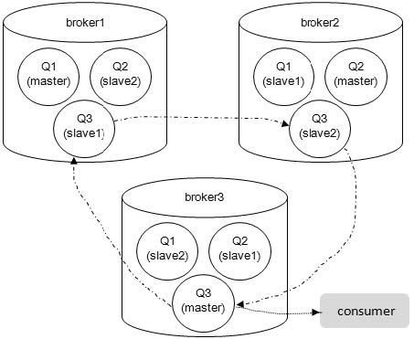

> RabbitMQ 版本为3.6.10
> 摘抄自《RabbitMQ实战指南》 朱忠华 著

### RabbitMQ的优点
- **可靠性**：RabbitMQ 使用一些机制来保证可靠性，如持久化、传输确认及发布确认等。
- **灵活的路由**：在消息进入队列之前，通过交换器来路由消息。对于典型的路由功能，RabbitMQ 已经提供了一些内置的交换器来实现。针对更复杂的路由功能，可以将多个交换器绑定在一起，也可以通过插件机制来实现自己的交换器。
- **扩展性**：多个 RabbitMQ 节点可以组成一个集群，也可以根据实际业务情况动态地扩展集群中节点。
- **高可用性**：队列可以在集群中的机器上设置镜像，使得在部分节点出现问题的情况下队列仍然可用。
- **多种协议**：RabbitMQ除了原生支持AMQP协议，还支持STOMP、MQTT 等多种消息中间件协议。
- **多语言客户端**：RabbitMQ几乎支持所有常用语言，比如Java、Python、Ruby、PHP、C#、JavaScript 等。
- **管理界面**：RabbitMQ 提供了一个易用的用户界面，使得用户可以监控和管理消息、集群中的节点等。
- **插件机制**：RabbitMQ 提供了许多插件，以实现从多方面进行扩展，当然也可以编写自己的插件。

### RabbitMQ的模型架构


### RabbitMQ基本概念
#### Producer：生产者
就是投递消息的一方。生产者创建消息，然后发布到RabbitMQ 中。  
消息一般可以包含2个部分：**消息体**和**标签**（Label）。  
消息体也可以称之为payload，在实际应用中，消息体一般是一个带有业务逻辑结构的数据，比如一个JSON字符串。当然可以进一步对这个消息体进行序列化操作。  
消息的标签用来表述这条消息，比如一个交换器的名称和一个路由键。生产者把消息交由RabbitMQ，RabbitMQ之后会根据标签把消息发送给对应的Broker。

#### Consumer：消费者
就是接收消息的一方。消费者连接到RabbitMQ 服务器，并订阅到队列上。当消费者消费一条消息时，只是消费消息的消息体（payload）。  
在消息路由的过程中，消息的标签会丢弃，存入到队列中的消息只有消息体，消费者也只会消费到消息体，也就不知道消息的生产者是谁，当然消费者也不需要知道。

#### Broker
一个RabbitMQ Broker 可以简单地看作一个RabbitMQ 服务节点，或者RabbitMQ 服务实例。大多数情况下也可以将一个RabbitMQ Broker 看作一台RabbitMQ服务器。

#### Queue：队列
RabbitMQ 的内部对象，用于存储消息。  
RabbitMQ 中消息都只能存储在队列中，这一点和Kafka 这种消息中间件相反。Kafka 将消息存储在topic（主题）这个逻辑层面，而相对应的队列逻辑只是topic 实际存储文件中的位移标识。  
多个消费者可以订阅同一个队列，这时队列中的消息会被平均分摊（Round-Robin，即轮询）给多个消费者进行处理，而不是每个消费者都收到所有的消息并处理。  
<span style="color: red;">tips</span>：RabbitMQ 不支持队列层面的广播消费，如果需要广播消费，需要在其上进行二次开发，处理逻辑会变得异常复杂，同时也不建议这么做。

#### Exchange：交换器
生产者将消息发送到Exchange（交换器，通常也可以用大写的“X”来表示），由交换器将消息路由到一个或者多个队列中。如果路由不到，或许会返回给生产者，或许直接丢弃。

##### 交换器类型
RabbitMQ 常用的交换器类型有fanout、direct、topic、headers 这四种。  
<span style="color: red;">tips</span>：AMQP 协议里还提到另外两种类型：System 和自定义  

- **fanout**  
它会把所有发送到该交换器的消息路由到所有与该交换器绑定的队列中。

- **direct**  
它会把消息路由到那些BindingKey 和RoutingKey 完全匹配的队列中。

- **topic**  
按照一定的匹配规则将消息路由到BindingKey 和RoutingKey 相匹配的队列中。
> RoutingKey 和BindingKey 都是用一个点号“.”分隔的字符串（被点号“.”分隔开的每一段独立的字符串称为一个单词），如“com.rabbitmq.client”  
> BindingKey 中可以存在两种特殊字符串“\*”和“#”，用于做模糊匹配，其中“\*”用于匹配一个单词，“#”用于匹配多个单词（可以是零个）  

例："*.log" 将匹配任何以 .log 结尾的消息路由键，如 "info.log" 或 "error.log"，但不会匹配 "debug.user.log"  
&emsp;&emsp; "topic.#" 将匹配任何以 topic. 开头的所有路由键，如 "topic.info"、"topic.error.subitem" 等

- **headers**  
headers 类型的交换器不依赖于路由键的匹配规则来路由消息，而是根据发送的消息内容中的headers 属性进行匹配。在绑定队列和交换器时制定一组键值对，当发送消息到交换器时，RabbitMQ 会获取到该消息的headers（也是一个键值对的形式），对比其中的键值对是否完全匹配队列和交换器绑定时指定的键值对，如果完全匹配则消息会路由到该队列，否则不会路由到该队列。headers 类型的交换器性能会很差，而且也不实用，基本上不会看到它的存在。

#### RoutingKey：路由键
生产者将消息发给交换器的时候，一般会指定一个RoutingKey，用来指定这个消息的路由规则，而这个Routing Key 需要与交换器类型和绑定键（BindingKey）联合使用才能最终生效。

##### BindingKey
在绑定的时候使用的路由键（the routing key to use for the binding）。大多数时候，包括官方文档和RabbitMQ Java API中都把BindingKey 和RoutingKey 看作RoutingKey。

#### Binding：绑定
RabbitMQ 中通过绑定将交换器与队列关联起来，在绑定的时候一般会指定一个绑定键（BindingKey），生产者将消息发送给交换器时，需要一个RoutingKey，当BindingKey 和RoutingKey 相匹配时，消息会被路由到对应的队列中。  
在绑定多个队列到同一个交换器的时候，这些绑定允许使用相同的BindingKey。  
BindingKey 并不是在所有的情况下都生效，它依赖于交换器类型，比如fanout 类型的交换器就会无视BindingKey，而是将消息路由到所有绑定到该交换器的队列中。

### RabbitMQ的运转过程

- **生产者发送消息的过程**  
（1）生产者连接到RabbitMQ Broker，建立一个连接（Connection），开启一个信道（Channel）  
（2）生产者声明一个交换器，并设置相关属性，比如交换机类型、是否持久化等  
（3）生产者声明一个队列并设置相关属性，比如是否排他、是否持久化、是否自动删除等  
（4）生产者通过路由键将交换器和队列绑定起来  
（5）生产者发送消息至RabbitMQ Broker，其中包含路由键、交换器等信息  
（6）相应的交换器根据接收到的路由键查找相匹配的队列  
（7）如果找到，则将从生产者发送过来的消息存入相应的队列中  
（8）如果没有找到，则根据生产者配置的属性选择丢弃还是回退给生产者  
（9）关闭信道  
（10）关闭连接  
- **消费者接受消息的过程**  
（1）消费者连接到RabbitMQ Broker，建立一个连接（Connection），开启一个信道（Channel）  
（2）消费者向RabbitMQ Broker 请求消费相应队列中的消息，可能会设置相应的回调函数，以及做一些准备工作  
（3）等待RabbitMQ Broker 回应并投递相应队列中的消息，消费者接收消息  
（4）消费者确认（ack）接收到的消息  
（5）RabbitMQ 从队列中删除相应已经被确认的消息  
（6）关闭信道  
（7）关闭连接  

### 连接RabbitMQ

#### Connection
Connection 是指客户端与RabbitMQ服务器之间建立的TCP连接。它是一个底层的网络连接，用于承载AMQP的消息交换。  
RabbitMQ 采用类似NIO的做法，选择TCP 连接复用，不仅可以减少性能开销，同时也便于管理。

#### Channel
Channel 是一种轻量级的通信通道，它是建立在 Connection 之上的逻辑单元。每个 Connection 可以拥有多个 Channel，并且所有通信都在 Channel 上进行，而不是直接在 Connection 上。  
Channel 提供了一种在单个TCP连接上执行多路复用的方法，这意味着通过一个TCP连接，可以处理多个并发的AMQP 会话，而不必为每个会话维护独立的连接。  
使用 Channel 而不是直接在 Connection 上操作，可以减少TCP连接的创建和销毁；但是Channel 实例不能在线程间共享，在网络上出现错误的通信帧交错，同时也会影响发送方确认（publisher confirm）机制的运行，所以多线程间共享Channel 实例是非线程安全的。

#### 使用交换器和队列
生产者和消费者都可以声明一个交换器或者队列。  
如果尝试声明一个已经存在的交换器或者队列，只要声明的参数完全匹配现存的交换器或者队列，RabbitMQ就可以什么都不做，并成功返回。如果声明的参数不匹配则会抛出异常。  

#### 何时创建交换器和队列
按照RabbitMQ 官方建议，生产者和消费者都应该尝试创建（这里指声明操作）队列。这是一个很好的建议，但不适用于所有的情况。如果业务本身在架构设计之初已经充分地预估了队列的使用情况，完全可以在业务程序上线之前在服务器上创建好（比如通过页面管理、RabbitMQ命令或者更好的是从配置中心下发），这样业务程序也可以免去声明的过程，直接使用即可。预先创建好资源还有一个好处是，可以确保交换器和队列之间正确地绑定匹配。

- ##### exchangeDeclare
这个方法的返回值是Exchange.DeclareOK，用来标识成功声明了一个交换器。  
```java
Exchange.DeclareOk exchangeDeclare(String exchange, String type, boolean durable, boolean autoDelete, 
                                boolean internal, Map<String, Object> arguments) throws IOException;
```
> exchange：交换器的名称。  
  type：交换器的类型，常见的如fanout、direct、topic。  
  durable：设置是否持久化。durable 设置为true 表示持久化，反之是非持久化。持久化可以将交换器存盘，在服务器重启的时候不会丢失相关信息。  
  autoDelete：设置是否自动删除。autoDelete 设置为true 则表示自动删除。自动删除的前提是至少有一个队列或者交换器与这个交换器绑定，之后所有与这个交换器绑定的队列或者交换器都与此解绑。注意不能错误地把这个参数理解为：“当与此交换器连接的客户端都断开时，RabbitMQ 会自动删除本交换器”。  
  internal：设置是否是内置的。如果设置为true，则表示是内置的交换器，客户端程序无法直接发送消息到这个交换器中，只能通过交换器路由到交换器这种方式。  
  argument：其他一些结构化参数，比如alternate-exchange

exchangeDeclare 的其他重载方法如下：
```java
Exchange.DeclareOk exchangeDeclare(String exchange, String type) throws IOException;

Exchange.DeclareOk exchangeDeclare(String exchange, String type, boolean durable) throws IOException;

Exchange.DeclareOk exchangeDeclare(String exchange, String type, boolean durable, boolean autoDelete, Map<String, Object> arguments) throws IOException;
```
<span style="color: red;">tips</span>：第二个参数String type 可以换成BuiltInExchangeType type

**其他创建交换器的方法**
```java
// 客户端声明了一个交换器之后，不需要服务器任何返回值（如果服务器还并未完成交换器的创建，紧接着使用会发生异常，所以不建议使用该方法）
void exchangeDeclareNoWait(String exchange, String type, boolean durable, boolean autoDelete,
                            boolean internal, Map<String, Object> arguments) throws IOException;

// 检测相应的交换器是否存在。如果存在则正常返回；如果不存在则抛出异常：404 channel exception，同时Channel 也会被关闭
Exchange.DeclareOk exchangeDeclarePassive(String name) throws IOException;
```

**删除交换器的方法**
```java
Exchange.DeleteOk exchangeDelete(String exchange) throws IOException;

void exchangeDeleteNoWait(String exchange, boolean ifUnused) throws IOException;

Exchange.DeleteOk exchangeDelete(String exchange, boolean ifUnused) throws IOException;
```
> exchange：表示交换器的名称  
ifUnused：用来设置是否在交换器没有被使用的情况下删除。如果isUnused 设置为true，则只有在此交换器没有被使用的情况下才会被删除；如果设置false，则无论如何这个交换器都要被删除

- ##### queueDeclare
声明一个队列。

```java
// 创建一个由RabbitMQ 命名的（类似这种amq.gen-LhQz1gv3GhDOv8PIDabOXA 名称，这种队列也称之为匿名队列）、排他的、自动删除的、非持久化的队列
Queue.DeclareOk queueDeclare() throws IOException;

Queue.DeclareOk queueDeclare(String queue, boolean durable, boolean exclusive, boolean autoDelete, Map<String, Object> arguments) throws IOException;
```
> queue：队列的名称。  
durable：设置是否持久化。为true 则设置队列为持久化。持久化的队列会存盘，在服务器重启的时候可以保证不丢失相关信息。  
exclusive：设置是否排他。为true 则设置队列为排他的。如果一个队列被声明为排他队列，该队列仅对首次声明它的连接可见，并在连接断开时自动删除。这里需要注意三点：排他队列是基于连接（Connection）可见的，同一个连接的不同信道（Channel）是可以同时访问同一连接创建的排他队列；“首次”是指如果一个连接已经声明了一个排他队列，其他连接是不允许建立同名的排他队列的，这个与普通队列不同；即使该队列是持久化的，一旦连接关闭或者客户端退出，该排他队列都会被自动删除，这种队列适用于一个客户端同时发送和读取消息的应用场景。  
autoDelete：设置是否自动删除。为true 则设置队列为自动删除。自动删除的前提是：至少有一个消费者连接到这个队列，之后所有与这个队列连接的消费者都断开时，才会自动删除。不能把这个参数错误地理解为：“当连接到此队列的所有客户端断开时，这个队列自动删除”，因为生产者客户端创建这个队列，或者没有消费者客户端与这个队列连接时，都不会自动删除这个队列。  
arguments：设置队列的其他一些参数，如x-message-ttl、x-expires、x-max-length、x-max-length-bytes、x-dead-letter-exchange、x-deadletter-routing-key、x-max-priority 等。

<span style="color: red;">tips：生产者和消费者都能够使用queueDeclare 来声明一个队列，但是如果消费者在同一个信道上订阅了另一个队列，就无法再声明队列了。必须先取消订阅，然后将信道置为“传输”模式，之后才能声明队列。</span>

**其他创建队列的方法**
```java
// 客户端声明了一个队列之后，不需要服务器任何返回值（如果服务器还并未完成队列的创建，紧接着使用会发生异常，所以不建议使用该方法）
void queueDeclareNoWait(String queue, boolean durable, boolean exclusive,
                        boolean autoDelete, Map<String, Object> arguments) throws IOException;

// 检测相应的队列是否存在。如果存在则正常返回，如果不存在则抛出异常：404 channel exception，同时Channel 也会被关闭
Queue.DeclareOk queueDeclarePassive(String queue) throws IOException;
```

**删除队列的方法**
```java
Queue.DeleteOk queueDelete(String queue) throws IOException;

Queue.DeleteOk queueDelete(String queue, boolean ifUnused, boolean ifEmpty) throws IOException;

void queueDeleteNoWait(String queue, boolean ifUnused, boolean ifEmpty) throws IOException;
```
> queue：表示队列的名称  
ifUnused：用来设置是否在队列没有被使用的情况下删除。如果isUnused 设置为true，则只有在此队列没有被使用的情况下才会被删除；如果设置false，则无论如何这个队列都要被删除
ifEmpty：设置为true 表示在队列为空（队列里面没有任何消息堆积）的情况下才能够删除

```java
// 清空队列中的内容，而不删除队列本身
Queue.PurgeOk queuePurge(String queue) throws IOException;
```

- ##### queueBind
将队列和交换器绑定。  

```java
Queue.BindOk queueBind(String queue, String exchange, String routingKey) throws IOException;

Queue.BindOk queueBind(String queue, String exchange, String routingKey, Map<String, Object> arguments) throws IOException;

void queueBindNoWait(String queue, String exchange, String routingKey, Map<String, Object> arguments) throws IOException;
```
> queue：队列名称  
exchange：交换器的名称  
routingKey：用来绑定队列和交换器的路由键  
argument：定义绑定的一些参数  

**队列和交换器解绑**
```java
Queue.UnbindOk queueUnbind(String queue, String exchange, String routingKey) throws IOException;

Queue.UnbindOk queueUnbind(String queue, String exchange, String routingKey, Map<String, Object> arguments) throws IOException;
```

- ##### exchangeBind
将交换器与交换器绑定。

```java
Exchange.BindOk exchangeBind(String destination, String source, String routingKey) throws IOException;

Exchange.BindOk exchangeBind(String destination, String source, String routingKey, Map<String, Object> arguments) throws IOException;

void exchangeBindNoWait(String destination, String source, String routingKey, Map<String, Object> arguments) throws IOException;
```
> destination：目的交换器  
source：源交换器，消息从source 交换器转发到destination 交换器  
routingKey：用来绑定两个交换器的路由键  
argument：定义绑定的一些参数  

#### 关闭连接
```java
// 显式地关闭Channel 是个好习惯，但这不是必须的，在Connection 关闭的时候，Channel 也会自动关闭
channel.close();
connection.close();
```

Connection 和Channel 的生命周期：
> Open：开启状态，代表当前对象可以使用。  
Closing：正在关闭状态。当前对象被显式地通知调用关闭方法（shutdown），这样就产生了一个关闭请求让其内部对象进行相应的操作，并等待这些关闭操作的完成。  
Closed：已经关闭状态。当前对象已经接收到所有的内部对象已完成关闭动作的通知，并且其也关闭了自身。

在Connection 和Channel 中与关闭相关的方法：
```java
// 当Connection 或者Channel 的状态转变为Closed 的时候会调用ShutdownListener。
// 如果将一个ShutdownListener 注册到一个已经处于Closed状态的对象（这里特指Connection 和Channel 对象）时，会立刻调用ShutdownListener
addShutdownListener(ShutdownListener listener)  
removeShutdownListener (ShutdownListner listener)

// 获取对象关闭的原因（ShutdownSignalException）
getCloseReason

// 检测对象当前是否处于开启状态
isOpen

// 显式地通知当前对象执行关闭操作
close(int closeCode, String closeMessage)
```

当触发ShutdownListener 的时候，可以获取到关闭的原因（ShutdownSignalException）
```java
connection.addShutdownListener(new ShutdownListener() {
    public void shutdownCompleted(ShutdownSignalException cause) {
        // isHardError 方法可以知道是Connection 的还是Channel 的错误
        if (cause.isHardError()) {
            Connection conn = (Connection)cause.getReference();
            if (!cause.isInitiatedByApplication()) {
                // getReason 方法可以获取异常相关的信息
                Method reason = cause.getReason();
                ...
            }
        ...
        } else {
            Channel ch = (Channel)cause.getReference();
            ...
        }
    }
});
```

### 发送消息
发送一个消息，可以使用Channel 类的basicPublish 方法  

```java
void basicPublish(String exchange, String routingKey, BasicProperties props, byte[] body) throws IOException;

void basicPublish(String exchange, String routingKey, boolean mandatory, BasicProperties props, byte[] body) throws IOException;

void basicPublish(String exchange, String routingKey, boolean mandatory, boolean immediate, BasicProperties props, byte[] body) throws IOException;
```

> exchange：交换器的名称，指明消息需要发送到哪个交换器中。如果设置为空字符串，则消息会被发送到RabbitMQ 默认的交换器中。  
routingKey：路由键，交换器根据路由键将消息存储到相应的队列之中。  
props：消息的基本属性集，其包含14 个属性成员，分别有contentType、contentEncoding、headers(Map<String,Object>)、deliveryMode、priority、correlationId、replyTo、expiration、messageId、timestamp、type、userId、appId、clusterId。  
byte[] body：消息体（payload），真正需要发送的消息。  
mandatory：当mandatory 参数设为true 时，交换器无法根据自身的类型和路由键找到一个符合条件的队列，那么RabbitMQ 会调用Basic.Return 命令将消息返回给生产者。当mandatory 参数设置为false 时，出现上述情形，则消息直接被丢弃。  
immediate：当immediate 参数设为true 时，如果交换器在将消息路由到队列时发现队列上并不存在任何消费者，那么这条消息将不会存入队列中。当与路由键匹配的所有队列都没有消费者时，该消息会通过Basic.Return 返回至生产者。<span style="color: red;">RabbitMQ 3.0 版本开始去掉了对immediate 参数的支持，对此RabbitMQ 官方解释是：immediate 参数会影响镜像队列的性能，增加了代码复杂性，建议采用TTL 和DLX 的方法替代</span>  

##### 当mandatory 为 true 时，添加ReturnListener 监听器来接收返回的消息
```java
channel.basicPublish(EXCHANGE_NAME, "", true, MessageProperties.PERSISTENT_TEXT_PLAIN, "测试消息".getBytes());
channel.addReturnListener(new ReturnListener() {
    public void handleReturn(int replyCode, String replyText, String exchange, String routingKey, 
                            AMQP.BasicProperties basicProperties, byte[] body) throws IOException {
        String message = new String(body);
        System.out.println("Basic.Return 返回的结果是："+message);
    }
});
```

##### BasicProperties props 示例
```java
// MessageProperties.PERSISTENT_TEXT_PLAIN 相当于设置投递模式（delivery mode）为2，即消息会被持久化，
// 设置优先级（priority）为1，设置content-type为“text/plain”
channel.basicPublish(exchangeName, routingKey, mandatory, MessageProperties.PERSISTENT_TEXT_PLAIN, messageBodyBytes);

// 自己设定同上的属性
channel.basicPublish(exchangeName, routingKey,
    new AMQP.BasicProperties.Builder().contentType("text/plain").deliveryMode(2).priority(1).userId("hidden").build(), messageBodyBytes);

// 发送一条带有headers、过期时间（expiration）的消息
Map<String, Object> headers = new HashMap<String, Object>();
headers.put("localtion", "here");
headers.put("time","today");
channel.basicPublish(exchangeName, routingKey, new AMQP.BasicProperties.Builder().headers(headers).expiration("60000").build(), messageBodyBytes);
```

### 消费消息
RabbitMQ 的**消费模式**分两种：推（Push）模式和拉（Pull）模式。推模式采用Basic.Consume 进行消费，而拉模式则是调用Basic.Get 进行消费。

#### 推模式
接收消息一般通过实现Consumer 接口或者继承DefaultConsumer 类来实现。  

Channel 类中basicConsume 方法有如下几种形式：
```java
String basicConsume(String queue, Consumer callback) throws IOException;

String basicConsume(String queue, boolean autoAck, Consumer callback) throws IOException;

String basicConsume(String queue, boolean autoAck, Map<String, Object> arguments, Consumer callback) throws IOException;

String basicConsume(String queue, boolean autoAck, String consumerTag, Consumer callback) throws IOException;

String basicConsume(String queue, boolean autoAck, String consumerTag, boolean noLocal, boolean exclusive,
                    Map<String, Object> arguments, Consumer callback) throws IOException;
```
> queue：队列的名称  
autoAck：设置是否自动确认。建议设成false，即不自动确认  
consumerTag：消费者标签，用来区分多个消费者  
noLocal：设置为true 则表示不能将同一个Connection 中生产者发送的消息传送给这个Connection 中的消费者  
exclusive：设置是否排他
arguments：设置消费者的其他参数
callback：设置消费者的回调函数。用来处理RabbitMQ 推送过来的消息，比如DefaultConsumer，使用时需要客户端重写（override）其中的方法

callback 中被重写的方法：
```java
// 处理推送的消息
void handleDelivery(String consumerTag, Envelope envelope, AMQP.BasicProperties properties, byte[] body) throws IOException;

// 会在其他方法之前调用，返回消费者标签
void handleConsumeOk(String consumerTag);

// 消费端可以在显式地取消订阅的时候调用
void handleCancelOk(String consumerTag);

// 消费端可以在隐式地取消订阅的时候调用
void handleCancel(String consumerTag) throws IOException;

// 当Channel或者Connection关闭的时候会调用
void handleShutdownSignal(String consumerTag, ShutdownSignalException sig);

// 请求重新消费未确认的消息时调用
void handleRecoverOk(String consumerTag);
```

通过channel.basicCancel 方法可以显式地取消一个消费者的订阅
```java
// 相当于首先触发handleConsumerOk 方法，之后触发handleDelivery方法，最后触发handleCancelOk 方法
channel.basicCancel(consumerTag);
```
和生产者一样，消费者客户端同样需要考虑线程安全的问题。消费者客户端的这些callback 会被分配到与Channel 不同的线程池上，这意味着消费者客户端可以安全地调用这些阻塞方法，比如channel.queueDeclare、channel.basicCancel 等。  
每个Channel 都拥有自己独立的线程。最常用的做法是一个Channel 对应一个消费者,也就是意味着消费者彼此之间没有任何关联。当然也可以在一个Channel 中维持多个消费者,但是要注意一个问题，如果Channel 中的一个消费者一直在运行，那么其他消费者的callback 会被“耽搁”。

##### 弃用QueueingConsumer
RabbitMQ 4.x 版本开始将QueueingConsumer 标记为@Deprecated，因为它有如下缺陷：
> 1. QueueingConsumer 内部使用LinkedBlockingQueue 来缓存这些消息，消息太多会导致堆内存变大直至内存溢出，可以使用Basic.Qos 限制消费者所保持未确认消息的数量来解决
2. QueueingConsumer 会拖累同一个Connection 下的所有信道，使其性能降低
3. 同步递归调用QueueingConsumer 会产生死锁
4. RabbitMQ 的自动连接恢复机制（automatic connection recovery）不支持Queueing Consumer 的这种形式
5. QueueingConsumer 不是事件驱动的

#### 拉模式
通过channel.basicGet 方法可以单条地获取消息，其返回值是GetRespone  

```java
GetResponse basicGet(String queue, boolean autoAck) throws IOException;
```
> queue：队列的名称  
autoAck：设置是否自动确认。建议设成false，即不自动确认  

<span style="color: red;font-weight: bold;">Tips</span>：Basic.Consume 将信道（Channel）置为接收模式，直到取消队列的订阅为止。在接收模式期间，RabbitMQ 会不断地推送消息给消费者，当然推送消息的个数还是会受到Basic.Qos 的限制。如果只想从队列获得单条消息而不是持续订阅，建议还是使用Basic.Get 进行消费（Basic.Qos 的限制对拉模式消费无效）。但是不能将Basic.Get 放在一个循环里来代替Basic.Consume，这样做会严重影响RabbitMQ的性能。如果要实现高吞吐量，消费者理应使用Basic.Consume 方法。  

### 备份交换器
Alternate Exchange，简称AE  
生产者在发送消息时如果不设置mandatory 参数，那么消息在未被路由的情况下将会丢失；如果设置了mandatory 参数，那么需要添加ReturnListener 的编程逻辑，生产者的代码将变得复杂。  
如果既不想复杂化生产者的编程逻辑，又不想消息丢失，那么可以使用备份交换器，这样可以将未被路由的消息存储在RabbitMQ 中，再在需要的时候去处理这些消息。

<span style="color: red;font-weight: bold;">Tips：</span>
> 如果设置的备份交换器不存在，客户端和RabbitMQ 服务端都不会有异常出现，此时消息会丢失。  
如果备份交换器没有绑定任何队列，客户端和RabbitMQ 服务端都不会有异常出现，此时消息会丢失。  
如果备份交换器没有任何匹配的队列，客户端和RabbitMQ 服务端都不会有异常出现，此时消息会丢失。  
如果备份交换器和mandatory 参数一起使用，那么mandatory 参数无效。  

```java
// 一、通过在声明交换器（ 调用channel.exchangeDeclare 方法）的时候添加alternate-exchange
Map<String, Object> args = new HashMap<String, Object>();
args.put("alternate-exchange", "myAe");
channel.exchangeDeclare("normalExchange", "direct", true, false, args);
channel.exchangeDeclare("myAe", "fanout", true, false, null);
channel.queueDeclare("normalQueue", true, false, false, null);
channel.queueBind("normalQueue", "normalExchange", "normalKey");
channel.queueDeclare("unroutedQueue", true, false, false, null);
channel.queueBind("unroutedQueue", "myAe", "");
```
> 上面的代码中声明了两个交换器normalExchange 和myAe，分别绑定了normalQueue 和unroutedQueue 这两个队列，同时将myAe 设置为normalExchange 的备份交换器。  
注意myAe 的交换器类型为fanout（建议设置为fanout 类型，其它类型要进行路由键匹配，否则消息丢失）  
如果此时发送一条消息到normalExchange 上，当路由键等于“normalKey”的时候，消息能正确路由到normalQueue 这个队列中。  、
如果路由键设为其他值，比如“errorKey”，即消息不能被正确地路由到与normalExchange 绑定的任何队列上，此时就会发送给myAe，进而发送到unroutedQueue 这个队列。

```bash
# 二、采用策略（Policy）方式来设置备份交换器
rabbitmqctl set_policy AE "^normalExchange$" ‘{"alternate-exchange": "myAE"}’
```

<span style="color: red;font-weight: bold;">Tips：</span>调用channel.exchangeDeclar 声明备份交换器的优先级更高，会覆盖掉Policy 的设置。


### 过期时间（TTL）
Time to Live 的简称，RabbitMQ 可以对消息和队列设置TTL。  

#### 设置消息的TTL
1. 通过队列属性设置，队列中所有消息都有相同的过期时间
2. 对消息本身进行单独设置，每条消息的TTL 不同

如果两种方法一起使用，则消息的TTL 以两者之间较小的那个数值为准。  

消息在队列中的生存时间一旦超过设置的TTL 值时，就会变成“死信”（Dead Message），消费者将无法再收到该消息（这点不是绝对的）。  

如果不设置TTL，则表示此消息不会过期。  

如果将TTL 设置为0，则表示除非此时可以直接将消息投递到消费者，否则该消息会被立即丢弃。  

“通过队列属性设置”队列TTL 属性的方法，一旦消息过期，就会从队列中抹去，而在“对消息本身进行单独设置”的情况，即使消息过期，也不会马上从队列中抹去，因为每条消息是否过期是在即将投递到消费者之前判定的。

1. 通过队列属性设置消息TTL 的代码：

```java
// 1.在channel.queueDeclare 方法中加入x-message-ttl 参数实现的，这个参数的单位是毫秒
Map<String, Object> argss = new HashMap<String, Object>();
argss.put("x-message-ttl",6000);
channel.queueDeclare(queueName, durable, exclusive, autoDelete, argss);

// 2.通过Policy 的方式来设置
rabbitmqctl set_policy TTL ".*" '{"message-ttl":60000}' --apply-to queues

// 3.通过调用HTTP API 接口设置
$ curl -i -u root:root -H "content-type:application/json"-X PUT -d
'{"auto_delete":false,"durable":true,"arguments":{"x-message-ttl":60000}}'
http://localhost:15672/api/queues/{vhost}/{queuename}

```

2. 对消息本身进行单独设置TTL 的代码：

```java
// 1.通过BasicProperties.Builder 设置
AMQP.BasicProperties.Builder builder = new AMQP.BasicProperties.Builder();
builder.deliveryMode(2);//持久化消息
builder.expiration("60000");//设置TTL=60000ms
AMQP.BasicProperties properties = builder.build();
channel.basicPublish(exchangeName,routingKey,mandatory,properties,"ttlTestMessage".getBytes());

// 2.通过BasicProperties 设置
AMQP.BasicProperties properties = new AMQP.BasicProperties();
Properties.setDeliveryMode(2);
properties.setExpiration("60000");
channel.basicPublish(exchangeName,routingKey,mandatory,properties,"ttlTestMessage".getBytes());

// 3.通过HTTP API 接口设置
$ curl -i -u root:root -H "content-type:application/json" -X POST -d
'{"properties":{"expiration":"60000"},"routing_key":"routingkey","payload":"ttlTestMessage","payload_encoding":"string"}'
http://localhost:15672/api/exchanges/{vhost}/{exchangename}/publish
```

#### 设置队列的TTL

通过channel.queueDeclare 方法中的x-expires 参数可以控制队列被自动删除前处于未使用状态的时间。  
未使用的意思是队列上没有任何的消费者，队列也没有被重新声明，并且在过期时间段内也未调用过Basic.Get 命令。

设置队列里的TTL 可以应用于类似RPC 方式的回复队列，在RPC 中，许多队列会被创建出来，但是却是未被使用的。  
RabbitMQ 会确保在过期时间到达后将队列删除，但是不保障删除的动作有多及时。

在RabbitMQ 重启后，持久化的队列的过期时间会被重新计算。

```java
// 用于表示过期时间的x-expires 参数以毫秒为单位，并且服从和x-message-ttl 一样的约束条件，不过不能设置为0
Map<String, Object> args = new HashMap<String, Object>();
args.put("x-expires", 1800000);
channel.queueDeclare("myqueue", false, false, false, args);
```

### 死信队列
DLX，全称为Dead-Letter-Exchange，可以称之为死信交换器。  
当消息在一个队列中变成死信（dead message）之后，它能被重新被发送到另一个交换器中，这个交换器就是DLX，绑定DLX 的队列就称之为死信队列。

消息变成死信的原因：
> 消息被拒绝（Basic.Reject/Basic.Nack），并且设置requeue 参数为false；  
  消息过期；  
  队列达到最大长度。  

为某个队列设置DLX （实际上就是设置某个队列的属性），当这个队列中存在死信时，RabbitMQ 就会自动地将这个消息重新发布到设置的DLX 上去，进而被路由到DLX 的死信队列。

```java
// 在channel.queueDeclare 方法中设置x-dead-letter-exchange 参数来为这个队列添加DLX
channel.exchangeDeclare("dlx_exchange", "direct");//创建DLX: dlx_exchange
Map<String, Object> args = new HashMap<String, Object>();
args.put("x-dead-letter-exchange", " dlx_exchange ");
//为队列myqueue 添加DLX
channel.queueDeclare("myqueue", false, false, false, args);

// 也可以为这个DLX 指定路由键，如果没有特殊指定，则使用原队列的路由键
args.put("x-dead-letter-routing-key", "dlx-routing-key");

// 通过Policy 的方式添加DLX
rabbitmqctl set_policy DLX ".*" '{"dead-letter-exchange":" dlx_exchange "}' --apply-to queues
```

代码示例：
```java
channel.exchangeDeclare("exchange.dlx", "direct", true);
channel.exchangeDeclare("exchange.normal", "fanout", true);
Map<String, Object> args = new HashMap<String, Object>();
args.put("x-message-ttl", 10000);
args.put("x-dead-letter-exchange", "exchange.dlx");
args.put("x-dead-letter-routing-key", "routingkey");
channel.queueDeclare("queue.normal", true, false, false, args);
channel.queueBind("queue.normal", "exchange.normal", "");
channel.queueDeclare("queue.dlx", true, false, false, null);
channel.queueBind("queue.dlx", "exchange.dlx", "routingkey");
channel.basicPublish("exchange.normal", "rk", MessageProperties.PERSISTENT_TEXT_PLAIN, "dlx".getBytes());
```
> 这段代码创建了两个交换器exchange.normal 和exchange.dlx，分别绑定两个队列queue.normal 和queue.dlx，再将exchange.dlx 设置到queue.normal  
生产者首先发送一条携带路由键为“rk”的消息，然后经过交换器exchange.normal 顺利地存储到队列queue.normal 中。由于队列queue.normal 设置了过期时间为10s，在这10s 内没有消费者消费这条消息，那么判定这条消息为过期。由于设置了DLX，过期之时，消息被丢给交换器exchange.dlx 中，这时找到与exchange.dlx 匹配的队列queue.dlx，最后消息被存储在queue.dlx 这个死信队列中。


### 延迟队列
延迟队列存储的对象是对应的延迟消息，所谓“延迟消息”是指当消息被发送以后，并不想让消费者立刻拿到消息，而是等待特定时间后，消费者才能拿到这个消息进行消费。

延迟队列的使用场景：
> 超时未支付的订单，需要关闭  
智能设备定时开关

在AMQP 协议中，或者RabbitMQ 本身没有直接支持延迟队列的功能，但是可以通过DLX 和TTL 模拟出延迟队列的功能。

死信队列可以被视为延迟队列，假设一个应用中将每条消息都设置为10 秒的延迟，生产者通过交换器将发送的消息存储到队列中。消费者订阅的并非是这个队列，而是给这个队列配置的死信队列。当消息这个队列中过期之后被存入死信队列中，消费者就恰巧消费到了延迟10 秒的这条消息。

  
> 根据应用需求的不同，生产者在发送消息的时候通过设置不同的路由键，以此将消息发送到与交换器绑定的不同的队列中。这里队列分别设置了过期时间为5 秒、10 秒、30 秒、1 分钟，同时也分别配置了DLX 和相应的死信队列。当相应的消息过期时，就会转存到相应的死信队列（即延迟队列）中，这样消费者根据业务自身的情况，分别选择不同延迟等级的延迟队列进行消费。


### 优先级队列
具有高优先级的队列具有高的优先权，优先级高的消息具备优先被消费的特权。

```java
// 1.配置一个队列的最大优先级可以通过设置队列的x-max-priority 参数来实现
Map<String, Object> args = new HashMap<String, Object>();
args.put("x-max-priority", 10);
channel.queueDeclare("queue.priority", true, false, false, args);

// 2.发送时在消息中设置消息当前的优先级
AMQP.BasicProperties.Builder builder = new AMQP.BasicProperties.Builder();
builder.priority(5);
AMQP.BasicProperties properties = builder.build();
channel.basicPublish("exchange_priority","rk_priority",properties,("messages").getBytes());
```
上面的代码中设置消息的优先级为5。默认最低为0，最高为队列设置的最大优先级。  

如果在消费者的消费速度大于生产者的速度且Broker 中没有消息堆积的情况下，对发送的消息设置优先级也就没有什么实际意义。

### RPC实现
Remote Procedure Call 的简称，即远程过程调用。  
客户端发送请求消息，服务端回复响应的消息。为了接收响应的消息，我们需要在请求消息中发送一个回调队列（可以使用默认的队列）。


上图的处理流程：
> 1. 当客户端启动时，创建一个匿名的回调队列（名称由RabbitMQ 自动创建，图中的回调队列为amq.gen-LhQz1gv3GhDOv8PIDabOXA）
2. 客户端为RPC 请求设置2 个属性：replyTo 用来告知RPC 服务端回复请求时的目的队列，即回调队列；correlationId 用来标记一个请求。
3. 请求被发送到rpc_queue 队列中。
4. RPC 服务端监听rpc_queue 队列中的请求，当请求到来时，服务端会处理并且把带有结果的消息发送给客户端。接收的队列就是replyTo 设定的回调队列。
5. 客户端监听回调队列，当有消息时，检查correlationId 属性，如果与请求匹配，那就是结果了。

发送消息时，参数BasicProperties 类中包含14 个属性，这里用到两个：  
1. replyTo：通常用来设置一个回调队列。
2. correlationId：用来关联请求（request）和其调用RPC 之后的回复（response）。

为每个RPC请求单独创建一个回调队列。效率会非常低。解决方案是可以为每个客户端创建一个单一的回调队列。  
对于回调队列而言，在其接收到一条回复的消息之后，它并不知道这条消息应该和哪一个请求匹配。这里就用到correlationId 这个属性了，我们应该为每一个请求设置一个唯一的correlationId。之后在回调队列接收到回复的消息时，可以根据这个属性匹配到相应的请求。如果回调队列接收到一条未知correlationId 的回复消息，可以简单地将其丢弃。

RabbitMQ 官方用一个例子来做说明，RPC 客户端通过RPC 调用服务端的方法以便得到相应的斐波那契值：
```java
// 服务端关键代码
public class RPCServer {
    private static final String RPC_QUEUE_NAME = "rpc_queue";

    public static void main(String args[]) throws Exception {
        //省略了创建Connection 和Channel 的过程
        channel.queueDeclare(RPC_QUEUE_NAME, false, false, false, null);
        channel.basicQos(1);
        System.out.println(" [x] Awaiting RPC requests");
        Consumer consumer = new DefaultConsumer(channel) {
            @Override
            public void handleDelivery(String consumerTag, Envelope envelope, 
            AMQP.BasicProperties properties, byte[] body) throws IOException {
                // 将客户端发送的correlationId 装载到回复的消息中
                AMQP.BasicProperties replyProps = new AMQP.BasicProperties.Builder()
                .correlationId(properties.getCorrelationId()).build();
                String response = "";
                try {
                    String message = new String(body, "UTF-8");
                    int n = Integer.parseInt(message);
                    System.out.println(" [.] fib(" + message + ")");
                    response += fib(n);
                } catch (RuntimeException e) {
                    System.out.println(" [.] " + e.toString());
                } finally {
                    channel.basicPublish("", properties.getReplyTo(),
                    replyProps, response.getBytes("UTF-8"));
                    channel.basicAck(envelope.getDeliveryTag(), false);
                }
            }
        };
        channel.basicConsume(RPC_QUEUE_NAME, false, consumer);
    }

    private static int fib(int n){
        if (n == 0) return 0;
        if (n == 1) return 1;
        return fib(n - 1) + fib(n - 2);
    }
}

// 客户端关键代码
public class RPCClient {
    private Connection connection;
    private Channel channel;
    private String requestQueueName = "rpc_queue";
    private String replyQueueName;
    private QueueingConsumer consumer;

    public RPCClient() throws IOException, TimeoutException {
        //省略了创建Connection 和Channel 的过程
        replyQueueName = channel.queueDeclare().getQueue();
        consumer = new QueueingConsumer(channel);
        channel.basicConsume(replyQueueName, true, consumer);
    }

    public String call(String message) throws IOException,ShutdownSignalException,ConsumerCancelledException,InterruptedException {
        String response = null;
        String corrId = UUID.randomUUID().toString();
        BasicProperties props = new BasicProperties.Builder()
        .correlationId(corrId).replyTo(replyQueueName).build();
        channel.basicPublish("", requestQueueName, props, message.getBytes());
        while(true){
            QueueingConsumer.Delivery delivery = consumer.nextDelivery();
            if(delivery.getProperties().getCorrelationId().equals(corrId)){
                response = new String(delivery.getBody());
                break;
            }
        }
        return response;
    }

    public void close() throws Exception{
        connection.close();
    }

    public static void main(String args[]) throws Exception{
        RPCClient fibRpc = new RPCClient();
        System.out.println(" [x] Requesting fib(30)");
        String response = fibRpc.call("30");
        System.out.println(" [.] Got '"+response+"'");
        fibRpc.close();
    }
}
```

### 消息可靠性
保障消息可靠性的方法：  
1. 消息生产者需要开启事务机制或者publisher confirm 机制，以确保消息可以可靠地传输到RabbitMQ 中
2. 消息生产者需要配合使用mandatory 参数或者备份交换器来确保消息能够从交换器路由到队列中，进而能够保存下来而不会被丢弃
3. 交换器、消息和队列都需要进行持久化处理，以确保RabbitMQ 服务器在遇到异常情况时不会造成消息丢失
4. 消费者在消费消息的同时需要将autoAck 设置为false，然后通过手动确认的方式去确认已经正确消费的消息，以避免在消费端引起消息丢失

#### 生产者确认
如果在消息到达服务器之前已经丢失，不进行特殊配置，默认情况下生产者是不知道消息有没有正确地到达服务器。  
对此，RabbitMQ 提供了两种解决方式：
1. 通过事务机制实现
2. 通过发送方确认（publisher confirm）机制实现

##### 事务机制
RabbitMQ 客户端中与事务机制相关的方法有三个：
> channel.txSelect 用于将当前的信道设置成事务模式  
> channel.txCommit 用于提交事务  
> channel.txRollback 用于事务回滚  

开启事务机制后，相比不开启事务会多四个步骤：
> 客户端发送Tx.Select，将信道置为事务模式；  
Broker 回复Tx.Select-Ok，确认已将信道置为事务模式；  
在发送完消息之后，客户端发送Tx.Commit 提交事务；  
Broker 回复Tx.Commit-Ok，确认事务提交。  

事务确实能够解决消息发送方和RabbitMQ 之间消息确认的问题，只有消息成功被RabbitMQ 接收，事务才能提交成功，否则便可在捕获异常之后进行事务回滚，与此同时可以进行消息重发。  
<span style="color: red;">但是使用事务机制会“吸干”RabbitMQ 的性能。</span>

##### 发送方确认机制
生产者将信道设置成confirm（确认）模式，一旦信道进入confirm 模式，所有在该信道上面发布的消息都会被指派一个唯一的ID（从1 开始），一旦消息被投递到所有匹配的队列之后，RabbitMQ 就会发送一个确认（Basic.Ack）给生产者（包含消息的唯一ID），这就使得生产者知晓消息已经正确到达了目的地了。如果RabbitMQ 因为自身内部错误导致消息丢失，就会发送一条nack（Basic.Nack）命令，生产者应用程序同样可以在回调方法中处理该nack 命令。

如果消息和队列是可持久化的，那么确认消息会在消息写入磁盘之后发出。

RabbitMQ 回传给生产者的确认消息中的deliveryTag 包含了确认消息的序号，此外RabbitMQ 也可以设置channel.basicAck 方法中的multiple 参数，表示到这个序号之前的所有消息都已经得到了处理。

相比事务机制，发送方确认机制最大的好处在于它是异步的。  
如果publisher confirm 模式是每发送一条消息后就调用channel.waitForConfirms 方法，之后等待服务端的确认，这实际上是一种串行同步等待的方式。同步等待的方式只比事务机制快一点。

publisher confirm 的优势在于并不一定需要同步确认。改进方式有如下两种：
1. 批量confirm ：每发送一批消息后，调用channel.waitForConfirms 方法，等待服务器的确认返回。
2. **异步confirm** ：提供一个回调方法，服务端确认了一条或者多条消息后客户端会回调这个方法进行处理。

批量confirm 虽然能提升了confirm 的效率，但是问题在于出现返回Basic.Nack 或者超时情况时，客户端需要将这一批次的消息全部重发，这会带来明显的重复消息数量。如果异常情况经常发生，反而会降低发送消息的效率。

异步confirm 在客户端Channel 接口中提供的addConfirmListener 方法可以添加ConfirmListener 这个回调接口， 这个ConfirmListener 接口包含两个方法：handleAck 和handleNack，分别用来处理RabbitMQ 回传的Basic.Ack 和Basic.Nack 。在这两个方法中都包含有一个参数deliveryTag（在publisher confirm 模式下用来标记消息的唯一有序序号）。我们需要为每一个信道维护一个“unconfirm”的消息序号集合，每发送一条消息，集合中的元素加1。每当调用ConfirmListener 中的handleAck 方法时，“unconfirm”集合中删掉相应的一条（multiple 设置为false）或者多条（multiple 设置为true）记录。这个“unconfirm”集合最好采用有序集合SortedSet 的存储结构。  
<span style="color: red;">建议使用异步confirm 的方式</span>

```java
// 异步confirm 的示例代码
channel.confirmSelect();
channel.addConfirmListener(new ConfirmListener() {
    public void handleAck(long deliveryTag, boolean multiple) throws IOException {
        System.out.println("Ack, SeqNo: " + deliveryTag + ", multiple: " + multiple);
        if (multiple) {
            confirmSet.headSet(deliveryTag - 1).clear();
        } else {
            confirmSet.remove(deliveryTag);
        }
    }
    public void handleNack(long deliveryTag, boolean multiple) throws IOException {
        System.out.println("Nack, SeqNo: " + deliveryTag + ", multiple: " + multiple);
        if (multiple) {
            confirmSet.headSet(deliveryTag - 1).clear();
        } else {
            confirmSet.remove(deliveryTag);
        }
        //注意这里需要添加处理消息重发的场景
    }
});

//下面是演示一直发送消息的场景
while (true) {
    long nextSeqNo = channel.getNextPublishSeqNo();
    channel.basicPublish(ConfirmConfig.exchangeName, ConfirmConfig.routingKey,MessageProperties.PERSISTENT_TEXT_PLAIN,ConfirmConfig.msg_10B.getBytes());
    confirmSet.add(nextSeqNo);
}
```
生产者确认的4种方式QPS对比（横坐标表示测试的次数，纵坐标表示QPS）：  


<span style="color: red;font-weight: bold;">Tips</span>：事务机制和publisher confirm 机制两者是互斥的，不能共存。  
&emsp;&emsp;生产者确认确保的是消息能够正确地发送至RabbitMQ，如果此交换器没有匹配的队列，那么消息也会丢失。所以需要配合使用mandatory 参数或者备份交换器来确保消息能够从交换器路由到队列。

#### 持久化
持久化可以提高RabbitMQ 的可靠性，以防在异常情况（重启、关闭、宕机等）下的数据丢失。  
RabbitMQ 的持久化分为三个部分：  
1. 交换器的持久化  
    在声明交换器时将durable 参数置为true，如果交换器不设置持久化，那么出现异常状况后，相关的交换器元数据会丢失，不过消息不会丢失，只是不能将消息发送到这个交换器了。
2. 队列的持久化  
    在声明队列时将durable 参数置为true，。如果队列不设置持久化，那么出现异常状况后，相关队列的元数据会丢失，此时数据也会丢失。
3. 消息的持久化  
    将消息的投递模式（BasicProperties 中的deliveryMode 属性）设置为2 即可实现消息的持久化。常用的MessageProperties.PERSISTENT_TEXT_PLAIN 实际上是封装了这个属性。

<span style="color: red;font-weight: bold;">Tips</span>：可以将所有的消息都设置为持久化，但是这样会严重影响RabbitMQ 的性能（随机）。写入磁盘的速度比写入内存的速度慢得不只一点点。对于可靠性不高的消息可以不采用持久化处理以提高整体的吞吐量。在选择是否要将消息持久化时，需要在可靠性和吐吞量之间做一个权衡。

持久化不能完全保障消息不丢失，RabbitMQ 并不会为每条消息都进行同步存盘（调用Linux内核的fsync方法）的处理，而是先存放到本地的一块缓存，等到缓存写满或内核需要重用该缓存时，再将该缓存排入输出队列，进而同步到磁盘上（这种策略可以减少磁盘IO）。此时可以引入RabbitMQ 的镜像队列机制来提升可靠性，如果主节点（master）在此特殊时间内挂掉，可以自动切换到从节点（slave），这样有效地保证了高可用性。除非整个集群都挂掉才会导致消息丢失。

#### 消费者确认与拒绝
##### 确认消息
为了保证消息从队列可靠地达到消费者，RabbitMQ 提供了消息确认机制（message acknowledgement）。  
消费者在订阅队列时，可以指定autoAck 参数，当autoAck 等于false 时，RabbitMQ 会等待消费者显式地回复确认信号后才从内存（或者磁盘）中移去消息（实质上是先打上删除标记，之后再删除）。当autoAck 等于true 时，RabbitMQ 会自动把发送出去的消息置为确认，然后从内存（或者磁盘）中删除，而不管消费者是否真正地消费到了这些消息。  
采用消息确认机制后，只要设置autoAck 参数为false，消费者就有足够的时间处理消息（任务），不用担心处理消息过程中消费者进程挂掉后消息丢失的问题，因为RabbitMQ 会一直等待持有消息直到消费者显式调用Basic.Ack 命令为止。  
当autoAck 参数置为false，对于RabbitMQ 服务端而言，队列中的消息分成了两个部分：一部分是等待投递给消费者的消息；一部分是已经投递给消费者，但是还没有收到消费者确认信号的消息。如果RabbitMQ 一直没有收到消费者的确认信号，并且消费此消息的消费者已经断开连接，则RabbitMQ 会安排该消息重新进入队列，等待投递给下一个消费者，当然也有可能还是原来的那个消费者。  
RabbitMQ 不会为未确认的消息设置过期时间，它判断此消息是否需要重新投递给消费者的唯一依据是消费该消息的消费者连接是否已经断开，这么设计的原因是RabbitMQ 允许消费者消费一条消息的时间可以很久很久。

RabbtiMQ 的Web 管理平台上可以看到当前队列中的“Ready”状态和“Unacknowledged”状态的消息数，也可以通过命令查看：
```bash
[root@gackey-pc ~]# rabbitmqctl list_queues name messages_ready messages_unacknowledged
```

消费者通过调用 channel.basicAck 方法，能够确认特定的消息
```java
void basicAck(long deliveryTag, boolean multiple);
```
> deliveryTag：这是消息的唯一标识符，每个从队列中投递给消费者的消息都有一个递增的delivery tag，用来追踪和确认每条消息。它是一个64 位的长整型值，最大值是9223372036854775807  
multiple（可选）：如果设置为 true，则表示确认deliveryTag 编号以及之前所有未被当前消费者确认的消息。如果设置为 false，则只确认编号为deliveryTag 的这一条消息。

##### 拒绝消息

```java
// 采用channel.basicReject 方法来拒绝这个消息，一次只能拒绝一条消息 
void basicReject(long deliveryTag, boolean requeue) throws IOException;

// 如果想要批量拒绝消息，可以调用channel.basicNack 方法来实现
void basicNack(long deliveryTag, boolean multiple, boolean requeue) throws IOException;
```
> deliveryTag：这是消息的唯一标识符，每个从队列中投递给消费者的消息都有一个递增的delivery tag，用来追踪和确认每条消息。  
requeue：如果设置为true，则RabbitMQ 会重新将这条消息存入队列，以便可以发送给下一个订阅的消费者；如果设置为false，则RabbitMQ立即会把消息从队列中移除，而不会把它发送给新的消费者。  
multiple：如果设置为 true，则表示拒绝deliveryTag 编号以及之前所有未被当前消费者确认的消息。如果设置为 false，则只拒绝编号为deliveryTag 的这一条消息。

<span style="color: red;font-weight: bold;">Tips</span>：将channel.basicReject 或者channel.basicNack 中的requeue 设置为false，可以启用“死信队列”的功能。死信队列可以通过检测被拒绝或者未送达的消息来追踪问题。  

##### 手动恢复消息
通常用channel.basicRecover 在消费者崩溃后恢复未处理的消息
```java
// 将所有未确认的消息重新加入到原始队列，再次投递给消费者
channel.basicRecover();

// requeue 参数默认设置为true，则未被确认的消息会被重新加入到队列中，这样对于同一条消息来说，可能会被分配给与之前不同的消费者
// 如果requeue 参数设置为false，那么同一条消息会被路由到死信队列（如果配置过），再分配给与之前相同的消费者
channel.basicRecover(boolean requeue);
```

### 用RabbitTemplate时保障消息可靠性

**一.确保消息发送到 RabbitMQ 的交换器**
- 启用消息确认机制  
yml中的配置
```yml
spring:
    rabbitmq:
        # 消息发送交换机，开启确认回调模式
        publisher-confirm-type: correlated
        # 消息发送交换机，开启确认机制，并且返回回调
        publisher-returns: true
```
提供一个实现了 ConfirmCallback 接口的回调方法。当消息被成功发送到 RabbitMQ 时，这个方法会被调用。
```java
rabbitTemplate.setConfirmCallback(new ConfirmCallback() {  
        @Override  
        public void confirm(CorrelationData correlationData, Exception exception) {  
            if (exception != null) {  
                // 处理发送消息失败的情况  
                System.out.println("发送消息失败：" + exception.getMessage());  
            } else {  
                // 处理消息发送成功的情况  
                System.out.println("消息发送成功，correlationData：" + correlationData);  
            }  
        }  
    });  
```

**二.确保消息路由到 RabbitMQ 的队列**
1. 路由保证的失败通知（mandatory+ReturnListener）  
生产者的 RabbitTemplate 里开启路由失败通知并添加失败通知的回调
```java
//如果消息不能被路由到队列，那么不应该继续尝试发送消息。如果这个消息没有被路由，那么它会返回一个异常
rabbitTemplate.setMandatory(true);
//当消息不能被路由或消费者拒绝消息时，这个方法会被调用
rabbitTemplate.setReturnCallback(new ReturnCallback() {  
        @Override  
        public void returned(Exchange exchange, Message message, String cause) {  
            System.out.println("Message returned. Cause: " + cause);  
        }  
    });
```
2. 备用交换器  
在 RabbitMQ 的控制台配置 exchanges 时，Arguments 选项里点击 “Add Alternate exchange” 即可  

**三.确保消息在 RabbitMQ 正常存储**
- 交换器持久化
```java
rabbitTemplate.setPersistent(true);
```
- 队列持久化
```java
// 使用RabbitTemplate的queue()方法创建持久化队列
Queue queue = new Queue("my-queue", true);
```
或者
```java
Map<String, Object> args = new HashMap<String, Object>();
// 设置durable属性为true以创建持久化队列
args.put("durable", true);
// 使用declareQueue()方法创建持久化队列
channel.queueDeclare("my-queue", false, false, false, args);
```
- 消息持久化
```java
rabbitTemplate.convertAndSend("exchange", "routing-key", message, new MessagePostProcessor() {  
    @Override  
    public Message postProcessMessage(Message message) throws AmqpException {  
        message.setPersistent(true); // 设置消息为持久化消息  
        return message;  
    }  
});
```

**四.消费确认**
- 手动确认  
yml中配置

```yml
spring:
    rabbitmq:
        host: 192.168.0.100
        port: 5672
        username: guest
        password: guest
        virtual-host: /
        connection-timeout: 2000000
        listener:
            direct:
                # 采用手动应答
                acknowledge-mode: manual
            simple:
                # 指定最大的消费者数量
                max-concurrency: 50
                # 指定最小的消费者数量
                concurrency: 1
                # 采用手动应答
                acknowledge-mode: manual
                retry:
                    # 是否开启重试机制
                    enabled: true
                    # 默认是3,是一共三次，而不是重试三次
                    max-attempts: 3
                    # 重试间隔时间，毫秒
                    initial-interval: 2000
                default-requeue-rejected: false
```
Java代码处理
```java
@Component
@Slf4j
public class AckCustomer {

    //多线程环境下有问题，需要消息唯一性处理
    private AtomicInteger count = new AtomicInteger(0); 

    @RabbitListener(queuesToDeclare = @Queue(value = "ack_err", durable = "true", autoDelete = "false"))
    public void process(@Payload String data, @Headers Map<String, Object> headers, Channel channel, Message message) throws IOException {
        try {
            //处理业务逻辑
            // ......
            /*
            * 成功后确认
            * 参数1：消息标签
            * 参数2：是否批量确认，之前消费的未确认消息，全部确认，false:只确认当前消息
            */
            channel.basicAck(message.getMessageProperties().getDeliveryTag(), false);
        }catch (Exception e) {
            count.incrementAndGet();
            if(count.get() == 3){
                log.error("[ackErr]消费者出现异常，共执行{}次，开启确认失败！：{}", count, e.getMessage());
                /*
                * 异常后确认
                * 参数1：消息标签
                * 参数2：是否批量处理 true：批量，false:只确认当前消息
                * 参数3：被拒绝的消息是否回归队列 true：回归，false：丢弃
                */
                channel.basicNack(message.getMessageProperties().getDeliveryTag(), false, false);
                count.set(0);
            }
            throw e;
        }
    }
}
```

### 消息顺序性
消息的顺序性是指消费者消费到的消息和发送者发布的消息的顺序是一致的。

当出现下列情况时，消息的顺序性难以保证
> 1. 有多个生产者同时发送消息，无法确定消息到达Broker 的前后顺序
2. 生产者确认机制下，发生异常回滚，补偿发送会导致消息错序
3. 给消息设置了不同的过期时间，并配置了死信队列，那么死信队列中的消息顺序与发送时的消息顺序也会不一致
4. 为消息设置了优先级，也会导致顺序不一致
5. 消费者拒绝消息，RabbitMQ 会重发，也会导致消息错序

如果要保证消息的顺序性，需要业务中使用RabbitMQ 之后做进一步的处理，比如在消息体内添加全局有序标识（类似Sequence ID）来实现。

### 消息重复性
一般消息中间件的消息传输保障分为三个层级：
> At most once：最多一次。消息可能会丢失，但绝不会重复传输。  
> At least once：最少一次。消息绝不会丢失，但可能会重复传输。  
> Exactly once：恰好一次。每条消息肯定会被传输一次且仅传输一次。  

“最少一次”方式投递实现需要通过消息的可靠性保障。  
“最多一次”方式，生产者随意发送，消费者随意消费，不过这样很难确保消息不会丢失。  
“恰好一次”方式是RabbitMQ 目前无法保障的。受网络波动的影响，生产者可能重复发送，消费者也可能重复消费。

去重处理一般是在业务客户端实现，比如引入GUID（Globally Unique Identifier）的概念。针对GUID，如果从客户端的角度去重，那么需要引入集中式缓存，必然会增加依赖复杂度，另外缓存的大小也难以界定。建议在实际生产环境中，业务方根据自身的业务特性进行去重，比如业务消息本身具备幂等性，或者借助Redis 等其他产品进行去重处理。

### 消息分发
当RabbitMQ 队列拥有多个消费者时，队列收到的消息将以轮询（round-robin）的分发方式发送给消费者。每条消息只会发送给订阅列表里的一个消费者。  
如果现在负载加重，那么只需要创建更多的消费者来消费处理消息即可。

默认情况下，如果有n 个消费者，那么RabbitMQ 会将第m 条消息分发给第m%n（取余的方式）个消费者，RabbitMQ 不管消费者是否消费并已经确认（Basic.Ack）了消息。  
如果消费者的业务复杂度不同，会影响自身的消费能力，就会造成整体应用吞吐量的下降。

使用channel.basicQos(int prefetchCount) 方法限制信道上的消费者所能保持的最大未确认消息的数量。  
channel.basicQos 必须在channel.basicConsume 前设置才会生效。  
RabbitMQ 会保存一个消费者的列表，每发送一条消息都会为对应的消费者计数加1，如果达到了所设定的上限，那么RabbitMQ 就不会向这个消费者再发送任何消息。直到消费者确认了某条消息之后，RabbitMQ 将相应的计数减1，之后消费者可以继续接收消息，直到再次到达计数上限。这种机制可以类比于TCP/IP 中的“滑动窗口”。

<span style="color: red;font-weight: bold;">Tips</span>：Basic.Qos 的使用对于拉模式的消费方式无效。

channel.basicQos 有三种类型的重载方法：

```java
void basicQos(int prefetchCount) throws IOException;
void basicQos(int prefetchCount, boolean global) throws IOException;
void basicQos(int prefetchSize, int prefetchCount, boolean global) throws IOException;
```

> prefetchCount：表示消费者所能保持的最大未确认消息的数量，设置为0 则表示没有上限  
prefetchCount：表示消费者所能接收未确认消息的总体大小的上限，单位为B，设置为0 则表示没有上限  
global：当一个信道同时消费多个队列，并设置了prefetchCount 大于0 时，这个信道需要和各个队列协调以确保发送的消息都没有超过所限定的prefetchCount 的值，这样会使RabbitMQ 的性能降低，尤其是这些队列分散在集群中的多个Broker 节点之中。

global参数 | AMQP 0-9-1 | RabbitMQ
---- | :---- | :----
false | 信道上所有的消费者都需要遵从prefetchCount 的限定值 | 信道上新的消费者需要遵从prefetchCount 的限定值
true | 当前通信链路（Connection）上所有的消费者都需要遵从prefetchCount 的限定值 | 信道上所有的消费者都需要遵从prefetchCount 的限定值

```java
// 同一个信道上有多个消费者，如果设置了prefetchCount 的值，那么都会生效
Channel channel = ...;
Consumer consumer1 = ...;
Consumer consumer2 = ...;
channel.basicQos(10); // Per consumer limit
channel.basicConsume("my-queue1", false, consumer1);
channel.basicConsume("my-queue2", false, consumer2);

// 在订阅消息之前，既设置了global 为true 的限制，又设置了global 为false 的限制，RabbitMQ 会确保两者都会生效
// 每个消费者最多只能收到3 个未确认的消息，两个消费者能收到的未确认的消息个数之和的上限为5
Channel channel = ...;
Consumer consumer1 = ...;
Consumer consumer2 = ...;
channel.basicQos(3, false); // Per consumer limit
channel.basicQos(5, true); // Per channel limit
channel.basicConsume("queue1", false, consumer1);
channel.basicConsume("queue2", false, consumer2);
```

同时使用两种global模式，会增加RabbitMQ的负载，因为RabbitMQ 需要更多的资源来协调完成这些限制。  
如无特殊需要，最好只使用global 为false 的设置，这也是默认的设置。

### 存储机制
不管是持久化的消息还是非持久化的消息都可以被写入到磁盘。  
持久化的消息在到达队列时就被写入到磁盘，并且如果可以，持久化的消息也会在内存中保存一份备份，这样可以提高一定的性能，当内存吃紧的时候会从内存中清除。  
非持久化的消息一般只保存在内存中，在内存吃紧的时候会被换入到磁盘中，以节省内存空间。这两种类型的消息的落盘处理都在RabbitMQ 的“持久层”中完成。

持久层是一个逻辑上的概念，实际包含两个部分：
- 队列索引（rabbit_queue_index）负责维护队列中落盘消息的信息，包括消息的存储地点、是否已被交付给消费者、是否已被消费者ack 等。每个队列都有与之对应的一个rabbit_queue_index。
- 消息存储（rabbit_msg_store）以键值对的形式存储消息，它被所有队列共享，在每个节点中有且只有一个。从技术层面上来说，rabbit_msg_store 具体还可以分为msg_store_persistent 和msg_store_transient，msg_store_persistent 负责持久化消息的持久化，重启后消息不会丢失；msg_store_transient 负责非持久化消息的持久化，重启后消息会丢失。通常情况下，习惯性地将msg_store_persistent 和msg_store_transient 看成rabbit_msg_store 这样一个整体。

消息（包括消息体、属性和headers）可以直接存储在rabbit_queue_index 中，也可以被保存在rabbit_msg_store 中。默认在$RABBITMQ_HOME/var/lib/mnesia/rabbit@$HOSTNAME/路径下包含queues、msg_store_persistent、msg_store_transient 这三个文件夹，其分别存储对应的信息。
```bash
[root@node1 rabbit@node1]# pwd
/opt/rabbitmq/var/lib/rabbitmq/mnesia/rabbit@node1
[root@node1 rabbit@node1]# ll
# ......
drwxr-xr-x 2 root root 4096 Sep 7 20:03 msg_store_persistent
drwxr-xr-x 2 root root 4096 Sep 7 20:03 msg_store_transient
drwxr-xr-x 6 root root 4096 Sep 10 11:12 queues
# ......
```

最佳的配备是较小的消息存储在rabbit_queue_index 中而较大的消息存储在rabbit_msg_store 中。  
消息大小的界定可以通过queue_index_embed_msgs_below 来配置，默认大小为4096，单位为B。注意这里的消息大小是指消息体、属性及headers 整体的大小。当一个消息小于设定的大小阈值时就可以存储在rabbit_queue_index 中，这样可以得到性能上的优化。

**rabbit_queue_index**  
rabbit_queue_index 中以顺序（文件名从0 开始累加）的段文件来进行存储，后缀为“ .idx ”， 每个段文件中包含固定的SEGMENT_ENTRY_COUNT 条记录，SEGMENT_ENTRY_COUNT 默认值为16384。每个rabbit_queue_index 从磁盘中读取消息的时候至少要在内存中维护一个段文件，所以设置queue_index_embed_msgs_below 值的时候要格外谨慎，一点点增大也可能会引起内存爆炸式的增长。

**rabbit_msg_store**  
经过rabbit_msg_store 处理的所有消息都会以追加的方式写入到文件中，当一个文件的大小超过指定的限制（file_size_limit）后，关闭这个文件再创建一个新的文件以供新的消息写入。文件名（文件后缀是“.rdq”）从0 开始进行累加，因此文件名最小的文件也是最老的文件。在进行消息的存储时，RabbitMQ 会在ETS（Erlang Term Storage）表中记录消息在文件中的位置映射（Index）和文件的相关信息（FileSummary）。  
在读取消息的时候，先根据消息的ID（msg_id）找到对应存储的文件，如果文件存在并且未被锁住，则直接打开文件，从指定位置读取消息的内容。如果文件不存在或者被锁住了，则发送请求由rabbit_msg_store 进行处理。  
消息的删除只是从ETS 表删除指定消息的相关信息，同时更新消息对应的存储文件的相关信息。执行消息删除操作时，并不立即对在文件中的消息进行删除，也就是说消息依然在文件中，仅仅是标记为垃圾数据而已。当一个文件中都是垃圾数据时可以将这个文件删除。当检测到前后两个文件中的有效数据可以合并在一个文件中，并且所有的垃圾数据的大小和所有文件（至少有3 个文件存在的情况下）的数据大小的比值超过设置的阈值GARBAGE_FRACTION（默认值为0.5）时才会触发垃圾回收将两个文件合并。  
执行合并的两个文件一定是逻辑上相邻的两个文件。执行合并时首先锁定这两个文件，并先对前面文件中的有效数据进行整理，再将后面文件的有效数据写入到前面的文件，同时更新消息在ETS 表中的记录，最后删除后面的文件。

#### 队列的结构
通常队列由rabbit_amqqueue_process 和backing_queue 这两部分组成。
- rabbit_amqqueue_process 负责协议相关的消息处理，即接收生产者发布的消息、向消费者交付消息、处理消息的确认（包括生产端的confirm 和消费端的ack）等。
- backing_queue 是消息存储的具体形式和引擎，并向rabbit_amqqueue_process 提供相关的接口以供调用。

如果消息投递的目的队列是空的，并且有消费者订阅了这个队列，那么该消息会直接发送给消费者，不会经过队列这一步。而当消息无法直接投递给消费者时，需要暂时将消息存入队列，以便重新投递。消息存入队列后，不是固定不变的，它会随着系统的负载在队列中不断地流动，消息的状态会不断发生变化。  
RabbitMQ 中的队列消息可能会处于以下四种状态：
- alpha：消息内容（包括消息体、属性和headers）和消息索引都存储在内存中。
- beta：消息内容保存在磁盘中，消息索引保存在内存中。
- gamma：消息内容保存在磁盘中，消息索引在磁盘和内存中都有。
- delta：消息内容和索引都在磁盘中。

对于持久化的消息，消息内容和消息索引都必须先保存在磁盘上，才会处于上述状态中的一种。gamma 状态的消息是只有持久化的消息才会有的状态。

RabbitMQ 在运行时会根据统计的消息传送速度定期计算一个当前内存中能够保存的最大消息数量（target_ram_count），如果alpha 状态的消息数量大于此值时，就会引起消息的状态转换，多余的消息可能会转换到beta 状态、gamma 状态或者delta 状态。区分这四种状态的主要作用是满足不同的内存和CPU 需求。alpha 状态最耗内存，但很少消耗CPU。delta状态基本不消耗内存，但是需要消耗更多的CPU 和磁盘I/O 操作。delta 状态需要执行两次I/O 操作才能读取到消息，一次是读消息索引（从rabbit_queue_index 中），一次是读消息内容（从rabbit_msg_store 中）；beta 和gamma 状态都只需要一次I/O 操作就可以读取到消息（从rabbit_msg_store 中）。

对于普通的没有设置优先级和镜像的队列来说，backing_queue 的默认实现是rabbit_variable_queue，其内部通过5 个子队列Q1、Q2、Delta、Q3 和Q4 来体现消息的各个状态。整个队列包括rabbit_amqqueue_process和backing_queue的各个子队列，队列的结构如下图。其中Q1、Q4 只包含alpha 状态的消息，Q2 和Q3 包含beta 和gamma 状态的消息，Delta 只包含delta 状态的消息。一般情况下，消息按照Q1→Q2→Delta→Q3→Q4 这样的顺序步骤进行流动，但并不是每一条消息都一定会经历所有的状态，这个取决于当前系统的负载状况。从Q1 至Q4 基本经历内存到磁盘，再由磁盘到内存这样的一个过程，如此可以在队列负载很高的情况下，能够通过将一部分消息由磁盘保存来节省内存空间，而在负载降低的时候，这部分消息又渐渐回到内存被消费者获取，使得整个队列具有很好的弹性。  


**消费者获取消息也会引起消息的状态转换**  
当消费者获取消息时，首先会从Q4 中获取消息，如果获取成功则返回。如果Q4 为空，则尝试从Q3 中获取消息，系统首先会判断Q3 是否为空，如果为空则返回队列为空，即此时队列中无消息。如果Q3 不为空，则取出Q3 中的消息，进而再判断此时Q3 和Delta 中的长度，如果都为空，则可以认为Q2、Delta、Q3、Q4 全部为空，此时将Q1 中的消息直接转移至Q4，下次直接从Q4 中获取消息。如果Q3 为空，Delta 不为空，则将Delta 的消息转移至Q3 中，下次可以直接从Q3 中获取消息。在将消息从Delta 转移到Q3 的过程中，是按照索引分段读取的，首先读取某一段，然后判断读取的消息的个数与Delta 中消息的个数是否相等，如果相等，则可以判定此时Delta 中已无消息，则直接将Q2 和刚读取到的消息一并放入到Q3 中；如果不相等，仅将此次读取到的消息转移到Q3。

**为什么Q3 为空则可以认定整个队列为空？为什么Q3 和Delta 都为空时，则可以认为Q2、Delta、Q3、Q4 全部为空？**  
如果Q3 为空，Delta 不为空，那么在Q3 取出最后一条消息的时候，Delta 上的消息就会被转移到Q3，这样与Q3 为空矛盾；如果Delta 为空且Q2 不为空，则在Q3 取出最后一条消息时会将Q2 的消息并入到Q3 中，这样也与Q3 为空矛盾；在Q3 取出最后一条消息之后，如果Q2、Delta、Q3 都为空，且Q1 不为空时，则Q1 的消息会被转移到Q4，这与Q4 为空矛盾。

---

在系统负载正常时，如果消息被消费的速度不小于接收新消息的速度，对于不需要保证可靠不丢失的消息来说，极有可能只会处于alpha 状态。对于durable 属性设置为true 的消息，它一定会进入gamma 状态，并且在开启publisher confirm 机制时，只有到了gamma 状态时才会确认该消息已被接收，若消息消费速度足够快、内存也充足，这些消息也不会继续走到下一个状态。  
在系统负载较高时，已接收到的消息若不能很快被消费掉，这些消息就会进入到很深的队列中去，这样会增加处理每个消息的平均开销。因为要花更多的时间和资源处理“堆积”的消息，如此用来处理新流入的消息的能力就会降低，使得后流入的消息又被积压到很深的队列中继续增大处理每个消息的平均开销，继而情况变得越来越恶化，使得系统的处理能力大大降低。

应对负载较高、消息积压问题一般有三种措施：
1. 增加prefetch_count 的值，即一次发送多条消息给消费者，加快消息被消费的速度；
2. 采用multiple ack，降低处理ack 带来的开销；
3. 流量控制

#### 惰性队列
RabbitMQ 从3.6.0 版本开始引入了惰性队列（Lazy Queue）的概念。惰性队列会尽可能地将消息存入磁盘中，而在消费者消费到相应的消息时才会被加载到内存中，它的一个重要的设计目标是能够支持更长的队列，即支持更多的消息存储。当消费者由于各种各样的原因（比如消费者下线、宕机，或者由于维护而关闭等）致使长时间内不能消费消息而造成堆积时，惰性队列就很有必要了。

默认情况下，当生产者将消息发送到RabbitMQ 的时候，队列中的消息会尽可能地存储在内存之中，这样可以更加快速地将消息发送给消费者。即使是持久化的消息，在被写入磁盘的同时也会在内存中驻留一份备份。当RabbitMQ 需要释放内存的时候，会将内存中的消息换页至磁盘中，这个操作会耗费较长的时间，也会阻塞队列的操作，进而无法接收新的消息。虽然RabbitMQ 的开发者们一直在升级相关的算法，但是效果始终不太理想，尤其是在消息量特别大的时候。

惰性队列会将接收到的消息直接存入文件系统中，而不管是持久化的或者是非持久化的，这样可以减少了内存的消耗，但是会增加I/O 的使用，如果消息是持久化的，那么这样的I/O 操作不可避免，惰性队列和持久化的消息可谓是“最佳拍档”。注意如果惰性队列中存储的是非持久化的消息，内存的使用率会一直很稳定，但是重启之后消息一样会丢失。

队列具备两种模式：
- **default 模式**：默认的模式，在3.6.0 之前的版本无须做任何变更。
- **lazy 模式**：即为惰性队列的模式。

使用何种模式可以通过调用channel.queueDeclare 方法的时候在参数中设置，也可以通过Policy 的方式设置，如果一个队列同时使用这两种方式设置，那么Policy 的方式具备更高的优先级。  
如果要通过声明的方式改变已有队列的模式，那么只能先删除队列，然后再重新声明一个新的。

在队列声明的时候可以通过x-queue-mode 参数来设置队列的模式，取值为default 和lazy。示例如下：
```java
Map<String, Object> args = new HashMap<String, Object>();
args.put("x-queue-mode", "lazy");
channel.queueDeclare("myqueue", false, false, false, args);
```

对应的Policy 设置方式为：
```bash
rabbitmqctl set_policy Lazy "^myqueue$" '{"queue-mode":"lazy"}' --apply-to queues
```

惰性队列和普通队列相比，只有很小的内存开销。发送1 千万条消息，每条消息的大小为1KB，并且此时没有任何的消费者，那么普通队列会消耗1.2GB 的内存，而惰性队列只消耗1.5MB 的内存。  
据官方测试数据显示，对于普通队列，如果要发送1 千万条消息，需要耗费801 秒，平均发送速度约为13000 条/秒。如果使用惰性队列，那么发送同样多的消息时，耗时是421 秒，平均发送速度约为24000 条/秒。出现性能偏差的原因是普通队列会由于内存不足而不得不将消息换页至磁盘。如果有消费者消费时，惰性队列会耗费将近40MB 的空间来发送消息，对于一个消费者的情况，平均的消费速度约为14000 条/秒。

如果要将普通队列转变为惰性队列，那么我们需要忍受同样的性能损耗，首先需要将缓存中的消息换页至磁盘中，然后才能接收新的消息。反之，当将一个惰性队列转变为普通队列的时候，和恢复一个队列执行同样的操作，会将磁盘中的消息批量地导入到内存中。

### 内存、磁盘告警
当内存使用超过配置的阈值或者磁盘剩余空间低于配置的阈值时，RabbitMQ 都会暂时阻塞（block）客户端的连接（Connection）并停止接收从客户端发来的消息，以此避免服务崩溃。与此同时，客户端与服务端的心跳检测也会失效。可以通过rabbitmqctl list_connections 命令或者Web 管理界面来查看它的状态，如下图：  
  
被阻塞的Connection 的状态要么是blocking，要么是blocked。  
blocking对应于并不试图发送消息的Connection，比如消费者关联的Connection，这种状态下的Connection 可以继续运行。  
blocked对应于一直有消息发送的Connection，这种状态下的Connection 会被停止发送消息。  
注意在一个集群中，如果一个Broker 节点的内存或者磁盘受限，都会引起整个集群中所有的Connection 被阻塞。

理想的情况是当发生阻塞时可以在阻止生产者的同时而又不影响消费者的运行。但是在AMQP 协议中，一个信道（Channel）上可以同时承载生产者和消费者，同一个Connection 中也可以同时承载若干个生产者的信道和消费者的信道，这样就会使阻塞逻辑错乱，虽然大多数情况下并不会发生任何问题，但还是建议生产和消费的逻辑可以分摊到独立的Connection 之上而不发生任何交集。客户端程序可以通过添加BlockedListener 来监听相应连接的阻塞信息。

#### 内存告警
RabbitMQ 服务器会在启动或者执行rabbitmqctl set_vm_memory_high_watermark fraction 命令时计算系统内存的大小。默认情况下vm_memory_high_watermark 的值为0.4，即内存阈值为0.4，表示当RabbitMQ 使用的内存超过40%时，就会产生内存告警并阻塞所有生产者的连接。一旦告警被解除（有消息被消费或者从内存转储到磁盘等情况的发生），一切都会恢复正常。  
默认情况下将RabbitMQ 所使用内存的阈值设置为40%，这并不意味着此时RabbitMQ 不能使用超过40%的内存，这仅仅只是限制了RabbitMQ 的消息生产者。在最坏的情况下，Erlang 的垃圾回收机制会导致两倍的内存消耗，也就是80%的使用占比。

内存阈值可以通过rabbitmq.config 配置文件来配置，下面示例中设置了默认的内存阈值为0.4：
```tex
[
    {
        rabbit, [
            {vm_memory_high_watermark, 0.4}
        ]
    }
].
```

与此配置对应的rabbitmqctl 系列的命令如下，fraction 对应上面配置中的0.4，表示占用内存的百分比，取值为大于等于0 的浮点数。
```bash
rabbitmqctl set_vm_memory_high_watermark {fraction}
```

设置对应的百分比值之后，RabbitMQ 中会打印服务日志。当在内存为7872MB 的节点中设置内存阈值为0.4 时，会有如下信息：
```bash
=INFO REPORT==== 4-Sep-2017::20:30:09 ===
Memory limit set to 3148MB of 7872MB total.
```

如果设置fraction 为0，所有的生产者都会被停止发送消息。这个功能可以适用于需要禁止集群中所有消息发布的情况。  
正常情况下建议vm_memory_high_watermark 取值在0.4 到0.66 之间，不建议取值超过0.7。

除了通过百分比的形式，RabbitMQ 也可以采用绝对值的形式来设置内存阈值，默认单位为B。下面示例设置了内存阈值的绝对值为1024MB（1024×1024×1024B=1073741824B）：
```bash
[{rabbit, [{vm_memory_high_watermark, {absolute, 1073741824}}]}].
# 纯数字的配置可读性较差，RabbitMQ 中也提供了单位的形式
[{rabbit, [{vm_memory_high_watermark, {absolute, "1024MiB"}}]}].
```

可用的内存单位有：K 或KiB 表示千字节，大小为2¹⁰B；M 或MiB 表示兆字节，大小为2²⁰B；G 或GiB 表示千兆字节，大小为2³⁰B。  
注意这里的内存单位还可以设置为：KB，大小为10³B；MB，大小为10⁶B；GB，大小为10⁹B。

与绝对值配置对应的rabbitmqctl 系列的命令为：
```bash
rabbitmqctl set_vm_memory_high_watermark absolute {memory_limit}
```

<span style="color: red;font-weight: bold;">Tips</span>：用rabbitmqctl 命令设置的配置项，在服务器重启之后所设置的阈值都会失效；而通过配置文件的方式设置的阈值则不会在重启之后失效，但是修改配置文件后的配置需要在重启之后才能生效。

在某个Broker 节点触及内存并阻塞生产者之前，它会尝试将队列中的消息换页到磁盘以释放内存空间。持久化和非持久化的消息都会被转储到磁盘中，其中持久化的消息本身就在磁盘中有一份副本，这里会将持久化的消息从内存中清除掉。

默认情况下，在内存到达内存阈值的50%时会进行换页动作。也就是说，在默认的内存阈值为0.4 的情况下，当内存超过0.4×0.5=0.2 时会进行换页动作。可以通过在配置文件中配置vm_memory_high_watermark_paging_ratio 项来修改此值。可以将vm_memory_high_watermark_paging_ratio 值设置为大于1 的浮点数，这种配置相当于禁用了换页功能。
```bash
[{rabbit, [
        {vm_memory_high_watermark_paging_ratio, 0.5},
        {vm_memory_high_watermark, 0.4}
]}].
```

<span style="color: red;font-weight: bold;">Tips</span>：注意RabbitMQ 中并没有类似rabbitmqctl vm_memory_high_watermark_paging_ratio {xxx}的命令。

如果RabbitMQ 无法识别所在的操作系统，那么在启动的时候会在日志文件中追加一些信息，并将内存的值假定为1GB。相应的日志信息参考如下。对应vm_memory_high_watermark 为0.4 的情形来说，RabbitMQ 的内存阈值就约为410MB。如果操作系统本身的内存大小为8GB，可以将vm_memory_high_watermark 设置为3，这样内存阈值就提高到了3GB。
```bash
=WARNING REPORT==== 5-Sep-2017::17:23:44 ===
Unknown total memory size for your OS {unix,magic_homebrew_os}. Assuming memory size is 1024MB.
```

#### 磁盘告警
当剩余磁盘空间低于确定的阈值时，RabbitMQ 同样会阻塞生产者，这样可以避免因非持久化的消息持续换页而耗尽磁盘空间导致服务崩溃。  
默认情况下，磁盘阈值为50MB，这意味着当磁盘剩余空间低于50MB 时会阻塞生产者并停止内存中消息的换页动作。这个阈值的设置可以减小但不能完全消除因磁盘耗尽而导致崩溃的可能性，比如在两次磁盘空间检测期间内，磁盘空间从大于50MB 被耗尽到0MB。  
一个相对谨慎的做法是将磁盘阈值设置为与操作系统所显示的内存大小一致。

在Broker 节点启动的时候会默认开启磁盘检测的进程，相对应的服务日志为：
```bash
=INFO REPORT==== 7-Sep-2017::20:03:00 ===
Disk free limit set to 50MB
```

对于不识别的操作系统而言，磁盘检测功能会失效，对应的服务日志为：
```bash
=WARNING REPORT==== 7-Sep-2017::15:45:29 ===
Disabling disk free space monitoring
```

RabbitMQ 会定期检测磁盘剩余空间，检测的频率与上一次执行检测到的磁盘剩余空间大小有关。正常情况下，每10 秒执行一次检测，随着磁盘剩余空间与磁盘阈值的接近，检测频率会有所增加。当要到达磁盘阈值时，检测频率为每秒10 次，这样有可能会增加系统的负载。

可以通过在配置文件中配置disk_free_limit 项来设置磁盘阈值。
```bash
# 将磁盘阈值设置为1GB 左右
[{rabbit, [{disk_free_limit, 1000000000}]}].
# 也可以使用单位设置，单位的选择可以为KB，KiB，MB，MiB，GB，GiB
[{rabbit, [{disk_free_limit, "1GB"}]}].
```

还可以参考机器内存的大小为磁盘阈值设置一个相对的比值。
```bash
# 将磁盘阈值设置为与集群内存一样大
[{rabbit, [{disk_free_limit, {mem_relative, 1.0}}]}].
```

与绝对值和相对值这两种配置对应的rabbitmqctl 系列的命令为：rabbitmqctl set_disk_free_limit {disk_limit}和rabbitmqctl set_disk_free_limit mem_relative {fraction}，在Broker 重启之后将会失效。通过配置文件的方式设置的阈值则不会在重启之后失效，但是修改后的配置需要在重启之后才能生效。  
正常情况下，建议disk_free_limit.mem_relative 的取值为1.0 到2.0 之间。

### 流控
RabbitMQ 可以对内存和磁盘使用量设置阈值，当达到阈值后，生产者将被阻塞（block），直到对应项恢复正常。除了这两个阈值，从2.8.0 版本开始，RabbitMQ 还引入了流控（Flow Control）机制来确保稳定性。  
流控机制是用来避免消息的发送速率过快而导致服务器难以支撑的情形。  
内存和磁盘告警相当于全局的流控（Global Flow Control），一旦触发会阻塞集群中所有的Connection，而这里讲的流控是针对单个Connection 的，可以称之为Per-Connection Flow Control 或者Internal Flow Control。

#### 流控的原理
Erlang 进程之间并不共享内存（binary 类型的除外），而是通过消息传递来通信，每个进程都有自己的进程邮箱（mailbox）。默认情况下，Erlang 并没有对进程邮箱的大小进行限制，所以当有大量消息持续发往某个进程时，会导致该进程邮箱过大，最终内存溢出并崩溃。  
在RabbitMQ 中，如果生产者持续高速发送，而消费者消费速度较低时，如果没有流控，很快就会使内部进程邮箱的大小达到内存阈值。

RabbitMQ 使用了一种基于信用证算法（credit-based algorithm）的流控机制来限制发送消息的速率以解决前面所提出的问题。它通过监控各个进程的进程邮箱，当某个进程负载过高而来不及处理消息时，这个进程的进程邮箱就会开始堆积消息。当堆积到一定量时，就会阻塞而不接收上游的新消息。从而慢慢地，上游进程的进程邮箱也会开始堆积消息。当堆积到一定量时也会阻塞而停止接收上游的消息，最后就会使负责网络数据包接收的进程阻塞而暂停接收新的数据。

**信用证算法**  
如下图所示，进程A 接收消息并转发至进程B，进程B 接收消息并转发至进程C。每个进程中都有一对关于收发消息的credit值。  
以进程B为例，{{credit_from, C}, value}表示能发送多少条消息给C，每发送一条消息该值减1，当为0 时，进程B 不再往进程C 发送消息也不再接收进程A 的消息。{{credit_to, A}, value}表示再接收多少条消息就向进程A 发送增加credit 值的通知，进程A 接收到该通知后就增加{{credit_from, B}, value}所对应的值，这样进程A 就能持续发送消息。当上游发送速率高于下游接收速率时，credit 值就会被逐渐耗光，这时进程就会被阻塞，阻塞的情况会一直传递到最上游。当上游进程收到来自下游进程的增加credit 值的通知时，若此时上游进程处于阻塞状态则解除阻塞，开始接收更上游进程的消息，一个一个传导最终能够解除最上游的阻塞状态。由此可知，基于信用证的流控机制最终将消息发送进程的发送速率限制在消息处理进程的处理能力范围之内。  
 _信用证算法_

如下图所示，一个连接（Connection）触发流控时会处于“flow”的状态，也就意味着这个Connection 的状态每秒在blocked 和unblocked 之间来回切换数次，这样可以将消息发送的速率控制在服务器能够支撑的范围之内。可以通过rabbitmqctl list_connections 命令或者Web 管理界面来查看Connection 的状态，处于flow 状态的Connection 和处于running 状态的Connection 并没有什么不同，这个状态只是告诉系统管理员相应的发送速率受限了。而对于客户端而言，它看到的只是服务器的带宽要比正常情况下要小一些。  


流控机制不只是作用于Connection，同样作用于信道（Channel）和队列。从Connection 到Channel，再到队列，最后是消息持久化存储形成一个完整的流控链，对于处于整个流控链中的任意进程，只要该进程阻塞，上游的进程必定全部被阻塞。也就是说，如果某个进程达到性能瓶颈，必然会导致上游所有的进程被阻塞。所以可以利用流控机制的这个特点找出瓶颈之所在。  
 _流控链_  
- rabbit_reader：Connection 的处理进程，负责接收、解析AMQP 协议数据包等。
- rabbit_channel：Channel 的处理进程，负责处理AMQP 协议的各种方法、进行路由解析等。
- rabbit_amqqueue_process：队列的处理进程，负责实现队列的所有逻辑。
- rabbit_msg_store：负责实现消息的持久化。

**流控状态解析**  
- 当某个Connection 处于flow 状态，但这个Connection 中没有一个Channel 处于flow 状态时，这就意味这个Connection 中有一个或者多个Channel 出现了性能瓶颈。某些Channel 进程的运作（比如处理路由逻辑）会使得服务器CPU 的负载过高从而导致了此种情形。尤其是在发送大量较小的非持久化消息时，此种情形最易显现。  
- 当某个Connection 处于flow 状态，并且这个Connection 中也有若干个Channel 处于flow 状态，但没有任何一个对应的队列处于flow 状态时，这就意味着有一个或者多个队列出现了性能瓶颈。这可能是由于将消息存入队列的过程中引起服务器CPU 负载过高，或者是将队列中的消息存入磁盘的过程中引起服务器I/O 负载过高而引起的此种情形。尤其是在发送大量较小的持久化消息时，此种情形最易显现。  
- 当某个Connection 处于flow 状态，同时这个Connection 中也有若干个Channel 处于flow 状态，并且也有若干个对应的队列处于flow 状态时，这就意味着在消息持久化时出现了性能瓶颈。在将队列中的消息存入磁盘的过程中引起服务器I/O 负载过高而引起的此种情形。尤其是在发送大量较大的持久化消息时，此种情形最易显现。

#### 案例：打破队列的瓶颈
一般情况下，向一个队列里推送消息时，往往会在rabbit_amqqueue_process 中（即队列进程中）产生性能瓶颈。  
在向一个队列中快速发送消息的时候，Connection 和Channel 都会处于flow 状态，而队列处于running 状态，这样通过流控状态解析可以得出在队列进程中产生性能瓶颈的结论。在一台CPU 主频为2.6Hz、CPU 内核为4、内存为8GB、磁盘为40GB 的虚拟机中测试向单个队列中发送非持久化、大小为10B 的消息，消息发送的QPS 平均为18k 左右。如果开启publisherconfirm 机制、持久化消息及增大payload 都会降低这个QPS 的数值。

**提升队列的性能**一般可以有两种解决方案：
1. 开启Erlang 语言的HiPE 功能，这样保守估计可以提高30%～40%的性能，不过在较旧版本的Erlang 中，这个功能不太稳定，建议使用较新版本的Erlang，版本至少是18.x。
2. 寻求打破rabbit_amqqueue_process 的性能瓶颈。这里的打破是指以多个rabbit_amqqueue_process 替换单个rabbit_amqqueue_process（如下图所示），这样可以充分利用上rabbit_reader 或者rabbit_channel 进程中被流控的性能。  
 _利用多个rabbit_amqqueue_process 替换单个rabbit_amqqueue_process_

<span style="color: red;font-weight: bold;">Tips</span>：如果在应用代码中直接使用多个队列，则会侵入原有代码的逻辑使其复杂化，同时可读性也差。这里所要做的一件事就是封装。将交换器、队列、绑定关系、生产和消费的方法全部进行封装，这样对于应用来说好比在操作一个（逻辑）队列。

与Broker 建立连接、声明交换器跟原先的实现没有什么差别，但是声明队列和绑定关系就需要注意了，在这个逻辑队列背后是多个实际的物理队列。物理队列的个数需要事先规划好，对于物理队列的个数我们也可以称之为“分片数”。假设这里的分片数为4 个，那么实际声明队列和绑定关系就各自需要4 次。比如逻辑队列名称为“queue”，那么就需要转变为类似“queue_0”、“queue_1”、“queue_2”、“queue_3”这4 个物理队列，类似的路由键也需要从“rk”转变为“rk_0”、“rk_1”、“rk_2”、“rk_3”。如下图所示：  


封装声明的示例代码：
```java
/**
* host、port、vhost、username、password 值可以在rmq_cfg.properties 配置
*/
public class RmqEncapsulation {
    private static String host = "localhost";
    private static int port = 5672;
    private static String vhost = "/";
    private static String username = "guest";
    private static String password = "guest";
    private static Connection connection;
    //分片数，表示一个逻辑队列背后的实际队列数
    private int subdivisionNum;
    public RmqEncapsulation(int subdivisionNum) {
        this.subdivisionNum = subdivisionNum;
    }
    //创建Connection
    public static void newConnection() throws IOException, TimeoutException {
        ConnectionFactory connectionFactory = new ConnectionFactory();
        connectionFactory.setHost(host);
        connectionFactory.setVirtualHost(vhost);
        connectionFactory.setPort(port);
        connectionFactory.setUsername(username);
        connectionFactory.setPassword(password);
        connection = connectionFactory.newConnection();
    }
    //获取Connection，若为null，则调用newConnection 进行创建
    public static Connection getConnection() throws IOException, TimeoutException {
        if (connection == null) {
            newConnection();
        }
        return connection;
    }
    //关闭Connection
    public static void closeConnection() throws IOException {
        if (connection != null) {
            connection.close();
        }
    }
    //声明交换器
    public void exchangeDeclare(Channel channel, String exchange, String type, boolean durable,
        boolean autoDelete, Map<String, Object> arguments) throws IOException {
        channel.exchangeDeclare(exchange, type, durable, autoDelete, autoDelete, arguments);
    }
    //声明队列
    public void queueDeclare(Channel channel, String queue, boolean durable, boolean exclusive, 
    boolean autoDelete, Map<String, Object> arguments) throws IOException {
        for (int i = 0; i < subdivisionNum; i++) {
            String queueName = queue + "_" + i;
            channel.queueDeclare(queueName, durable, exclusive, autoDelete, arguments);
        }
    }
    //创建绑定关系
    public void queueBind(Channel channel, String queue, String exchange, String routingKey, 
        Map<String, Object> arguments) throws IOException {
        for (int i = 0; i < subdivisionNum; i++) {
            String rkName = routingKey + "_" + i;
            String queueName = queue + "_" + i;
            channel.queueBind(queueName, exchange, rkName, arguments);
        }
    }
}
```

注意queueDeclare 方法、queueBind 方法中名称转换的小细节。这里方法的取名也和原生客户端中的名称相同，这样可以尽量保持使用者原有的编程思维。这里的queueDeclare 方法是针对单个Broker 的情况设计的，如果集群中有多个节点，queueDeclare 方法需要做些修改，使得分片队列能够均匀地散开到集群中的各个节点中，以达到负载均衡的目的。

使用RmqEncapsulation 类来声明交换器“exchange”、队列“queue”及之间的绑定关系：
```java
RmqEncapsulation rmqEncapsulation = new RmqEncapsulation(4);
try {
    Connection connection = RmqEncapsulation.getConnection();
    Channel channel = connection.createChannel();
    rmqEncapsulation.exchangeDeclare(channel, "exchange", "direct", true, false, null);
    rmqEncapsulation.queueDeclare(channel, "queue", true, false, false, null);
    rmqEncapsulation.queueBind(channel, "queue", "exchange", "rk", null);
} catch (IOException e) {
    e.printStackTrace();
} catch (TimeoutException e) {
    e.printStackTrace();
} finally {
    try {
        RmqEncapsulation.closeConnection();
    } catch (IOException e) {
        e.printStackTrace();
    }
}
```

生产者的封装代码：
```java
public void basicPublish(Channel channel, String exchange, String routingKey, boolean mandatory, 
    AMQP.BasicProperties props, byte[] body) throws IOException {
    //随机挑选一个队列发送
    Random random = new Random();
    int index = random.nextInt(subdivisionNum);
    String rkName = routingKey + "_" + index;
    channel.basicPublish(exchange, rkName, mandatory, props, body);
}
```

basicPublish 方法的使用示例如下：
```java
Channel channel = connection.createChannel();
for(int i=0;i<100;i++) {
    //Message 类的是用来封装消息的
    Message message = new Message();
    message.setMsgSeq(i);
    message.setMsgBody("rabbitmq encapsulation");
    byte[] body = getBytesFromObject(message);
    rmqEncapsulation.basicPublish(channel, "exchange", "rk", false, MessageProperties.PERSISTENT_TEXT_PLAIN, body);
}
```

Message 类的实现如下。为了方便演示，通过Serializable 接口来实现序列化，实际使用时建议采用ProtoBuff 这类性能较高的序列化工具。
```java
public class Message implements Serializable{
    private static final long serialVersionUID = 1L;
    //消息的序号
    private long msgSeq;
    //消息体本身
    private String msgBody;
    //用于消息确认
    private long deliveryTag;
    //省略Getter 和Setter 方法
    @Override
    public String toString(){
        return "[msgSeq=" + msgSeq + ", msgBody=" + msgBody
        + ", deliveryTag=" + deliveryTag + "]";
    }
}
```

getBytesFromObject 方法与getObjectFromBytes 方法：
```java
public static byte[] getBytesFromObject(Object object) throws IOException {
    if (object == null) {
        return null;
    }
    ByteArrayOutputStream bo = new ByteArrayOutputStream();
    ObjectOutputStream oo = new ObjectOutputStream(bo);
    oo.writeObject(object);
    oo.close();
    bo.close();
    return bo.toByteArray();
}
public static Object getObjectFromBytes(byte[] body) throws IOException, ClassNotFoundException {
    if (body == null || body.length == 0) {
        return null;
    }
    ByteArrayInputStream bi = new ByteArrayInputStream(body);
    ObjectInputStream oi = new ObjectInputStream(bi);
    oi.close();
    bi.close();
    return oi.readObject();
}
```

消费者拉模式封装实现：
```java
//首先随机拉取一个物理队列中的数据，如果返回为空，则再按顺序拉取。
//因为当生产者发送速度大于消费者消费速度时，顺序拉取可能只拉取到第一个物理队列的数据，即“queue_0”中的数据，而其余3 个物理队列的数据可能会被长久积压。
public GetResponse basicGet(Channel channel, String queue, boolean autoAck) throws IOException {
    GetResponse getResponse = null;
    Random random = new Random();
    int index = random.nextInt(subdivisionNum);
    getResponse = channel.basicGet(queue+"_"+index,autoAck);
    if (getResponse == null) {
        for(int i=0;i<subdivisionNum;i++) {
            String queueName = queue + "_" + i;
            getResponse = channel.basicGet(queueName, autoAck);
            if (getResponse != null) {
                return getResponse;
            }
        }
    }
    return getResponse;
}
```

推模式的封装实现需要在RmqEncapsulation 类中添加一个ConcurrentLinkedDeque\<Message>类型的成员变量blockingQueue，用来缓存推送的数据以方便消费者消费。  
消费者推模式封装实现：
```java
public class RmqEncapsulation {
    //省略host、port、vhost、username、password 的定义及实现
    private static Connection connection;
    //分片数，表示一个逻辑队列背后的实际队列数
    private int subdivisionNum;
    private ConcurrentLinkedDeque<Message> blockingQueue;
    //修改了构造函数的实现
    public RmqEncapsulation(int subdivisionNum) {
        this.subdivisionNum = subdivisionNum;
        blockingQueue = new ConcurrentLinkedDeque<Message>();
    }
    //省略newConnection 方法、getConnection 方法、closeConnection 方法的实现
    //省略exchangeDeclare 方法、queueDeclare 方法、queueBind 方法的实现
    //省略basicPublish 方法和basicGet 方法的实现
    private void startConsume(Channel channel, String queue, boolean autoAck, String consumerTag, 
        ConcurrentLinkedDeque<Message> newblockingQueue) throws IOException {
        for (int i = 0; i < subdivisionNum; i++) {
            String queueName = queue + "_" + i;
            channel.basicConsume(queueName, autoAck, consumerTag + i, new NewConsumer(channel, newblockingQueue));
        }
    }
    public void basicConsume(Channel channel, String queue, boolean autoAck, String consumerTag, 
    ConcurrentLinkedDeque<Message> newblockingQueue, IMsgCallback iMsgCallback) throws IOException {
        startConsume(channel, queue, autoAck, consumerTag, newblockingQueue);
        while (true) {
            Message message = newblockingQueue.peekFirst();
            if (message != null) {
                ConsumeStatus consumeStatus = iMsgCallback.consumeMsg(message);
                newblockingQueue.removeFirst();
                if (consumeStatus == ConsumeStatus.SUCCESS) {
                    channel.basicAck(message.getDeliveryTag(), false);
                } else {
                    channel.basicReject(message.getDeliveryTag(),false);
                }
            } else {
                try {
                    TimeUnit.MILLISECONDS.sleep(100);
                } catch (InterruptedException e) {
                    e.printStackTrace();
                }
            }
        }
    }
    public static class NewConsumer extends DefaultConsumer{
        private ConcurrentLinkedDeque<Message> newblockingQueue;
        public NewConsumer(Channel channel, ConcurrentLinkedDeque<Message> newblockingQueue) {
            super(channel);
            this.newblockingQueue = newblockingQueue;
        }
        @Override
        public void handleDelivery(String consumerTag, Envelope envelope, AMQP.BasicProperties properties, 
            byte[] body) throws IOException {
            try {
                Message message = (Message) getObjectFromBytes(body);
                message.setDeliveryTag(envelope.getDeliveryTag());
                newblockingQueue.addLast(message);
            } catch (ClassNotFoundException e) {
                e.printStackTrace();
            }
        }
    }
}
public interface IMsgCallback {
    ConsumeStatus consumeMsg(Message message);
}
public enum ConsumeStatus {
    SUCCESS,
    FAIL
}
```

真正在使用推模式消费时调用的方法为basicConsume，与原生客户端的方法channel.basicConsume 类似。NewConsumer 这个内部的功能只是获取Broker 中的数据然后存入RmqEncapsulation 的成员变量blockingQueue 中。这里需要关注的是basicConsume 方法中的IMsgCallback，这是包含一个回调函数consumeMsg(Message message) 的接口，consumeMsg 方法返回值为一个枚举类型ConsumeStatus，当消费端消费成功后返回ConsumeStatus.SUCCESS，反之则返回ConsumeStatus.FAIL。  
推模式的消费示例如下：
```java
Channel channel = connection.createChannel();
channel.basicQos(64);
rmqEncapsulation.basicConsume(channel, "queue", false, "consumer_zzh", rmqEncapsulation.blockingQueue, new IMsgCallback() {
    @Override
    public ConsumeStatus consumeMsg(Message message) {
        ConsumeStatus consumeStatus = ConsumeStatus.FAIL;
        if (message!= null) {
            System.out.println(message);
            consumeStatus = ConsumeStatus.SUCCESS;
        }
        return consumeStatus;
    }
});
```

<span style="color: red;font-weight: bold;">Tips</span>：_以上代码示例省去了很多的功能，局限性很强。比如没有使用publisher confirm 机制；没有设置mandatory 参数；只能使用一个Connection；无法保证消息的顺序性；消息没有使用Protostuff 这种性能较高的序列化工具进行序列化和反序列化，等等。_

### 镜像队列
如果RabbitMQ 集群中只有一个Broker 节点，那么该节点的失效将导致整体服务的临时性不可用，并且也可能会导致消息的丢失。  
可以将所有消息都设置为持久化，并且对应队列的durable 属性也设置为true，但是这样仍然无法避免由于缓存导致的问题：因为消息在发送之后和被写入磁盘并执行刷盘动作之间存在一个短暂却会产生问题的时间窗。通过publisher confirm 机制能够确保客户端知道哪些消息已经存入磁盘，尽管如此，一般不希望遇到因单点故障导致的服务不可用。  
如果RabbitMQ 集群是由多个Broker 节点组成的，那么从服务的整体可用性上来讲，该集群对于单点故障是有弹性的。  
但是也需要注意：尽管交换器和绑定关系能够在单点故障问题上幸免于难，但是队列和其上的存储的消息却不行，这是因为队列进程及其内容仅仅维持在单个节点之上，所以一个节点的失效表现为其对应的队列不可用。

引入镜像队列（Mirror Queue）的机制，可以将队列镜像到集群中的其他Broker 节点之上，如果集群中的一个节点失效了，队列能自动地切换到镜像中的另一个节点上以保证服务的可用性。在通常的用法中，针对每一个配置镜像的队列（以下简称镜像队列）都包含一个主节点（master）和若干个从节点（slave），相应的结构如下图：  
 _主从结构_  
slave 会准确地按照master 执行命令的顺序进行动作，故slave 与master 上维护的状态应该是相同的。如果master 由于某种原因失效，那么“资历最老”的slave 会被提升为新的master。根据slave 加入的时间排序，时间最长的slave 即为“资历最老”。  
发送到镜像队列的所有消息会被同时发往master 和所有的slave 上，如果此时master 挂掉了，消息还会在slave 上，这样slave 提升为master 的时候消息也不会丢失。  
除发送消息（Basic.Publish）外的所有动作都只会向master 发送，然后再由master 将命令执行的结果广播给各个slave。

如果消费者与slave 建立连接并进行订阅消费，其实质上都是从master 上获取消息，只不过看似是从slave 上消费而已。比如消费者与slave 建立了TCP 连接之后执行一个Basic.Get 的操作，那么首先是由slave 将Basic.Get 请求发往master，再由master 准备好数据返回给slave，最后由slave 投递给消费者。  
这样大多的读写压力都落到了master 上，是否做不到有效的负载均衡？注意这里的master 和slave 是针对队列而言的，而队列可以均匀地散落在集群的各个Broker 节点中以达到负载均衡的目的，因为真正的负载还是针对实际的物理机器而言的，而不是内存中驻留的队列进程。

如下图所示，集群中的每个Broker 节点都包含1 个队列的master 和2 个队列的slave，Q1 的负载大多都集中在broker1 上，Q2 的负载大多都集中在broker2 上，Q3 的负载大多都集中在broker3 上，只要确保队列的master 节点均匀散落在集群中的各个Broker 节点即可确保很大程度上的负载均衡（每个队列的流量会有不同，因此均匀散落各个队列的master 也无法确保绝对的负载均衡）。至于为什么不像MySQL 一样读写分离，RabbitMQ 从编程逻辑上来说完全可以实现，但是这样得不到更好的收益，即读写分离并不能进一步优化负载，却会增加编码实现的复杂度，增加出错的可能，显得得不偿失。  


<span style="color: red;font-weight: bold;">Tips</span>：RabbitMQ 的镜像队列同时支持publisher confirm 和事务两种机制。在事务机制中，只有当前事务在全部镜像中执行之后，客户端才会收到Tx.Commit-Ok 的消息。同样的，在publisher confirm 机制中，生产者进行当前消息确认的前提是该消息被全部进行所接收了。

###### 镜像队列的底层结构
镜像队列的backing_queue 比较特殊，其实现并非是rabbit_variable_queue，它内部包裹了普通backing_queue 进行本地消息消息持久化处理，在此基础上增加了将消息和ack 复制到所有镜像的功能。镜像队列的结构如下图所示，master 的backing_queue 采用的是rabbit_mirror_queue_master，而slave 的backing_queue 实现是rabbit_mirror_queue_slave。  
 _镜像队列的结构_  
所有对rabbit_mirror_queue_master 的操作都会通过组播GM（Guaranteed Multicast）的方式同步到各个slave 中。GM 负责消息的广播，rabbit_mirror_queue_slave 负责回调处理，而master 上的回调处理是由coordinator 负责完成的。如前所述，除了Basic.Publish，所有的操作都是通过master 来完成的，master 对消息进行处理的同时将消息的处理通过GM 广播给所有的slave ， slave 的GM 收到消息后， 通过回调交由rabbit_mirror_queue_slave 进行实际的处理。

GM 模块实现的是一种可靠的组播通信协议，该协议能够保证组播消息的原子性，即保证组中活着的节点要么都收到消息要么都收不到，它的实现大致为：将所有的节点形成一个循环链表，每个节点都会监控位于自己左右两边的节点，当有节点新增时，相邻的节点保证当前广播的消息会复制到新的节点上；当有节点失效时，相邻的节点会接管以保证本次广播的消息会复制到所有的节点。在master 和slave 上的这些GM 形成一个组（gm_group），这个组的信息会记录在Mnesia 中。不同的镜像队列形成不同的组。操作命令从master 对应的GM 发出后，顺着链表传送到所有的节点。由于所有节点组成了一个循环链表，master 对应的GM 最终会收到自己发送的操作命令，这个时候master 就知道该操作命令都同步到了所有的slave 上。  
新节点的加入过程如下图所示，整个过程就像在链表中间插入一个节点。注意每当一个节点加入或者重新加入到这个镜像链路中时，之前队列保存的内容会被全部清空。  
 _新节点的加入过程_

当slave 挂掉之后，除了与slave 相连的客户端连接全部断开，没有其他影响。  
当master 挂掉之后，会有以下连锁反应：
1. 与master 连接的客户端连接全部断开。
2. 选举最老的slave 作为新的master，因为最老的slave 与旧的master 之间的同步状态应该是最好的。如果此时所有slave 处于未同步状态，则未同步的消息会丢失。
3. 新的master 重新入队所有unack 的消息，因为新的slave 无法区分这些unack 的消息是否已经到达客户端，或者是ack 信息丢失在老的master 链路上，再或者是丢失在老的master 组播ack 消息到所有slave 的链路上，所以出于消息可靠性的考虑，重新入队所有unack 的消息，不过此时客户端可能会有重复消息。
4. 如果客户端连接着slave，并且Basic.Consume 消费时指定了x-cancel-on-ha-failover 参数，那么断开之时客户端会收到一个Consumer Cancellation Notification 的通知，消费者客户端中会回调Consumer 接口的handleCancel 方法。如果未指定x-cancelon-ha-failover 参数，那么消费者将无法感知master 宕机。

x-cancel-on-ha-failover 参数的使用示例如下：
```java
Channel channel = ...;
Consumer consumer = ...;
Map<String, Object> args = new HashMap<String, Object>();
args.put("x-cancel-on-ha-failover", true);
channel.basicConsume("my-queue", false, args, consumer);
```
###### 镜像队列的配置
通过添加相应的Policy 来完成的，此处需要详解介绍的是rabbitmqctl set_policy [-p vhost] [--priority priority] [--apply-to apply-to] {name} {pattern} {definition}命令中的definition 部分，对于镜像队列的配置来说，definition 中需要包含三个部分：
- ha-mode：指明镜像队列的模式，有效值为all、exactly、nodes，默认为all。all 表示在集群中所有的节点上进行镜像；exactly 表示在指定个数的节点上进行镜像，节点个数由ha-params 指定；nodes 表示在指定节点上进行镜像，节点名称通过ha-params 指定，节点的名称通常类似于rabbit@hostname ， 可以通过rabbitmqctl cluster_status 命令查看到。
- ha-params：不同的ha-mode 配置中需要用到的参数。
- ha-sync-mode：队列中消息的同步方式，有效值为automatic 和manual。

举个例子，对队列名称以“queue_”开头的所有队列进行镜像，并在集群的两个节点上完成镜像，Policy 的设置命令为：
```bash
rabbitmqctl set_policy --priority 0 --apply-to queues mirror_queue "^queue_"
 '{"ha-mode":"exactly","ha-params":2,"ha-sync-mode":"automatic"}'
```

ha-mode 参数对排他（exclusive）队列并不生效，因为排他队列是连接独占的，当连接断开时队列会自动删除，所以实际上这个参数对排他队列没有任何意义。

---

将新节点加入已存在的镜像队列时，默认情况下ha-sync-mode 取值为manual，镜像队列中的消息不会主动同步到新的slave 中，除非显式调用同步命令。当调用同步命令后，队列开始阻塞，无法对其进行其他操作，直到同步完成。当ha-sync-mode 设置为automatic 时，新加入的slave 会默认同步已知的镜像队列。由于同步过程的限制，所以不建议对生产环境中正在使用的队列进行操作。  
使用rabbitmqctl list_queues {name} slave_pids synchronised_slave_pids 命令可以查看哪些slaves 已经完成同步。  
通过手动方式同步一个队列的命令为rabbitmqctl sync_queue {name}。  
也可以取消某个队列的同步操作：rabbitmqctl cancel_sync_queue {name}。

---

当所有slave 都出现未同步状态，并且ha-promote-on-shutdown 设置为when-synced（默认）时，如果master 因为主动原因停掉，比如通过rabbitmqctl stop 命令或者优雅关闭操作系统，那么slave 不会接管master，也就是此时镜像队列不可用；但是如果master 因为被动原因停掉，比如Erlang 虚拟机或者操作系统崩溃，那么slave 会接管master。这个配置项隐含的价值取向是保证消息可靠不丢失，同时放弃了可用性。如果ha-promote-on-shutdown 设置为always，那么不论master 因为何种原因停止，slave 都会接管master，优先保证可用性，不过消息可能会丢失。

---

镜像队列中最后一个停止的节点会是master，启动顺序必须是master 先启动。如果slave 先启动，它会有30 秒的等待时间，等待master 的启动，然后加入到集群中。如果30 秒内master 没有启动，slave 会自动停止。当所有节点因故（断电等）同时离线时，每个节点都认为自己不是最后一个停止的节点，要恢复镜像队列，可以尝试在30 秒内启动所有节点。
