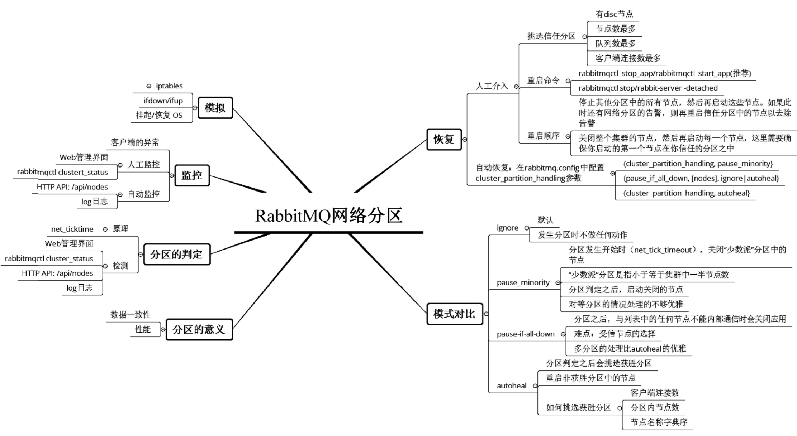

> RabbitMQ 版本为3.6.10

### 附录A 集群元数据信息示例
```json
{
    "rabbit_version": "3.6.10", //集群节点版本号
    "users": [//用户信息
        {
            "name": "guest",//默认账户
            "password_hash": "3AxhftqMnqa7ApWRFm+PDOU7tL98iEi/SVefsM8gLqzrhbJX",
            "hashing_algorithm": "rabbit_password_hashing_sha256",
            "tags": "administrator"
        },
        {
            "name": "root",
            "password_hash": "dx8F8+ylF/W3PTzzhbbqgo4UgBTzUCRVWMaStErFgW2W5iYTP",
            "hashing_algorithm": "rabbit_password_hashing_sha256",
            "tags": "administrator"
        }
    ],
    "vhosts": [ { "name": "/" } ],
    "permissions": [
        { "user": "root", "vhost": "/", "configure": ".*", "write": ".*", "read": ".*" },
        { "user": "guest", "vhost": "/", "configure": ".*", "write": ".*", "read": ".*" }
    ],
    "parameters": [],
    "global_parameters": [//旧一点的版本没有这一项内容
        { "name": "cluster_name", "value": "rabbit@node1" }
    ],
    "policies": [//策略
        {
            "vhost": "/", "name": "p1", "pattern": ".*", "apply-to": "queues",
            "definition": { "ha-mode": "exactly", "ha-params": 2,
            "ha-sync-mode": "automatic" },
            "priority": 0
        }
    ],
    //分界点，下面是关键的队列、交换器和绑定关系的元数据
    "queues": [//队列信息
        { "name": "queue3", "vhost": "/", "durable": true, "auto_delete": false, "arguments": {} },
        { "name": "queue1", "vhost": "/", "durable": true, "auto_delete": false, "arguments": {} },
        {
            "name": "queue2", "vhost": "/",
            "durable": true, "auto_delete": false,
            "arguments": {
                "x-dead-letter-exchange": "exchange_dlx",
                "x-message-ttl": 200000,
                "x-max-length": 100000
            }
        }
    ],
    "exchanges": [//交换器信息
        {
            "name": "exchange", "vhost": "/", "type": "direct",
            "durable": true, "auto_delete": false,
            "internal": false, "arguments": {}
        },
        {
            "name": "exchange2e", "vhost": "/", "type": "direct",
            "durable": true, "auto_delete": false,
            "internal": false, "arguments": {}
        }
    ],
    "bindings": [//绑定信息，注意绑定有两种：交换器与队列绑定；交换器与交换器绑定
        {
            "source": "exchange", "vhost": "/", "destination": "queue1",
            "destination_type": "queue",
            "routing_key": "rk1", "arguments": {}
        },
        {
            "source": "exchange", "vhost": "/", "destination": "queue2",
            "destination_type": "queue",
            "routing_key": "rk2", "arguments": {}
        },
        {
            "source": "exchange", "vhost": "/", "destination": "queue3",
            "destination_type": "queue",
            "routing_key": "rk3", "arguments": {}
        },
        {
            "source": "exchange", "vhost": "/", "destination": "exchange2e",
            "destination_type": "exchange",
            "routing_key": "rk_exchange", "arguments": {}
        }
    ]
}
```

### 附录B /api/nodes 接口详细内容
curl -i -u root:root123 -H "content-type:application/json" -X GET http://localhost:15672/api/nodes 的执行结果如下（单节点的）：
```json
[{
    "partitions": [],
    "os_pid": "15015",
    "fd_total": 1024,
    "sockets_total": 829,
    "mem_limit": 3301929779,
    "mem_alarm": false,
    "disk_free_limit": 50000000,
    "disk_free_alarm": false,
    "proc_total": 1048576,
    "rates_mode": "basic",
    "uptime": 99563,
    "run_queue": 0,
    "processors": 4,
    "exchange_types": [
        { "name": "fanout", "description": "AMQP fanout exchange, as per the AMQP specification", "enabled": true },
        { "name": "headers", "description": "AMQP headers exchange, as per the AMQP specification", "enabled": true },
        { "name": "topic", "description": "AMQP topic exchange, as per the AMQP specification", "enabled": true },
        { "name": "direct", "description": "AMQP direct exchange, as per the AMQP specification", "enabled": true }
    ],
    "auth_mechanisms": [
        { "name": "RABBIT-CR-DEMO", "description": "RabbitMQ Demo challenge-response authentication mechanism", "enabled": false },
        { "name": "PLAIN", "description": "SASL PLAIN authentication mechanism", "enabled": true },
        { "name": "AMQPLAIN", "description": "QPid AMQPLAIN mechanism", "enabled": true }
    ],
    "applications": [
        { "name": "amqp_client", "description": "RabbitMQ AMQP Client", "version": "3.6.10" },
        //篇幅限制，省略若干与监控无关的数据
    ],
    "contexts": [ { "description": "RabbitMQ Management", "path": "/", "port": "15672" } ],
    "log_file": "/opt/rabbitmq/var/log/rabbitmq/rabbit@node1.log",
    "sasl_log_file": "/opt/rabbitmq/var/log/rabbitmq/rabbit@node1-sasl.log",
    "db_dir": "/opt/rabbitmq/var/lib/rabbitmq/mnesia/rabbit@node1",
    "config_files": [ "/opt/rabbitmq/etc/rabbitmq/rabbitmq.config (not found)" ],
    "net_ticktime": 60,
    "enabled_plugins": [ "rabbitmq_management" ],
    "name": "rabbit@node1",
    "type": "disc",
    "running": true, 
    "mem_used": 58328312,
    "mem_used_details": { "rate": -123492.8 },
    "fd_used": 57,
    "fd_used_details": { "rate": -1 },
    "sockets_used": 0,
    "sockets_used_details": { "rate": 0 },
    "proc_used": 326,
    "proc_used_details": { "rate": -1 },
    "disk_free": 23734689792,
    "disk_free_details": { "rate": 0 },
    "gc_num": 5320,
    "gc_num_details": { "rate": 19.4 },
    "gc_bytes_reclaimed": 290549824,
    "gc_bytes_reclaimed_details": { "rate": 278136 },
    "context_switches": 83470,
    "context_switches_details": { "rate": 67.4 },
    "io_read_count": 1,
    "io_read_count_details": { "rate": 0 },
    "io_read_bytes": 1,
    "io_read_bytes_details": { "rate": 0 },
    "io_read_avg_time": 0.041,
    "io_read_avg_time_details": { "rate": 0 },
    "io_write_count": 0,
    "io_write_count_details": { "rate": 0 },
    "io_write_bytes": 0,
    "io_write_bytes_details": { "rate": 0 },
    "io_write_avg_time": 0,
    "io_write_avg_time_details": { "rate": 0 },
    "io_sync_count": 0,
    "io_sync_count_details": { "rate": 0 },
    "io_sync_avg_time": 0,
    "io_sync_avg_time_details": { "rate": 0 },
    "io_seek_count": 0,
    "io_seek_count_details": { "rate": 0 },
    "io_seek_avg_time": 0,
    "io_seek_avg_time_details": { "rate": 0 },
    "io_reopen_count": 0,
    "io_reopen_count_details": { "rate": 0 },
    "mnesia_ram_tx_count": 16,
    "mnesia_ram_tx_count_details": { "rate": 0 },
    "mnesia_disk_tx_count": 7,
    "mnesia_disk_tx_count_details": { "rate": 0.2 },
    "msg_store_read_count": 0,
    "msg_store_read_count_details": { "rate": 0 },
    "msg_store_write_count": 0,
    "msg_store_write_count_details": { "rate": 0 },
    "queue_index_journal_write_count": 0,
    "queue_index_journal_write_count_details": { "rate": 0 },
    "queue_index_write_count": 0,
    "queue_index_write_count_details": { "rate": 0 },
    "queue_index_read_count": 0,
    "queue_index_read_count_details": { "rate": 0 },
    "io_file_handle_open_attempt_count": 11,
    "io_file_handle_open_attempt_count_details": { "rate": 0 },
    "io_file_handle_open_attempt_avg_time": 0.0528181818181818,
    "io_file_handle_open_attempt_avg_time_details": { "rate": 0 },
    "cluster_links": [],
    "metrics_gc_queue_length": {
        "connection_closed": 0,
        "channel_closed": 0,
        "consumer_deleted": 0,
        "exchange_deleted": 0,
        "queue_deleted": 0,
        "vhost_deleted": 0,
        "node_node_deleted": 0,
        "channel_consumer_deleted": 0
    }
}]
```

### 附录C 网络分区图谱
