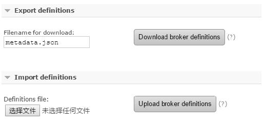
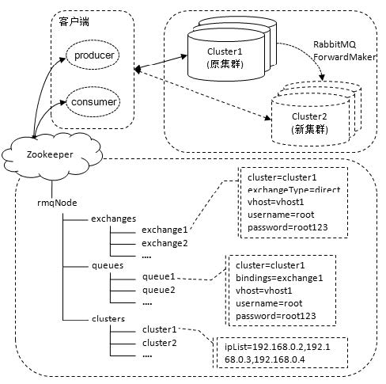

> RabbitMQ 版本为3.6.10

RabbitMQ 集群中的所有节点都会备份所有的元数据信息：

    队列元数据：队列的名称及属性；
    交换器：交换器的名称及属性；
    绑定关系元数据：交换器与队列或者交换器与交换器之间的绑定关系；
    vhost元数据：为vhost 内的队列、交换器和绑定提供命名空间及安全属性。

但是不会备份消息（通过特殊的配置比如镜像队列可以解决这个问题）。集群只会在单个节点（而不是在所有节点上）创建队列的进程并包含完整的队列信息（元数据、状态、内容）。这样只有队列的宿主节点，即所有者节点知道队列的所有信息，其他非所有者节点只知道队列的元数据和指向该队列存在的那个节点的指针。因此当集群节点崩溃时，该节点的队列进程和关联的绑定都会消失。附加在那些队列上的消费者也会丢失其所订阅的信息，并且任何匹配该队列绑定信息的新消息也都会消失。

## 搭建集群

RabbitMQ 集群对延迟非常敏感，应当只在本地局域网内使用。  
在广域网中不应该使用集群，而应该使用Federation 或者Shovel 来代替。

### 多机多节点配置

#### 集群配置流程

假设现在一共有三台物理主机，均已正确地安装了RabbitMQ，且主机名分别为node1、node2和node3。

1. 配置各个节点的hosts 文件，让各个节点都能互相识别对方的存在。  
比如在Linux 系统中可以编辑/etc/hosts 文件，在其上添加IP 地址与节点名称的映射信息：

```bash
192.168.0.2 node1
192.168.0.3 node2
192.168.0.4 node3
```

2. 编辑RabbitMQ 的cookie 文件，以确保各个节点的cookie 文件使用的是同一个值。cookie 相当于密钥令牌，集群中的RabbitMQ 节点需要通过交换密钥令牌以获得相互认证。  
可以读取node1 节点的cookie 值，然后将其复制到node2 和node3 节点中。cookie 文件默认路径为/var/lib/rabbitmq/.erlang.cookie 或者$HOME/.erlang.cookie。  
如果节点的密钥令牌不一致，那么在配置节点时就会有如下的报错：

```bash
[root@node2 ~]# rabbitmqctl join_cluster rabbit@node1
Clustering node rabbit@node2 with rabbit@node1
Error: unable to connect to nodes [rabbit@node1]: nodedown
DIAGNOSTICS
===========
attempted to contact: [rabbit@node1]
rabbit@node1:
* connected to epmd (port 4369) on node1
* epmd reports node 'rabbit' running on port 25672
* TCP connection succeeded but Erlang distribution failed
* Authentication failed (rejected by the remote node), please check the Erlang cookie    #报错原因
current node details:
- node name: 'rabbitmq-cli-53@node2'
- home dir: /root
- cookie hash: kLtTY75JJGZnZpQF7CqnYg==
```

3. 配置集群。配置集群有三种方式：

- 通过rabbitmqctl 工具配置；
- 通过rabbitmq.config 配置文件配置；
- 通过rabbitmq-autocluster1 插件配置。

其中rabbitmqctl 工具配置是最常用的方式。

首先启动node1、node2 和node3 这三个节点的RabbitMQ 服务。

```bash
[root@node1 ~]# rabbitmq-server –detached
[root@node2 ~]# rabbitmq-server -detached
[root@node3 ~]# rabbitmq-server -detached
```

这三个节点目前都是以独立节点存在的单个集群。通过rabbitmqctl cluster_status 命令来查看各个节点的状态。

```bash
[root@node1 ~]# rabbitmqctl cluster_status
Cluster status of node rabbit@node1
[{nodes,[{disc,[rabbit@node1]}]},
 {running_nodes,[rabbit@node1]},
 {cluster_name,<<"rabbit@node1">>},
 {partitions,[]},
 {alarms,[{rabbit@node1,[]}]}]
```

如果以node1 节点为基准，将node2 和node3 节点加入node1 节点的集群中。（这三个节点是平等的，如果想调换彼此的加入顺序也未尝不可。）  
以node2 节点加入node1 节点的集群为例，步骤如下：

```bash
[root@node2 ~]# rabbitmqctl stop_app
Stopping rabbit application on node rabbit@node2
[root@node2 ~]# rabbitmqctl reset
Resetting node rabbit@node2
[root@node2 ~]# rabbitmqctl join_cluster rabbit@node1
Clustering node rabbit@node2 with rabbit@node1
[root@node2 ~]# rabbitmqctl start_app
Starting node rabbit@node2
```

之后将node3 节点也加入node1 节点所在的集群中，这三个节点组成了一个完整的集群。  
在任意一个节点中执行rabbitmqctl cluster_status都可以看到如下的集群状态。

```bash
[{nodes,[{disc,[rabbit@node1,rabbit@node2,rabbit@node3]}]},
 {running_nodes,[rabbit@node1,rabbit@node2,rabbit@node3]},
 {cluster_name,<<"rabbit@node1">>},
 {partitions,[]},
 {alarms,[{rabbit@node1,[]},{rabbit@node2,[]} ,{rabbit@node3,[]}]}]
```

#### 集群节点关闭引发异常

在node2 节点上执行rabbitmqctl stop_app 命令来主动关闭RabbitMQ 应用。此时在node1 上看到的集群状态可以参考下方信息，可以看到在running_nodes 这一选项中已经没有了rabbit@node2 这一节点。

```bash
[{nodes,[{disc,[rabbit@node1,rabbit@node2,rabbit@node3]}]},
 {running_nodes,[rabbit@node1 ,rabbit@node3]},
 {cluster_name,<<"rabbit@node1">>},
 {partitions,[]},
 {alarms,[{rabbit@node1,[]} ,{rabbit@node3,[]}]}]
```

如果关闭了集群中的所有节点，则需要确保在启动的时候**最后关闭的那个节点是第一个启动的**。如果第一个启动的不是最后关闭的节点，那么这个节点会等待最后关闭的节点启动。这个等待时间是30 秒，如果没有等到，那么这个先启动的节点也会失败。  
在最新的版本中会有重试机制，默认重试10 次30 秒以等待最后关闭的节点启动。  
在重试失败之后，当前节点也会因失败而关闭自身的应用。

如果最后一个关闭的节点最终由于某些异常而无法启动，则可以通过rabbitmqctl forget_cluster_node 命令来将此节点剔出当前集群。  
如果集群中的所有节点由于某些非正常因素，比如断电而关闭，那么集群中的节点都会认为还有其他节点在它后面关闭，此时需要调用rabbitmqctl force_boot 命令来启动一个节点，之后集群才能正常启动。

```bash
[root@node2 ~]# rabbitmqctl force_boot
Forcing boot for Mnesia dir /opt/rabbitmq/var/lib/rabbitmq/mnesia/rabbit@node2
[root@node2 ~]# rabbitmq-server –detached
```

### 集群节点类型

在使用rabbitmqctl cluster_status 命令来查看集群状态时会有{nodes,[{disc,[rabbit@node1,rabbit@node2,rabbit@node3]}]}这一项信息，其中的disc 标注了RabbitMQ 节点的类型。  
RabbitMQ 中的每一个节点，不管是单一节点系统或者是集群中的节点，都只会是以下两种类型之一：

- 内存节点
- 磁盘节点

内存节点将所有的队列、交换器、绑定关系、用户、权限和vhost的元数据定义都存储在内存中，而磁盘节点则将这些信息存储到磁盘中。  
单节点的集群中必然只有磁盘类型的节点，否则当重启RabbitMQ 之后，所有关于系统的配置信息都会丢失。  
不过在集群中，可以选择配置部分节点为内存节点，这样可以获得更高的性能。

在将节点加入到集群中时，可以通过“--ram”参数指定节点的类型为内存节点：

```bash
[root@node2 ~]# rabbitmqctl join_cluster rabbit@node1 --ram
```

默认不添加“--ram”参数则表示此节点为磁盘节点。

如果集群已经搭建好了，那么也可以使用rabbitmqctl change_cluster_node_type {disc,ram}命令来切换节点的类型，其中disc 表示磁盘节点，而ram 表示内存节点。

```bash
[root@node2 ~]# rabbitmqctl stop_app
Stopping rabbit application on node rabbit@node2
# 将node2 节点由磁盘节点转变为内存节点
[root@node2 ~]# rabbitmqctl change_cluster_node_type ram
Turning rabbit@node2 into a disc node
[root@node2 ~]# rabbitmqctl start_app
Starting node rabbit@node2
[root@node2 ~]# rabbitmqctl cluster_status
Cluster status of node rabbit@node2
[{nodes,[{disc,[rabbit@node1]},{ram,[rabbit@node2]}]},
{running_nodes,[rabbit@node1,rabbit@node2]},
{cluster_name,<<"rabbit@node1">>},
{partitions,[]},
{alarms,[{rabbit@node1,[]},{rabbit@node2,[]}]}]
```

在集群中创建队列、交换器或者绑定关系这些操作，直到所有集群节点都成功提交元数据变更后才会返回。

###### 集群中磁盘节点的关键性

RabbitMQ 只要求在集群中至少有一个磁盘节点，所有其他节点可以是内存节点。  
当节点加入或者离开集群时，它们必须将变更通知到至少一个磁盘节点。  
如果只有一个磁盘节点，而且不凑巧的是它刚好崩溃了，那么集群可以继续发送或者接收消息，但是不能执行创建队列、交换器、绑定关系、用户，以及更改权限、添加或删除集群节点的操作了。  
如果集群中唯一的磁盘节点崩溃，集群仍然可以保持运行，但是直到将该节点恢复到集群前，你无法更改任何东西。所以在建立集群的时候应该保证有两个或者多个磁盘节点的存在。

<span style="color: red;font-weight: bold;">Tips</span>：在内存节点重启后，会连接到预先配置的磁盘节点，下载当前集群元数据的副本。当在集群中添加内存节点时，确保告知其所有的磁盘节点（内存节点唯一存储在本地磁盘的元数据信息就是集群中磁盘节点的地址）。只要内存节点可以找到至少一个磁盘节点，那么它就能在重启后重新加入集群中。

<span style="color: red;font-weight: bold;">Tips</span>：为了确保集群信息的可靠性，或者在不确定使用磁盘节点或者内存节点的时候，建议全部使用磁盘节点。

### 剔除单个节点

以node1、node2 和node3 组成的集群为例，有两种方式将node2 剥离出当前集群。  

1. 首先在node2 节点上执行rabbitmqctl stop_app 或者rabbitmqctl stop 命令来关闭RabbitMQ 服务。之后再在node1 节点或者node3 节点上执行rabbitmqctl forget_cluster_node rabbit@node2 命令将node2 节点剔除出去。这种方式适合node2 节点不再运行RabbitMQ 的情况。  

```bash
[root@node1 ~]# rabbitmqctl forget_cluster_node rabbit@node2
Removing node rabbit@node2 from cluster
```

在关闭集群中的每个节点之后，如果最后一个关闭的节点最终由于某些异常而无法启动，则可以通过rabbitmqctl forget_cluster_node 命令来将此节点剔除出当前集群。例如：

```bash
# 集群中节点按照node3、node2、node1 的顺序关闭
[root@node3 ~]# rabbitmqctl stop
Stopping and halting node rabbit@node3
[root@node2 ~]# rabbitmqctl stop
Stopping and halting node rabbit@node2
[root@node1 ~]# rabbitmqctl stop
Stopping and halting node rabbit@node1
# 若要启动集群，就要从node1 节点开始启动，假如node1 出现问题无法启动
# 可以在node2 节点中执行命令将node1 节点剔除出当前集群
[root@node2 ~]# rabbitmqctl forget_cluster_node rabbit@node1 --offline
```

上面在使用rabbitmqctl forget_cluster_node 命令的时候用到了“--offline”参数。如果不添加这个参数，就需要保证node2 节点中的RabbitMQ 服务处于运行状态。这种情况node2 无法先行启动，则“--offline”参数的添加让其可以在非运行状态下将node1 剥离出当前集群。

2. 在node2 上执行rabbitmqctl reset 命令。如果不是像上面由于启动顺序的缘故而不得不删除一个集群节点，建议采用这种方式。

```bash
[root@node2 ~]# rabbitmqctl stop_app
Stopping rabbit application on node rabbit@node2
[root@node2 ~]# rabbitmqctl reset
Resetting node rabbit@node2
[root@node2 ~]# rabbitmqctl start_app
Starting node rabbit@node2
```

如果从node2 节点上检查集群的状态，会发现它现在是独立的节点。同样在集群中剩余的节点node1 和node3 上看到node2 已不再是集群中的一部分了。

rabbitmqctl reset 命令将清空节点的状态，并将其恢复到空白状态。  
当重置的节点是集群中的一部分时，该命令也会和集群中的磁盘节点进行通信，告诉它们该节点正在离开集群。不然集群会认为该节点出了故障，并期望其最终能够恢复过来。

### 集群节点的升级

如果RabbitMQ 集群由**单独的一个节点**组成，只需关闭原来的服务，然后解压新的版本再运行即可。只要保留原节点的Mnesia 数据，然后解压新版本到相应的目录，再将新版本的Mnesia 路径指向保留的Mnesia 数据的路径（也可以直接复制保留的Mnesia 数据到新版本中相应的目录），最后启动新版本的服务即可。

如果RabbitMQ 集群由**多个节点**组成，升级步骤如下：

1. 关闭所有节点的服务，注意采用rabbitmqctl stop 命令关闭。
2. 保存各个节点的Mnesia 数据。
3. 解压新版本的RabbitMQ 到指定的目录。
4. 指定新版本的Mnesia 路径为步骤2 中保存的Mnesia 数据路径。
5. 启动新版本的服务，注意先重启原版本中最后关闭的那个节点。

<span style="color: red;font-weight: bold;">Tips</span>：在对不同版本升级的过程中，最好先测试两个版本互通的可能性，然后再在线上环境中实地操作。

###### 节点升级前的准备工作

首先要保存元数据，之后再关闭所有生产者并等待消费者消费完队列中的所有数据，紧接着关闭所有消费者，然后重新安装RabbitMQ 并重建元数据等。

### 单机多节点配置

在一台机器上部署多个RabbitMQ 服务节点，需要确保每个节点都有独立的名称、数据存储位置、端口号（包括插件的端口号）等。  
下面演示在主机名称为node1 的机器上创建一个由rabbit1@node1、rabbit2@node1 和rabbit3@node1 这三个节点组成RabbitMQ 集群。

首先需要确保机器上已经安装了Erlang 和RabbitMQ 的程序。  
其次，为每个RabbitMQ 服务节点设置不同的端口号和节点名称来启动相应的服务。
```bash
[root@node1 ~]# RABBITMQ_NODE_PORT=5672 RABBITMQ_NODENAME=rabbit1
rabbitmq-server -detached
[root@node1 ~]# RABBITMQ_NODE_PORT=5673 RABBITMQ_NODENAME=rabbit2
rabbitmq-server -detached
[root@node1 ~]# RABBITMQ_NODE_PORT=5674 RABBITMQ_NODENAME=rabbit3
rabbitmq-server –detached
```

如果开启了RabbitMQ Management 插件，就需要为每个服务节点配置一个对应插件端口号：
```bash
[root@node1 ~]# RABBITMQ_NODE_PORT=5672 RABBITMQ_NODENAME=rabbit1 RABBITMQ_SERVER_START_ARGS="-rabbitmq_management listener [{port,15672}]"
rabbitmq-server -detached
[root@node1 ~]# RABBITMQ_NODE_PORT=5673 RABBITMQ_NODENAME=rabbit2 RABBITMQ_SERVER_START_ARGS="-rabbitmq_management listener [{port,15673}]"
rabbitmq-server -detached
[root@node1 ~]# RABBITMQ_NODE_PORT=5674 RABBITMQ_NODENAME=rabbit3 RABBITMQ_SERVER_START_ARGS="-rabbitmq_management listener [{port,15674}]"
rabbitmq-server -detached
```

启动各节点服务之后，将rabbit2@node1 节点加入rabbit1@node1 的集群之中：
```bash
[root@node1 ~]# rabbitmqctl -n rabbit2@node1 stop_app
Stopping rabbit application on node rabbit2@node1
[root@node1 ~]# rabbitmqctl -n rabbit2@node1 reset
Resetting node rabbit2@node1
[root@node1 ~]# rabbitmqctl -n rabbit2@node1 join_cluster rabbit1@node1
Clustering node rabbit2@node1 with rabbit1@node1
[root@node1 ~]# rabbitmqctl -n rabbit2@node1 start_app
Starting node rabbit2@node1
```

按照rabbit2@node1 的操作将rabbit3@node1 也加入到集群中。然后通过 rabbitmqctl cluster_status 命令查看各个服务节点的集群状态：
```bash
[root@node1 ~]# rabbitmqctl -n rabbit1@node1 cluster_status
Cluster status of node rabbit1@node1
[{nodes,[{disc,[rabbit1@node1,rabbit2@node1,rabbit3@node1]}]},
{running_nodes,[rabbit3@node1,rabbit2@node1,rabbit1@node1]},
{cluster_name,<<"rabbit1@node1">>},
{partitions,[]},
{alarms,[{rabbit3@node1,[]},{rabbit2@node1,[]},{rabbit1@node1,[]}]}]
```


## 查看服务日志
RabbitMQ 日志中包含各种类型的事件，比如连接尝试、服务启动、插件安装及解析请求时的错误等。  
RabbitMQ 的日志默认存放在$RABBITMQ_HOME/var/log/rabbitmq 文件夹内。在这个文件夹内RabbitMQ 会创建两个日志文件： RABBITMQ_NODENAME-sasl.log 和RABBITMQ_NODENAME.log。

- SASL（System Application Support Libraries，系统应用程序支持库）是库的集合，作为Erlang-OTP 发行版的一部分。它们帮助开发者在开发Erlang 应用程序时提供一系列标准，其中之一是日志记录格式。所以当RabbitMQ 记录Erlang 相关信息时，它会将日志写入文件RABBITMQ_NODENAME-sasl.log 中。举例来说，可以在这个文件中找到Erlang 的崩溃报告，有助于调试无法启动的RabbitMQ 节点。

- 如果想查看RabbitMQ 应用服务的日志，则需要查阅RABBITMQ_NODENAME.log 这个文件，RabbitMQ 服务日志指的就是这个文件。

1. 启动阶段，日志包含了RabbitMQ 的版本号、Erlang 的版本号、RabbitMQ 服务节点名称、cookie 的hash 值、RabbitMQ 配置文件地址、内存限制、磁盘限制、默认账户guest 的创建及权限配置、插件信息、统计值信息等。  
在RabbitMQ 中，日志级别有none、error、warning、info、debug 这5 种，none 表示不输出日志。日志级别可以通过rabbitmq.config 配置文件中的log_levels 参数来进行设置，默认为[{connection, info}]。

2. 使用rabbitmqctl stop 命令，会将Erlang 虚拟机一同关闭，而rabbitmqctl stop_app 只关闭RabbitMQ 应用服务，在关闭的时候打印的日志会有区别。

<span style="color: red;font-weight: bold;">Tips</span>：在执行任何RabbitMQ 操作之前，打开一个新的窗口运行tail -f $RABBITMQ_HOME/var/log/rabbitmq/rabbit@$HOSTNAME.log -n 200 命令来实时查看相应操作所对应的服务日志。

**手工切换当前的日志**的命令：
```bash
rabbitmqctl rotate_logs .bak
```

之后可以看到在日志目录下会建立新的日志文件，并且将老的日志文件以添加“.bak”后缀的方式进行区分保存：
```bash
[root@node1 rabbitmq]# ls -al
-rw-r--r-- 1 root root 0 Jul 23 00:50 rabbit@node1.log
-rw-r--r-- 1 root root 22646 Jul 23 00:50 rabbit@node1.log.bak
-rw-r--r-- 1 root root 0 Jul 23 00:50 rabbit@node1-sasl.log
-rw-r--r-- 1 root root 0 Jul 23 00:50 rabbit@node1-sasl.log.bak
```

也可以使用Linux crontab 执行一个定时任务，以当前日期为后缀，每天执行一次切换日志的任务，这样在后面需要查阅日志的时候可以根据日期快速定位到相应的日志文件。

###### 通过程序化的方式查看日志
RabbitMQ 默认会创建一些交换器，其中amq.rabbitmq.log 就是用来收集RabbitMQ 日志的，集群中所有的服务日志都会发往这个交换器中。这个交换器的类型为topic，可以收集如前面所说的debug、info、warning 和error 这4 个级别的日志。  
创建4 个日志队列queue.debug、queue.info、queue.warning 和queue.error，分别采用debug、info、warning 和error 这4 个路由键来绑定amq.rabbitmq.log。如果要使用一个队列来收集所有级别的日志，可以使用“#”这个路由键。

集群情况下，会在任一节点创建交换器amq.rabbitmq.log ，它负责收集集群中所有节点的日志，但这些日志是互相交错的。  
对于日志的监控处理可以用客户端消费队列中的日志信息，也可以采用Logstash等第三方工具实现。  
接收服务日志示例程序：
```java
public class ReceiveLog {
    public static void main(String[] args) {
        try {
        //省略创建connection…详细内容
        Channel channelDebug = conncection.createChannel();
        Channel channelInfo = conncection.createChannel();
        Channel channelWarn = conncection.createChannel();
        Channel channelError = conncection.createChannel();
        //省略channel.basicQos(int prefetch_count);
        channelDebug.basicConsume("queue.debug", false, "DEBUG",
        new ConsumerThread(channelDebug));
        channelInfo.basicConsume("queue.info", false, "INFO",
        new ConsumerThread(channelInfo));
        channelWarn.basicConsume("queue.warning", false, "WARNING",
        new ConsumerThread(channelWarn));
        channelError.basicConsume("queue.error", false, "ERROR",
        new ConsumerThread(channelError));
        } catch (IOException e) {
            e.printStackTrace();
        } catch (TimeoutException e) {
            e.printStackTrace();
        }
    }

    public static class ConsumerThread extends DefaultConsumer {
        public ConsumerThread(Channel channel) {
            super(channel);
        }

        @Override
        public void handleDelivery(String consumerTag, Envelope envelope, 
        AMQP.BasicProperties properties, byte[] body) throws IOException {
            String log = new String(body);
            System.out.println("="+consumerTag+" REPORT====\n"+log);
            //对日志进行相应的处理
            getChannel().basicAck(envelope.getDeliveryTag(),false);
        }
    }
}
```


## 单节点故障恢复
单点故障是指集群中单个节点发生了故障，有可能会引起集群服务不可用、数据丢失等异常。配置数据节点冗余（镜像队列）可以有效地防止由于单点故障而降低整个集群的可用性、可靠性。

单节点故障包括：机器硬件故障、机器掉电、网络异常、服务进程异常。

- 单节点机器硬件故障包括机器硬盘、内存、主板等故障造成的死机，无法从软件角度来恢复。此时需要在集群中的其他节点中执行rabbitmqctl forget_cluster_node {nodename}命令来将故障节点剔除，其中nodename 表示故障机器节点名称。如果之前有客户端连接到此故障节点上，在故障发生时会有异常报出，此时需要将故障节点的IP 地址从连接列表里删除，并让客户端重新与集群中的节点建立连接，以恢复整个应用。如果此故障机器修复或者原本有备用机器，那么也可以选择性的添加到集群中。
- 当遇到机器掉电故障，需要等待电源接通之后重启机器。此时这个机器节点上的RabbitMQ 处于stop 状态，但是此时不要盲目重启服务，否则可能会引起网络分区。此时同样需要在其他节点上执行rabbitmqctl forget_cluster_node {nodename}命令将此节点从集群中剔除，然后删除当前故障机器的RabbitMQ 中的Mnesia 数据（相当于重置），然后再重启RabbitMQ 服务，最后再将此节点作为一个新的节点加入到当前集群中。
- 网线松动或者网卡损坏都会引起网络故障的发生。对于网线松动，无论是彻底断开，还是“藕断丝连”，只要它不降速，RabbitMQ 集群就没有任何影响。但是为了保险起见，建议先关闭故障机器的RabbitMQ 进程，然后对网线进行更换或者修复操作，之后再考虑是否重新开启RabbitMQ 进程。而网卡故障极易引起网络分区的发生，如果监控到网卡故障而网络分区尚未发生时，理应第一时间关闭此机器节点上的RabbitMQ 进程，在网卡修复之前不建议再次开启。
- 对于服务进程异常，如RabbitMQ 进程非预期终止，需要预先思考相关风险是否在可控范围之内。如果风险不可控，可以选择抛弃这个节点。一般情况下，重新启动RabbitMQ 服务进程即可。


## 集群迁移
在为集群扩容时，向集群中加入新的集群节点即可，不过新的机器节点中是没有队列创建的，只有后面新创建的队列才有可能进入这个新的节点中。  
迁移可以解决扩容遇到的问题，将旧的集群中的数据（包括元数据信息和消息）迁移到新的且容量更大的集群中即可。  
RabbitMQ 中的集群迁移更多的是用来解决集群故障不可短时间内修复而将所有的数据、客户端连接等迁移到新的集群中，以确保服务的可用性。

RabbitMQ 集群迁移包括元数据重建、数据迁移，以及与客户端连接的切换。

### 元数据重建
通过手工或者使用客户端重建元数据极其烦琐、低效，且时效性太差，不到万不得已不建议使用。  
高效的手段莫过于通过Web管理界面的方式重建，在Web 管理界面的首页最下面有如下图所示功能：  
  
可以在原集群上点击“Download broker definitions”按钮下载集群的元数据信息文件，此文件是一个JSON 文件，比如命名为metadata.json，其内部详细内容可以参考附录A。之后再在新集群上的Web 管理界面中点击“Upload broker definitions”按钮上传metadata.json 文件，如果导入成功则会跳转到成功页面，这样就迅速在新集群中创建了元数据信息。  
<span style="color: red;font-weight: bold;">Tips</span>：如果新集群有数据与metadata.json 中的数据相冲突，对于交换器、队列及绑定关系这类非可变对象而言会报错，而对于其他可变对象如Parameter、用户等则会被覆盖，没有发生冲突的则不受影响。如果过程中发生错误，则导入过程终止，导致metadata.json 中只有部分数据加载成功。

以上重建元数据的方式需要考虑三个问题。
1. 如果原集群突发故障，又或者开启RabbitMQ Management 插件的那个节点机器故障不可修复，就无法获取原集群的元数据metadata.json，这样元数据重建就无从谈起。  
解决方法可以采取一个通用的备份任务，在元数据有变更或者达到某个存储周期时将最新的metadata.json 备份至另一处安全的地方。这样在遇到需要集群迁移时，可以获取到最新的元数据。
2. 如果新旧集群的RabbitMQ 版本不一致时会出现异常情况，比如新建立了一个3.6.10 版本的集群，旧集群版本为3.5.7，这两个版本的元数据就不相同。  
一般情况下，RabbitMQ 是能够做到向下兼容的，在高版本的RabbitMQ 中可以上传低版本的元数据文件。然而如果在低版本中上传高版本的元数据文件就麻烦了。  
例如密码加密方式变了，可以简单地在Shell 控制台输入变更密码的方式来解决这个问题：
```bash
rabbitmqctl change_password {username} {new_password}
```

如果还是不能成功上传元数据，就说明还有其它变更的元数据定义。我们首先需要明确一个概念，就是对于用户、策略、权限这种元数据来说内容相对固定，且内容较少，手工重建的代价较小。而且在一个新集群中要能让Web 管理界面运作起来，本身就需要创建用户、设置角色及添加权限等。相反，集群中元数据最多且最复杂的要数队列、交换器和绑定这三项的内容，这三项内容还涉及其内容的参数设置，如果采用人工重建的方式代价太大，重建元数据的意义其实就在于重建队列、交换器及绑定这三项的相关信息。  
解决方法就是将低版本的metadata.json 文件中queues 这一项前面的所有内容（包括rabbit_version、users、vhosts、permissions、parameters、global_parameters、policies）覆盖掉高版本的metadata.json 文件中queues 项前面的内容，再尝试导入。

3. 如果采用上面的方法将元数据在新集群上重建，则所有的队列都只会落到同一个集群节点上，而其他节点处于空置状态，这样所有的压力将会集中到这单台节点之上。  
解决方法有两种方式，都是通过程序（或者脚本）的方式在新集群上建立元数据，而非简单地在页面上上传元数据文件而已。  
    - 第一种方式是通过HTTP API 接口创建相应的数据。这里需要节点名称的列表。
    - 第二种方式是随机连接集群中不同的节点的IP 地址，然后再创建队列。这里需要的是节点IP 地址列表。

第一种方式：
```java
/* 创建Queue, Exchange, Binding对象 */
public class Queue {
    //与附录A 中相关内容一一对应
    private String name;
    private String vhost;
    private Boolean durable;
    private Boolean auto_delete;
    private Map<String, Object> arguments;
    //省略Getter 和Setter 方法…
}
public class Exchange {
    private String name;
    private String vhost;
    private String type;
    private Boolean durable;
    private Boolean auto_delete;
    private Boolean internal;
    private Map<String, Object> arguments;
    //省略Getter 和Setter 方法…
}
public class Binding {
    private String source;
    private String vhost;
    private String destination;
    private String destination_type;
    private String routing_key;
    private Map<String, Object> arguments;
    //省略Getter 和Setter 方法…
}

/* 用Gson解析metadata.json */
private static List<Queue> queueList = new ArrayList<Queue>();
private static List<Exchange> exchangeList = new ArrayList<Exchange>();
private static List<Binding> bindingList = new ArrayList<Binding>();
private static void parseJson(String filename) {
    JsonParser parser = new JsonParser();
    try {
        JsonObject json = (JsonObject) parser.parse(new FileReader(filename));
        JsonArray jsonQueueArray = json.get("queues").getAsJsonArray();
        for (int i = 0; i < jsonQueueArray.size(); i++) {
            JsonObject subObject = jsonQueueArray.get(i).getAsJsonObject();
            Queue queue = parseQueue(subObject);
            queueList.add(queue);
        }
        JsonArray jsonExchangeArray = json.get("exchanges").getAsJsonArray();
        for(int i=0;i<jsonExchangeArray.size();i++) {
            JsonObject subObject = jsonExchangeArray.get(i).getAsJsonObject();
            Exchange exchange = parseExchange(subObject);
            exchangeList.add(exchange);
        }
        JsonArray jsonBindingArray = json.get("bindings").getAsJsonArray();
        for(int i=0;i<jsonBindingArray.size();i++) {
            JsonObject subObject = jsonBindingArray.get(i).getAsJsonObject();
            Binding binding = parseBinding(subObject);
            bindingList.add(binding);
        }
    } catch (FileNotFoundException e) {
        e.printStackTrace();
    }
}
//解析队列信息
private static Queue parseQueue(JsonObject subObject) {
    Queue queue = new Queue();
    queue.setName(subObject.get("name").getAsString());
    queue.setVhost(subObject.get("vhost").getAsString());
    queue.setDurable(subObject.get("durable").getAsBoolean());
    queue.setAuto_delete(subObject.get("auto_delete").getAsBoolean());
    JsonObject argsObject = subObject.get("arguments").getAsJsonObject();
    Map<String, Object> map = parseArguments(argsObject);
    queue.setArguments(map);
    return queue;
}
//解析交换器信息
private static Exchange parseExchange(JsonObject subObject) {
    //省略，具体参考parseQueue 方法进行推演
}
//解析绑定信息
private static Binding parseBinding(JsonObject subObject) {
    //省略，具体参考parseQueue 方法进行推演
}
//解析参数arguments 这一项内容
private static Map<String,Object> parseArguments(JsonObject argsObject){
    Map<String, Object> map = new HashMap<String, Object>();
    Set<Map.Entry<String, JsonElement>> entrySet = argsObject.entrySet();
    for (Map.Entry<String, JsonElement> mapEntry : entrySet) {
        map.put(mapEntry.getKey(), mapEntry.getValue());
    }
    return map;
}
//在解析完队列、交换器及绑定关系之后，只需要遍历queueList、exchangeList 和bindingList，然后调用HTTP API 创建相应的数据即可。

/* 创建元数据 */
private static final String ip = "192.168.0.2";
private static final String username = "root";
private static final String password = "root123";
private static final List<String> nodeList = new ArrayList<String>(){{
    add("rabbit@node1");
    add("rabbit@node2");
    add("rabbit@node3");
}};
//创建队列
private static Boolean createQueues() {
    try {
        for(int i=0;i<queueList.size();i++) {
            Queue queue = queueList.get(i);
            //注意将特殊字符转义，比如默认的vhost="/"，将其转成%2F
            String url = String.format("http://%s:15672/api/queues/%s/%s", ip,
            encode(queue.getVhost(),"UTF-8"), encode(queue.getName(),"UTF-8"));
            Map<String, Object> map = new HashMap<String, Object>();
            map.put("auto_delete", queue.getAuto_delete());
            map.put("durable", queue.getDurable());
            map.put("arguments", queue.getArguments());
            //随机挑选一个节点，并在此节点上创建相应的队列，可以解决集群内部队列分布不均匀的问题
            Collections.shuffle(nodeList);
            map.put("node", nodeList.get(0));
            String data = new Gson().toJson(map);
            System.out.println(url);
            System.out.println(data);
            httpPut(url,data,username,password);
        }
    } catch (UnsupportedEncodingException e) {
        e.printStackTrace();
        return false;
    } catch (IOException e) {
        e.printStackTrace();
        return false;
    }
    return true;
}
//创建交换器
private static Boolean createExchanges(){
    //省略，具体参考createQueues 方法进行推演，关键信息如url
    String url = String.format("http://%s:15672/api/exchanges/%s/%s",ip,
    encode(exchange.getVhost(),"UTF-8"),encode(exchange.getName(),"UTF-8"));
}
//创建绑定关系
private static Boolean createBindings(){
    //省略，具体参考createQueues 方法进行推演，关键信息如url
    String url = null;
    //绑定有两种：交换器与队列，交换器与交换器
    if (binding.getDestination_type().equals("queue")) {
        url = String.format("http://%s:15672/api/bindings/%s/e/%s/q/%s", ip, encode(binding.getVhost(),"UTF-8"),
        encode(binding.getSource(),"UTF-8"), encode(binding.getDestination(),"UTF-8"));
    } else {
        url = String.format("http://%s:15672/api/bindings/%s/e/%s/e/%s", ip, encode(binding.getVhost(),"UTF-8"),
        encode(binding.getSource(),"UTF-8"), encode(binding.getDestination(),"UTF-8"));
    }
}
// http Put
public static int httpPut(String url, String data, String username, String password) throws IOException {
    HttpClient client = new HttpClient();
    client.getState().setCredentials(AuthScope.ANY, new UsernamePasswordCredentials(username, password));
    PutMethod putMethod = new PutMethod(url);
    putMethod.setRequestHeader("Content-Type","application/json;charset=UTF-8");
    putMethod.setRequestEntity(new StringRequestEntity(data,"application/json","UTF-8"));
    int statusCode = client.executeMethod(putMethod);
    //System.out.println(statusCode);
    return statusCode;
}
public static int httpPost(String url, String data, String username, String password) throws IOException {
    //省略，具体参考httpPut 方法进行推演
}
```

第二种方式：
```java
/* 节点IP 地址列表 */
private static List<String> ipList = new ArrayList<String>(){{
add("192.168.0.2");
add("192.168.0.3");
add("192.168.0.4");
}};

//客户端通过连接不同的IP 地址来创建不同的connection 和channel，然后将channel存入一个缓冲池channelList。
//之后随机从channelList 中获取一个channel，再根据queueList 中的信息创建相应的队列
//每一个channel 对应一个connection，而每一个connection 又对应一个IP，这样串起来就能保证channelList 中不会遗留任何节点
/* 创建队列 */
private static void createQueuesNew(){
    List<Channel> channelList = new ArrayList<Channel>();
    List<Connection> connectionList = new ArrayList<Connection>();
    try {
        for (int i = 0; i < ipList.size(); i++) {
            String ip = ipList.get(i);
            ConnectionFactory connectionFactory = new ConnectionFactory();
            connectionFactory.setUsername(username);
            connectionFactory.setPassword(password);
            connectionFactory.setHost(ip);
            connectionFactory.setPort(5672);
            Connection connection = connectionFactory.newConnection();
            Channel channel = connection.createChannel();
            channelList.add(channel);
            connectionList.add(connection);
        }
        createQueueByChannel(channelList);
    } catch (IOException e) {
        e.printStackTrace();
    } catch (TimeoutException e) {
        e.printStackTrace();
    } finally {
        for (Connection connection : connectionList) {
            try {
                connection.close();
            } catch (IOException e) {
                e.printStackTrace();
            }
        }
    }
}
private static void createQueueByChannel(List<Channel> channelList) {
    for(int i=0;i<queueList.size();i++) {
        Queue queue = queueList.get(i);
        //随机获取相应的channel
        Collections.shuffle(channelList);
        Channel channel = channelList.get(0);
        try {
            Map<String, Object> mapArgs = queue.getArguments();
            //do something with mapArgs.
            channel.queueDeclare(queue.getName(), queue.getDurable(), false, queue.getAuto_delete(), mapArgs);
        } catch (IOException e) {
            e.printStackTrace();
        }
    }
}
```

### 数据迁移和客户端连接的切换
将生产者的客户端与原RabbitMQ 集群的连接断开，然后再与新的集群建立新的连接，这样就可以将新的消息流转入到新的集群中。

至于消费者客户端，一种是等待原集群中的消息全部消费完之后再将连接断开，然后与新集群建立连接进行消费作业。  
可以通过Web 页面查看消息是否消费完成。也可以通过rabbitmqctl list_queues name messages messages_ready messages_unacknowledged 命令来查看是否有未被消费的消息。  
当原集群服务不可用或者出现故障造成服务质量下降而需要迅速将消息流切换到新的集群中时，此时就不能等待消费完原集群中的消息，这里需要及时将消费者客户端的连接切换到新的集群中，那么在原集群中就会残留部分未被消费的消息，此时需要做进一步的处理。如果原集群损坏，可以等待修复之后将数据迁移到新集群中，否则会丢失数据。  
数据迁移的主要原理是先从原集群中将数据消费出来，然后存入一个缓存区中，另一个线程读取缓存区中的消息再发布到新的集群中，如此便完成了数据迁移的动作。作者将此命名为“RabbitMQ ForwardMaker”，可以自行编写一个小工具来实现这个功能。RabbitMQ 本身提供的Federation 和Shovel 插件都可以实现RabbitMQ ForwardMaker 的功能，确切地说Shovel 插件更贴近RabbitMQ ForwardMaker，不过自定义的RabbitMQ ForwardMaker 工具可以让迁移系统更加高效、灵活。

### 自动化迁移
要实现集群自动化迁移，需要在使用相关资源时就做好一些准备工作，方便在自动化迁移过程中进行无缝切换。  
与生产者和消费者客户端相关的是交换器、队列及集群的信息，如果这3 种类型的资源发生改变时需要让客户端迅速感知，以便进行相应的处理，则可以通过将相应的资源加载到ZooKeeper 的相应节点中，然后在客户端为对应的资源节点加入watcher 来感知变化，当然这个功能使用etcd或者集成到公司层面的资源配置中心中会更加标准、高效。  
etcd 是一个分布式一致性k-v 存储系统，可用于服务注册发现与共享配置。官网地址为https://coreos.com/etcd/

如图所示，将整个RabbitMQ 集群资源的使用分为三个部分：客户端、集群、ZooKeeper配置管理。  
  
在集群中创建元数据资源时都需要在ZooKeeper 中生成相应的配置，比如在cluster1 集群中创建交换器exchange1 之后，需要在/rmqNode/exchanges 路径下创建实节点exchange1，并赋予节点的数据内容为：

```bash
cluster=cluster1 #表示此交换器所在的集群名称
exchangeType=direct #表示此交换器的类型
vhost=vhost1 #表示此交换器所在的vhost
username=root #表示用户名
password=root123 #表示密码
```

同样，在cluster1 集群中创建队列queue1 之后，需要在/rmqNode/queues 路径下创建实节点queue1，并赋予节点的数据内容为：

```bash
cluster=cluster1
bindings=exchange1 #表示此队列所绑定的交换器
#如果有需要，也可以添加一些其他信息，比如路由键等
vhost=vhost1
username=root
password=root123
```

对应集群的数据在/rmqNode/clusters 路径下，比如cluster1 集群，其对应节点的数据内容包含IP 地址列表信息：

```bash
ipList=192.168.0.2,192.168.0.3,192.168.0.4 #集群中各个节点的IP 地址信息
```

客户端程序如果与其上的交换器或者队列进行交互，那么需要在相应的ZooKeeper 节点中添加watcher，以便在数据发生变更时进行相应的变更，从而达到自动化迁移的目的。

生产者客户端在发送消息之前需要先连接ZooKeeper，然后根据指定的交换器名称如exchange1 到相应的路径/rmqNode/exchanges 中寻找exchange1 的节点，之后再读取节点中的数据，并同时对此节点添加watcher。在节点的数据第一条“cluster=cluster1”中找到交换器所在的集群名称，然后再从路径/rmqNode/clusters 中寻找cluster1 节点，然后读取其对应的IP 地址列表信息。这样整个发送端所需要的连接串数据（IP 地址列表、vhost、username、password 等）都已获取，接下就可以与RabbitMQ 集群cluster1 建立连接然后发送数据了。

对于消费者客户端而言，同样需要连接ZooKeeper，之后根据指定的队列名称（queue1）到相应的路径/rmqNode/queues 中寻找queue1 节点，继而找到相应的连接串，然后与RabbitMQ 集群cluster1 建立连接进行消费。当然对/rmqNode/queues/queue1 节点的watcher 必不可少。

当cluster1 集群需要迁移到cluster2 集群时，首先需要将cluster1 集群中的元数据在cluster2 集群中重建。之后通过修改zk 的channel 和queue 的元数据信息，比如原cluster1 集群中有交换器exchange1、exchange2 和队列queue1、queue2，现在通过脚本或者程序将其中的“cluster=cluster1”数据修改为“cluster=cluster2”。客户端会立刻感知节点的变化，然后迅速关闭当前连接之后再与新集群cluster2 建立新的连接后生产和消费消息，在此切换客户端连接的过程中是可以保证数据零丢失的。迁移之后，生产者和消费者都会与cluster2 集群进行互通，此时原cluster1 集群中可能还有未被消费完的数据，此时需要使用RabbitMQ ForwardMaker 工具将cluster1 集群中未被消费完的数据同步到cluster2 集群中。

如果没有准备RabbitMQ ForwardMaker 工具，也不想使用Federation 或者Shovel 插件，那么在变更完交换器相关的ZooKeeper 中的节点数据之后，需要等待原集群中的所有队列都消费完全之后，再将队列相关的ZooKeeper 中的节点数据变更，进而使得消费者的连接能够顺利迁移到新的集群之上。可以通过下面的命令来查看是否有队列中的消息未被消费完：
```bash
rabbitmqctl list_queues -p / -q | awk '{if($2>0) print $0}'
```

<span style="color: red;font-weight: bold;">Tips</span>：上面的自动化迁移立足于将现有集群迁移到空闲的备份集群，如果有很多个正在运行的RabbitMQ 集群，为每个集群都配备一个空闲的备份集群无疑是一种资源的浪费。  
对此，可以采用“两两互备”或“以1备2”的方案解决这个难题。但是要注意多集群间互备的解决方案需要配套一个完备的实施系统，比如具备资源管理、执行下发、数据校对等功能，具体细节也需要仔细斟酌。


## 集群监控
集群监控可以提供运行时的数据为应用提供参考依据、迅速定位问题、提供预防及告警等功能，增强了整体服务的鲁棒性。  
RabbitMQ Management 插件就能提供一定的监控功能，Web 管理界面提供了很多的统计值信息：如发送速度、确认速度、消费速度、消息总数、磁盘读写速度、句柄数、Socket 连接数、Connection 数、Channel 数、内存信息等。虽然RabbitMQ Management 插件提供的监控页面是相对完善的，但是难以和公司内部系统平台关联。

### 通过HTTP API 接口提供监控数据
假设集群中一共有4 个节点node1、node2、node3 和node4，有一个交换器exchange 通过同一个路由键“rk”绑定了3 个队列queue1、queue2 和queue3。  
集群节点的信息可以通过/api/nodes 接口来获取。有关从/api/nodes 接口中获取到数据的结构可以参考附录B。

收集数据的代码示例：  
创建ClusterNode 类
```java
public class ClusterNode {
    private long diskFree;//磁盘空闲
    private long diskFreeLimit;
    private long fdUsed;//句柄使用数
    private long fdTotal;
    private long socketsUsed;//Socket 使用数
    private long socketsTotal;
    private long memoryUsed;//内存使用值
    private long memoryLimit;
    private long procUsed;//Erlang 进程使用数
    private long procTotal;
    @Override
    public String toString() {
        return "{disk_free="+diskFree+", disk_free_limit="+diskFreeLimit+", fd_used="+fdUsed+", "+
        "fd_total="+fdTotal+", sockets_used="+socketsUsed+", sockets_total="+socketsTotal+", "+
        "mem_used="+memoryUsed+", mem_limit="+memoryLimit+", proc_used="+procUsed+", proc_total="+procTotal+"}";
    }
    //省略Getter 和Setter 方法
}
```

封装HTTP GET
```java
public class HttpUtils {
    public static String httpGet(String url, String username, String password) throws IOException {
        HttpClient client = new HttpClient();
        client.getState().setCredentials(AuthScope.ANY, new UsernamePasswordCredentials(username, password));
        GetMethod getMethod = new GetMethod(url);
        int ret = client.executeMethod(getMethod);
        String data = getMethod.getResponseBodyAsString();
        System.out.println(data);
        return data;
    }
}
```

采集集群节点数据
```java
public static List<ClusterNode> getClusterData(String ip, int port, String username, String password) {
    List<ClusterNode> list = new ArrayList<ClusterNode>();
    String url = "http://" + ip + ":" + port + "/api/nodes";
    System.out.println(url);
    try {
        String urlData = HttpUtils.httpGet(url, username, password);
        parseClusters(urlData,list);
    } catch (IOException e) {
        e.printStackTrace();
    }
    System.out.println(list);
    return list;
}
private static void parseClusters(String urlData, List<ClusterNode> list) {
    JsonParser parser = new JsonParser();
    JsonArray jsonArray = (JsonArray) parser.parse(urlData);
    for(int i=0;i<jsonArray.size();i++) {
        JsonObject jsonObjectTemp = jsonArray.get(i).getAsJsonObject();
        ClusterNode cluster = new ClusterNode();
        cluster.setDiskFree(jsonObjectTemp.get("disk_free").getAsLong());
        cluster.setDiskFreeLimit(jsonObjectTemp. get("disk_free_ limit").
        getAsLong());
        cluster.setFdUsed(jsonObjectTemp.get("fd_used").getAsLong());
        cluster.setFdTotal(jsonObjectTemp.get("fd_total").getAsLong());
        cluster.setSocketsUsed(jsonObjectTemp.get("sockets_used"). getAsLong());
        cluster.setSocketsTotal(jsonObjectTemp.get("sockets_total").getAsLong());
        cluster.setMemoryUsed(jsonObjectTemp.get("mem_used").getAsLong());
        cluster.setMemoryLimit(jsonObjectTemp.get("mem_limit").getAsLong());
        cluster.setProcUsed(jsonObjectTemp.get("proc_used").getAsLong());
        cluster.setProcTotal(jsonObjectTemp.get("proc_total").getAsLong());
        list.add(cluster);
    }
}
```

对于交换器而言的数据采集可以调用/api/exchanges/vhost/name 接口，比如需要调用虚拟主机为默认的“/”、交换器名称为exchange 的数据，只需要使用HTTP GET 方法获取http://xxx.xxx.xxx.xxx:15672/api/exchanges/%2F/exchange 的数据即可。注意，这里需要将“/”进行HTML 转义成“%2F”，否则会出错。对应的数据内容可以参考下方：
```json
{
    "message_stats": {
        "publish_in_details": {
            "rate": 0.4//数据流入的速率
        },
        "publish_in": 9,//数据流入的总量
        "publish_out_details": {
            "rate": 1.2//数据流出的速率
        },
        "publish_out": 27//数据流出的总量
    },
    "outgoing": [],
    "incoming": [],
    "arguments": {},
    "internal": false,
    "auto_delete": false,
    "durable": true,
    "type": "direct",
    "vhost": "/",
    "name": "exchange"
}
```

采集交换器数据
```java
public class Exchange {
    private double publishInRate;
    private long publishIn;
    private double publishOutRate;
    private long publishOut;
    @Override
    public String toString() {
    return "{publish_in_rate=" + publishInRate + ", publish_in=" + publishIn +
    ", publish_out_rate=" + publishOutRate + ", publish_out=" + publishOut+"}";
    }
    //省略Getter 和Setter 方法
}
public class ExchangeMonitor {
    public static void main(String[] args) {
        try {
            getExchangeData("192.168.0.2", 15672, "root", "root123", "/", "exchange");
        } catch (IOException e) {
            e.printStackTrace();
        }
    }
    public static Exchange getExchangeData(String ip, int port, String username,
    String password, String vhost, String exchange) throws IOException {
        String url = "http://" + ip + ":" + port + "/api/exchanges/"
            + encode(vhost, "UTF-8") + "/" + encode(exchange, "UTF-8");
        System.out.println(url);
        String urlData = HttpUtils.httpGet(url, username, password);
        System.out.println(urlData);
        Exchange exchangeAns = parseExchange(urlData);
        System.out.println(exchangeAns);
        return exchangeAns;
    }
    //解析程序
    private static Exchange parseExchange(String urlData) {
        Exchange exchange = new Exchange();
        JsonParser parser = new JsonParser();
        JsonObject jsonObject = (JsonObject) parser.parse(urlData);
        JsonObject msgStats = jsonObject.get("message_stats").getAsJsonObject();
        double publish_in_details_rate = msgStats.get("publish_in_details").getAsJsonObject().get("rate").getAsDouble();
        double publish_out_details_rate = msgStats.get("publish_out_details").getAsJsonObject().get("rate").getAsDouble();
        long publish_in = msgStats.get("publish_in").getAsLong();
        long publish_out = msgStats.get("publish_out").getAsLong();
        exchange.setPublishInRate(publish_in_details_rate);
        exchange.setPublishOutRate(publish_out_details_rate);
        exchange.setPublishIn(publish_in);
        exchange.setPublishOut(publish_out);
        return exchange;
    }
}
```

对于队列而言的数据采集相关的接口为/api/queues/vhost/name，对应的数据结构可以参考下方内容。代码逻辑省略。
```json
{
    "consumer_details": [],
    "incoming": [],
    "deliveries": [],
    "messages_details": { "rate": 0 },
    "messages": 12,
    "messages_unacknowledged_details": { "rate": 0 },
    "messages_unacknowledged": 0,
    "messages_ready_details": { "rate": 0 },
    "messages_ready": 12,
    "reductions_details": { "rate": 0 },
    "reductions": 577759,
    "message_stats": { "publish_details": { "rate": 0 }, "publish": 12 },
    "node": "rabbit@node2",
    "arguments": {},
    "exclusive": false,
    "auto_delete": false,
    "durable": true,
    "vhost": "/",
    "name": "queue1",
    "message_bytes_paged_out": 0,
    "messages_paged_out": 0,
    "backing_queue_status": {
        "mode": "default", "q1": 0, "q2": 0,
        "delta": ["delta", "undefined", 0, 0, "undefined" ],
        "q3": 0, "q4": 12, "len": 12, "target_ram_count": "infinity",
        "next_seq_id": 12,
        "avg_ingress_rate": 0.0501007133625864,
        "avg_egress_rate": 0, "mirror_seen": 0,
        "avg_ack_ingress_rate": 0, "avg_ack_egress_rate": 0,
        "mirror_senders": 0
    },
    "head_message_timestamp": null,
    "message_bytes_persistent": 28,
    "message_bytes_ram": 28,
    "message_bytes_unacknowledged": 0,
    "message_bytes_ready": 28,
    "message_bytes": 28,
    "messages_persistent": 12,
    "messages_unacknowledged_ram": 0,
    "messages_ready_ram": 12,
    "messages_ram": 12,
    "garbage_collection": {
        "minor_gcs": 492, "fullsweep_after": 65535, "min_heap_size": 233,
        "min_bin_vheap_size": 46422, "max_heap_size": 0
    },
    "state": "running",
    "recoverable_slaves": [ "rabbit@node1" ],
    "synchronised_slave_nodes": [ "rabbit@node1" ],
    "slave_nodes": [ "rabbit@node1" ],
    "memory": 143272,
    "consumer_utilisation": null,
    "consumers": 0,
    "exclusive_consumer_tag": null,
    "policy": "policy1"
}
```

数据采集完之后并没有结束，采集程序通过定时调用HTTP API 接口获取JSON 数据，然后进行JSON 解析之后再进行持久化处理。对于这种基于时间序列的数据非常适合使用OpenTSDB来进行存储。监控管理系统可以根据用户的检索条件来从OpenTSDB 中获取相应的数据并展示到页面之中。监控管理系统本身还可以具备报表、权限管理等功能，同时也可以实时读取所采集的数据，对其进行分析处理，对于异常的数据需要及时报告给相应的人员。  
OpenTSDB：基于Hbase 的分布式的，可伸缩的时间序列数据库。主要用途就是做监控系统，比如收集大规模集群（包括网络设备、操作系统、应用程序）的监控数据并进行存储、查询。

### 通过客户端提供监控数据
除了HTTP API 接口可以提供监控数据，Java 版客户端（3.6.x 版本开始）中Channel 接口中也提供了两个方法来获取数据。方法定义如下：
```java
//查询队列中的消息个数，可以为监控消息堆积的情况提供数据
long messageCount(String queue) throws IOException;
//查询队列中的消费者个数，可以为监控消费者的情况提供数据
long consumerCount(String queue) throws IOException;
```

也可以通过连接的状态进行监控。Java 客户端中Connection 接口提供了addBlockedListener（BlockedListener listener）方法（用来监听连接阻塞信息）和addShutdownListener（ShutdownListener listener）方法（用来监听连接关闭信息）。  
监听Connection 的状态：
```java
try {
    Connection connection = connectionFactory.newConnection();
    connection.addShutdownListener(new ShutdownListener() {
        public void shutdownCompleted(ShutdownSignalException cause) {
            //处理并记录连接关闭事项
        }
    });
    connection.addBlockedListener(new BlockedListener() {
        public void handleBlocked(String reason) throws IOException {
            //处理并记录连接阻塞事项
        }
        public void handleUnblocked() throws IOException {
            //处理并记录连接阻塞取消事项
        }
    });
    Channel channel = connection.createChannel();
    long msgCount = channel.messageCount("queue1");
    long consumerCount = channel.consumerCount("queue1");
    //记录msgCount 和consumerCount
} catch (IOException e) {
    e.printStackTrace();
} catch (TimeoutException e) {
    e.printStackTrace();
}
```

自定义埋点数据：
```java
public static volatile int successCount = 0;//记录发送成功的次数
public static volatile int failureCount = 0;//记录发送失败的次数
//下面代码内容包含在某方法体内
try {
    channel.confirmSelect();
    channel.addReturnListener(new ReturnListener() {
        public void handleReturn(int replyCode, String replyText, String exchange, String routingKey, 
            AMQP.BasicProperties properties, byte[] body) throws IOException {
            failureCount++;
        }
    });
    channel.basicPublish("","",true,MessageProperties.PERSISTENT_TEXT_PLAIN, "msg".getBytes());
    if (channel.waitForConfirms() == true) {
        successCount++;
    } else {
        failureCount++;
    }
} catch (IOException e) {
    e.printStackTrace();
    failureCount++;
} catch (InterruptedException e) {
    e.printStackTrace();
    failureCount++;
}
```

上面的代码中只是简单地对successCount 和failureCount 进行累加操作，这里推荐引入metrics 工具（比如com.codahale.metrics.*）来进行埋点，同样的方式也可以统计消费者消费成功的条数和消费失败的条数。

### 检测RabbitMQ 服务是否健康
通过某些工具或方法可以检测RabbitMQ 进程是否在运行（如ps aux | grep rabbitmq），或者5672 端口是否开启（如telnet xxx.xxx.xxx.xxx 5672），但是这样依旧不能真正地评判RabbitMQ 是否还具备服务外部请求的能力。  
这里就需要使用AMQP 协议来构建一个类似于TCP 协议中的Ping 的检测程序。当这个测试程序与RabbitMQ 服务无法建立TCP 协议层面的连接，或者无法构建AMQP 协议层面的连接，再或者构建连接超时，则可判定RabbitMQ 服务处于异常状态而无法正常为外部应用提供相应的服务。

AMQP-ping 测试程序：
```java
/**
* AMQP-ping 测试程序返回的状态
*/
enum PING_STATUS{
    OK,//正常
    EXCEPTION//异常
}
public class AMQPPing {
    private static String host = "localhost";
    private static int port = 5672;
    private static String vhost = "/";
    private static String username = "guest";
    private static String password = "guest";
    /**
    * 读取rmq_cfg.properties 中的内容，如果没有配置相应的项则采用默认值
    */
    static {
        Properties properties = new Properties();
        try {
            properties.load(AMQPPing.class.getClassLoader().getResourceAsStream("rmq_cfg.properties"));
            host = properties.getProperty("host");
            port = Integer.valueOf(properties.getProperty("port"));
            vhost = properties.getProperty("vhost");
            username = properties.getProperty("username");
            password = properties.getProperty("password");
        } catch (Exception e) {
            e.printStackTrace();
        }
    }
    /**
    * AMQP-ping 测试程序，如有IOException 或者TimeoutException，则说明RabbitMQ
    * 服务出现异常情况
    */
    public static PING_STATUS checkAMQPPing(){
        PING_STATUS ping_status = PING_STATUS.OK;
        ConnectionFactory connectionFactory = new ConnectionFactory();
        connectionFactory.setHost(host);
        connectionFactory.setPort(port);
        connectionFactory.setVirtualHost(vhost);
        connectionFactory.setUsername(username);
        connectionFactory.setPassword(password);
        Connection connection = null;
        Channel channel = null;
        try {
            connection = connectionFactory.newConnection();
            channel = connection.createChannel();
        } catch (IOException | TimeoutException e ) {
            e.printStackTrace();
            ping_status = PING_STATUS.EXCEPTION;
        } finally {
            if (connection != null) {
                try {
                    connection.close();
                } catch (IOException e) {
                    e.printStackTrace();
                }
            }
        }
        return ping_status;
    }
}
```

示例中涉及rmq_cfg.properties 配置文件，这个文件用来灵活地配置与RabbitMQ 服务的连接所需的连接信息，包括IP 地址、端口号、vhost、用户名和密码等。如果没有配置相应的项则可以采用默认的值。  
监控应用时，可以定时调用AMQPPing.checkAMQPPing()方法来获取检测信息，AMQPPing 类能够检测RabbitMQ 是否能够接收新的请求和构造AMQP 信道。

RabbitMQ Management 插件提供了/api/aliveness-test/vhost 的HTTP API 形式的接口，这个接口通过三个步骤来验证RabbitMQ 服务的健康性：

    （1）创建一个以“aliveness-test”为名称的队列来接收测试消息。
    （2）用队列名称，即“aliveness-test”作为消息的路由键，将消息发往默认交换器。
    （3）到达队列时就消费该消息，否则就报错。

这个HTTP API 接口背后的检测程序也称之为aliveness-test，其运行在Erlang 虚拟机内部，因此它不会受到网络问题的影响。如果在虚拟机外部，则网络问题可能会阻止外部客户端连接到RabbitMQ 的5672 端口。aliveness-test 程序不会删除创建的队列，对于频繁调用这个接口的情况，它可以避免数以千计的队列元数据事务对Mnesia 数据库造成巨大的压力。如果RabbitMQ 服务完好，调用/api/aliveness-test/vhost 接口会返回{"status":"ok"}，HTTP 状态码为200。

AlivenessTest 程序：
```java
/**
* AlivenessTest 程序返回的状态
* OK 表示健康，EXCEPTION 表示异常
*/
enum ALIVE_STATUS{
    OK,
    EXCEPTION
}
public class AlivenessTest {
    public static ALIVE_STATUS checkAliveness(String url, String username, String password){
        ALIVE_STATUS alive_status = ALIVE_STATUS.OK;
        HttpClient client = new HttpClient();
        client.getState().setCredentials(AuthScope.ANY, new UsernamePasswordCredentials(username, password));
        GetMethod getMethod = new GetMethod(url);
        String data = null;
        int ret = -1;
        try {
            ret = client.executeMethod(getMethod);
            data = getMethod.getResponseBodyAsString();
            if (ret != 200 || !data.equals("{\"status\":\"ok\"}")) {
                alive_status = ALIVE_STATUS.EXCEPTION;
            }
        } catch (IOException e) {
            e.printStackTrace();
            alive_status = ALIVE_STATUS.EXCEPTION;
        }
        return alive_status;
    }
}
//调用示例
//AlivenessTest.checkAliveness("http://192.168.0.2:15672/api/aliveness-test/%2F","root", "root123");
```

aliveness-test 程序配合前面的AMQPPing 程序一起使用可以从内部和外部这两个方面来全面地监控RabbitMQ 服务。  
HTTP API 接口中还有另外两个接口/api/healthchecks/node 和/api/healthchecks/node/node，这两个HTTP API 接口分别表示对当前节点或指定节点进行基本的健康检查，包括RabbitMQ 应用、信道、队列是否运行正常，是否有告警产生等。

### 元数据管理与监控
删除队列、删除交换器，或者修改了绑定信息，再或者是胡乱建立了一个队列绑定到现有的一个交换器中，同时又没有消费者订阅消费此队列，从而留下消
息堆积的隐患等都会对使用RabbitMQ 服务的业务应用造成影响。所以对于RabbitMQ 元数据的管理与监控也尤为重要。  
许多应用场景是在业务逻辑代码中创建相应的元数据资源（交换器、队列及绑定关系）并使用。对于排他的、自动删除的这类非高可靠性要求的元数据资源可以在一定程度上忽略元数据变更的影响。但是对于两个非常重要的且通过消息中间件交互的业务应用，在使用相应的元数据资源时最好进行相应的管控，如果一方或者其他方肆意变更所使用的元数据，必然对另一方造成不小的损失。管控的介入自然会降低消息中间件的灵活度，但是可以增强系统的可靠性。比如提供给业务方使用的用户只有可读和可写的权限。

RabbitMQ 中在创建元数据资源的时候是以一种声明的形式完成的：无则创建、有则不变，不过在对应的元数据存在的情况下，对其再次声明时使用不同的属性会报出相应的错误信息。  
可以利用这一特性来监控元数据的变更，通过定时程序来将记录中的元数据信息重新声明一次，查看是否有异常报出。不过这种方法非常具有局限性，只能增加元数据的信息而不能减少。

**下面提供一个简单的元数据管控和监控的思路：**  
所有的业务应用都需要通过元数据审核系统来申请变更（创建、查询、修改及删除）相应的元数据信息。在申请动作完成之后，由专门的人员进行审批，之后在数据库中存储和在RabbitMQ 集群中创建相应的元数据，这两个步骤可以同时进行，而且也无须为这两个动作添加强一致性的事务逻辑。在数据库和RabbitMQ 集群之间用一个元数据一致性校验程序来检测元数据不一致的地方，然后将不一致的数据上送到监控管理系统。监控管理系统中可以显示元数据不一致的记录信息，也可以以告警的形式推送出来，然后相应的管理人员可以选择手动或者自动地进行元数据修正。这里的不一致有可能是由于数据库的记录未被正确及时地更新，也有可能是RabbitMQ 集群中元数据被异常篡改。元数据修正需慎之又慎，在整个系统修正逻辑完备之前，建议优先采用人工的方式，毕竟不一致的元数据仅占少数，人工修正的工作量并不太大。

RabbitMQ 中主要的元数据是queues、exchanges 和bindings，可以分别建立三张表，参考附录A。
- Table 1：队列信息表，名称为rmq_queues。列名有name、vhost、durable、auto_delete、arguments、cluster_name、description。
- Table 2：交换器信息表，名称为rmq_exchanges。列名有name、vhost、type、durable、auto_delete、internal、arguments、cluster_name、description。
- Table 3：绑定信息表，名称为rmq_bindings。列名有source、vhost、destination、destination_type、routing_key、arguments、cluster_name、description。

元数据一致性检测程序可以通过/api/definitions 的HTTP API 接口获取集群的元数据信息，通过解析之后与数据库中的记录一一比对，查看是否有不一致的地方。


## Federation


## Shovel


