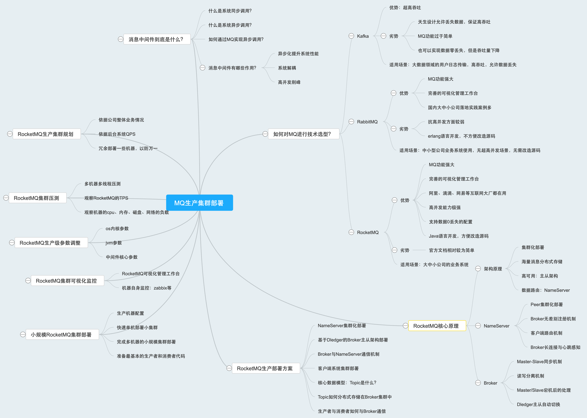
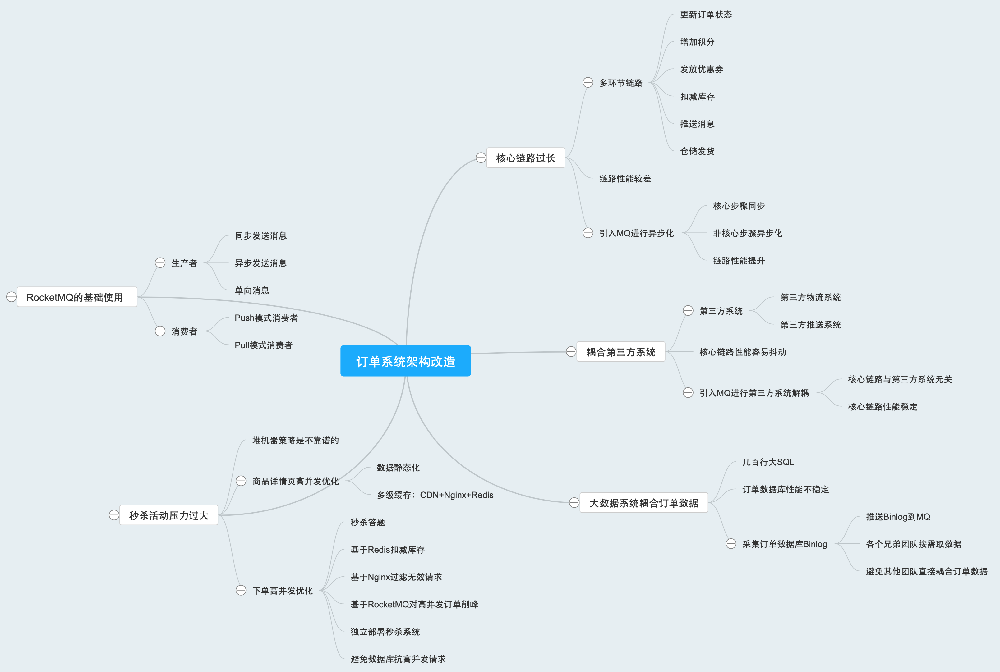

### RocketMQ生产环境参数调整
#### 调整Linux内核参数
- **vm.overcommit_memory**可以解释为“内存过度分配策略”  
修改命令：echo 'vm.overcommit_memory=1' >> /etc/sysctl.conf
> 1. 当vm.overcommit_memory设置为 0 时，内核会尽量保守地管理内存。在进程请求分配内存时，内核会尝试估算系统的内存使用情况和剩余可用内存。如果新的内存分配请求超过了一个基于系统当前状态计算出的阈值，内核可能会拒绝分配内存。
> 2. 当vm.overcommit_memory设置为 1 时，内核采取宽松的内存分配策略。在这种模式下，内核通常会允许所有的内存分配请求，即使这可能导致分配的虚拟内存总量超过实际的物理内存大小。这种情况下，系统依赖于页面替换（paging）和交换空间（swap space）来在需要时将部分虚拟内存换出到磁盘，以应对可能的物理内存不足问题。
> 3. 当vm.overcommit_memory设置为 2 时，内核采用一种介于保守和宽松之间的策略。它会根据系统的物理内存大小和交换空间大小，以及vm.overcommit_ratio参数来计算一个可超分配的内存阈值。如果新的内存分配请求超过这个阈值，内核将拒绝分配内存。

- **vm.max_map_count**的作用在于限制一个进程可以创建的内存映射区域的数量。其默认值是65536，当在进程中创建大量线程时，会相应地增加对内存映射区域的需求。  
修改命令：echo 'vm.max_map_count=655360' >> /etc/sysctl.conf  

- **vm.swappiness**用于控制系统在使用物理内存和交换空间（swap space）之间的平衡策略。它的值是一个介于0和100之间的整数，表示了系统在决定是否将内存页从物理内存换出到交换空间时的倾向性。它的默认值是60  
修改命令：echo 'vm.swappiness=10' >> /etc/sysctl.conf
> 当vm.swappiness的值较高（接近100）时，系统更倾向于提前换出内存页到交换空间，即使物理内存尚未完全用尽。这种策略在物理内存相对较小或者希望优先保证空闲物理内存供其他特定用途的情况下可能会有所帮助。  
> 当vm.swappiness的值较低（接近0）时，系统会尽量避免使用交换空间，只有在物理内存极度紧张的情况下才会开始换出内存页。这种策略在物理内存较大且希望最大化利用内存性能的环境中更为合适，因为它减少了对磁盘交换的依赖，从而可能提高系统整体的性能。

- **ulimit**主要用于控制和限制用户或 shell 启动的进程对系统资源的使用。通过使用 ulimit 命令，系统管理员或用户可以设置特定的限制，以防止个别进程过度消耗系统资源，如 CPU 时间、内存、打开的文件描述符数量、最大进程数等。  
修改打开文件句柄数的命令：echo 'ulimit -n 1000000' >> /etc/profile  
以下是一些 ulimit 可能控制的资源类型：
>- 内核文件的最大大小（core file size）
>- 数据段的最大大小（data seg size）
>- Shell 进程创建的文件的最大大小（file size）
>- 可加锁内存的最大大小（max locked memory）
>- 常驻内存集的最大大小（max memory size）
>- 打开文件句柄数（open files）
>- 分配堆栈的最大大小（stack size）
>- CPU 占用时间（CPU time）
>- 单个用户最大可用的进程数（max user processes）
>- Shell 进程所能使用的最大虚拟内存（virtual memory）

#### 调整JVM参数
在rocketmq/distribution/target/apache-rocketmq/bin目录下有对应的启动脚本，mqbroker是用来启动Broker的，mqnamesvr是用来启动NameServer的。  
查看mqbroker脚本的内容，最后一行内容如下：
> sh ${ROCKETMQ_HOME}/bin/runbroker.sh org.apache.rocketmq.broker.BrokerStartup $@

这一行内容就是用runbroker.sh脚本来启动一个JVM进程，JVM进程刚开始执行的main类就是org.apache.rocketmq.broker.BrokerStartup  
runbroker.sh脚本中就是为启动Broker设置对应的JVM参数和其他一些参数：
>- -server ：采用服务器模式
>- -Xms8g -Xmx8g -Xmn4g ：堆内存初始大小为8G，最大大小为8G，年轻代大小为4G
>- -XX:+UseG1GC -XX:G1HeapRegionSize=16m ：采用G1垃圾回收器，每个region大小为16M
>- -XX:G1ReservePercent=25 ：表示预留堆内存的25%作为空闲分区
>- -XX:InitiatingHeapOccupancyPercent=30 ：表示当年轻代占用的堆内存达到总堆内存的30%时，就会触发并发标记周期，提高了gc频率，避免垃圾对象过多
>- -XX:SoftRefLRUPolicyMSPerMB=0 ：表示每个MB堆内存中的软引用对象可以存活0毫秒。避免频繁回收一些软引用的Class对象，这里可以调整为1000
>- -verbose:gc -Xloggc:/dev/shm/mq_gc_%p.log -XX:+PrintGCDetails -XX:+PrintGCDateStamps -XX:+PrintGCApplicationStoppedTime -XX:+PrintAdaptiveSizePolicy -XX:+UseGCLogFileRotation >-XX:NumberOfGCLogFiles=5 -XX:GCLogFileSize=30m ：这些参数都是控制GC日志打印输出的，指定gc日志文件的地址，要打印哪些详细信息，最多保留5个gc日志文件，然后控制每个gc日志文件的大小是30m
>- -XX:-OmitStackTraceInFastThrow ：示在快速抛出异常时仍然包含堆栈跟踪信息
>- -XX:+AlwaysPreTouch ：用于开启预先触摸（pre-touch）内存。不启用该参数时，分配的内存可能不会立即映射到物理内存，而是在首次访问时才进行。这种行为被称为"懒加载"（lazy allocation）或"按需分配"（allocation on demand）；启用该参数后，JVM会在堆内存初始化时预先触摸所有的页面，确保它们被立即映射到物理内存。这样可以消除后续访问这些内存区域时的延迟，提高应用程序的性能。
>- -XX:MaxDirectMemorySize=15g ：表示直接内存的最大大小被限制为15GB。如果应用程序尝试分配超过这个大小的直接内存，将会抛出OutOfMemoryError异常。直接内存是指通过java.nio.DirectByteBuffer等类直接分配的本机内存，它不位于Java堆内存中。直接内存通常用于高性能的I/O操作，如网络通信和文件读写。
>- -XX:-UseLargePages -XX:-UseBiasedLocking ：表示禁用大对象和偏向锁

#### 调整RocketMQ核心参数
修改dledger的配置文件（位置是在rocketmq/distribution/target/apache-rocketmq/conf/dledger）
>- sendMessageThreadPoolNums=16 ：这个参数的意思就是RocketMQ内部用来发送消息的线程池的线程数量，默认是16，可以根据机器的CPU数量修改

### RocketMQ集群部署

### 订单系统架构
