> 基于Redis 2.9，适用于Redis 2.6至Redis 3.0

## 数据结构

### SDS
simple dynamic string，简单动态字符串，Redis的默认字符串表示。  
字符串、哈希表、列表、集合等数据类型的键值对底层都是由SDS 实现的，因为Redis 需要表示一个可以被修改的字符串值。  
SDS还被用作缓冲区（buffer）：AOF模块中的AOF缓冲区，以及客户端状态中的输入缓冲区。

在Redis里，C语言的字符串只会作为字符串字面量（string literal）用在一些无须对字符串值进行修改的地方，比如打印日志。

每个**sds.h/sdshdr**结构表示一个SDS值：

```
struct sdshdr {
    //记录buf 数组中已使用字节的数量，等于SDS 所保存字符串的长度
    int len;
    //记录buf 数组中未使用字节的数量
    int free;
    //字节数组，用于保存字符串
    char buf[];
};
```

SDS 图示：  
  
> free属性的值为0，表示这个SDS没有分配任何未使用空间  
len属性的值为5，表示这个SDS保存了一个5字节长的字符串  
buf属性是一个char类型的数组，数组的前五个字节分别保存了'R'、'e'、'd'、'i'、's'五个字符，而最后一个字节则保存了空字符'\0'

SDS 遵循C字符串以空字符结尾的惯例，好处是SDS 可以直接重用一部分C字符串函数库里面的函数。

##### Ⅰ.常数复杂度获取字符串长度
C语言使用长度为N+1的字符数组来表示长度为N的字符串，并且字符数组的最后一个元素总是空字符'\0'。  
C字符串并不记录自身的长度信息，为了获取一个C字符串的长度，程序必须遍历整个字符串，直到遇到代表字符串结尾的空字符为止，这个操作的复杂度为O(N)。  
SDS在len属性中记录了字符数组的长度，所以获取一个SDS长度的复杂度仅为O(1)。  
因为采用SDS这种数据结构，Redis即使反复获取一个非常长的字符串的长度，也不会对系统性能造成影响。

##### Ⅱ.杜绝缓冲区溢出
C字符串不记录自身长度带来的另一个问题是容易造成缓冲区溢出（buffer overflow）。举个例子，<string.h>/strcat函数可以将src字符串中的内容拼接到dest字符串的末尾：  
```
char *strcat(char *dest, const char *src);
```
在执行strcat函数前，如果没有为dest分配足够的空间去容纳src字符串的内容，就会覆盖掉相邻内存的内容，这就产生了缓冲区溢出。

当对SDS进行修改时，SDS API会先检查SDS的空间是否满足修改所需的要求，如果不满足，API会自动将SDS的空间扩展至执行修改所需的大小，然后才执行实际的修改操作。  
所以使用SDS既不需要手动修改SDS的空间大小，也不会出现C字符串的缓冲区溢出问题。

##### Ⅲ.减少修改字符串时带来的内存重分配次数
每次增长或者缩短一个C字符串，程序总要对保存这个C字符串的数组进行一次内存重分配操作：

    ※如果程序执行的是增长字符串的操作，比如拼接操作（append），那么在执行这个操作之前，程序需要先通过内存重分配来扩展底层数组的空间大小——如果忘了这一步就会产生缓冲区溢出。  
    ※如果程序执行的是缩短字符串的操作，比如截断操作（trim），那么在执行这个操作之后，程序需要通过内存重分配来释放字符串不再使用的那部分空间——如果忘了这一步就会产生内存泄漏。

因为内存重分配涉及复杂的算法，并且可能需要执行系统调用，所以它通常是一个比较耗时的操作。  
如果修改字符串长度的情况不太常出现，那么每次修改都执行一次内存重分配是可以接受的。  
但是Redis经常被用于速度要求严苛、数据被频繁修改的场合，如果每次修改字符串的长度都需要执行一次内存重分配的话，那么光是执行内存重分配的时间就会占去修改字符串所用时间的一大部分，如果这种修改频繁地发生的话，可能还会对性能造成影响。

为了避免C字符串的这种缺陷，SDS通过“未使用空间”解除了字符串长度与底层数组长度之间的关联：在SDS中，buf数组的长度不一定就是字符数量加一，数组里面可以包含未使用的字节，而这些字节的数量就由SDS的free属性记录。  
通过未使用空间，SDS实现了空间预分配和惰性空间释放两种优化策略。

1. **空间预分配**

空间预分配用于优化SDS的字符串增长操作：当SDS的API对一个SDS进行修改，并且需要对SDS进行空间扩展的时候，程序不仅会为SDS分配修改所必须要的空间，还会为SDS分配额外的未使用空间。  
在扩展SDS空间之前，SDS API会先检查未使用空间是否足够，如果足够的话，API就会直接使用未使用空间，而无须执行内存重分配。

额外分配的未使用空间数量的规则：
> - 如果对SDS进行修改之后，SDS的长度（也就是len属性的值）将小于1MB，那么程序分配和len属性同样大小的未使用空间，这时SDS len属性的值将和free属性的值相同。  
例如，如果进行修改之后，SDS的len将变成13字节，那么程序也会分配13字节的未使用空间，SDS的buf数组的实际长度将变成13+13+1=27字节（额外的一字节用于空字符）。  
> - 如果对SDS进行修改之后，SDS的长度将大于等于1MB，那么程序会分配1MB的未使用空间。  
例如，如果进行修改之后，SDS的len将变成30MB，那么程序会分配1MB的未使用空间，SDS的buf数组的实际长度将为30MB+1MB+1byte。

通过空间预分配策略，Redis可以减少连续执行字符串增长操作所需的内存重分配次数。SDS将连续增长N次字符串所需的内存重分配次数从必定N次降低为最多N次。

2. **惰性空间释放**

惰性空间释放用于优化SDS的字符串缩短操作：当SDS的API需要缩短SDS保存的字符串时，程序并不立即使用内存重分配来回收缩短后多出来的字节，而是使用free属性将这些字节的数量记录起来，并等待将来使用。

通过惰性空间释放策略，SDS避免了缩短字符串时所需的内存重分配操作，并为将来可能有的增长操作提供了优化。  
SDS提供了相应的API，可以在有需要时，真正地释放SDS的未使用空间。

##### Ⅳ.二进制安全
C字符串中的字符必须符合某种编码（比如ASCII），并且除了字符串的末尾之外，字符串里面不能包含空字符，否则最先被程序读入的空字符将被误认为是字符串结尾，这些限制使得C字符串只能保存文本数据，而不能保存像图片、音频、视频、压缩文件这样的二进制数据。

SDS的API都是二进制安全的（binary-safe），所有SDS API都会以处理二进制的方式来处理SDS存放在buf数组里的数据，程序不会对其中的数据做任何限制、过滤、或者假设，数据在写入时是什么样的，它被读取时就是什么样。  
这也是我们将SDS的buf属性称为字节数组的原因——Redis不是用这个数组来保存字符，而是用它来保存一系列二进制数据。  
当遇到使用'\0'空字符来分割单词的特殊数据格式，SDS也没有问题，因为SDS使用len属性的值而不是空字符来判断字符串是否结束。

##### Ⅴ.兼容部分C字符串函数
通过遵循C字符串以空字符结尾的惯例，SDS可以在有需要时重用<string.h>函数库，从而避免了不必要的代码重复。

例如，重用<string.h>/strcasecmp函数来对比SDS保存的字符串和另一个C字符串；重用<string.h>/strcat函数来将SDS保存的字符串追加到一个C字符串的后面。

#### C字符串和SDS之间的区别

C字符串 | SDS
 :---- | :----
获取字符串长度的复杂度为O(N) | 获取字符串长度的复杂度为O(1)
API不安全，可能造成缓冲区溢出 | API安全，不会造成缓冲区溢出
修改字符串长度N次必然执行N次内存重分配 | 修改字符串长度N次最多执行N次内存重分配
只能保存文本数据 | 可以保存文本或者二进制数据
可以使用所有<string.h>库中的函数 | 可以使用部分<string.h>库中的函数

#### SDS API
SDS的主要操作API：

函数 | 作用 | 时间复杂度
 ---- | :---- | :----
sdsnew | 创建一个包含给定C字符串的SDS | O(N)，N为给定C字符串的长度
sdsempty | 创建一个不包含任何内容的空SDS | O(1)
sdsfree | 释放给定的SDS | O(N)，N为被释放SDS的长度
sdslen | 返回SDS的已使用空间字节数 | O(1)，这个值可以通过读取SDS的len属性获得
sdsavail | 返回SDS的未使用空间字节数 | O(1)，这个值可以通过读取SDS的free属性获得
sdsdup | 创建一个给定的SDS的副本(copy) | O(N)，N为给定SDS的长度
sdsclear | 清空SDS保存的字符串内容 | O(1)，因为惰性空间释放策略
sdscat | 将给定C字符串拼接到SDS字符串末尾 | O(N)，N为被拼接C字符串的长度
sdscatsds | 将给定SDS字符串拼接到另一个SDS字符串末尾 | O(N)，N为被拼接SDS字符串的长度
sdscpy | 将给定C字符串复制到SDS里面，覆盖原字符串 | O(N)，N为被复制C字符串的长度
sdsgrowzero | 用空字符将SDS扩展至给定长度 | O(N)，N为扩展新增的字节数
sdsrange | 保留SDS指定区间内的数据，不在区间内的数据会被覆盖或清除 | O(N)，N为被保留数据的字节数
sdstrim | 接受一个SDS和一个C字符串作为参数，从SDS中移除所有在C字符串中出现过的字符 | O(N²)
sdscmp | 对比两个SDS字符串是否相同 | O(N)，N为两个SDS中较短的那个SDS的长度


### 链表
链表提供了高效的节点重排能力，以及顺序性的节点访问方式，并且可以通过增删节点来灵活地调整链表的长度。

因为Redis使用的C语言并没有内置这种数据结构，所以Redis构建了自己的链表实现。

当一个列表对象包含了数量比较多的元素，又或者列表中包含的元素都是比较长的字符串时，Redis就会使用链表作为列表对象的底层实现。  
发布与订阅、慢查询、监视器等功能也用到了链表，Redis服务器本身还使用链表来保存多个客户端的状态信息，以及使用链表来构建客户端输出缓冲区（output buffer）。

```
redis> LLEN integers
(integer) 1024
redis> LRANGE integers 0 2
1)"1"
2)"2"
3)"3"
```

integers列表对象的底层实现就是一个链表，链表中的每个节点都保存了一个整数值。

每个链表节点使用一个**adlist.h/listNode**结构来表示：  
```
typedef struct listNode {
    //前置节点
    struct listNode * prev;
    //后置节点
    struct listNode * next;
    //节点的值
    void * value;
}listNode;
```

多个listNode可以通过prev和next指针组成双端链表：  


用**adlist.h/list**来持有链表：  
```
typedef struct list {
    //表头指针
    listNode * head;
    //表尾指针
    listNode * tail;
    //链表所包含的节点数量
    unsigned long len;
    //复制链表节点所保存的值
    void *(*dup)(void *ptr);
    //释放链表节点所保存的值
    void (*free)(void *ptr);
    //对比链表节点所保存的值和另一个输入值是否相等
    int (*match)(void *ptr,void *key);
} list;
```

由一个list结构和三个listNode结构组成的链表：  


##### Redis的链表实现的特性
- 双端：链表节点带有prev和next指针，获取某个节点的前置节点和后置节点的复杂度都是O(1)
- 无环：表头节点的prev指针和表尾节点的next指针都指向NULL，对链表的访问以NULL为终点
- 带表头指针和表尾指针：通过list结构的head指针和tail指针，程序获取链表的表头节点和表尾节点的复杂度为O(1)
- 带链表长度计数器：程序使用list结构的len属性来对list持有的链表节点进行计数，程序获取链表中节点数量的复杂度为O(1)
- 多态：链表节点使用void*指针来保存节点值，并且可以通过list结构的dup、free、match三个属性为节点值设置类型特定函数，所以链表可以用于保存各种不同类型的值

#### 链表和链表节点的API

 函数 | 作用 |时间复杂度
 :----: | :---- | :----
listSetDupMethod | 将给定的函数设置为链表的节点值复制函数 | O(1)，复制函数可以通过链表的dup属性获得
listGetDupMethod | 返回链表当前正在使用的节点值复制函数 | O(1)
listSetFreeMethod | 将给定的函数设置为链表的节点值释放函数 | O(1)，释放函数可以通过链表的free属性获得
listGetFree | 返回链表当前正在使用的节点值释放函数 | O(1)
listSetMatchMethod | 将给定的函数设置为链表的节点值对比函数 | O(1)，对比函数可以通过链表的match属性获得
listGetMatchMethod | 返回链表当前正在使用的节点值对比函数 | O(1)
listLength | 返回链表的长度（包含多少节点）| O(1)，链表长度可以通过链表的len属性获得
listFirst | 返回链表的表头节点 | O(1)，表头节点可以通过链表的head属性获得
listLast | 返回链表的表尾节点 | O(1)，表尾节点可以通过链表的tail属性获得
listPrevNode | 返回给定节点的前置节点 | O(1)，前置节点可以通过节点的prev属性获得
listNextNode | 返回给定节点的后置节点 | O(1)，后置节点可以通过节点的next属性获得
listNodeValue | 返回给定节点目前正在保存的值 | O(1)，节点值可以通过节点的value属性获得
listCreate | 创建一个不包含任何节点的新链表 | O(1)
listAddNodeHead | 将一个包含给定值的新节点添加到给定链表的表头 | O(1)
listAddNodeTail | 将一个包含给定值的新节点添加到给定链表的表尾 | O(1)
listInsertNode | 将一个包含给定值的新节点添加到给定节点的之前或之后 | O(1)
listSearchKey | 查找并返回链表中包含给定值的节点 | O(N)，N为链表长度
listIndex | 返回链表在给定索引上的节点 | O(N)，N为链表长度
listDelNode | 从链表中删除给定节点 | O(N)，N为链表长度
listRotate | 将链表的表尾节点弹出，然后将被弹出的节点插入到链表表头，成为新的表头节点 | O(1)
listDup | 复制一个给定链表的副本 | O(N)，N为链表长度
listRelease | 释放给定链表，以及链表中的所有节点 | O(N)，N为链表长度


### 字典
又称为符号表（symbol table）、关联数组（associative array）或映射（map），是一种用于保存键值对（key-value pair）的抽象数据结构。  
在字典中，一个键（key）可以和一个值（value）进行关联（或者说将键映射为值），这些关联的键和值就称为键值对。

Redis的数据库、哈希对象等都是基于字典实现的。
```
redis> SET msg "hello world"
```
在数据库中创建一个键为"msg"，值为"hello world"的键值对时，这个键值对就是保存在代表数据库的字典里面的。

```
redis> HLEN website
(integer) 10086
redis> HGETALL website
1)"Redis"
2)"Redis.io"
3)"MariaDB"
4)"MariaDB.org"
# ...
```
website这个哈希对象的底层实现就是一个字典，字典中包含了10086个键值对。例如，键值对的键为"Redis"，值为"Redis.io"。

Redis的字典结构图：  


**哈希表节点**使用dictEntry结构定义，每个dictEntry结构都保存着一个键值对：  
```
typedef struct dictEntry {
    //键
    void *key;
    //值
    union{
        void *val;
        uint64_tu64;
        int64_ts64;
    } v;
    //指向下个哈希表节点，形成链表
    struct dictEntry *next;
} dictEntry;
```

**哈希表**由dict.h/dictht结构定义：  
```
typedef struct dictht {
    //哈希表数组
    dictEntry **table;
    //哈希表大小，记录table数组的大小
    unsigned long size;
    //哈希表大小掩码，用于计算索引值，总是等于size-1
    unsigned long sizemask;
    //该哈希表已有节点的数量
    unsigned long used;
} dictht;
```

**字典**由dict.h/dict结构定义：  
```
typedef struct dict {
    //类型特定函数
    dictType *type;
    //私有数据
    void *privdata;
    //哈希表
    dictht ht[2];
    // rehash索引，当不进行rehash时，值为-1
    int rehashidx;
} dict;
```

> type属性和privdata属性是针对不同类型的键值对，为创建多态字典而设置的：  
> - type属性是一个指向dictType结构的指针，每个dictType结构保存了一簇用于操作特定类型键值对的函数，Redis会为用途不同的字典设置不同的类型特定函数。
> - privdata属性则保存了需要传给那些类型特定函数的可选参数。
> - ht属性是一个包含两个项的数组，数组中的每项都是一个dictht哈希表，一般情况，字典只使用ht[0]哈希表，ht[1]哈希表只会在进行rehash时使用。
> - rehashidx用来记录rehash目前的进度，如果目前没有在进行rehash，那么它的值为-1。

```
typedef struct dictType {
    //计算哈希值的函数
    unsigned int (*hashFunction)(const void *key);
    //复制键的函数
    void *(*keyDup)(void *privdata, const void *key);
    //复制值的函数
    void *(*valDup)(void *privdata, const void *obj);
    //对比键的函数
    int (*keyCompare)(void *privdata, const void *key1, const void *key2);
    //销毁键的函数
    void (*keyDestructor)(void *privdata, void *key);
    // 销毁值的函数
    void (*valDestructor)(void *privdata, void *obj);
} dictType;
```

#### 哈希算法
当要将一个新的键值对添加到字典里面时，程序需要先根据键值对的键计算出哈希值和索引值，然后再根据索引值，将包含新键值对的哈希表节点放到哈希表数组的指定索引上面。Redis计算哈希值和索引值的方法如下：  

    #使用字典设置的哈希函数，计算键key的哈希值
    hash = dict->type->hashFunction(key);
    #使用哈希表的sizemask属性和哈希值，计算出索引值（根据情况不同，ht[x]可以是ht[0]或者ht[1]）
    index = hash & dict->ht[x].sizemask;

举例，如果将一个键值对k0和v0添加到字典里：  
```
//计算键k0的哈希值，假设计算得出的哈希值为8
hash = dict->type->hashFunction(k0);
//根据hash=8计算出键k0的索引值0
index = hash & dict->ht[0].sizemask
= 8 & 3 = 0;
```

根据公式的计算结果将键值对k0、v0的节点放置到哈希表数组的索引0位置上，如图：  


当字典被用作数据库或者哈希对象的底层实现时，Redis使用MurmurHash2算法来计算键的哈希值。  
MurmurHash算法最初由Austin Appleby于2008年发明，这种算法的优点在于，即使输入的键是有规律的，算法仍能给出一个很好的随机分布性，并且算法的计算速度也非常快。MurmurHash算法目前的最新版本为MurmurHash3，而Redis使用的是MurmurHash2，关于MurmurHash算法的更多信息可以参考该算法的主页：http://code.google.com/p/smhasher/

##### 解决键冲突
当有两个或以上数量的键被分配到了哈希表数组的同一个索引上面时，我们称这些键发生了冲突（collision）。  
Redis的哈希表使用链地址法（separate chaining）来解决键冲突，每个哈希表节点都有一个next指针，多个哈希表节点可以用next指针构成一个单向链表，被分配到同一个索引上的多个节点可以用这个单向链表连接起来，这就解决了键冲突的问题。  
因为dictEntry节点组成的链表没有指向链表表尾的指针，所以为了速度考虑，程序总是将新节点添加到链表的表头位置（复杂度为O（1）），排在其他已有节点的前面。

##### rehash
随着操作的不断执行，哈希表保存的键值对会逐渐地增多或者减少，为了让哈希表的负载因子（load factor）维持在一个合理的范围之内，当哈希表保存的键值对数量太多或者太少时，程序需要对哈希表的大小进行相应的扩展或者收缩。

1. 为字典的ht[1]哈希表分配空间，这个哈希表的空间大小取决于要执行的操作，以及ht[0]当前包含的键值对数量（也即是ht[0].used属性的值）：

    如果执行的是扩展操作，那么ht[1]的大小 = 大于等于ht[0].used*2的最小 2ⁿ  
    如果执行的是收缩操作，那么ht[1]的大小 = 大于等于ht[0].used的最小 2ⁿ

2. 将保存在ht[0]中的所有键值对rehash到ht[1]上面：rehash指的是重新计算键的哈希值和索引值，然后将键值对从ht[0]放置到ht[1]哈希表的指定位置上。  
3. 当ht[0]包含的所有键值对都迁移到了ht[1]之后（ht[0]变为空表），释放ht[0]，将ht[1]设置为ht[0]，并在ht[1]新创建一个空白哈希表，为下一次rehash做准备。

###### 哈希表的扩展与收缩
**哈希表的扩展条件**：
- 服务器目前没有在执行BGSAVE命令或者BGREWRITEAOF命令，并且哈希表的负载因子大于等于1
- 服务器目前正在执行BGSAVE命令或者BGREWRITEAOF命令，并且哈希表的负载因子大于等于5

**哈希表的收缩条件**：
- 当哈希表的负载因子小于0.1时，程序自动开始对哈希表执行收缩操作

```
#负载因子 = 哈希表已保存节点数量 / 哈希表大小
load_factor = ht[0].used / ht[0].size
```

<span style="color: red;font-weight: bold;">Tips</span>：根据BGSAVE命令或BGREWRITEAOF命令是否正在执行，服务器执行扩展操作所需的负载因子并不相同，这是因为在执行BGSAVE命令或BGREWRITEAOF命令的过程中，Redis需要创建当前服务器进程的子进程，而大多数操作系统都采用写时复制（copy-on-write）技术来优化子进程的使用效率，所以在子进程存在期间，服务器会提高执行扩展操作所需的负载因子，从而尽可能地避免在子进程存在期间进行哈希表扩展操作，这可以避免不必要的内存写入操作，最大限度地节约内存。

###### 渐进式rehash
如果哈希表里的键值对数量特别多，要一次性将这些键值对全部rehash到ht[1]的话，庞大的计算量可能会导致服务器在一段时间内停止服务。因此，为了避免rehash对服务器性能造成影响，服务器不是一次性将ht[0]里面的所有键值对全部rehash到ht[1]，而是分多次、渐进式地将ht[0]里面的键值对慢慢地rehash到ht[1]。

哈希表**渐进式rehash**的详细步骤：  
1. 为ht[1]分配空间，让字典同时持有ht[0]和ht[1]两个哈希表。
2. 在字典中维持一个索引计数器变量rehashidx，并将它的值设置为0，表示rehash工作正式开始。
3. 在rehash进行期间，程序除了对字典执行增删改查操作外，还会顺带将ht[0]哈希表在rehashidx索引上的所有键值对rehash到ht[1]，当rehash工作完成之后，程序将rehashidx属性的值增一。
4. 随着字典操作的不断执行，最终在某个时间点上，ht[0]的所有键值对都会被rehash至ht[1]，这时程序将rehashidx属性的值设为-1，表示rehash操作已完成。

渐进式rehash的好处在于它采取分而治之的方式，将rehash键值对所需的计算工作均摊到对字典的增删改查操作上，从而避免了集中式rehash而带来的庞大计算量。

<span style="color: red;font-weight: bold;">Tips</span>：在进行渐进式rehash的过程中，字典会同时使用ht[0]和ht[1]两个哈希表，所以在渐进式rehash进行期间，字典的删除（delete）、查找（find）、更新（update）等操作会在两个哈希表上进行。例如，要在字典里面查找一个键的话，程序会先在ht[0]里面进行查找，如果没找到的话，就会继续到ht[1]里面进行查找。  
另外，在渐进式rehash执行期间，新添加到字典的键值对一律会被保存到ht[1]里面，而ht[0]则不再进行任何添加操作，这一措施保证了ht[0]包含的键值对数量会只减不增，并随着rehash操作的执行而最终变成空表。

#### 字典API
函数 | 作用 | 时间复杂度
 :----: | :---- | :----
dictCreate | 创建一个新的字典 | O(1)
dictAdd | 将给定的键值对添加到字典里 | O(1)
dictReplace | 将给定的键值对添加到字典里，如果键已存在，那么用新值取代原值 | O(1)
dictFetchValue | 返回给定键的值 | O(1)
dictGetRandomKey | 从字典中随机返回一个键值对 | O(1)
dictDelete | 从字典中删除给定键所对应的键值对 | O(1)
dictRelease | 释放给定字典，以及字典中包含的所有键值对 | O(N)，N为字典包含的键值对数量


### 跳跃表
skiplist，是一种有序数据结构，它通过在每个节点中维持多个指向其他节点的指针，从而达到快速访问节点的目的。  
跳跃表支持平均O(logN)、最坏O(N)复杂度的节点查找，还可以通过顺序性操作来批量处理节点。  
在大部分情况下，跳跃表的效率可以和平衡树相媲美，并且因为跳跃表的实现比平衡树要来得更为简单，所以有不少程序都使用跳跃表来代替平衡树。

如果一个有序集合包含的元素数量比较多，又或者有序集合中元素的成员（member）是比较长的字符串时，Redis就会使用跳跃表来作为有序集合对象的底层实现。

Redis只在两个地方用到了跳跃表，一个是实现有序集合对象，另一个是在集群节点中用作内部数据结构。

fruit-price有序集合的130个数据都保存在一个跳跃表里，其中每个跳跃表节点（node）都保存了一款水果的名称和价钱，所有水果按价钱从低到高在跳跃表里面排序。  
例如，跳跃表的第一个元素的成员为"banana"，它的分值为5。
```
redis> ZCARD fruit-price
(integer)130
redis> ZRANGE fruit-price 0 2 WITHSCORES
1)"banana"
2)"5"
3)"cherry"
4)"6.5"
5)"apple"
6)"8"
```

**跳跃表**的结构图示：  


位于图片最左边的是zskiplist结构，位于zskiplist结构右方的是四个zskiplistNode结构。

<span style="color: red;font-weight: bold;">Tips</span>：注意表头节点和其他节点的构造是一样的：表头节点也有后退指针、分值和成员对象，不过表头节点的这些属性都不会被用到，所以图中省略了这些部分，只显示了表头节点的各个层。

**redis.h/zskiplist**结构的定义：  
```
typedef struct zskiplist {
    //表头节点和表尾节点
    structz skiplistNode *header, *tail;
    //表中节点的数量（表头节点不计算在内）
    unsigned long length;
    //表中层数最大的节点的层数（表头节点的层数不计算在内）
    int level;
} zskiplist;
```

> - header和tail指针分别指向跳跃表的表头和表尾节点，通过这两个指针，程序定位表头节点和表尾节点的复杂度为O(1)
> - 通过使用length属性来记录节点的数量，程序可以在O(1)复杂度内返回跳跃表的长度
> - level属性则用于在O(1)复杂度内获取跳跃表中层高最大的那个节点的层数量，注意表头节点的层高并不计算在内

**redis.h/zskiplistNode**结构的定义：  
```
typedef struct zskiplistNode {
    //层
    struct zskiplistLevel {
        //前进指针
        struct zskiplistNode *forward;
        //跨度
        unsigned int span;
    } level[];
    //后退指针
    struct zskiplistNode *backward;
    //分值
    double score;
    //成员对象
    robj *obj;
} zskiplistNode;
```

> - 层：跳跃表节点的level数组可以包含多个元素，每个元素都包含一个指向其他节点的指针，程序可以通过这些层来加快访问其他节点的速度，一般来说，层的数量越多，访问其他节点的速度就越快。  
每次创建一个新跳跃表节点的时候，程序都根据幂次定律（power law，越大的数出现的概率越小）随机生成一个介于1和32之间的值作为level数组的大小，这个大小就是层的“高度”。  
上图节点中用L1、L2、L3等字样标记节点的各个层，L1代表第一层，L2代表第二层……
> - 前进指针：每个层都有一个指向表尾方向的前进指针（level[i].forward属性），用于从表头向表尾方向访问节点。  
上图连线上带有数字的箭头就代表前进指针。
> - 跨度：层的跨度（level[i].span属性）用于记录两个节点之间的距离。  
跨度是用来计算排位（rank）的：在查找某个节点的过程中，将沿途访问过的所有层的跨度累计起来，得到的结果就是目标节点在跳跃表中的排位。  
上图连线上带有数字的箭头上的数字就代表跨度。
例如：在跳跃表中查找分值为3.0、成员对象为o3的节点，查找的过程只经过了一个层，并且层的跨度为3，所以目标节点在跳跃表中的排位为3。
> - 后退指针：节点中用BW字样标记节点的后退指针，用于从表尾向表头方向访问节点：跟可以一次跳过多个节点的前进指针不同，因为每个节点只有一个后退指针，所以每次只能后退至前一个节点。
> - 分值：是一个double类型的浮点数，跳跃表中的所有节点都按分值从小到大来排序。  
上图各个节点中的1.0、2.0和3.0是节点所保存的分值。
> - 成员对象：是一个指针，它指向一个字符串对象，而字符串对象则保存着一个SDS值。  
上图各个节点中的o1、o2和o3是节点所保存的成员对象。

<span style="color: red;font-weight: bold;">Tips</span>：在同一个跳跃表中，各个节点保存的成员对象必须是唯一的，但是各个节点保存的分值却可以是相同的：分值相同的节点将按照成员对象在字典序中的大小来进行排序，成员对象较小的节点会排在前面（靠近表头的方向），而成员对象较大的节点则会排在后面（靠近表尾的方向）。

#### 跳跃表API
函数 | 作用 | 时间复杂度
 :----: | :---- | :----
zslCreate | 创建一个新的跳跃表 | O(1)
zslFree | 释放给定跳跃表，以及表中包含的所有节点 | O(N)，N为跳跃表长度
zslInsert | 将包含给定成员和分值的新节点添加到跳跃表中 | 平均O(logN)，最坏O(N)，N为跳跃表长度
zslDelete | 删除跳跃表中包含给定成员和分值的节点 | 平均O(logN)，最坏O(N)，N为跳跃表长度
zslGetRank | 返回包含给定成员和分值的节点在跳跃表中的排位 | 平均O(logN)，最坏O(N)，N为跳跃表长度
zslGetElementByRank | 返回跳跃表在给定排位上的节点 | 平均O(logN)，最坏O(N)，N为跳跃表长度
zslIsInRange | 给定一个分值范围(range)，比如0到15，20到28，如果跳跃表中至少一个节点的分值在其范围内，那么返回1，否则返回0 | O(1)，通过表头节点和表尾节点检测
zslFirstInRange |给定一个分值范围，返回跳跃表中第一个符合之歌范围的节点 | 平均O(logN)，最坏O(N)，N为跳跃表长度
zslLastInRange | 给定一个分值范围，返回跳跃表中最后一个符合这个范围的节点 | 平均O(logN)，最坏O(N)，N为跳跃表长度
zslDeleteRangeByScore | 给定一个分值范围，删除跳跃表中所有在这个范围内的节点 | O(N)，N为被删除节点数量
zslDeleteRangeByRank | 给定一个排位范围，删除跳跃表中所有在这个范围内的节点 | O(N)，N为被删除节点数量


### 整数集合
intset，当一个集合只包含整数值元素，并且这个集合的元素数量不多时，Redis就会使用整数集合作为集合对象的底层实现。例如：
```
redis> SADD numbers 1 3 5 7 9
(integer) 5
redis> OBJECT ENCODING numbers
"intset"
```

整数集合（intset）可以保存类型为int16_t、int32_t、int64_t的整数值，并且保证集合有序，其中不会出现重复元素。

**intset.h/intset**结构定义：  
```
typedef struct intset {
    //编码方式
    uint32_t encoding;
    //集合包含的元素数量
    uint32_t length;
    //保存元素的数组
    int8_t contents[];
} intset;
```

> - contents[]是整数集合的底层实现：整数集合的每个元素都是contents数组的一个数组项（item），各个项在数组中按值的大小从小到大有序地排列，并且数组中不包含任何重复项。
> - length属性记录了整数集合包含的元素数量，也即是contents数组的长度。
> - encoding决定contents数组中元素值的真正类型，而不是contents数组声明的int8_t类型。  
如果encoding属性的值为INTSET_ENC_INT16，那么contents就是一个int16_t类型的数组，数组里的每个项都是一个int16_t类型的整数值（最小值为-32768，最大值为32767）。  
如果encoding属性的值为INTSET_ENC_INT32，那么contents就是一个int32_t类型的数组，数组里的每个项都是一个int32_t类型的整数值（最小值为-2147483648，最大值为2147483647）。  
如果encoding属性的值为INTSET_ENC_INT64，那么contents就是一个int64_t类型的数组，数组里的每个项都是一个int64_t类型的整数值（最小值为-9223372036854775808，最大值为9223372036854775807）。

整数集合结构图示：  
  
encoding属性的值为INTSET_ENC_INT64，每个集合元素都是int64_t类型的整数值，所以contents数组的大小为sizeof(int64_t)\*4=64\*4=256位。

#### 升级
每当我们要将一个新元素添加到整数集合里面，并且新元素的类型比整数集合现有所有元素的类型都要长时，整数集合需要先进行升级（upgrade），然后才能将新元素添加到整数集合里面。  
升级整数集合并添加新元素共分为以下三步：  
> 1. 根据新元素的类型，扩展整数集合底层数组的空间大小，并为新元素分配空间。
2. 将底层数组现有的所有元素都转换成与新元素相同的类型，并将类型转换后的元素放置到正确的位上，而且在放置元素的过程中，需要继续维持底层数组的有序性质不变。
3. 将新元素添加到底层数组里面。

举例：有一个INTSET_ENC_INT16编码的整数集合，集合中包含三个int16_t类型的元素，每个元素都占用16位空间，整数集合底层数组的大小为16\*3=48位，如图：  
  
现将类型为int32_t的整数值65535添加到整数集合里面，int16_t类型不足以容纳65535，所以程序需要先对整数集合进行升级。  
首先要根据新类型的长度，以及集合元素的数量（包括要添加的新元素在内），对底层数组进行空间重分配。  
原有的3个元素，加上新增的1个元素，元素的类型为int32_t，所以为底层数组分配的大小是32\*4=128位。如图：  
  
然后将元素3由原来的32至47位移动到新的64至95位；将元素2由原来的16至31位移动到新的32至63位；将元素1由原来的0至15位移动到新的0至31位。  
再将新元素65535添加到96至127位，也就是索引3的位置。如图：  
  
最后，将整数集合encoding属性的值从INTSET_ENC_INT16改为INTSET_ENC_INT32，并将length属性的值从3改为4。如图：  


每次向整数集合添加新元素都可能会引起升级，而升级需要对底层数组中已有的所有元素进行类型转换，所以向整数集合添加新元素的时间复杂度为O(N)。

**升级之后新元素的摆放位置**
> 因为引发升级的新元素的长度总是比整数集合现有所有元素的长度都大，所以这个新元素的值要么就大于所有现有元素，要么就小于所有现有元素：
> - 在新元素小于所有现有元素的情况下，新元素会被放置在底层数组的最开头（索引0）
> - 在新元素大于所有现有元素的情况下，新元素会被放置在底层数组的最末尾（索引length-1）

##### 升级的好处
1. 提升灵活性：整数集合可以通过自动升级底层数组来适应新元素，不必担心出现类型错误。
2. 节约内存：整数集合让一个数组可以保存int16_t、int32_t、int64_t三种类型的值，又可以确保升级操作只会在有需要的时候进行，这可以尽量节省内存。

#### 降级
整数集合不支持降级操作，一旦对数组进行了升级，编码就会一直保持升级后的状态。

#### 整数集合API
函数 | 作用 | 时间复杂度
 :----: | :---- | :----
intsetNew | 创建一个新的压缩列表 | O(1)
intsetAdd | 将给定元素添加到整数集合里面 | O(N)
intsetRemove | 从整数集合中移除给定元素 | O(N)
intsetFind | 检查给定元素是否存在于集合 | O(logN)，因为底层数组有序，可以通过二分查找进行
intsetRandom | 从整数集合中随机返回一个元素 | O(1)
intsetGet | 取出底层数组在给定索引上的元素 | O(1)
intsetLen | 返回整数集合包含的元素个数 | O(1)
intsetBlobLen | 返回整数集合占用的内存字节数 | O(1)


### 压缩列表
压缩列表（ziplist）是列表对象和哈希对象的底层实现之一。

当一个列表对象只包含少量列表项，并且每个列表项要么就是小整数值，要么就是长度比较短的字符串，那么Redis就会使用压缩列表来做列表键的底层实现。  
```
redis> RPUSH lst 1 3 5 10086 "hello" "world"
(integer)6
redis> OBJECT ENCODING lst
"ziplist"
```

当一个哈希对象只包含少量键值对，并且每个键值对的键和值要么就是小整数值，要么就是长度比较短的字符串，那么Redis就会使用压缩列表来做哈希对象的底层实现。  
```
redis> HMSET profile "name" "Jack" "age" 28 "job" "Programmer"
OK
redis> OBJECT ENCODING profile
"ziplist"
```

压缩列表结构图示：  
  
压缩列表各个组成部分的详细说明：

属性 | 类型 | 长度 | 用途
 :---- | :---- | :----: | :----
zlbytes | uint32_t | 4字节 | 记录整个压缩列表占用的内存字节数：在对压缩列表进行内存重分配，或者计算zlend的位置时使用
zltail | uint32_t | 4字节 | 记录压缩列表表尾节点距离压缩列表的起始地址有多少字节：通过这个偏移量，程序无须遍历整个压缩列表就可以确定表尾节点的地址
zllen | uint16_t | 2字节 | 记录压缩列表包含的节点数量：当这个属性的值小于UINT16_MAX(65535)时，该属性的值就是压缩列表包含节点的数量；当该值等于UINT16_MAX时，节点的的真实数量需要遍历整个压缩列表才能计算得出
entryX | 列表节点 | 不定 | 压缩列表包含的各个节点，节点的长度由节点保存的内容决定
zlend | uint8_t | 1字节 | 特殊值0xFF（十进制255），用于标记压缩列表的末端

举例：  
  
> - 列表zlbytes属性的值为0xd2（十进制210），表示压缩列表的总长为210字节。
> - 列表zltail属性的值为0xb3（十进制179），这表示如果我们有一个指向压缩列表起始地址的指针p，那么只要用指针p加上偏移量179，就可以计算出表尾节点entry5的地址。
> - 列表zllen属性的值为0x5（十进制5），表示压缩列表包含五个节点。

每个**压缩列表节点**可以保存一个字节数组或者一个整数值。  
字节数组可以是以下三种长度的其中一种：

    长度小于等于63（2 6 –1）字节的字节数组；
    长度小于等于16383（2 14 –1）字节的字节数组；
    长度小于等于4294967295（2 32 –1）字节的字节数组。

整数值可以是以下六种长度的其中一种：

    4位长，介于0至12之间的无符号整数；
    1字节长的有符号整数；
    3字节长的有符号整数；
    int16_t类型整数；
    int32_t类型整数；
    int64_t类型整数。

压缩列表节点结构图示：  
  
###### previous_entry_length
以字节为单位，记录了压缩列表中前一个节点的长度。previous_entry_length属性的长度可以是1字节或者5字节：

    如果前一节点的长度小于254字节，那么previous_entry_length属性的长度为1字节：前一节点的长度就保存在这一个字节里面。  
    如果前一节点的长度大于等于254字节，那么previous_entry_length属性的长度为5字节：其中属性的第一字节会被设置为0xFE（十进制值254），而之后的四个字节则用于保存前一节点的长度。

因为节点的previous_entry_length属性记录了前一个节点的长度，所以程序可以通过指针运算，根据当前节点的起始地址来计算出前一个节点的起始地址。  
如果有一个指向当前节点起始地址的指针c，那么只要用指针c减去当前节点previous_entry_length属性的值，就可以得出指向前一个节点起始地址的指针p。  
压缩列表的从表尾向表头遍历操作就是使用这一原理实现的，只要拥有了一个指向某个节点起始地址的指针，那么通过这个指针以及这个节点的previous_entry_length属性，程序就可以一直向前一个节点回溯，最终到达压缩列表的表头节点。

###### encoding
记录了节点的content属性所保存数据的类型以及长度。

    一字节、两字节或者五字节长，值的最高位为00、01或者10的是字节数组编码：这种编码表示节点的content属性保存着字节数组，数组的长度由编码除去最高两位之后的其他位记录；  
    一字节长，值的最高位以11开头的是整数编码：这种编码表示节点的content属性保存着整数值，整数值的类型和长度由编码除去最高两位之后的其他位记录。

字节数组编码：

编码 | 编码长度 | content保存的值
 :---- | :----: | :----
00bbbbbb | 1字节 | 长度小于等于63字节的字节数组
01bbbbbb xxxxxxxx | 2字节 | 长度小于等于16383字节的字节数组
10______ aaaaaaaa bbbbbbbb cccccccc dddddddd | 5字节 | 长度小于等于4294967295字节的字节数组

表格中的下划线“_”表示留空，而a、b、x等变量则代表实际的二进制数据，为了方便阅读，多个字节之间用空格隔开。

整数编码：

编码 | 编码长度 | content保存的值
 :---- | :----: | :----
11000000 | 1字节 | int16_t类型的整数
11010000 | 1字节 | int32_t类型的整数
11100000 | 1字节 | int64_t类型的整数
11110000 | 1字节 | 24位有符号整数
11111110 | 1字节 | 8位有符号整数
1111xxxx | 1字节 | 使用这一编码的节点没有相应的content属性，因为编码本身的xxxx四个位用来保存一个介于0到12之间的值，所以无须content属性

###### content
负责保存节点的值，节点值可以是一个字节数组或者整数，值的类型和长度由节点的encoding属性决定。

#### 连锁更新
每个节点的previous_entry_length属性都记录了前一个节点的长度：

    如果前一节点的长度小于254字节，那么previous_entry_length属性需要用1字节长的空间来保存这个长度值。  
    如果前一节点的长度大于等于254字节，那么previous_entry_length属性需要用5字节长的空间来保存这个长度值。

考虑这样一种情况：在一个压缩列表中，有多个连续的、长度介于250字节到253字节之间的节点e1至eN，因为e1至eN的所有节点的长度都小于254字节，所以记录这些节点的长度只需要1字节长的previous_entry_length属性，换句话说，e1至eN的所有节点的previous_entry_length属性都是1字节长的。  
这时，如果我们将一个长度大于等于254字节的新节点new设置为压缩列表的表头节点，那么new将成为e1的前置节点，如图：  
  
因为e1的previous_entry_length属性仅长1字节，它没办法保存新节点new的长度，所以程序将对压缩列表执行空间重分配操作，并将e1节点的previous_entry_length属性从原来的1字节长扩展为5字节长。  
现在，麻烦的事情来了，e1原本的长度介于250字节至253字节之间，在为previous_entry_length属性新增四个字节的空间之后，e1的长度就变成了介于254字节至257字节之间，而这种长度使用1字节长的previous_entry_length属性是没办法保存的。  
因此，为了让e2的previous_entry_length属性可以记录下e1的长度，程序需要再次对压缩列表执行空间重分配操作，并将e2节点的previous_entry_length属性从原来的1字节长扩展为5字节长。  
正如扩展e1引发了对e2的扩展一样，扩展e2也会引发对e3的扩展……为了让每个节点的previous_entry_length属性都符合压缩列表对节点的要求，程序需要不断地对压缩列表执行空间重分配操作，直到eN为止。  
Redis将这种在特殊情况下产生的连续多次空间扩展操作称之为“连锁更新”（cascade update）。

除了添加新节点可能会引发连锁更新之外，删除节点也可能会引发连锁更新。  
  
按上图所示，如果e1至eN都是大小介于250字节至253字节的节点，big节点的长度大于等于254字节（需要5字节的previous_entry_length来保存），而small节点的长度小于254字节（只需要1字节的previous_entry_length来保存），那么当我们将small节点从压缩列表中删除之后，为了让e1的previous_entry_length属性可以记录big节点的长度，程序将扩展e1的空间，并由此引发之后的连锁更新。

因为连锁更新在最坏情况下需要对压缩列表执行N次空间重分配操作，而每次空间重分配的最坏复杂度为O(N)，所以连锁更新的最坏复杂度为O(N²)。  
尽管连锁更新的复杂度较高，但它真正造成性能问题的几率是很低的：

    首先，压缩列表里要恰好有多个连续的、长度介于250字节至253字节之间的节点，连锁更新才有可能被引发，在实际中，这种情况并不多见；  
    其次，即使出现连锁更新，但只要被更新的节点数量不多，就不会对性能造成任何影响：比如说，对三五个节点进行连锁更新是绝对不会影响性能的。

因为以上原因，ziplistPush等命令的平均复杂度仅为O(N)，在实际中，可以放心地使用这些函数，而不必担心连锁更新会影响压缩列表的性能。

#### 压缩列表API
函数 | 作用 | 时间复杂度
 :----: | :---- | :----
ziplistNew | 创建一个新的压缩列表 | O(1)
ziplistPush | 创建一个包含给定值的新节点，并将这个新节点添加到压缩列表的表头或表尾 | 平均O(N)，最坏O(N²)
ziplistInsert | 将包含给定值的新节点插入到给定节点之后 | 平均O(N)，最坏O(N²)
ziplistIndex | 返回压缩列表给定索引上的节点 | O(N)
ziplistFind | 在压缩列表中查找并返回包含了给定值的节点 | 因为节点的值可能是一个字节数组，所以对比节点值和给定值是否相同的复杂度为O(N)，对整个列表而言的复杂度为O(N²)
ziplistNext | 返回给定节点的下一个节点 | O(1)
ziplistPrev | 返回给定节点的前一个节点 | O(1)
ziplistGet | 获取给定节点所保存的值 | O(1)
ziplistDelete | 从压缩列表中删除给定的节点 | 平均O(N)，最坏O(N²)
ziplistDeleteRange | 删除压缩列表在给定索引上的连续多个节点 | 平均O(N)，最坏O(N²)
ziplistBlobLen | 返回压缩列表目前占用的内存字节数 | O(1)
ziplistLen | 返回压缩列表目前包含的节点数量 | 节点数量小于65535时为O(1)，大于65535时为O(N)

※因为ziplistPush、ziplistInsert、ziplistDelete和ziplistDeleteRange四个函数都有可能会引发连锁更新，所以它们的最坏复杂度都是O(N²)。


## 对象
Redis对象系统包含字符串对象、列表对象、哈希对象、集合对象和有序集合对象这五种类型，每种对象都用到了至少一种数据结构。  
Redis在执行命令之前，根据对象的类型来判断一个对象是否可以执行给定的命令。使用对象的另一个好处是，我们可以针对不同的使用场景，为对象设置多种不同的数据结构实现，从而优化对象在不同场景下的使用效率。  
Redis的对象系统还实现了基于引用计数技术的内存回收机制，当程序不再使用某个对象的时候，这个对象所占用的内存就会被自动释放；另外，Redis还通过引用计数技术实现了对象共享机制，这一机制可以在适当的条件下，通过让多个数据库键共享同一个对象来节约内存。  
Redis的对象带有访问时间记录信息，该信息可以用于计算数据库键的空转时长，在服务器启用了maxmemory功能的情况下，空转时长较大的那些键可能会优先被服务器删除。

### 对象的类型与编码
在Redis的数据库中新创建一个键值对时，我们至少会创建两个对象，一个对象用作键值对的键（键对象），另一个对象用作键值对的值（值对象）。

Redis中的每个对象都由一个redisObject结构表示：
```
typedef struct redisObject {
    //类型
    unsigned type:4;
    //编码
    unsigned encoding:4;
    //指向底层实现数据结构的指针
    void *ptr;
    // ...
} robj;
```

###### 类型
类型常量 | 对象的名称 | TYPE命令的输出
 :---- | :---- | :----
REDIS_STRING | 字符串对象 | string
REDIS_LIST | 列表对象 | list
REDIS_HASH | 哈希对象 | hash
REDIS_SET | 集合对象 | set
REDIS_ZSET | 有序集合对象 | zset

对于Redis数据库保存的键值对来说，键总是一个字符串对象，而值则可以是字符串对象、列表对象、哈希对象、集合对象或者有序集合对象的其中一种。

执行TYPE命令时，返回的结果为数据库键对应的值对象的类型：
```
redis> TYPE msg
string
redis> TYPE profile
hash
```

###### 编码
对象的ptr指针指向对象的底层实现数据结构，而这些数据结构由对象的encoding属性决定。

编码常量 | 底层的数据结构 | OBJECT ENCODING命令的输出
 :---- | :---- | :----
REDIS_ENCODING_INT | long类型的整数 | int
REDIS_ENCODING_EMBSTR | embstr编码的简单动态字符串 | embstr
REDIS_ENCODING_RAW | 简单动态字符串 | raw
REDIS_ENCODING_HT | 字典 | hashtable
REDIS_ENCODING_LINKEDLIST | 双端链表 | linkedlist
REDIS_ENCODING_ZIPLIST | 压缩列表 | ziplist
REDIS_ENCODING_INTSET | 整数集合 | intset
REDIS_ENCODING_SKIPLIST | 跳跃表和字典 | skiplist

使用OBJECT ENCODING命令可以查看一个数据库键的值对象的编码：
```
redis> OBJECT ENCODING msg
"embstr"
redis> OBJECT ENCODING numbers
"hashtable"
```

##### 类型与编码的关系图 
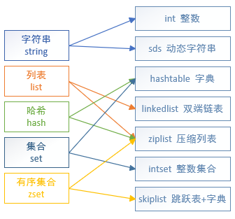


### 字符串对象
字符串对象的编码可以是int、raw或者embstr。

如果一个字符串对象保存的是整数值，并且这个整数值可以用long类型来表示，那么字符串对象会将整数值保存在字符串对象结构的ptr属性里面（将void*转换成long），并将字符串对象的编码设置为int。  


如果字符串对象保存的是一个字符串值，并且这个字符串值的长度大于32字节，那么字符串对象将使用一个简单动态字符串（SDS）来保存这个字符串值，并将对象的编码设置为raw。  


如果字符串对象保存的是一个字符串值，并且这个字符串值的长度小于等于32字节，那么字符串对象将使用embstr编码的方式来保存这个字符串值。  


使用embstr编码的字符串对象来保存短字符串值有以下好处：
> - embstr编码将创建字符串对象所需的内存分配次数从raw编码的两次降低为一次。
> - 释放embstr编码的字符串对象只需要调用一次内存释放函数，而释放raw编码的字符串对象需要调用两次内存释放函数。
> - 因为embstr编码的字符串对象的所有数据都保存在一块连续的内存里面，所以这种编码的字符串对象比起raw编码的字符串对象能够更好地利用缓存带来的优势。

用long double类型表示的浮点数在Redis中也是作为字符串值来保存的。

字符串对象保存各类型值的编码方式：

值 | 编码
 :---- | :----
long类型的整数 | int
字符串；long double类型的浮点数；长度太大的long类型整数 | embstr或者raw

##### 编码转换
- 当整数是long类型无法表示的，或者更新后不再是整数，编码会从int转换为raw
- embstr编码的字符串对象是只读的，没有修改的命令，当对字符串进行修改，编码会从embstr转换为raw

##### 部分字符串命令的实现
命令 | int编码的实现方法 | embstr编码的实现方法 | raw编码的实现方法
 :---- | :---- | :---- | :----
SET | 使用int编码保存值 | 使用embstr编码保存值 | 使用raw编码保存值
GET | 拷贝对象所保存的整数值，将这个拷贝转换成字符串值，然后向客户端返回字符串值 | 直接向客户端返回字符串值 | 直接向客户端返回字符串值
APPEND | 将对象转换成raw编码，按raw编码的方式操作 | 将对象转换成raw编码，按raw编码的方式操作 | 调用sdscatlen函数，将给定字符串追加到原字符串末尾
INCRBYFLOAT | 取出整数值并转换成long double类型的浮点数，对这个浮点数进行加法计算，然后将结果保存 | 取出整数值并尝试转换成long double类型的浮点数，对这个浮点数进行加法计算，然后将结果保存。如果字符串值不能被转换成浮点数，就向客户端返回一个错误 | 取出整数值并尝试转换成long double类型的浮点数，对这个浮点数进行加法计算，然后将结果保存。如果字符串值不能被转换成浮点数，就向客户端返回一个错误
INCRBY | 对整数值进行加法计算，结果作为整数保存起来 | 不能执行此命令，向客户端返回一个错误 | 不能执行此命令，向客户端返回一个错误
DECRBY | 对整数值进行减法计算，结果作为整数保存起来 | 不能执行此命令，向客户端返回一个错误 | 不能执行此命令，向客户端返回一个错误
STRLEN | 拷贝对象所保存的整数值，将其转换成字符串值，计算并返回这个字符串值的长度 | 调用sdslen函数，返回字符串的长度 | 调用sdslen函数，返回字符串的长度
SETRANGE | 将对象转换成raw编码，按raw编码的方式操作 | 将对象转换成raw编码，按raw编码的方式操作 | 将字符串特定索引上的值设置为给定的字符
GETRANGE | 拷贝对象所保存的整数值，将其转换成字符串值，然后取出并返回字符串指定索引上的字符 | 直接取出并返回字符串指定索引上的字符 | 直接取出并返回字符串指定索引上的字符


### 列表对象
列表对象的编码可以是ziplist或者linkedlist。

ziplist编码的列表对象使用压缩列表作为底层实现，每个压缩列表节点（entry）保存了一个列表元素。  


linkedlist编码的列表对象使用双端链表作为底层实现，每个双端链表节点（node）都保存了一个字符串对象，而每个字符串对象都保存了一个列表元素。  


注意，linkedlist编码的列表对象在底层的双端链表结构中包含了多个字符串对象。字符串对象是Redis五种类型的对象中唯一一种会被其他四种类型对象嵌套的对象。  
为了简化字符串对象的表示，上图用StringObject来表示，下面是完整的字符串对象表示：  


##### 编码转换
满足以下两个条件的列表对象使用ziplist编码，否则需要使用linkedlist编码：

    列表对象保存的所有字符串元素的长度都小于64字节；
    列表对象保存的元素数量小于512个；

<span style="color: red;font-weight: bold;">Tips</span>：以上两个条件的上限值是可以修改的，具体请看配置文件中关于list-max-ziplist-value选项和list-max-ziplist-entries选项的说明。

##### 部分列表命令的实现
命令 | ziplist编码的实现方法 | linkedlist编码的实现方法
 :---- | :---- | :----
LPUSH | 调用ziplistPush函数，将新元素推入到压缩列表的表头 | 调用listAddNodeHead函数，将新元素推入到双端链表的表头
RPUSH | 调用ziplistPush函数，将新元素推入到压缩列表的表尾 | 调用listAddNodeTail函数，将新元素推入到双端链表的表尾
LPOP | 调用ziplistIndex函数定位压缩列表的表头节点，向客户端返回表头节点的元素，然后调用ziplistDelete函数删除表头节点 | 调用listFirst函数定位双端链表的表头节点，向客户端返回表头节点的元素，然后调用listDelNode函数删除表头节点
RPOP | 调用ziplistIndex函数定位压缩列表的表尾节点，向客户端返回表尾节点的元素，然后调用ziplistDelete函数删除表尾节点 | 调用listLast函数定位双端链表的表尾节点，向客户端返回表尾节点的元素，然后调用listDelNode函数删除表尾节点
LINDEX | 调用ziplistIndex函数定位压缩列表中的指定节点，向客户端返回该节点的元素 | 调用listIndex函数定位双端链表中的指定节点，向客户端返回该节点的元素
LLEN | 调用ziplistLen函数返回压缩列表的长度 | 调用listLength函数返回双端链表的长度
LINSERT | 插入新节点到压缩列表的表头或表尾，使用ziplistPush函数；插入新节点到压缩列表的其他位置，使用ziplistInsert函数 | 调用listInsertNode函数，将新节点插入到双端链表的指定位置
LREM | 遍历压缩列表节点，并调用ziplistDelete函数删除包含给定元素的节点 | 遍历双端链表节点，并调用listDelNode函数删除包含给定元素的节点
LTRIM | 调用ziplistDeleteRange函数，删除压缩列表中所有不在指定索引范围内的节点 | 遍历双端链表节点，并调用listDelNode函数删除链表中所有不在指定索引范围内的节点
LSET | 调用ziplistDelete函数删除压缩列表指定索引上的节点，然后调用ziplistInsert函数，将一个包含给定原色的新节点插入到相容索引上 | 调用listIndex函数，定位到双端链表指定索引上的节点，然后通过赋值操作更新节点的值


### 哈希对象
哈希对象的编码可以是ziplist或者hashtable。

ziplist编码的哈希对象使用压缩列表作为底层实现，每当有新的键值对要加入到哈希对象时，程序会先将保存了键的压缩列表节点推入到压缩列表表尾，然后再将保存了值的压缩列表节点推入到压缩列表表尾。  


hashtable编码的哈希对象使用字典作为底层实现，哈希对象中的每个键值对都使用一个字典键值对来保存。  


##### 编码转换
当哈希对象可以同时满足以下两个条件时，哈希对象使用ziplist编码，否则需要使用hashtable编码：

    哈希对象保存的所有键值对的键和值的字符串长度都小于64字节；
    哈希对象保存的键值对数量小于512个；

<span style="color: red;font-weight: bold;">Tips</span>：这两个条件的上限值是可以修改的，具体请看配置文件中关于hash-max-ziplist-value选项和hash-max-ziplist-entries选项的说明。

##### 部分哈希命令的实现
命令 | ziplist编码的实现方法 | hashtable编码的实现方法
 :---- | :---- | :----
HSET | 调用ziplistPush函数将键推入到压缩列表的表尾，再次调用ziplistPush将值推入到压缩列表的表尾 | 调用dictAdd函数将新节点添加到字典里
HGET | 调用ziplistFind函数在压缩列表中查找给定键对应的节点，然后调用ziplistNext函数将指针移动到键节点旁边的值节点，最后返回值节点 | 调用dictFind函数，在字典中查找给定键，然后调用dictGetVal函数，返回该键对应的值
HEXISTS | 调用ziplistFind函数，在压缩列表中查找给定键对应的节点，如果找到的话说明键值对存在 | 调用dictFind函数在字典中查找给定键对应的节点，如果找到的话说明键值对存在
HDEL | 调用ziplistFind函数在压缩列表中查找给定键对应的节点，然后将对应的键节点、旁边的值节点都删除 | 调用dictDelete函数将给定键对应的键值对从字典中删除
HLEN | 调用ziplistLen函数，获取压缩列表包含的节点数量，将该数量除以2，结果就是压缩列表保存的键值对的数量 | 调用dictSize函数，返回字典包含的键值对数量，即哈希对象包含的键值对数量
HGETALL | 遍历整个压缩列表，用ziplistGet函数返回所有键和值 | 遍历整个字典，用dictGetKey函数返回字典的键，用dictGetVal函数返回字典的值


### 集合对象
集合对象的编码可以是intset或者hashtable。

intset编码的集合对象使用整数集合作为底层实现，集合对象包含的所有元素都被保存在整数集合里面。  


hashtable编码的集合对象使用字典作为底层实现，字典的每个键都是一个字符串对象，每个字符串对象包含了一个集合元素，而字典的值则全部被设置为NULL。  


##### 编码转换
当集合对象可以同时满足以下两个条件时，使用intset编码，否则需要使用hashtable编码：

    集合对象保存的所有元素都是整数值；
    集合对象保存的元素数量不超过512个；

<span style="color: red;font-weight: bold;">Tips</span>：第二个条件的上限值是可以修改的，具体请看配置文件中关于set-max-intset-entries选项的说明。

##### 部分集合命令的实现
命令 | intset编码的实现方法 | hashtable编码的实现方法
 :---- | :---- | :----
SADD | 调用intsetAdd函数将所有新元素添加到整数集合里 | 调用dictAdd，以新元素为键，NULL为值，将键值对添加到字典里
SCARD | 调用intsetLen函数，返回整数集合包含的元素数量，即集合对象的元素数量 | 调用dictSize函数，返回字典包含的键值对数量，即集合对象的元素数量
SISMEMBER | 调用intsetFind函数，在整数集合中查找给定元素，找到了说明元素存在于集合中 | 调用dictFind函数，在字典的键中查找给定元素，找到了说明元素存在于集合中
SMEMBERS | 遍历整个整数集合，使用intsetGet函数返回集合元素 | 遍历整个字典，使用dictGetKey函数返回字典的键作为集合元素
SRANDMEMBER | 调用intsetRandom函数，从整数集合中随机返回一个元素 | 调用dictGetRandomKey函数，从字典中随机返回一个字典键
SPOP | 调用intsetRandom函数从整数集合中随机取出一个元素，将该元素返回给客户端，之后调用intsetRemove函数将该元素从整数集合中删除 | 调用dictGetRandomKey函数从字典中随机取出一个字典键，将这个字典键返回给客户端，之后调用dictDelete函数将该元素从字典中删除
SREM | 调用intsetRemove函数从整数集合中删除所有给定的元素 | 调用dictDelete函数从字典中删除所有键为给定元素的键值对


### 有序集合对象
有序集合的编码可以是ziplist或者skiplist。

ziplist编码的有序集合对象使用压缩列表作为底层实现，每个集合元素使用两个紧挨在一起的压缩列表节点来保存，第一个节点保存元素的成员（member），而第二个元素则保存元素的分值（score）。  
压缩列表内的集合元素按分值从小到大进行排序，分值较小的元素被放置在靠近表头的方向，而分值较大的元素则被放置在靠近表尾的方向。


skiplist编码的有序集合对象使用zset结构作为底层实现，一个zset结构同时包含一个字典和一个跳跃表：

```
typedef struct zset {
    zskiplist *zsl;
    dict *dict;
} zset;
```

  
<span style="color: red;font-weight: bold;">Tips</span>：上图为了展示清晰，重复展示了各个元素的成员和分值，但在实际中，字典和跳跃表会通过指针共享元素的成员和分值，所以并不会造成任何数据重复，也不会因此而浪费任何内存。

zset结构中的zsl跳跃表按分值从小到大保存了所有集合元素，每个跳跃表节点都保存了一个集合元素：跳跃表节点的object属性保存了元素的成员，而跳跃表节点的score属性则保存了元素的分值。通过这个跳跃表，程序可以对有序集合进行范围型操作，比如ZRANK、ZRANGE等命令就是基于跳跃表API来实现的。  
zset结构中的dict字典为有序集合创建了一个从成员到分值的映射，字典中的每个键值对都保存了一个集合元素：字典的键保存了元素的成员，而字典的值则保存了元素的分值。通过这个字典，程序可以用O（1）复杂度查找给定成员的分值，ZSCORE命令就是根据这一特性实现的，而很多其他有序集合命令都在实现的内部用到了这一特性。

##### 为什么有序集合需要同时使用跳跃表和字典来实现？
理论上，有序集合可以单独使用字典或者跳跃表的其中一种数据结构来实现，但在性能上对比起同时使用字典和跳跃表都会有所降低。  
举个例子，如果我们只使用字典来实现有序集合，那么虽然以O(1)复杂度查找成员的分值这一特性会被保留，但是，因为字典以无序的方式来保存集合元素，所以每次在执行范围型操作——比如ZRANK、ZRANGE等命令时，程序都需要对字典保存的所有元素进行排序，完成这种排序需要至少O(NlogN)时间复杂度，以及额外的O(N)内存空间（因为要创建一个数组来保存排序后的元素）。  
另一方面，如果我们只使用跳跃表来实现有序集合，那么跳跃表执行范围型操作的所有优点都会被保留，但因为没有了字典，所以根据成员查找分值这一操作的复杂度将从O(1)上升为O(logN)。  
以上原因，为了让有序集合的查找和范围型操作都尽可能快地执行，Redis选择了同时使用字典和跳跃表两种数据结构来实现有序集合。

##### 编码转换
当有序集合对象同时满足以下两个条件时，对象使用ziplist编码，否则将使用skiplist编码：

    有序集合保存的元素数量小于128个；
    有序集合保存的所有元素成员的长度都小于64字节；

<span style="color: red;font-weight: bold;">Tips</span>：以上两个条件的上限值是可以修改的，具体请看配置文件中关于zset-max-ziplist-entries选项和zset-max-ziplist-value选项的说明。

##### 部分有序集合命令的实现
命令 | ziplist编码的实现方法 | zset编码的实现方法
 :---- | :---- | :----
ZADD | 调用ziplistInsert函数将成员和分值作为两个节点分别插入到压缩列表 | 先调用zslInsert函数将新元素添加到跳跃表，然后调用dictAdd函数将新元素关联到字典
ZCARD | 调用ziplistLen函数获得压缩列表包含节点的数量，将该数量除以2得出集合元素的数量 | 访问跳跃表数据结构的length属性，直接返回集合元素的数量
ZCOUNT | 遍历压缩列表，统计分值在给定范围内的节点的数量 | 遍历跳跃表，统计分值在给定范围内的节点的数量
ZRANGE | 从表头向表尾遍历压缩列表，返回给定索引范围内的所有元素 | 从表头向表尾遍历跳跃表，返回给定索引范围内的所有元素
ZREVRANGE | 从表尾向表头遍历压缩列表，返回给定索引范围内的所有元素 | 从表尾向表头遍历跳跃表，返回给定索引范围内的所有元素
ZRANK | 从表头向表尾遍历压缩列表，查找给定的成员，沿途记录经过节点的数量，当找到给定成员后，途经节点的数量就是该成员对应元素的排名 | 从表头向表尾遍历跳跃表，查找给定的成员，沿途记录经过节点的数量，当找到给定成员后，途经节点的数量就是该成员对应元素的排名
ZREVRANK | 从表尾向表头遍历压缩列表，查找给定的成员，沿途记录经过节点的数量，当找到给定成员后，途经节点的数量就是该成员对应元素的排名 | 从表尾向表头遍历跳跃表，查找给定的成员，沿途记录经过节点的数量，当找到给定成员后，途经节点的数量就是该成员对应元素的排名
ZREM | 遍历压缩列表，删除所有包含给定成员的节点，以及被删除成员节点旁边的分值节点 | 遍历跳跃表，删除所有包含给定成员的跳跃表节点，并在字典中解除被删除元素的成员和分值的关联
ZSCORE | 遍历压缩列表，查找包含给定成员的节点，然后取出成员节点旁边的分值节点保存的元素分值 | 直接从字典中取出给定成员的分值

### 类型检查与命令多态
Redis中用于操作键的命令基本上可以分为两种类型。  
- 可以对任何类型的键执行，比如说DEL命令、EXPIRE命令、RENAME命令、TYPE命令、OBJECT命令等。
- 只能对特定类型的键执行。例如：  
> - SET、GET、APPEND、STRLEN等命令只能对字符串键执行；
> - HDEL、HSET、HGET、HLEN等命令只能对哈希键执行；
> - RPUSH、LPOP、LINSERT、LLEN等命令只能对列表键执行；
> - SADD、SPOP、SINTER、SCARD等命令只能对集合键执行；
> - ZADD、ZCARD、ZRANK、ZSCORE等命令只能对有序集合键执行。

##### 类型检查的实现
类型特定命令所进行的类型检查是通过redisObject结构的type属性来实现的：

    在执行一个类型特定命令之前，服务器会先检查输入数据库键的值对象是否为执行命令所需的类型，如果是的话，服务器就对键执行指定的命令；
    否则，服务器将拒绝执行命令，并向客户端返回一个类型错误。

##### 多态命令的实现
Redis除了会根据值对象的类型来判断键是否能够执行指定命令之外，还会根据值对象的编码方式，选择正确的命令实现代码来执行命令。

  
如果对一个键执行LLEN命令，那么服务器除了要确保执行命令的是列表键之外，还需要根据键的值对象所使用的编码来选择正确的LLEN命令实现：

    如果列表对象的编码为ziplist，那么说明列表对象的实现为压缩列表，程序将使用ziplistLen函数来返回列表的长度；
    如果列表对象的编码为linkedlist，那么说明列表对象的实现为双端链表，程序将使用listLength函数来返回双端链表的长度；

借用面向对象方面的术语来说，可以认为LLEN命令是多态（polymorphism）的，只要执行LLEN命令的是列表键，那么无论值对象使用的是ziplist编码还是linkedlist编码，命令都可以正常执行。  
DEL、EXPIRE、TYPE等命令也可以称为多态命令，因为无论输入的键是什么类型，这些命令都可以正确地执行。


### 内存回收
因为C语言并不具备自动内存回收功能，所以Redis在自己的对象系统中构建了一个引用计数（reference counting）技术实现的内存回收机制，通过这一机制，程序可以通过跟踪对象的引用计数信息，在适当的时候自动释放对象并进行内存回收。  
每个对象的引用计数信息由redisObject结构的refcount属性记录：

```
typedef struct redisObject {
    // ...
    //引用计数
    int refcount;
    // ...
} robj;
```

对象的引用计数信息会随着对象的使用状态而不断变化：

    在创建一个新对象时，引用计数的值会被初始化为1；
    当对象被一个新程序使用时，它的引用计数值会被增一；
    当对象不再被一个程序使用时，它的引用计数值会被减一；
    当对象的引用计数值变为0时，对象所占用的内存会被释放。

##### 修改对象引用计数的API
函数 | 作用
 :---- | :----
incrRefCount | 将对象的引用计数值增一
decrRefCount | 将对象的引用计数值减一，当对象的引用计数值等于0时，释放对象
resetRefCount | 将对象的引用计数值设置为0，但不释放对象，通常在需要重新设置对象的引用计数值时使用


### 对象共享
除了用于实现引用计数内存回收机制之外，对象的引用计数属性还带有对象共享的作用。

假设键A创建了一个包含整数值100的字符串对象作为值对象，这时键B也要创建一个同样保存了整数值100的字符串对象作为值对象，那么服务器有以下两种做法：  
1. 为键B新创建一个包含整数值100的字符串对象；
2. 让键A和键B共享同一个字符串对象；

明显是第二种方法更节约内存。  
在Redis中，让多个键共享同一个值对象需要执行以下两个步骤：

    1.将数据库键的值指针指向一个现有的值对象；
    2.将被共享的值对象的引用计数增一。

※目前来说，Redis会在初始化服务器时，创建一万个字符串对象，这些对象包含了从0到9999的所有整数值，当服务器需要用到值为0到9999的字符串对象时，服务器就会使用这些共享对象，而不是新创建对象。

<span style="color: red;font-weight: bold;">Tips</span>：创建共享字符串对象的数量可以通过修改redis.h/REDIS_SHARED_INTEGERS常量来修改。

举例，创建两个值为100的键，并使用OBJECT REFCOUNT命令查看键的值对象的引用计数：  
```
redis> SET A 100
OK
redis> OBJECT REFCOUNT A
(integer) 2
redis> SET B 100
OK
redis> OBJECT REFCOUNT A
(integer) 3
redis> OBJECT REFCOUNT B
(integer) 3
```


另外，这些共享对象不单单只有字符串键可以使用，那些在数据结构中嵌套了字符串对象的对象（linkedlist编码的列表对象、hashtable编码的哈希对象、hashtable编码的集合对象，以及zset编码的有序集合对象）都可以使用这些共享对象。

##### 为什么Redis不共享包含字符串的对象？
当服务器考虑将一个共享对象设置为键的值对象时，程序需要先检查给定的共享对象和键想创建的目标对象是否完全相同，只有在共享对象和目标对象完全相同的情况下，程序才会将共享对象用作键的值对象。  
一个共享对象保存的值越复杂，验证共享对象和目标对象是否相同所需的复杂度就会越高，消耗的CPU时间也会越多：
> - 如果共享对象是保存整数值的字符串对象，那么验证操作的复杂度为O(1)；
> - 如果共享对象是保存字符串值的字符串对象，那么验证操作的复杂度为O(N)；
> - 如果共享对象是包含了多个值（或者对象的）对象，比如列表对象或者哈希对象，那么验证操作的复杂度将会是O(N²)。

因此，尽管共享更复杂的对象可以节约更多的内存，但受到CPU时间的限制，Redis只对包含整数值的字符串对象进行共享。


### 对象的空转时长
redisObject结构包含的lru属性，记录了对象最后一次被命令程序访问的时间。
```
typedef struct redisObject {
    // ...
    unsigned lru:22;
    // ...
} robj;
```

OBJECT IDLETIME命令可以打印出给定键的空转时长，空转时长就是通过将当前时间减去键的值对象的lru时间计算得出的。
```
redis> SET msg "hello world"
OK
#等待一段时间
redis> OBJECT IDLETIME msg
(integer) 20
#访问msg键的值
redis> GET msg
"hello world"
#键处于活跃状态，空转时长为0 
redis> OBJECT IDLETIME msg
(integer) 0
```

另外，如果服务器打开了maxmemory选项，并且服务器用于回收内存的算法为volatile-lru或者allkeys-lru，那么当服务器占用的内存数超过了maxmemory选项所设置的上限值时，空转时长较高的那部分键会优先被服务器释放，从而回收内存。

<span style="color: red;font-weight: bold;">Tips</span>：OBJECT IDLETIME命令在访问键的值对象时，不会修改值对象的lru属性。


## 数据库
Redis服务器将所有数据库都保存在服务器状态redis.h/redisServer结构的db数组中，db数组的每个项都是一个redis.h/redisDb结构，每个redisDb结构代表一个数据库：  
```
struct redisServer {
    // ...
    // 一个数组，保存着服务器中的所有数据库
    redisDb *db;
    // 服务器的数据库数量
    int dbnum;
    // ...
};
```

在服务器内部，客户端状态redisClient结构的db属性记录了客户端当前的目标数据库，这个属性是一个指向redisDb结构的指针：  
```
typedef struct redisClient {
    // ...
    // 记录客户端当前正在使用的数据库
    redisDb *db;
    // ...
} redisClient;
```

在初始化服务器时，程序会根据服务器状态的dbnum属性来决定应该创建多少个数据库。dbnum属性的值由服务器配置的database选项决定，默认情况下，该选项的值为16。

默认情况下，Redis客户端的目标数据库为0号数据库，但客户端可以通过执行 SELECT dbnum 命令来切换目标数据库。  
通过修改redisClient.db指针，让它指向服务器中的不同数据库，从而实现切换目标数据库的功能——这就是SELECT命令的实现原理。


<span style="color: red;font-weight: bold;">Tips</span>：许多语言的客户端程序没有可以获取当前目标数据库的命令。在数次切换数据库之后，很可能会忘记当前正在使用的是哪个数据库。当出现这种情况时，为了避免对数据库进行误操作，在执行Redis命令（特别是像FLUSHDB这样的危险命令）之前，最好先执行一个SELECT命令，显式地切换到指定的数据库，然后才执行别的命令。


### 键空间
Redis服务器中的每个数据库都由一个redis.h/redisDb结构表示，其中，redisDb结构的dict字典保存了数据库中的所有键值对，我们将这个字典称为键空间（key space）：  
```
typedef struct redisDb {
    // ...
    //数据库键空间，保存着数据库中的所有键值对
    dict *dict;
    //过期字典，保存着键的过期时间
    dict *expires;
    // ...
} redisDb;
```

键空间和用户所见的数据库是直接对应的：  

    键空间的键也就是数据库的键，每个键都是一个字符串对象。
    键空间的值也就是数据库的值，每个值可以是字符串对象、列表对象、哈希表对象、集合对象和有序集合对象中的任意一种Redis对象。

##### 读写键空间时的维护操作
- 在读取一个键之后（读操作和写操作都要对键进行读取），服务器会根据键是否存在来更新服务器的键空间命中（hit）次数或键空间不命中（miss）次数，这两个值可以在INFO stats命令的keyspace_hits属性和keyspace_misses属性中查看。
- 在读取一个键之后，服务器会更新键的LRU（最后一次使用）时间，这个值可以用于计算键的闲置时间，使用OBJECT idletime命令可以查看键key的闲置时间。
- 如果服务器在读取一个键时发现该键已经过期，那么服务器会先删除这个过期键，然后才执行余下的其他操作。
- 如果有客户端使用WATCH命令监视了某个键，那么服务器在对被监视的键进行修改之后，会将这个键标记为脏（dirty），从而让事务程序注意到这个键已经被修改过。
- 服务器每次修改一个键之后，都会对脏（dirty）键计数器的值增1，这个计数器会触发服务器的持久化以及复制操作。
- 如果服务器开启了数据库通知功能，那么在对键进行修改之后，服务器将按配置发送相应的数据库通知。

### 生存时间和过期时间
#### EXPIRE、PEXPIRE
通过EXPIRE命令或者PEXPIRE命令，客户端可以以秒或者毫秒精度为数据库中的某个键设置**生存时间（Time To Live，TTL）**，在经过指定的生存时间之后，服务器就会自动删除生存时间为0的键。  
```
redis> SET key value
OK
redis> EXPIRE key 5
(integer) 1
redis> GET key    //5秒之内
"value"
redis> GET key    //5秒之后
(nil)
```

<span style="color: red;font-weight: bold;">Tips</span>：SETEX命令可以在设置一个字符串键的同时为键设置过期时间，SETEX命令是一个类型限定的命令（只能用于字符串键），SETEX命令设置过期时间的原理和EXPIRE命令设置过期时间的原理是完全一样的。

#### EXPIREAT、PEXPIREAT
客户端可以通过EXPIREAT命令或PEXPIREAT命令，以秒或者毫秒精度给数据库中的某个键设置**过期时间（expire time）**，过期时间是一个UNIX时间戳，当键的过期时间来临时，服务器就会自动从数据库中删除这个键。  
```
redis> SET key value
OK
redis> EXPIREAT key 1377257300
(integer) 1
redis> TIME
1)"1377257296"
2)"296543"
redis> GET key    //1377257300之前
"value"
redis> TIME
1)"1377257303"
2)"230656"
redis> GET key    //1377257300之后
(nil)
```

#### TTL、PTTL
TTL命令和PTTL命令接受一个带有生存时间或者过期时间的键，返回这个键的剩余生存时间，也就是返回距离这个键被服务器自动删除还有多长时间。  
```
redis> SET key value
OK
redis> EXPIRE key 1000
(integer) 1
redis> TTL key
(integer) 997
redis> SET another_key another_value
OK
redis> TIME
1)"1377333070"
2)"761687"
redis> EXPIREAT another_key 1377333100
(integer) 1
redis> TTL another_key
(integer) 10
```

TTL命令以秒为单位返回键的剩余生存时间，而PTTL命令则以毫秒为单位返回键的剩余生存时间。  
TTL和PTTL两个命令都是通过计算键的过期时间和当前时间之间的差来实现的。

#### 设置过期时间
Redis有四个不同的命令可以用于设置键的生存时间（键可以存在多久）或过期时间（键什么时候会被删除）：  
> - EXPIRE \<key> \<ttl>命令用于将键key的生存时间设置为ttl秒。
> - PEXPIRE \<key> \<ttl>命令用于将键key的生存时间设置为ttl毫秒。
> - EXPIREAT \<key> \<timestamp>命令用于将键key的过期时间设置为timestamp所指定的秒数时间戳。
> - PEXPIREAT \<key> \<timestamp>命令用于将键key的过期时间设置为timestamp所指定的毫秒数时间戳。

虽然有多种不同单位和不同形式的设置命令，但实际上EXPIRE、PEXPIRE、EXPIREAT三个命令都是使用PEXPIREAT命令来实现的：无论客户端执行的是以上四个命令中的哪一个，经过转换之后，最终的执行效果都和执行PEXPIREAT命令一样。

#### 保存过期时间
redisDb结构的expires字典保存了数据库中所有键的过期时间，我们称这个字典为过期字典：  
> 过期字典的键是一个指针，这个指针指向键空间中的某个键对象（也即是某个数据库键）。  
过期字典的值是一个long long类型的整数，这个整数保存了键所指向的数据库键的过期时间——一个毫秒精度的UNIX时间戳。

#### 移除过期时间
PERSIST命令可以移除一个键的过期时间：  
```
redis> PERSIST message
(integer) 1
redis> TTL message
(integer) -1
```

PERSIST命令在过期字典中查找给定的键，并解除键和值（过期时间）在过期字典中的关联。移除键的过期时间对象后，TTL的返回值会是 -1。

#### 过期键的判定
通过is_expired(key)判定给定键是否过期：  
1. 检查给定键是否存在于过期字典：如果存在，那么取得键的过期时间。
2. 检查当前UNIX时间戳是否大于键的过期时间：如果是的话，那么键已经过期；否则的话，键未过期。

实现过期键判定的另一种方法是使用TTL命令或者PTTL命令，比如说，如果对某个键执行TTL命令，并且命令返回的值大于等于0，那么说明该键未过期。  
在实际中，Redis检查键是否过期的方法和is_expired函数所描述的方法一致，因为直接访问字典比执行一个命令稍微快一些。

#### 过期键删除策略
过期键删除策略有三种：定时删除、惰性删除、定期删除。  
定时删除和定期删除为主动删除策略，而惰性删除则为被动删除策略。

###### 定时删除
在设置键的过期时间的同时，创建一个定时器（timer），让定时器在键的过期时间来临时，立即执行对键的删除操作。

定时删除策略对内存是最友好的：通过使用定时器，定时删除策略可以保证过期键会尽可能快地被删除，并释放过期键所占用的内存。  
定时删除策略对CPU时间是最不友好的：在过期键比较多的情况下，删除过期键这一行为可能会占用相当一部分CPU时间，在内存不紧张但是CPU时间非常紧张的情况下，将CPU时间用在删除与当前任务无关的过期键上，无疑会对服务器的响应时间和吞吐量造成影响。  
另外，创建一个定时器需要用到Redis服务器中的时间事件，而当前时间事件的实现方式——无序链表，查找一个事件的时间复杂度为O(N)，并不能高效地处理大量时间事件。

###### 惰性删除
放任键过期不管，但是每次从键空间中获取键时，都检查取得的键是否过期，如果过期的话，就删除该键；如果没有过期，就返回该键。

惰性删除策略对CPU时间来说是最友好的：程序只会在取出键时才对键进行过期检查，这可以保证删除过期键的操作只会在非做不可的情况下进行，并且删除的目标仅限于当前处理的键，与其他的过期键无关。  
惰性删除策略对内存是最不友好的：如果一个键已经过期，而这个键又仍然保留在数据库中，那么只要这个过期键不被删除，它所占用的内存就不会释放。  
在使用惰性删除策略时，如果数据库中有非常多的过期键，而这些过期键又恰好没有被访问到的话，那么它们也许永远也不会被删除（除非用户手动执行FLUSHDB），我们甚至可以将这种情况看作是一种内存泄漏——无用的垃圾数据占用了大量的内存而不被清理。

###### 定期删除
每隔一段时间，程序就对数据库进行一次检查，删除里面的过期键。至于要删除多少过期键，以及要检查多少个数据库，则由算法决定。

对比定时删除和惰性删除，都有各自的缺点：

    定时删除占用太多CPU时间，影响服务器的响应时间和吞吐量。
    惰性删除浪费太多内存，有内存泄漏的危险。

定期删除策略是以上两种策略的一种整合和折中：定期删除策略每隔一段时间执行一次删除过期键操作，并通过限制删除操作执行的时长和频率来减少删除操作对CPU时间的影响。除此之外，通过定期删除过期键，定期删除策略有效地减少了因为过期键而带来的内存浪费。

#### Redis的过期键删除策略
Redis服务器使用的是惰性删除加定期删除两种策略：通过配合使用这两种删除策略，服务器可以很好地在合理使用CPU时间和避免浪费内存空间之间取得平衡。

#### AOF、RDB和复制功能对过期键的处理
###### 生成RDB文件
在执行SAVE命令或者BGSAVE命令创建一个新的RDB文件时，程序会对数据库中的键进行检查，已过期的键不会被保存到新创建的RDB文件中。

###### 载入RDB文件
在启动Redis服务器时，如果服务器开启了RDB功能，那么服务器将对RDB文件进行载入：  
> - 如果服务器以主服务器模式运行，那么在载入RDB文件时，程序会对文件中保存的键进行检查，未过期的键会被载入到数据库中，而过期键则会被忽略，所以过期键对载入RDB文件的主服务器不会造成影响。
> - 如果服务器以从服务器模式运行，那么在载入RDB文件时，文件中保存的所有键，不论是否过期，都会被载入到数据库中。不过，因为主从服务器在进行数据同步的时候，从服务器的数据库就会被清空，所以一般来讲，过期键对载入RDB文件的从服务器也不会造成影响。

###### AOF文件写入
当服务器以AOF持久化模式运行时，如果数据库中的某个键已经过期，但它还没有被惰性删除或者定期删除，那么AOF文件不会因为这个过期键而产生任何影响。  
当过期键被惰性删除或者定期删除之后，程序会向AOF文件追加（append）一条DEL命令，来显式地记录该键已被删除。

###### AOF重写
在执行AOF重写的过程中，程序会对数据库中的键进行检查，已过期的键不会被保存到重写后的AOF文件中。

###### 复制
当服务器运行在复制模式下时，从服务器的过期键删除动作由主服务器控制：  
> - 主服务器在删除一个过期键之后，会显式地向所有从服务器发送一个DEL命令，告知从服务器删除这个过期键。
> - 从服务器在执行客户端发送的读命令时，即使碰到过期键也不会将过期键删除，而是继续像处理未过期的键一样来处理过期键。
> - 从服务器只有在接到主服务器发来的DEL命令之后，才会删除过期键。

通过由主服务器来控制从服务器统一地删除过期键，可以保证主从服务器数据的一致性，也正是因为这个原因，当一个过期键仍然存在于主服务器的数据库时，这个过期键在从服务器里的复制品也会继续存在。  
在Redis 6.0中引入了过期信息传播机制，添加了repl-ping-slave-period配置项，减少主从服务间过期数据不一致窗口的存在时间。

### 数据库通知
数据库通知可以让客户端通过订阅给定的频道或者模式，来获知数据库中键的变化，以及数据库中命令的执行情况。

1. 关注“某个键执行了什么命令”的通知称为键空间通知（key-space notification）
2. 关注“某个命令被什么键执行了”的通知称为键事件通知（key-event notification）

以下是一个键空间通知的例子，代码展示了客户端如何获取0号数据库中针对message键执行的所有命令：  
```
127.0.0.1:6379> SUBSCRIBE _ _keyspace@0_ _:message
Reading messages... (press Ctrl-C to quit)
1) "subscribe"  // 订阅信息
2) "_ _keyspace@0_ _:message"     
3) (integer) 1  
1) "message"    //执行SET命令
2) "_ _keyspace@0_ _:message"   
3) "set"        
1) "message"    //执行EXPIRE命令
2) "_ _keyspace@0_ _:message"   
3) "expire"     
1) "message"    //执行DEL命令
2) "_ _keyspace@0_ _:message"   
3) "del"        
```

以下是一个键事件通知的例子，代码展示了客户端如何获取0号数据库中所有执行DEL命令的键：
```
127.0.0.1:6379> SUBSCRIBE _ _keyevent@0_ _:del
Reading messages... (press Ctrl-C to quit)
1) "subscribe"  // 订阅信息
2) "_ _keyevent@0_ _:del"
3) (integer) 1
1) "message"    //键key执行了DEL命令
2) "_ _keyevent@0_ _:del"
3) "key"
1) "message"    //键number执行了DEL命令
2) "_ _keyevent@0_ _:del"
3) "number"
1) "message"    //键message执行了DEL命令
2) "_ _keyevent@0_ _:del"
3) "message"
```

服务器配置的notify-keyspace-events选项决定了服务器所发送通知的类型（详细用法和配置可以参考Redis官方文档）：

    想让服务器发送所有类型的键空间通知和键事件通知，可以将选项的值设置为AKE。
    想让服务器发送所有类型的键空间通知，可以将选项的值设置为AK。
    想让服务器发送所有类型的键事件通知，可以将选项的值设置为AE。
    想让服务器只发送和字符串键有关的键空间通知，可以将选项的值设置为K$。
    想让服务器只发送和列表键有关的键事件通知，可以将选项的值设置为El。
    ......

##### 发送通知
发送数据库通知的功能是由notify.c/notifyKeyspaceEvent函数实现的：
```
void notifyKeyspaceEvent(int type,char *event,robj *key,int dbid);
```

> 函数的type参数是当前想要发送的通知的类型，程序会根据这个值来判断通知是否就是服务器配置notify-keyspace-events选项所选定的通知类型，从而决定是否发送通知。  
event、keys和dbid分别是事件的名称、产生事件的键，以及产生事件的数据库号码，函数会根据type参数以及这三个参数来构建事件通知的内容，以及接收通知的频道名。

每当一个Redis命令需要发送数据库通知的时候，该命令的实现函数就会调用notify-KeyspaceEvent函数，并向函数传递传递该命令所引发的事件的相关信息。

### RDB持久化
数据库状态：服务器中的非空数据库以及它们的键值对的统称。

Redis是内存数据库，它将自己的数据库状态储存在内存里面，所以如果不想办法将储存在内存中的数据库状态保存到磁盘里面，那么一旦服务器进程退出，服务器中的数据库状态也会消失不见。为此，Redis提供了RDB（Redis Database Backup）持久化功能。  
RDB是一种将Redis服务器在某一特定时刻的所有数据以二进制形式保存到磁盘上的机制，这些数据是以数据库的快照形式存储的，通常生成的文件扩展名为.rdb。RDB持久化既可以手动执行，也可以根据服务器配置选项定期执行。

#### RDB的创建与载入
有两个Redis命令可以用于生成RDB文件，一个是SAVE，另一个是BGSAVE。

SAVE命令会阻塞Redis服务器进程，直到RDB文件创建完毕为止，在服务器进程阻塞期间，服务器不能处理任何命令请求。  
当SAVE命令执行时，Redis服务器会被阻塞，所以当SAVE命令正在执行时，客户端发送的所有命令请求都会被拒绝。

BGSAVE命令会派生出一个子进程，然后由子进程负责创建RDB文件，服务器进程（父进程）继续处理命令请求。  
BGSAVE命令的保存工作是由子进程执行的，在子进程创建RDB文件的过程中，Redis服务器仍然可以继续处理客户端的命令请求。  
在BGSAVE命令执行期间，服务器处理SAVE、BGSAVE、BGREWRITEAOF三个命令的方式会和平时有所不同：
> - 在BGSAVE命令执行期间，客户端发送的SAVE命令会被服务器拒绝，服务器禁止SAVE命令和BGSAVE命令同时执行，这是为了避免父进程（服务器进程）和子进程同时执行两个rdbSave调用，防止产生竞争条件。
> - 在BGSAVE命令执行期间，客户端发送的BGSAVE命令会被服务器拒绝，因为同时执行两个BGSAVE命令也会产生竞争条件。
> - BGREWRITEAOF和BGSAVE两个命令不能同时执行：  
    + 如果BGSAVE命令正在执行，那么客户端发送的BGREWRITEAOF命令会被延迟到BGSAVE命令执行完毕之后执行。  
    + 如果BGREWRITEAOF命令正在执行，那么客户端发送的BGSAVE命令会被服务器拒绝。  
BGREWRITEAOF和BGSAVE两个命令都由子进程执行，彼此不会冲突，但却同时执行大量的磁盘写入操作，考虑到性能问题才禁止两个命令同时执行。

RDB文件的载入工作是在服务器启动时自动执行的，所以Redis并没有专门用于载入RDB文件的命令，只要Redis服务器在启动时检测到RDB文件存在，它就会自动载入RDB文件。  
服务器在载入RDB文件期间，会一直处于阻塞状态，直到载入工作完成为止。

创建RDB文件的实际工作由rdb.c/rdbSave函数完成，SAVE命令和BGSAVE命令会以不同的方式调用这个函数。  
载入RDB文件的实际工作由rdb.c/rdbLoad函数完成。

##### RDB与AOF在载入时的优先级
- 如果服务器开启了AOF持久化功能，那么服务器会优先使用AOF文件来还原数据库状态。
- 只有在AOF持久化功能处于关闭状态时，服务器才会使用RDB文件来还原数据库状态。

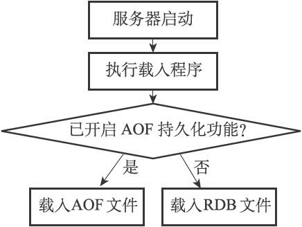

<span style="color: red;font-weight: bold;">Tips</span>：使用RDB恢复数据流程  

    1. 停止redis服务
    2. 关闭AOF，将配置文件中的appendonly改为no；删除aof文件
    3. 将要恢复的dump.rdb拷贝指定目录
    4. 启动redis服务
    5. 通过redis命令行动态配置临时开启AOF，使用CONFIG SET appendonly yes
    6. 一旦redis重启，状态将以配置文件为准，所以要将配置文件中的appendonly改为yes

#### RDB自动间隔性保存
Redis通过设置服务器配置的save选项，让服务器每隔一段时间自动执行一次BGSAVE命令。

用户可以通过指定配置文件或者传入启动参数的方式设置save选项，以下是服务器为save选项设置的默认条件：
```
save 900 1
save 300 10
save 60 10000
```

> - 服务器在900秒之内，对数据库进行了至少1次修改。
> - 服务器在300秒之内，对数据库进行了至少10次修改。
> - 服务器在60秒之内，对数据库进行了至少10000次修改。

当Redis服务器启动时，会根据save选项的保存条件，设置服务器状态redisServer结构的saveparams属性。
```
struct redisServer {
    // ...
    //记录了保存条件的数组
    struct saveparam *saveparams;
    //修改计数器
    long long dirty;
    //上一次执行save或bgsave保存的时间
    time_t lastsave;
    // ...
};

struct saveparam {
    //秒数
    time_t seconds;
    //修改次数
    int changes;
};
```

- dirty计数器记录距离上一次成功执行SAVE命令或者BGSAVE命令之后，服务器对数据库状态（服务器中的所有数据）进行了多少次修改（包括写入、删除、更新等操作）。
- lastsave属性是一个UNIX时间戳，记录了服务器上一次成功执行SAVE命令或者BGSAVE命令的时间。

1. 当服务器成功执行一个数据库修改命令之后，程序就会对dirty计数器进行更新：命令修改了多少次数据库，dirty计数器的值就增加多少。
2. Redis的服务器周期性操作函数serverCron默认每隔100毫秒就会执行一次，该函数用于对正在运行的服务器进行维护，它的其中一项工作就是检查save选项所设置的保存条件是否已经满足，如果满足的话，就执行BGSAVE命令。
3. 执行BGSAVE命令后，会将dirty计数器清零，并将命令执行时间更新到lastsave属性中。

下图是与RDB相关的服务器状态参数：  


#### RDB文件结构
  
（为了方便区分，全大写单词标示常量，全小写单词标示变量和数据）

- RDB文件的最开头是REDIS部分，这个部分的长度为5字节，保存着“REDIS”五个字符。通过这五个字符，程序可以在载入文件时，快速检查所载入的文件是否RDB文件。
- db_version长度为4字节，它的值是一个字符串表示的整数，这个整数记录了RDB文件的版本号，比如"0006"就代表RDB文件的版本为第六版。
- databases部分包含着零个或任意多个数据库，以及各个数据库中的键值对数据：  
    如果服务器的数据库状态为空（所有数据库都是空的），那么这个部分也为空，长度为0字节。  
    如果服务器的数据库状态为非空（至少一个数据库非空），那么这个部分也为非空，根据数据库所保存键值对的数量、类型和内容不同，这个部分的长度也会有所不同。

- EOF常量的长度为1字节，这个常量标志着RDB文件正文内容的结束，当读入程序遇到这个值的时候，它知道所有数据库的所有键值对都已经载入完毕了。
- check_sum是一个8字节长的无符号整数，保存着一个校验和，这个校验和是程序通过对REDIS、db_version、databases、EOF四个部分的内容进行计算得出的。服务器在载入RDB文件时，会将载入数据所计算出的校验和与check_sum所记录的校验和进行对比，以此来检查RDB文件是否有出错或者损坏的情况出现。

##### databases
一个RDB文件的databases部分可以保存任意多个非空数据库。  
每个非空数据库在RDB文件中都可以保存为SELECTDB、db_number、key_value_pairs三个部分：  


- SELECTDB常量的长度为1字节，当读入程序遇到这个值的时候，它知道接下来要读入的将是一个数据库号码。
- db_number保存着一个数据库号码，根据号码的大小不同，这个部分的长度可以是1字节、2字节或者5字节。当程序读入db_number部分之后，服务器会调用SELECT命令，根据读入的数据库号码进行数据库切换，使得之后读入的键值对可以载入到正确的数据库中。
- key_value_pairs部分保存了数据库中的所有键值对数据，如果键值对带有过期时间，那么过期时间也会和键值对保存在一起。根据键值对的数量、类型、内容以及是否有过期时间等条件的不同，key_value_pairs部分的长度也会有所不同。

下图是RDB文件中的数据库结构示例：  


###### key_value_pairs
RDB文件中的每个key_value_pairs部分都保存了一个或以上数量的键值对，如果键值对带有过期时间的话，那么键值对的过期时间也会被保存在内。

  
- TYPE记录了value的类型，长度为1字节，每个TYPE常量都代表了一种对象类型或者底层编码，当服务器读入RDB文件中的键值对数据时，程序会根据TYPE的值来决定如何读入和解释value的数据。取值是以下常量的其中之一：  
    REDIS_RDB_TYPE_STRING  
    REDIS_RDB_TYPE_LIST  
    REDIS_RDB_TYPE_SET  
    REDIS_RDB_TYPE_ZSET  
    REDIS_RDB_TYPE_HASH  
    REDIS_RDB_TYPE_LIST_ZIPLIST  
    REDIS_RDB_TYPE_SET_INTSET  
    REDIS_RDB_TYPE_ZSET_ZIPLIST  
    REDIS_RDB_TYPE_HASH_ZIPLIST  

- key保存了键值对的键对象，它总是一个字符串对象，根据内容长度的不同，key的长度也会有所不同。
- value保存了键值对的值对象，根据TYPE类型的不同，以及保存内容长度的不同，保存value的结构和长度也会有所不同。
- EXPIRETIME_MS常量的长度为1字节，它告知读入程序，接下来要读入的将是一个以毫秒为单位的过期时间。
- ms是一个8字节长的带符号整数，记录着一个以毫秒为单位的UNIX时间戳，这个时间戳就是键值对的过期时间。

1. **字符串对象**

TYPE的值为REDIS_RDB_TYPE_STRING，value保存的就是一个字符串对象，字符串对象的编码可以是REDIS_ENCODING_INT或者REDIS_ENCODING_RAW。

如果字符串对象的编码为REDIS_ENCODING_INT，那么说明对象中保存的是长度不超过32位的整数。ENCODING的值可以是REDIS_RDB_ENC_INT8、REDIS_RDB_ENC_INT16或者REDIS_RDB_ENC_INT32三个常量的其中一个，它们分别代表RDB文件使用8位（bit）、16位或者32位来保存整数值integer。  


如果字符串对象的编码为REDIS_ENCODING_RAW，那么说明对象所保存的是一个字符串值，根据字符串长度的不同，有压缩和不压缩两种方法来保存这个字符串：

    如果字符串的长度小于等于20字节，那么这个字符串会直接被原样保存。
    如果字符串的长度大于20字节，那么这个字符串会被压缩之后再保存。

以上两个条件是在假设服务器打开了RDB文件压缩功能的情况下进行的，如果服务器关闭了RDB文件压缩功能，那么RDB程序总以无压缩的方式保存字符串值。具体信息可以参考redis.conf文件中关于rdbcompression选项的说明。  
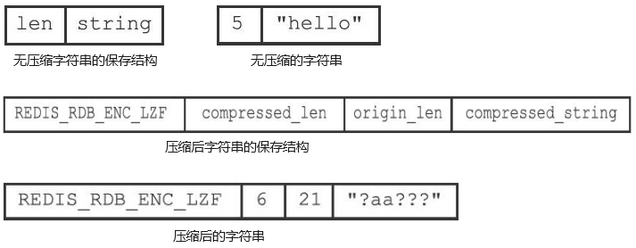

> - string部分保存了字符串值本身
> - len保存了字符串值的长度
> - REDIS_RDB_ENC_LZF常量标志着字符串已经被LZF算法（<http://liblzf.plan9.de>）压缩过了，读入程序在碰到这个常量时，会根据之后的compressed_len、origin_len和compressed_string三部分，对字符串进行解压缩
> - compressed_len记录的是字符串被压缩之后的长度
> - origin_len记录的是字符串原来的长度
> - compressed_string记录的则是被压缩之后的字符串

2. **列表对象**

TYPE的值为REDIS_RDB_TYPE_LIST，value保存的就是一个REDIS_ENCODING_LINKEDLIST编码的列表对象。

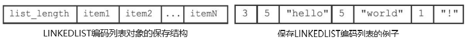

list_length记录了列表的长度，它记录列表保存了多少个项（item），读入程序可以通过这个长度知道自己应该读入多少个列表项。  
以item开头的部分代表列表的项，因为每个列表项都是一个字符串对象，所以程序会以处理字符串对象的方式来保存和读入列表项。  
例子中的第一个数字3是列表的长度，之后跟着三个列表项。第一个列表项的长度为5，内容为字符串"hello"......

3. **集合对象**

TYPE的值为REDIS_RDB_TYPE_SET，value保存的就是一个REDIS_ENCODING_HT编码的集合对象。

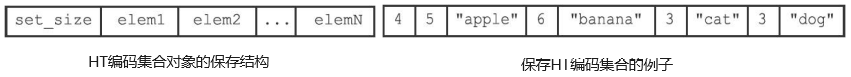

set_size是集合的大小，它记录集合保存了多少个元素，读入程序可以通过这个大小知道自己应该读入多少个集合元素。  
以elem开头的部分代表集合的元素，因为每个集合元素都是一个字符串对象，所以程序会以处理字符串对象的方式来保存和读入集合元素。  
例子中的第一个数字4记录了集合的大小，之后跟着的是集合的四个元素。第一个元素的长度为5，值为"apple"......

4. **哈希表对象**

TYPE的值为REDIS_RDB_TYPE_HASH，value保存的就是一个REDIS_ENCODING_HT编码的集合对象。

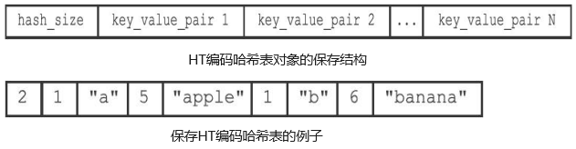

hash_size记录了哈希表的大小，也即是这个哈希表保存了多少键值对，读入程序可以通过这个大小知道自己应该读入多少个键值对。  
以key_value_pair开头的部分代表哈希表中的键值对，键值对的键和值都是字符串对象，所以程序会以处理字符串对象的方式来保存和读入键值对。  
例子中的第一个数字2记录了哈希表的键值对数量，之后跟着的是两个键值对。第一个键值对的键是长度为1的字符串"a"，值是长度为5的字符串"apple"......

5. **有序集合对象**

TYPE的值为REDIS_RDB_TYPE_ZSET，value保存的就是一个REDIS_ENCODING_SKIPLIST编码的有序集合对象。

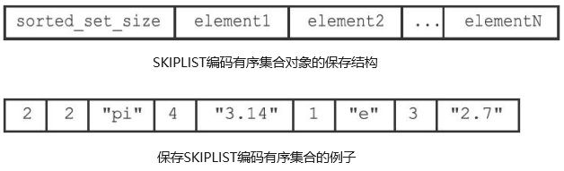

sorted_set_size记录了有序集合的大小，也即是这个有序集合保存了多少元素，读入程序需要根据这个值来决定应该读入多少有序集合元素。  
以element开头的部分代表有序集合中的元素，每个元素又分为成员（member）和分值（score）两部分，成员是一个字符串对象，分值则是一个double类型的浮点数，程序在保存RDB文件时会先将分值转换成字符串对象，然后再用保存字符串对象的方法将分值保存起来。  
例子中的第一个数字2记录了有序集合的元素数量，之后跟着的是两个有序集合元素。第一个元素的成员是长度为2的字符串"pi"，分值被转换成字符串之后变成了长度为4的字符串"3.14"......

6. **INTSET编码的集合**

TYPE的值为REDIS_RDB_TYPE_SET_INTSET，value保存的就是一个整数集合对象，RDB文件保存这种对象的方法是，先将整数集合转换为字符串对象，然后将这个字符串对象保存到RDB文件里面。

7. **ZIPLIST编码的列表、哈希表或者有序集合**

TYPE的值为REDIS_RDB_TYPE_LIST_ZIPLIST、REDIS_RDB_TYPE_HASH_ZIPLIST或者REDIS_RDB_TYPE_ZSET_ZIPLIST，value保存的就是一个压缩列表对象，RDB文件保存这种对象的方法是：先将压缩列表转换成一个字符串对象，再将转换所得的字符串对象保存到RDB文件。

#### 分析RDB文件
使用od命令来分析Redis服务器产生的RDB文件，该命令可以用给定的格式转存（dump）并打印输入文件。

    给定-c参数可以以ASCII编码的方式打印输入文件
    给定-x参数可以以十六进制的方式打印输入文件

调用od命令，打印包含带有过期时间的字符串键的RDB文件，将由以下几个部分组成：

> - 五个字节的"REDIS"字符串。
> - 四个字节的版本号（db_version）。
> - 一个一字节长的特殊值SELECTDB。
> - 一个长度可能为一字节、两字节或者五字节的数据库号码（db_number）。
> - 一个一字节长的EXPIRETIME_MS特殊值。
> - 一个八字节长的过期时间（ms）。
> - 一个一字节长的类型（TYPE）。
> - 一个或以上数量的键值对（key_value_pairs）。
> - 一个字节的EOF常量。
> - 八个字节的校验和（check_sum）。

```
$ od -c dump.rdb
0000000   R   E  D   I   S   0   0   0  6 376 \0 374  \  2 365 336
0000020   @ 001 \0  \0  \0 003   M   S  G 005  H   E  L  L   O 377
0000040 212 231  x 247 252   } 021 306
0000050
```

REDIS0006：RDB文件标志和版本号。  
376\0：376代表SELECTDB常量，\0代表整数0，表示切换到0号数据库。  
374：代表特殊值EXPIRETIME_MS。  
\2 365 336@001\0\0：代表八字节长的过期时间。  
\0 003 M S G：\0表示这是一个字符串类型，003是键的长度，MSG是键。  
005 H E L L O：005是值的长度，HELLO是值。  
377：代表EOF常量。  
212 231 x 247 252 } 021 306：代表八字节长的校验和。


### AOF持久化
Append Only File，通过保存Redis服务器所执行的写命令来记录数据库状态的。  
被写入AOF文件的所有命令都是以Redis的命令请求协议格式保存的，因为Redis的命令请求协议是纯文本格式，所以我们可以直接打开一个AOF文件，观察里面的内容。  
服务器在启动时，可以通过载入和执行AOF文件中保存的命令来还原服务器关闭之前的数据库状态。

AOF持久化功能的实现可以分为命令追加（append）、文件写入、文件同步（sync）三个步骤。

###### 命令追加
当AOF持久化功能处于打开状态时，服务器在执行完一个写命令之后，会以协议格式将被执行的写命令追加到服务器状态的aof_buf缓冲区的末尾。

```
struct redisServer {
    // ...
    // AOF缓冲区
    sds aof_buf;
    // ...
};
```

###### 文件写入
当AOF持久化功能处于打开状态时，将接收到的写命令以文本协议格式逐条追加到AOF文件中的过程。

###### 文件同步
将内存中的AOF缓冲区内容强制刷入磁盘的过程，确保在系统崩溃等意外情况下，已经写入缓冲区但尚未持久化到磁盘上的数据能够得到保存。

#### AOF持久化的实现
Redis的服务器进程就是一个事件循环（loop），这个循环中的文件事件负责接收客户端的命令请求，以及向客户端发送命令回复，而时间事件则负责执行像serverCron函数这样需要定时运行的函数。  
服务器在处理文件事件时可能会执行写命令，使得一些内容被追加到aof_buf缓冲区里面，在服务器每次结束一个事件循环之前，它都会调用flushAppendOnlyFile函数，考虑是否需要将aof_buf缓冲区中的内容写入和保存到AOF文件里面。

flushAppendOnlyFile函数的行为由服务器配置的appendfsync选项的值来决定，不同appendfsync值产生不同的持久化行为：

appendfsync的值 | flushAppendOnlyFile函数的行为
 :----: | :----
always | 将aof_buf缓冲区中的所有内容写入到AOF文件并同步到磁盘中
everysec | 将aof_buf缓冲区中的所有内容写入到AOF文件，如果距上次同步AOF文件到磁盘的时间超过一秒钟，那就再次将AOF文件同步到磁盘，该同步操作由一个线程专门负责执行
no | 将aof_buf缓冲区中的所有内容写入到AOF文件，但并不对AOF文件进行同步，何时同步由操作系统决定

appendfsync选项的默认值为everysec

##### AOF持久化的效率和安全性
服务器配置appendfsync选项的值直接决定AOF持久化功能的效率和安全性。
- 当appendfsync的值为always时，服务器在每个事件循环都要将aof_buf缓冲区中的所有内容写入到AOF文件，并且同步到磁盘，所以always的效率是最低的，但always也是最安全的，因为即使出现故障停机，AOF持久化也只会丢失一个事件循环中所产生的命令数据。
- 当appendfsync的值为everysec时，服务器在每个事件循环都要将aof_buf缓冲区中的所有内容写入到AOF文件，并且每隔一秒就要在子线程中对AOF文件进行一次同步。从效率上来讲，everysec模式足够快，并且就算出现故障停机，数据库也只丢失一秒钟的命令数据。
- 当appendfsync的值为no时，服务器在每个事件循环都要将aof_buf缓冲区中的所有内容写入到AOF文件，至于何时对AOF文件进行同步，则由操作系统控制。因为no模式的flushAppendOnlyFile调用无须执行同步操作，所以no模式下的AOF文件写入速度总是最快的，但是会在系统缓存中积累一段时间的写入数据，所以该模式的单次同步时长通常是最长的。从平摊操作的角度来看，no模式和everysec模式的效率类似，当出现故障停机时，使用no模式的服务器将丢失上次同步AOF文件之后的所有写命令数据。

#### AOF文件的载入与数据还原
因为AOF文件里面包含了重建数据库状态所需的所有写命令，所以服务器只要读入并重新执行一遍AOF文件里面保存的写命令，就可以还原服务器关闭之前的数据库状态。

Redis读取AOF文件并还原数据库状态的详细步骤如下：
1. 创建一个不带网络连接的伪客户端（fake client）：因为Redis的命令只能在客户端上下文中执行，而载入AOF文件时所使用的命令直接来源于AOF文件而不是网络连接，所以服务器使用了一个没有网络连接的伪客户端来执行AOF文件保存的写命令，伪客户端执行命令的效果和带网络连接的客户端执行命令的效果完全一样。
2. 从AOF文件中分析并读取出一条写命令。
3. 使用伪客户端执行被读出的写命令。
4. 一直执行步骤2和步骤3，直到AOF文件中的所有写命令都被处理完毕为止。

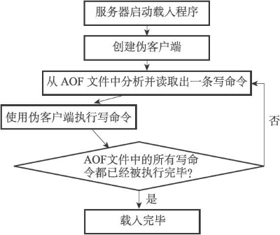

#### AOF重写
因为AOF持久化是通过保存被执行的写命令来记录数据库状态的，所以随着服务器运行时间的流逝，AOF文件中的内容会越来越多，文件的体积也会越来越大，如果不加以控制的话，体积过大的AOF文件很可能对Redis服务器、甚至整个宿主计算机造成影响，并且AOF文件的体积越大，使用AOF文件来进行数据还原所需的时间就越多。  
为了解决AOF文件体积膨胀的问题，Redis提供了AOF文件重写（rewrite）功能。  
Redis服务器可以创建一个新的AOF文件来替代现有的AOF文件，新旧两个AOF文件所保存的数据库状态相同，但新AOF文件不会包含任何浪费空间的冗余命令，所以新AOF文件的体积通常会比旧AOF文件的体积要小得多。

##### AOF文件重写的实现
虽然Redis将生成新AOF文件替换旧AOF文件的功能命名为“AOF文件重写”，但实际上，AOF文件重写并不需要对现有的AOF文件进行任何读取、分析或者写入操作，这个功能是通过读取服务器当前的数据库状态来实现的。  
首先从数据库中读取键现在的值，然后用一条命令去记录键值对，代替之前记录这个键值对的多条命令，这就是AOF重写功能的实现原理。

<span style="color: red;font-weight: bold;">Tips</span>：在实际中，为了避免在执行命令时造成客户端输入缓冲区溢出，重写程序在处理列表、哈希表、集合、有序集合这四种可能会带有多个元素的键时，会先检查键所包含的元素数量，如果元素的数量超过了redis.h/REDIS_AOF_REWRITE_ITEMS_PER_CMD常量的值，那么重写程序将使用多条命令来记录键的值，而不单单使用一条命令。  
在Redis 3.0中，REDIS_AOF_REWRITE_ITEMS_PER_CMD常量的值为64，这也就是说，如果一个集合键包含了超过64个元素，那么重写程序会用多条写命令（例如SADD）来记录这个集合，并且每条命令设置的元素数量最多为64个。

##### AOF后台重写
aof_rewrite函数会进行大量的写入操作，在调用时线程将被长时间阻塞，因为Redis服务器使用单个线程来处理命令请求，所以如果由服务器直接调用aof_rewrite函数的话，那么在重写AOF文件期间，服务期将无法处理客户端发来的命令请求。  
Redis决定将AOF重写程序放到子进程里执行，子进程进行AOF重写期间，服务器进程（父进程）可以继续处理命令请求。子进程带有服务器进程的数据副本，使用子进程而不是线程，可以在避免使用锁的情况下，保证数据的安全性。

使用子进程也有一个问题需要解决，因为子进程在进行AOF重写期间，服务器进程还需要继续处理命令请求，而新的命令可能会对现有的数据库状态进行修改，从而使得服务器当前的数据库状态和重写后的AOF文件所保存的数据库状态不一致。

为了解决这种数据不一致问题，Redis服务器设置了一个AOF重写缓冲区，这个缓冲区在服务器创建子进程之后开始使用，当Redis服务器执行完一个写命令之后，它会同时将这个写命令发送给AOF缓冲区和AOF重写缓冲区。  
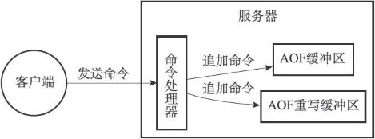

- AOF缓冲区的内容会定期被写入和同步到AOF文件，对现有AOF文件的处理工作会如常进行。
- 从创建子进程开始，服务器执行的所有写命令都会被记录到AOF重写缓冲区里面。
- 当子进程完成AOF重写工作之后，它会向父进程发送一个信号，父进程在接到该信号之后，会调用一个信号处理函数，并执行以下工作：  
    1）将AOF重写缓冲区中的所有内容写入到新AOF文件中，这时新AOF文件所保存的数据库状态将和服务器当前的数据库状态一致。  
    2）对新的AOF文件进行改名，原子地（atomic）覆盖现有的AOF文件，完成新旧两个AOF文件的替换。

<span style="color: red;font-weight: bold;">Tips</span>：在整个AOF后台重写过程中，只有信号处理函数执行时会对服务器进程（父进程）造成阻塞，在其他时候，AOF后台重写都不会阻塞父进程，这将AOF重写对服务器性能造成的影响降到了最低。


### 事件
Redis服务器是一个事件驱动程序，服务器需要处理以下两类事件：  
1. 文件事件（file event）：Redis服务器通过套接字与客户端（或者其他Redis服务器）进行连接，而文件事件就是服务器对套接字操作的抽象。服务器与客户端（或者其他服务器）的通信会产生相应的文件事件，而服务器则通过监听并处理这些事件来完成一系列网络通信操作。
2. 时间事件（time event）：Redis服务器中的一些操作（比如serverCron函数）需要在给定的时间点执行，而时间事件就是服务器对这类定时操作的抽象。

#### 文件事件
Redis基于Reactor模式开发了自己的网络事件处理器：文件事件处理器（file event handler）。  
- 文件事件处理器使用I/O多路复用（multiplexing）程序来同时监听多个套接字，并根据套接字目前执行的任务来为套接字关联不同的事件处理器。
- 当被监听的套接字准备好执行连接应答（accept）、读取（read）、写入（write）、关闭（close）等操作时，与操作相对应的文件事件就会产生，这时文件事件处理器就会调用套接字之前关联好的事件处理器来处理这些事件。

文件事件处理器以单线程方式运行，通过使用I/O多路复用程序来监听多个套接字。文件事件处理器既实现了高性能的网络通信模型，又可以很好地与Redis服务器中其他同样以单线程方式运行的模块进行对接，这保持了Redis内部单线程设计的简单性。

##### 文件事件处理器的构成
文件事件处理器有四个组成部分，它们分别是套接字、I/O多路复用程序、文件事件分派器（dispatcher）、事件处理器。  
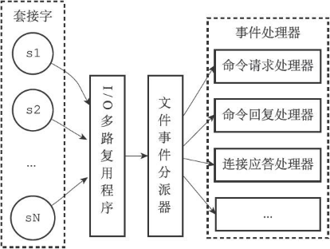  
文件事件是对套接字操作的抽象，每当一个套接字准备好执行连接应答（accept）、写入、读取、关闭等操作时，就会产生一个文件事件。因为一个服务器通常会连接多个套接字，所以多个文件事件有可能会并发地出现。  
I/O多路复用程序负责监听多个套接字，并向文件事件分派器传送那些产生了事件的套接字。

尽管多个文件事件可能会并发地出现，但I/O多路复用程序总是会将所有产生事件的套接字都放到一个队列里面，然后通过这个队列，以有序（sequentially）、同步（synchronously）、每次一个套接字的方式向文件事件分派器传送套接字。当上一个套接字产生的事件被处理完毕之后（该套接字为事件所关联的事件处理器执行完毕），I/O多路复用程序才会继续向文件事件分派器传送下一个套接字。文件事件分派器接收I/O多路复用程序传来的套接字，并根据套接字产生的事件的类型，调用相应的事件处理器。

##### I/O多路复用程序的实现
Redis的I/O多路复用程序的所有功能都是通过包装常见的select、epoll、evport和kqueue这些I/O多路复用函数库来实现的，每个I/O多路复用函数库在Redis源码中都对应一个单独的文件，比如ae_select.c、ae_epoll.c、ae_kqueue.c，诸如此类。  
因为Redis为每个I/O多路复用函数库都实现了相同的API，所以I/O多路复用程序的底层实现是可以互换的。  
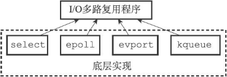

Redis在I/O多路复用程序的实现源码中用#include宏定义了相应的规则，程序会在编译时自动选择系统中性能最高的I/O多路复用函数库来作为Redis的I/O多路复用程序的底层实现。

```
/* Include the best multiplexing layer supported by this system.
 * The following should be ordered by performances, descending. */
# ifdef HAVE_EVPORT
# include "ae_evport.c"
# else
    # ifdef HAVE_EPOLL
    # include "ae_epoll.c"
    # else
        # ifdef HAVE_KQUEUE
        # include "ae_kqueue.c"
        # else
        # include "ae_select.c"
        # endif
    # endif
# endif
```

##### 事件的类型
I/O多路复用程序可以监听多个套接字的ae.h/AE_READABLE事件和ae.h/AE_WRITABLE事件，这两类事件和套接字操作之间的对应关系如下：

    当套接字变得可读时（客户端对套接字执行write操作，或者执行close操作），或者有新的可应答（acceptable）套接字出现时（客户端对服务器的监听套接字执行connect操作），套接字产生AE_READABLE事件。
    当套接字变得可写时（客户端对套接字执行read操作），套接字产生AE_WRITABLE事件。

I/O多路复用程序允许服务器同时监听套接字的AE_READABLE事件和AE_WRITABLE事件，如果一个套接字同时产生了这两种事件，那么文件事件分派器会优先处理AE_READABLE事件，然后再处理AE_WRITABLE事件。

##### API
- ae.c/aeCreateFileEvent函数接受一个套接字描述符、一个事件类型，以及一个事件处理器作为参数，将给定套接字的给定事件加入到I/O多路复用程序的监听范围之内，并对事件和事件处理器进行关联。
- ae.c/aeDeleteFileEvent函数接受一个套接字描述符和一个监听事件类型作为参数，让I/O多路复用程序取消对给定套接字的给定事件的监听，并取消事件和事件处理器之间的关联。
- ae.c/aeGetFileEvents函数接受一个套接字描述符，返回该套接字正在被监听的事件类型：

    如果套接字没有任何事件被监听，那么函数返回AE_NONE。  
    如果套接字的读事件正在被监听，那么函数返回AE_READABLE。  
    如果套接字的写事件正在被监听，那么函数返回AE_WRITABLE。  
    如果套接字的读事件和写事件正在被监听，那么函数返回AE_READABLE|AE_WRITABLE。

- ae.c/aeWait函数接受一个套接字描述符、一个事件类型和一个毫秒数为参数，在给定的时间内阻塞并等待套接字的给定类型事件产生，当事件成功产生，或者等待超时之后，函数返回。
- ae.c/aeApiPoll函数接受一个sys/time.h/struct timeval结构为参数，并在指定的时间內，阻塞并等待所有被aeCreateFileEvent函数设置为监听状态的套接字产生文件事件，当有至少一个事件产生，或者等待超时后，函数返回。
- ae.c/aeProcessEvents函数是文件事件分派器，它先调用aeApiPoll函数来等待事件产生，然后遍历所有已产生的事件，并调用相应的事件处理器来处理这些事件。
- ae.c/aeGetApiName函数返回I/O多路复用程序底层所使用的I/O多路复用函数库的名称：返回"epoll"表示底层为epoll函数库，返回"select"表示底层为select函数库，诸如此类。

##### 文件事件的处理器
> - 为了对连接服务器的各个客户端进行应答，服务器要为监听套接字关联连接应答处理器。
> - 为了接收客户端传来的命令请求，服务器要为客户端套接字关联命令请求处理器。
> - 为了向客户端返回命令的执行结果，服务器要为客户端套接字关联命令回复处理器。
> - 当主服务器和从服务器进行复制操作时，主从服务器都需要关联特别为复制功能编写的复制处理器。

下面介绍最常用的三种事件处理器：

1. 连接应答处理器  
networking.c/acceptTcpHandler函数是Redis的连接应答处理器，这个处理器用于对连接服务器监听套接字的客户端进行应答，具体实现为sys/socket.h/accept函数的包装。  
当Redis服务器进行初始化的时候，程序会将这个连接应答处理器和服务器监听套接字的AE_READABLE事件关联起来，当有客户端用sys/socket.h/connect函数连接服务器监听套接字的时候，套接字就会产生AE_READABLE事件，引发连接应答处理器执行，并执行相应的套接字应答操作。

2. 命令请求处理器  
networking.c/readQueryFromClient函数是Redis的命令请求处理器，这个处理器负责从套接字中读入客户端发送的命令请求内容，具体实现为unistd.h/read函数的包装。  
当一个客户端通过连接应答处理器成功连接到服务器之后，服务器会将客户端套接字的AE_READABLE事件和命令请求处理器关联起来，当客户端向服务器发送命令请求的时候，套接字就会产生AE_READABLE事件，引发命令请求处理器执行，并执行相应的套接字读入操作。  
在客户端连接服务器的整个过程中，服务器都会一直为客户端套接字的AE_READABLE事件关联命令请求处理器。

3. 命令回复处理器  
networking.c/sendReplyToClient函数是Redis的命令回复处理器，这个处理器负责将服务器执行命令后得到的命令回复通过套接字返回给客户端，具体实现为unistd.h/write函数的包装。  
当服务器有命令回复需要传送给客户端的时候，服务器会将客户端套接字的AE_WRITABLE事件和命令回复处理器关联起来，当客户端准备好接收服务器传回的命令回复时，就会产生AE_WRITABLE事件，引发命令回复处理器执行，并执行相应的套接字写入操作。  
当命令回复发送完毕之后，服务器就会解除命令回复处理器与客户端套接字的AE_WRITABLE事件之间的关联。

#### 时间事件

Redis的时间事件分为以下两类：

    定时事件：让一段程序在指定的时间之后执行一次。比如说，让程序X在当前时间的30毫秒之后执行一次。
    周期性事件：让一段程序每隔指定时间就执行一次。比如说，让程序Y每隔30毫秒就执行一次。

一个时间事件主要由以下三个属性组成：

    id：服务器为时间事件创建的全局唯一ID（标识号）。ID号按从小到大的顺序递增，新事件的ID号比旧事件的ID号要大。
    when：毫秒精度的UNIX时间戳，记录了时间事件的到达（arrive）时间。
    timeProc：时间事件处理器，一个函数。当时间事件到达时，服务器就会调用相应的处理器来处理事件。

一个时间事件是定时事件还是周期性事件取决于时间事件处理器的返回值：

    如果事件处理器返回ae.h/AE_NOMORE，那么这个事件为定时事件：该事件在达到一次之后就会被删除，之后不再到达。
    如果事件处理器返回一个非AE_NOMORE的整数值，那么这个事件为周期性时间：当一个时间事件到达之后，服务器会根据事件处理器返回的值，对时间事件的when属性进行更新，让这个事件在一段时间之后再次到达，并以这种方式一直更新并运行下去。比如说，如果一个时间事件的处理器返回整数值30，那么服务器应该对这个时间事件进行更新，让这个事件在30毫秒之后再次到达。
    
<span style="color: red;font-weight: bold;">Tips</span>：Redis 2.9版本只使用周期性事件，没有使用定时事件。

##### 时间事件的实现
服务器将所有时间事件都放在一个无序链表中，每当时间事件执行器运行时，它就遍历整个链表，查找所有已到达的时间事件，并调用相应的事件处理器。

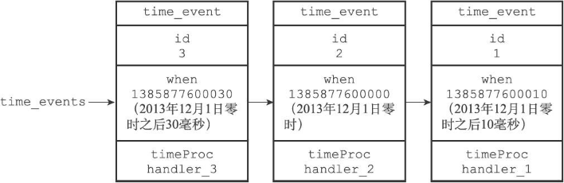  
链表中包含了三个不同的时间事件：因为新的时间事件总是插入到链表的表头，所以三个时间事件分别按ID逆序排序，表头事件的ID为3，中间事件的ID为2，表尾事件的ID为1。  
注意，我们说保存时间事件的链表为无序链表，指的不是链表不按ID排序，而是说，该链表不按when属性的大小排序。正因为链表没有按when属性进行排序，所以当时间事件执行器运行的时候，它必须遍历链表中的所有时间事件，这样才能确保服务器中所有已到达的时间事件都会被处理。

###### 无序链表并不影响时间事件处理器的性能
正常模式下的Redis服务器只使用serverCron一个时间事件，而在benchmark模式下，服务器也只使用两个时间事件。  
在这种情况下，服务器几乎是将无序链表退化成一个指针来使用，所以使用无序链表来保存时间事件，并不影响事件执行的性能。

##### API
- ae.c/aeCreateTimeEvent函数接受一个毫秒数milliseconds和一个时间事件处理器proc作为参数，将一个新的时间事件添加到服务器，这个新的时间事件将在当前时间的milliseconds毫秒之后到达，而事件的处理器为proc。
- ae.c/aeDeleteFileEvent函数接受一个时间事件ID作为参数，然后从服务器中删除该ID所对应的时间事件。
- ae.c/aeSearchNearestTimer函数返回到达时间距离当前时间最接近的那个时间事件。
- ae.c/processTimeEvents函数是时间事件的执行器，这个函数会遍历所有已到达的时间事件，并调用这些事件的处理器。已到达指的是，时间事件的when属性记录的UNIX时间戳等于或小于当前时间的UNIX时间戳。

##### serverCron函数
持续运行的Redis服务器需要定期对自身的资源和状态进行检查和调整，从而确保服务器可以长期、稳定地运行，这些定期操作由redis.c/serverCron函数负责执行，它的主要工作包括：

    更新服务器的各类统计信息，比如时间、内存占用、数据库占用情况等。
    清理数据库中的过期键值对。
    关闭和清理连接失效的客户端。
    尝试进行AOF或RDB持久化操作。
    如果服务器是主服务器，那么对从服务器进行定期同步。
    如果处于集群模式，对集群进行定期同步和连接测试。

Redis服务器以周期性事件的方式来运行serverCron函数，在服务器运行期间，每隔一段时间，serverCron就会执行一次，直到服务器关闭为止。  
在Redis2.6版本，服务器默认规定serverCron每秒运行10次，平均每间隔100毫秒运行一次。

#### 事件的调度与执行
事件的调度和执行由ae.c/aeProcessEvents函数负责，将aeProcessEvents函数置于一个循环里面，加上初始化和清理函数，这就构成了Redis服务器的主函数。

以下是事件的调度和执行规则：  
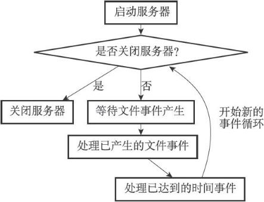  
1. aeApiPoll函数的最大阻塞时间由到达时间最接近当前时间的时间事件决定，这个方法既可以避免服务器对时间事件进行频繁的轮询（忙等待），也可以确保aeApiPoll函数不会阻塞过长时间。
2. 因为文件事件是随机出现的，如果等待并处理完一次文件事件之后，仍未有任何时间事件到达，那么服务器将再次等待并处理文件事件。随着文件事件的不断执行，时间会逐渐向时间事件所设置的到达时间逼近，并最终来到到达时间，这时服务器就可以开始处理到达的时间事件了。
3. 对文件事件和时间事件的处理都是同步、有序、原子地执行的，服务器不会中途中断事件处理，也不会对事件进行抢占，因此，不管是文件事件的处理器，还是时间事件的处理器，它们都会尽可地减少程序的阻塞时间，并在有需要时主动让出执行权，从而降低造成事件饥饿的可能性。比如说，在命令回复处理器将一个命令回复写入到客户端套接字时，如果写入字节数超过了一个预设常量的话，命令回复处理器就会主动用break跳出写入循环，将余下的数据留到下次再写；另外，时间事件也会将非常耗时的持久化操作放到子线程或者子进程执行。
4. 因为时间事件在文件事件之后执行，并且事件之间不会出现抢占，所以时间事件的实际处理时间，通常会比时间事件设定的到达时间稍晚一些。


### 客户端
Redis服务器是典型的一对多服务器程序：一个服务器可以与多个客户端建立网络连接，每个客户端可以向服务器发送命令请求，而服务器则接收并处理客户端发送的命令请求，并向客户端返回命令回复。  
通过使用由I/O多路复用技术实现的文件事件处理器，Redis服务器使用单线程单进程的方式来处理命令请求，并与多个客户端进行网络通信。

服务器为这些客户端建立了相应的redis.h/redisClient结构（客户端状态），这个链表结构保存了客户端当前的状态信息，以及执行相关功能时需要用到的数据结构，其中包括：

    客户端的套接字描述符。
    客户端的名字。
    客户端的标志值（flag）。
    指向客户端正在使用的数据库的指针，以及该数据库的号码。
    客户端当前要执行的命令、命令的参数、命令参数的个数，以及指向命令实现函数的指针。
    客户端的输入缓冲区和输出缓冲区。
    客户端的复制状态信息，以及进行复制所需的数据结构。
    客户端执行BRPOP、BLPOP等列表阻塞命令时使用的数据结构。
    客户端的事务状态，以及执行WATCH命令时用到的数据结构。
    客户端执行发布与订阅功能时用到的数据结构。
    客户端的身份验证标志。
    客户端的创建时间，客户端和服务器最后一次通信的时间，以及客户端的输出缓冲区大小超出软性限制（soft limit）的时间。

```
struct redisServer {
    // ...
    //一个链表，保存了所有客户端状态
    list *clients;
    // ...
};
```

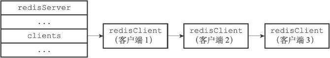

#### 客户端属性
客户端状态包含的属性可以分为两类：

    一类是比较通用的属性，这些属性很少与特定功能相关，无论客户端执行的是什么工作，它们都要用到这些属性。
    另外一类是和特定功能相关的属性，比如操作数据库时需要用到的db属性和dictid属性，执行事务时需要用到的mstate属性，以及执行WATCH命令时需要用到的watched_keys属性等等。

客户端的结构：
```
typedef struct redisClient {
    // ...
    //套接字描述符
    int fd;
    //名字
    robj *name;
    //标志
    int flags;
    //输入缓冲区
    sds querybuf;
    //命令与参数
    robj **argv;
    //argv数组的长度
    int argc;
    //命令的实现函数
    struct redisCommand *cmd;
    //固定大小的输出缓冲区
    char buf[REDIS_REPLY_CHUNK_BYTES];
    //buf数组的已使用字节数量
    int bufpos;
    //可变大小的输出缓冲区
    list *reply;
    //客户端是否通过身份验证
    int authenticated;
    //创建客户端的时间
    time_t ctime;
    //客户端与服务器最后一次进行互动（interaction）的时间
    time_t lastinteraction;
    //输出缓冲区第一次到达软性限制（soft limit）的时间
    time_t obuf_soft_limit_reached_time;
    // ...
} redisClient;
```

###### 套接字描述符
客户端状态的fd属性记录了客户端正在使用的套接字描述符。根据客户端类型的不同，fd属性的值可以是-1或者是大于-1的整数：  
    ▶ 伪客户端（fake client）的fd属性的值为-1：伪客户端处理的命令请求来源于AOF文件或者Lua脚本，而不是网络，所以这种客户端不需要套接字连接，自然也不需要记录套接字描述符。目前Redis服务器会在两个地方用到伪客户端，一个用于载入AOF文件并还原数据库状态，而另一个则用于执行Lua脚本中包含的Redis命令。  
    ▶ 普通客户端的fd属性的值为大于-1的整数：普通客户端使用套接字来与服务器进行通信，所以服务器会用fd属性来记录客户端套接字的描述符。因为合法的套接字描述符不能是-1，所以普通客户端的套接字描述符的值必然是大于-1的整数。

执行CLIENT list命令可以列出目前所有连接到服务器的普通客户端，命令输出中的fd域显示了服务器连接客户端所使用的套接字描述符：

```
redis> CLIENT list
addr=127.0.0.1:53428 fd=6 name= age=1242 idle=0 ...
addr=127.0.0.1:53469 fd=7 name= age=4 idle=4 ...
```

###### 名字
在默认情况下，一个连接到服务器的客户端是没有名字的。  
使用CLIENT setname命令可以为客户端设置一个名字，让客户端的身份变得更清晰。

```
redis> CLIENT list
addr=127.0.0.1:53428 fd=6 name=message_queue age=2093 idle=0 ...
addr=127.0.0.1:53469 fd=7 name=user_relationship age=855 idle=2 ...
```

###### 标志
客户端的标志属性flags记录了客户端的角色（role），以及客户端目前所处的状态。  
flags属性的值可以是单个标志；也可以是多个标志，用二进制或连接：

```
flags = <flag>
flags = <flag1> | <flag2> | ...
```
每个标志使用一个常量表示。所有标志都定义在redis.h文件里面。  
一部分标志记录了客户端的角色：  
    ▶ 在主从服务器进行复制操作时，主服务器会成为从服务器的客户端，而从服务器也会成为主服务器的客户端。REDIS_MASTER标志表示客户端代表的是一个主服务器，REDIS_SLAVE标志表示客户端代表的是一个从服务器。  
    ▶ REDIS_PRE_PSYNC标志表示客户端代表的是一个版本低于Redis2.8的从服务器，主服务器不能使用PSYNC命令与这个从服务器进行同步。这个标志只能在REDIS_SLAVE标志处于打开状态时使用。  
    ▶ REDIS_LUA_CLIENT标识表示客户端是专门用于处理Lua脚本里面包含的Redis命令的伪客户端。

另外一部分标志则记录了客户端目前所处的状态：  
▶ REDIS_MONITOR标志表示客户端正在执行MONITOR命令。  
▶ REDIS_UNIX_SOCKET标志表示服务器使用UNIX套接字来连接客户端。  
▶ REDIS_BLOCKED标志表示客户端正在被BRPOP、BLPOP等命令阻塞。  
▶ REDIS_UNBLOCKED标志表示客户端已经从REDIS_BLOCKED标志所表示的阻塞状态中脱离出来，不再阻塞。REDIS_UNBLOCKED标志只能在REDIS_BLOCKED标志已经打开的情况下使用。  
▶ REDIS_MULTI标志表示客户端正在执行事务。  
▶ REDIS_DIRTY_CAS标志表示事务使用WATCH命令监视的数据库键已经被修改，REDIS_DIRTY_EXEC标志表示事务在命令入队时出现了错误，以上两个标志都表示事务的安全性已经被破坏，只要这两个标记中的任意一个被打开，EXEC命令必然会执行失败。这两个标志只能在客户端打开了REDIS_MULTI标志的情况下使用。  
▶ REDIS_CLOSE_ASAP标志表示客户端的输出缓冲区大小超出了服务器允许的范围，服务器会在下一次执行serverCron函数时关闭这个客户端，以免服务器的稳定性受到这个客户端影响。积存在输出缓冲区中的所有内容会直接被释放，不会返回给客户端。  
▶ REDIS_CLOSE_AFTER_REPLY标志表示有用户对这个客户端执行了CLIENT KILL命令，或者客户端发送给服务器的命令请求中包含了错误的协议内容。服务器会将客户端积存在输出缓冲区中的所有内容发送给客户端，然后关闭客户端。  
▶ REDIS_ASKING标志表示客户端向集群节点（运行在集群模式下的服务器）发送了ASKING命令。  
▶ REDIS_FORCE_AOF标志强制服务器将当前执行的命令写入到AOF文件里面，REDIS_FORCE_REPL标志强制主服务器将当前执行的命令复制给所有从服务器。执行PUBSUB命令会使客户端打开REDIS_FORCE_AOF标志，执行SCRIPT LOAD命令会使客户端打开REDIS_FORCE_AOF标志和REDIS_FORCE_REPL标志。  
▶ 在主从服务器进行命令传播期间，从服务器需要向主服务器发送REPLICATION ACK命令，在发送这个命令之前，从服务器必须打开主服务器对应的客户端的REDIS_MASTER_FORCE_REPLY标志，否则发送操作会被拒绝执行。  

**PUBSUB命令和SCRIPT LOAD命令的特殊性**  
通常情况下，Redis只会将那些对数据库进行了修改的命令写入到AOF文件，并复制到各个从服务器。如果一个命令没有对数据库进行任何修改，那么它就会被认为是只读命令，这个命令不会被写入到AOF文件，也不会被复制到从服务器。  
以上规则适用于绝大部分Redis命令，但PUBSUB命令和SCRIPT LOAD命令是其中的例外。PUBSUB命令虽然没有修改数据库，但PUBSUB命令向频道的所有订阅者发送消息这一行为带有副作用，接收到消息的所有客户端的状态都会因为这个命令而改变。因此，服务器需要使用REDIS_FORCE_AOF标志，强制将这个命令写入AOF文件，这样在将来载入AOF文件时，服务器就可以再次执行相同的PUBSUB命令，并产生相同的副作用。SCRIPT LOAD命令的情况与PUBSUB命令类似：虽然SCRIPT LOAD命令没有修改数据库，但它修改了服务器状态，所以它是一个带有副作用的命令，服务器需要使用REDIS_FORCE_AOF标志，强制将这个命令写入AOF文件，使得将来在载入AOF文件时，服务器可以产生相同的副作用。  
另外，为了让主服务器和从服务器都可以正确地载入SCRIPT LOAD命令指定的脚本，服务器需要使用REDIS_FORCE_REPL标志，强制将SCRIPT LOAD命令复制给所有从服务器。

以下是一些flags属性的例子：

```
#客户端是一个主服务器
REDIS_MASTER
#客户端正在被列表命令阻塞
REDIS_BLOCKED
#客户端正在执行事务，但事务的安全性已被破坏
REDIS_MULTI | REDIS_DIRTY_CAS
#客户端是一个从服务器，并且版本低于Redis 2.8 
REDIS_SLAVE | REDIS_PRE_PSYNC
#这是专门用于执行Lua脚本包含的Redis命令的伪客户端
# 它强制服务器将当前执行的命令写入AOF文件，并复制给从服务器
REDIS_LUA_CLIENT | REDIS_FORCE_AOF| REDIS_FORCE_REPL
```

###### 输入缓冲区
客户端状态的输入缓冲区用于保存客户端发送的命令请求。  
输入缓冲区的大小会根据输入内容动态地缩小或者扩大，但它的最大大小不能超过1GB，否则服务器将关闭这个客户端。

###### 命令与命令参数
在服务器将客户端发送的命令请求保存到客户端状态的querybuf属性之后，服务器将对命令请求的内容进行分析，并将得出的命令参数以及命令参数的个数分别保存到客户端状态的argv属性和argc属性。  
argv属性是一个数组，数组中的每个项都是一个字符串对象，其中argv[0]是要执行的命令，而之后的其他项则是传给命令的参数。  
argc属性则负责记录argv数组的长度。

###### 命令的实现函数
当服务器从协议内容中分析并得出argv属性和argc属性的值之后，服务器将根据项argv[0]的值，在命令表中查找命令所对应的命令实现函数。  
命令表是一个字典，字典的键是一个SDS结构，保存了命令的名字，字典的值是命令所对应的redisCommand结构，这个结构保存了命令的实现函数、命令的标志、命令应该给定的参数个数、命令的总执行次数和总消耗时长等统计信息。  
当程序在命令表中成功找到argv[0]所对应的redisCommand结构时，它会将客户端状态的cmd指针指向这个结构。之后，服务器就可以使用cmd属性所指向的redisCommand结构，以及argv、argc属性中保存的命令参数信息，调用命令实现函数，执行客户端指定的命令。

###### 输出缓冲区
执行命令所得的命令回复会被保存在客户端状态的输出缓冲区里面，每个客户端都有两个输出缓冲区可用，一个缓冲区的大小是固定的，另一个缓冲区的大小是可变的：  
    ▶ 固定大小的缓冲区用于保存那些长度比较小的回复，比如OK、简短的字符串值、整数值、错误回复等等。  
    ▶ 可变大小的缓冲区用于保存那些长度比较大的回复，比如一个非常长的字符串值，一个由很多项组成的列表，一个包含了很多元素的集合等等。

- 客户端的固定大小缓冲区由buf和bufpos两个属性组成，buf是一个大小为REDIS_REPLY_CHUNK_BYTES字节的字节数组，而bufpos属性则记录了buf数组目前已使用的字节数量。  
REDIS_REPLY_CHUNK_BYTES常量目前的默认值为16*1024，也即是说，buf数组的默认大小为16KB。

当buf数组的空间已经用完，或者回复因为太大而没办法放进buf数组里面时，服务器就会开始使用可变大小缓冲区。

- 可变大小缓冲区由reply链表和一个或多个字符串对象组成。通过使用链表来连接多个字符串对象，服务器可以为客户端保存一个非常长的命令回复，而不必受到固定大小缓冲区16KB大小的限制。

###### 身份验证
客户端状态的authenticated属性用于记录客户端是否通过了身份验证。  
如果authenticated的值为0，那么表示客户端未通过身份验证；如果authenticated的值为1，那么表示客户端已经通过了身份验证。  
当客户端authenticated属性的值为0时，除了AUTH命令之外，客户端发送的所有其他命令都会被服务器拒绝执行。  
authenticated属性仅在服务器启用了身份验证功能时使用。如果服务器没有启用身份验证功能的话，那么即使authenticated属性的值为0（这是默认值），服务器也不会拒绝执行客户端发送的命令请求。

###### 时间
- ctime属性记录了创建客户端的时间，这个时间可以用来计算客户端与服务器已经连接了多少秒，CLIENT list命令的age域记录了这个秒数。

```
redis> CLIENT list
addr=127.0.0.1:53428 ... age=1242 idle=12 ...
```

- lastinteraction属性记录了客户端与服务器最后一次进行互动（interaction）的时间，这里的互动可以是客户端向服务器发送命令请求，也可以是服务器向客户端发送命令回复。  
lastinteraction属性可以用来计算客户端的空转（idle）时间，也即是，距离客户端与服务器最后一次进行互动以来，已经过去了多少秒，CLIENT list命令的idle域记录了这个秒数。
- obuf_soft_limit_reached_time属性记录了输出缓冲区第一次到达软性限制（soft limit）的时间。

#### 客户端的创建与关闭
1. **创建普通客户端**

如果客户端是通过网络连接与服务器进行连接的普通客户端，那么在客户端使用connect函数连接到服务器时，服务器就会调用连接事件处理器，为客户端创建相应的客户端状态，并将这个新的客户端状态添加到服务器状态结构clients链表的末尾。

2. **关闭普通客户端**

一个普通客户端可以因为多种原因而被关闭：  
    ▶ 如果客户端进程退出或者被杀死，那么客户端与服务器之间的网络连接将被关闭，从而造成客户端被关闭。  
    ▶ 如果客户端向服务器发送了带有不符合协议格式的命令请求，那么这个客户端也会被服务器关闭。  
    ▶ 如果客户端成为了CLIENT KILL命令的目标，那么它也会被关闭。  
    ▶ 如果用户为服务器设置了timeout配置选项，那么当客户端的空转时间超过timeout选项设置的值时，客户端将被关闭。不过timeout选项有一些例外情况：如果客户端是主服务器（打开了REDIS_MASTER标志），从服务器（打开了REDIS_SLAVE标志），正在被BLPOP等命令阻塞（打开了REDIS_BLOCKED标志），或者正在执行SUBSCRIBE、PSUBSCRIBE等订阅命令，那么即使客户端的空转时间超过了timeout选项的值，客户端也不会被服务器关闭。  
    ▶ 如果客户端发送的命令请求的大小超过了输入缓冲区的限制大小（默认为1 GB），那么这个客户端会被服务器关闭。  
    ▶ 如果要发送给客户端的命令回复的大小超过了输出缓冲区的限制大小，那么这个客户端会被服务器关闭。

服务器使用两种模式来限制客户端输出缓冲区的大小：  
    ▶ 硬性限制（hard limit）：如果输出缓冲区的大小超过了硬性限制所设置的大小，那么服务器立即关闭客户端。  
    ▶ 软性限制（soft limit）：如果输出缓冲区的大小超过了软性限制所设置的大小，但还没超过硬性限制，那么服务器将使用客户端状态结构的obuf_soft_limit_reached_time属性记录下客户端到达软性限制的起始时间；之后服务器会继续监视客户端，如果输出缓冲区的大小一直超出软性限制，并且持续时间超过服务器设定的时长，那么服务器将关闭客户端；相反地，如果输出缓冲区的大小在指定时间之内，不再超出软性限制，那么客户端就不会被关闭，并且obuf_soft_limit_reached_time属性的值也会被清零。

使用client-output-buffer-limit选项可以为普通客户端、从服务器客户端、执行发布与订阅功能的客户端分别设置不同的软性限制和硬性限制，该选项的格式为：

```
client-output-buffer-limit <class> <hard limit> <soft limit> <soft seconds>
//使用示例
//将普通客户端的硬性限制和软性限制都设置为0，表示不限制客户端的输出缓冲区大小。
client-output-buffer-limit normal 0 0 0
//将从服务器客户端的硬性限制设置为256MB，而软性限制设置为64MB，软性限制的时长为60秒。
client-output-buffer-limit slave 256mb 64mb 60
//将执行发布与订阅功能的客户端的硬性限制设置为32MB，软性限制设置为8MB，软性限制的时长为60秒。
client-output-buffer-limit pubsub 32mb 8mb 60
```

3. **Lua脚本的伪客户端**

服务器会在初始化时创建负责执行Lua脚本中包含的Redis命令的伪客户端，并将这个伪客户端关联在服务器状态结构的lua_client属性中。

```
struct redisServer {
    // ...
    redisClient *lua_client;
    // ...
};
```

lua_client伪客户端在服务器运行的整个生命期中会一直存在，只有服务器被关闭时，这个客户端才会被关闭。

4. **AOF文件的伪客户端**

服务器在载入AOF文件时，会创建用于执行AOF文件包含的Redis命令的伪客户端，并在载入完成之后，关闭这个伪客户端。


### 服务器
Redis服务器负责与多个客户端建立网络连接，处理客户端发送的命令请求，在数据库中保存客户端执行命令所产生的数据，并通过资源管理来维持服务器自身的运转。

#### 命令请求的执行过程
从客户端发送SET KEY VALUE命令到获得回复OK期间，客户端和服务器共需要执行以下操作：  
    1）客户端向服务器发送命令请求SET KEY VALUE。  
    2）服务器接收并处理客户端发来的命令请求SET KEY VALUE，在数据库中进行设置操作，并产生命令回复OK。  
    3）服务器将命令回复OK发送给客户端。  
    4）客户端接收服务器返回的命令回复OK，并将这个回复打印给用户观看。  

##### 一、发送命令请求
Redis服务器的命令请求来自Redis客户端，当用户在客户端中键入一个命令请求时，客户端会将这个命令请求转换成协议格式，然后通过连接到服务器的套接字，将协议格式的命令请求发送给服务器。

##### 二、读取命令请求
当客户端与服务器之间的连接套接字因为客户端的写入而变得可读时，服务器将调用命令请求处理器来执行以下操作：  
    1）读取套接字中协议格式的命令请求，并将其保存到客户端状态的输入缓冲区里面。  
    2）对输入缓冲区中的命令请求进行分析，提取出命令请求中包含的命令参数，以及命令参数的个数，然后分别将参数和参数个数保存到客户端状态的argv属性和argc属性里面。  
    3）调用命令执行器，执行客户端指定的命令。  

##### 三、命令执行器
###### 1.查找命令实现
命令执行器要做的第一件事就是根据客户端状态的argv[0]参数，在命令表（command table）中查找参数所指定的命令，并将找到的命令保存到客户端状态的cmd属性里面。  
命令表是一个字典，字典的键是一个个命令名字，比如"set"、"get"、"del"等等；而字典的值则是一个个redisCommand结构，每个redisCommand结构记录了一个Redis命令的实现信息。

redisCommand结构的主要属性如下：

属性名 | 类型 | 作用
 :---- | :---- | :----
name | char * | 命令的名字，比如“set"
proc | redisCommandProc * | 函数指针，指向命令的实现函数，比如setCommand。redisCommandProc类型的定义为 typedef void redisCommandProc(redisClient *c)
arity | int | 命令参数的个数，用于检查命令请求的格式是否正确。如果这个值为负数-N，那么表示参数的数量大等于N。命令的名字本身也是一个参数，例如SET msg "hello"命令的参数是"SET"、"msg"、"hello"
sflags | char * | 字符串形式的标识值。记录了命令的属性，例如这个命令是写命令还是读命令，是否允许在载入数据时使用，是否允许在Lua脚本中使用等
flags | int | 对sflags标识进行分析得出的二进制标识，由程序自动生成。服务器对命令标识进行检查时使用的都是flags属性而不是sflags属性，因为对二进制标识的检查可以方便地通过&、^、~等操作来完成
calls | long long | 服务器总共执行了多少次这个命令
milliseconds | long long | 服务器执行这个命令所耗费的总时长

sflags属性的标识如下：

标识 | 意义 | 带有这个标识的命令
 :----: | :---- | :----
w | 这是个写入命令，可能会修改数据库 | SET、RPUSH、DEL等
r | 这是个只读命令，不会修改数据库 | GET、STRLEN、EXISTS等
m | 该命令可能会占用大量内存，执行前需要先检查服务器的内存使用情况，如果内存紧缺就禁止执行该命令 | SET、APPEND、RPUSH、LPUSH、SADD、SINTERSTORE等
a | 这是个管理命令 | SAVE、BGSAVE、SHUTDOWN等
p | 这是个发布与订阅功能方面的命令 | PUBLISH、SUBSCRIBE、PUBSUB等
s | 该命令不可以在Lua脚本中使用 | BRPOP、BLPOP、BRPOPLPUSH、SPOP等
R | 这是个随机命令，对于相同的数据集和相同的参数，命令返回的结果可能不同 | SPOP、SRANDMEMBER、SSCAN、RANDOMKEY等
S | 当在Lua脚本中使用这个命令时，对这个命令的输出结果进行一次排序，使得结果有序 | SINTER、SUNION、SDIFF、SMEMBERS、KEYS等
l | 这个命令可以在服务器载入数据的过程中使用 | INFO、SHUTDOWN、PUBLISH等
t | 这是一个允许从服务器在带有过期数据时使用的命令 | SLAVEOF、PING、INFO等
M | 这个命令在监视器(monitor)模式下不会自动被传播(propagate) | EXEC

###### 命令名字的大小写不影响命令表的查找结果
因为命令表使用的是大小写无关的查找算法，无论输入的命令名字是大写、小写或者混合大小写，只要命令的名字是正确的，就能找到相应的redisCommand结构。比如说，无论用户输入的命令名字是"SET"、"set"、"SeT"又或者"sEt"，命令表返回的都是同一个redisCommand结构。

###### 2.执行预备操作
服务器将执行命令所需的命令实现函数集齐后，需要执行一些预备操作，确保命令可以正确、顺利地被执行。

- 检查客户端状态的cmd指针是否指向NULL，如果是的话，那么说明用户输入的命令名字找不到相应的命令实现，服务器不再执行后续步骤，并向客户端返回一个错误。
- 根据客户端cmd属性指向的redisCommand结构的arity属性，检查命令请求所给定的参数个数是否正确，当参数个数不正确时，不再执行后续步骤，直接向客户端返回一个错误。
- 检查客户端是否已经通过了身份验证，未通过身份验证的客户端只能执行AUTH命令，如果未通过身份验证的客户端试图执行除AUTH命令之外的其他命令，那么服务器将向客户端返回一个错误。
- 如果服务器打开了maxmemory功能，那么在执行命令之前，先检查服务器的内存占用情况，并在有需要时进行内存回收，从而使得接下来的命令可以顺利执行。如果内存回收失败，那么不再执行后续步骤，向客户端返回一个错误。
- 如果服务器上一次执行BGSAVE命令时出错，并且服务器打开了stop-writes-on-bgsave-error功能，而且服务器即将要执行的命令是一个写命令，那么服务器将拒绝执行这个命令，并向客户端返回一个错误。
- 如果客户端当前正在用SUBSCRIBE命令订阅频道，或者正在用PSUBSCRIBE命令订阅模式，那么服务器只会执行客户端发来的SUBSCRIBE、PSUBSCRIBE、UNSUBSCRIBE、PUNSUBSCRIBE四个命令，其他命令都会被服务器拒绝。
- 如果服务器正在进行数据载入，那么客户端发送的命令必须带有l标识（比如INFO、SHUTDOWN、PUBLISH等等）才会被服务器执行，其他命令都会被服务器拒绝。
- 如果服务器因为执行Lua脚本而超时并进入阻塞状态，那么服务器只会执行客户端发来的SHUTDOWN nosave命令和SCRIPT KILL命令，其他命令都会被服务器拒绝。
- 如果客户端正在执行事务，那么服务器只会执行客户端发来的EXEC、DISCARD、MULTI、WATCH四个命令，其他命令都会被放进事务队列中。
- 如果服务器打开了监视器功能，那么服务器会将要执行的命令和参数等信息发送给监视器。当完成了以上预备操作之后，服务器就可以开始真正执行命令了。

<span style="color: red;font-weight: bold;">Tips</span>：以上只列出了服务器在单机模式下执行命令时的检查操作，当服务器在复制或者集群模式下执行命令时，预备操作还会更多一些。

###### 3.调用命令的实现函数
服务器已经将要执行命令的实现保存到了客户端状态的cmd属性里面，并将命令的参数保存到了客户端状态的argv属性里面，之后只需要调用命令的实现函数即可。  
被调用的命令实现函数会执行指定的操作，并产生相应的命令回复，这些回复会被保存在客户端状态的输出缓冲区里面（buf属性和reply属性），之后实现函数还会为客户端的套接字关联命令回复处理器，这个处理器负责将命令回复返回给客户端。

###### 4.执行后续工作
- 如果服务器开启了慢查询日志功能，那么慢查询日志模块会检查是否需要为刚刚执行完的命令请求添加一条新的慢查询日志。
- 根据刚刚执行命令所耗费的时长，更新被执行命令的redisCommand结构的milliseconds属性，并将命令的redisCommand结构的calls计数器的值增一。
- 如果服务器开启了AOF持久化功能，那么AOF持久化模块会将刚刚执行的命令请求写入到AOF缓冲区里面。
- 如果有其他从服务器正在复制当前这个服务器，那么服务器会将刚刚执行的命令传播给所有从服务器。

当以上操作都执行完了之后，服务器对于当前命令的执行到此就告一段落了，之后服务器就可以继续从文件事件处理器中取出并处理下一个命令请求了。

##### 四、将命令回复发送给客户端
命令实现函数会将命令回复保存到客户端的输出缓冲区里面，并为客户端的套接字关联命令回复处理器，当客户端套接字变为可写状态时，服务器就会执行命令回复处理器，将保存在客户端输出缓冲区中的命令回复发送给客户端。  
当命令回复发送完毕之后，回复处理器会清空客户端状态的输出缓冲区，为处理下一个命令请求做好准备。

##### 五、客户端接收并打印命令回复
当客户端接收到协议格式的命令回复之后，它会将这些回复转换成人类可读的格式，并打印给用户观看。

#### serverCron函数
Redis服务器中的serverCron函数默认每隔100毫秒执行一次，这个函数负责管理服务器的资源，并保持服务器自身的良好运转。

redisServer结构（服务器状态）中和serverCron函数有关的属性：  
```
struct redisServer {
    // ...
    // 保存了秒级精度的系统当前UNIX时间戳
    time_t unixtime;
    // 保存了毫秒级精度的系统当前UNIX时间戳
    long long mstime;
    // 默认每10秒更新一次的时钟缓存，用于计算键的空转（idle）时长。
    unsigned lruclock:22;
    // 上一次进行抽样的时间
    long long ops_sec_last_sample_time;
    // 上一次抽样时，服务器已执行命令的数量
    long long ops_sec_last_sample_ops;
    // REDIS_OPS_SEC_SAMPLES大小（默认值为16）的环形数组， 数组中的每个项都记录了一次抽样结果。
    long long ops_sec_samples[REDIS_OPS_SEC_SAMPLES];
    // ops_sec_samples数组的索引值，每次抽样后将值自增一，在值等于16时重置为0，让ops_sec_samples数组构成一个环形数组。
    int ops_sec_idx;
    // 已使用内存峰值
    size_t stat_peak_memory;
    // 关闭服务器的标识：值为1时，关闭服务器，值为0时，不做动作。
    int shutdown_asap;
    // 如果值为1，那么表示有 BGREWRITEAOF命令被延迟了。
    int aof_rewrite_scheduled;
    // 记录执行BGSAVE命令的子进程的ID：如果服务器没有在执行BGSAVE，那么这个属性的值为-1。
    pid_t rdb_child_pid;
    // 记录执行BGREWRITEAOF命令的子进程的ID：如果服务器没有在执行BGREWRITEAOF，那么这个属性的值为-1。
    pid_t aof_child_pid;
    // serverCron函数的运行次数计数器
    // serverCron函数每执行一次，这个属性的值就增一。
    int cronloops;
    // ...
};
```

1. **更新服务器时间缓存**

Redis服务器中有不少功能需要获取系统的当前时间，而每次获取系统的当前时间都需要执行一次系统调用，为了减少系统调用的执行次数，服务器状态中的unixtime属性和mstime属性被用作当前时间的缓存。

因为serverCron函数默认会以每100毫秒一次的频率更新unixtime属性和mstime属性，所以这两个属性记录的时间的精确度并不高：  
    ▶ 服务器只会在打印日志、更新服务器的LRU时钟、决定是否执行持久化任务、计算服务器上线时间（uptime）这类对时间精确度要求不高的功能上。  
    ▶ 对于为键设置过期时间、添加慢查询日志这种需要高精确度时间的功能来说，服务器还是会再次执行系统调用，从而获得最准确的系统当前时间。

2. **更新LRU时钟**

服务器状态中的lruclock属性保存了服务器的LRU时钟。  
每个Redis对象都会有一个lru属性，这个lru属性保存了对象最后一次被命令访问的时间：  
```
typedef struct redisObject {
    // ...
    unsigned lru:22;
    // ...
} robj;
```

当服务器要计算一个数据库键的空转时间（也即是数据库键对应的值对象的空转时间），程序会用服务器的lruclock属性记录的时间减去对象的lru属性记录的时间，得出的计算结果就是这个对象的空转时间。  
serverCron函数默认会以每10秒一次的频率更新lruclock属性的值，因为这个时钟不是实时的，所以根据这个属性计算出来的LRU时间实际上只是一个模糊的估算值。  
lruclock时钟的当前值可以通过INFO server命令的lru_clock域查看：  
```
redis> INFO server
# Server
...
lru_clock:55923
...
```

3. **更新服务器每秒执行命令次数**

serverCron函数中的trackOperationsPerSecond函数会以每100毫秒一次的频率执行，这个函数的功能是以抽样计算的方式，估算并记录服务器在最近一秒钟处理的命令请求数量，这个值可以通过INFO status命令的instantaneous_ops_per_sec域查看：  
```
redis> INFO stats
# Stats
...
instantaneous_ops_per_sec:6
...
```

上面的命令结果显示，在最近的一秒钟内，服务器处理了大概六个命令。

trackOperationsPerSecond函数和服务器状态中四个ops_sec_开头的属性有关。  
trackOperationsPerSecond函数每次运行，都会根据ops_sec_last_sample_time记录的上一次抽样时间和服务器的当前时间，以及ops_sec_last_sample_ops记录的上一次抽样的已执行命令数量和服务器当前的已执行命令数量，计算出两次trackOperationsPerSecond调用之间，服务器平均每一毫秒处理了多少个命令请求，然后将这个平均值乘以1000，这就得到了服务器在一秒钟内能处理多少个命令请求的估计值，这个估计值会被作为一个新的数组项被放进ops_sec_samples环形数组里面。

当客户端执行INFO命令时，服务器就会调用getOperationsPerSecond函数，根据ops_sec_samples环形数组中的抽样结果，计算出instantaneous_ops_per_sec属性的值。instantaneous_ops_per_sec属性的值是通过计算最近REDIS_OPS_SEC_SAMPLES次取样的平均值来计算得出的，它只是一个估算值。

4. **更新服务器内存峰值记录**

服务器状态中的stat_peak_memory属性记录了服务器的内存峰值大小。

每次serverCron函数执行时，程序都会查看服务器当前使用的内存数量，并与stat_peak_memory保存的数值进行比较，如果当前使用的内存数量比stat_peak_memory属性记录的值要大，那么程序就将当前使用的内存数量记录到stat_peak_memory属性里面。  
INFO memory命令的used_memory_peak和used_memory_peak_human两个域分别以两种格式记录了服务器的内存峰值：  
```
redis> INFO memory
# Memory
...
used_memory_peak:501824
used_memory_peak_human:490.06K
...
```

5. **处理SIGTERM信号**
在启动服务器时，Redis会为服务器进程的SIGTERM信号关联处理器sigtermHandler函数，这个信号处理器负责在服务器接到SIGTERM信号时，打开服务器状态的shutdown_asap标识：  
```
// SIGTERM信号的处理器
static void sigtermHandler(int sig) {
    // 打印日志
    redisLogFromHandler(REDIS_WARNING,"Received SIGTERM, scheduling shutdown...");
    // 打开关闭标识
    server.shutdown_asap = 1;
}
```

每次serverCron函数运行时，程序都会对服务器状态的shutdown_asap属性进行检查，并根据属性的值决定是否关闭服务器。

以下代码展示了服务器在接到SIGTERM信号之后，关闭服务器并打印相关日志的过程：  
```
[6794 | signal handler] (1384435690) Received SIGTERM, scheduling shutdown...
[6794] 14 Nov 21:28:10.108 # User requested shutdown...
[6794] 14 Nov 21:28:10.108 * Saving the final RDB snapshot before exiting.
[6794] 14 Nov 21:28:10.161 * DB saved on disk
[6794] 14 Nov 21:28:10.161 # Redisis now ready to exit, bye bye...
```

从日志里面可以看到，服务器在关闭自身之前会进行RDB持久化操作，这也是服务器拦截SIGTERM信号的原因，如果服务器一接到SIGTERM信号就立即关闭，那么它就没办法执行持久化操作了。

6. **管理客户端资源**

serverCron函数每次执行都会调用clientsCron函数，clientsCron函数会对一定数量的客户端进行以下两个检查：  
    ▶ 如果客户端与服务器之间的连接已经超时（很长一段时间里客户端和服务器都没有互动），那么程序释放这个客户端。
    ▶ 如果客户端在上一次执行命令请求之后，输入缓冲区的大小超过了一定的长度，那么程序会释放客户端当前的输入缓冲区，并重新创建一个默认大小的输入缓冲区，从而防止客户端的输入缓冲区耗费了过多的内存。

7. **管理数据库资源**

serverCron函数每次执行都会调用databasesCron函数，这个函数会对服务器中的一部分数据库进行检查，删除其中的过期键，并在有需要时，对字典进行收缩操作。

8. **执行被延迟的BGREWRITEAOF**

在服务器执行BGSAVE命令的期间，如果客户端向服务器发来BGREWRITEAOF命令，那么服务器会将BGREWRITEAOF命令的执行时间延迟到BGSAVE命令执行完毕之后。

服务器的aof_rewrite_scheduled标识记录了服务器是否延迟了BGREWRITEAOF命令。  
每次serverCron函数执行时，函数都会检查BGSAVE命令或者BGREWRITEAOF命令是否正在执行，如果这两个命令都没在执行，并且aof_rewrite_scheduled属性的值为1，那么服务器就会执行之前被推延的BGREWRITEAOF命令。

9. **检查持久化操作的运行状态**

服务器状态使用rdb_child_pid属性和aof_child_pid属性记录执行BGSAVE命令和BGREWRITEAOF命令的子进程的ID，这两个属性也可以用于检查BGSAVE命令或者BGREWRITEAOF命令是否正在执行。

每次serverCron函数执行时，程序都会检查rdb_child_pid和aof_child_pid两个属性的值，只要其中一个属性的值不为-1，程序就会执行一次wait3函数，检查子进程是否有信号发来服务器进程：  
    ▶ 如果有信号到达，那么表示新的RDB文件已经生成完毕（对于BGSAVE命令来说），或者AOF文件已经重写完毕（对于BGREWRITEAOF命令来说），服务器需要进行相应命令的后续操作，比如用新的RDB文件替换现有的RDB文件，或者用重写后的AOF文件替换现有的AOF文件。  
    ▶ 如果没有信号到达，那么表示持久化操作未完成，程序不做动作。

如果rdb_child_pid和aof_child_pid两个属性的值都为-1，那么表示服务器没有在进行持久化操作，在这种情况下，程序执行以下三个检查：  
    1）查看是否有BGREWRITEAOF被延迟了，如果有的话，那么开始一次新的BGREWRITEAOF操作。  
    2）检查服务器的自动保存条件是否已经被满足，如果条件满足，并且服务器没有在执行其他持久化操作，那么服务器开始一次新的BGSAVE操作（因为条件1可能会引发一次BGREWRITEAOF，所以在这个检查中，程序会再次确认服务器是否已经在执行持久化操作了）。  
    3）检查服务器设置的AOF重写条件是否满足，如果条件满足，并且服务器没有在执行其他持久化操作，那么服务器将开始一次新的BGREWRITEAOF操作（因为条件1和条件2都可能会引起新的持久化操作，所以在这个检查中，我们要再次确认服务器是否已经在执行持久化操作了）。

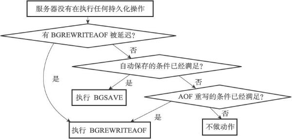

10. **将AOF缓冲区中的内容写入AOF文件**

如果服务器开启了AOF持久化功能，并且AOF缓冲区里面还有待写入的数据，那么serverCron函数会调用相应的程序，将AOF缓冲区中的内容写入到AOF文件里面。

11. **关闭异步客户端**

服务器会关闭那些输出缓冲区大小超出限制的客户端。

12. **增加cronloops计数器的值**

服务器状态的cronloops属性记录了serverCron函数执行的次数。  
cronloops属性目前在服务器中的唯一作用，就是在复制模块中实现“每执行serverCron函数N次就执行一次指定代码”的功能。

#### 初始化服务器
一个Redis服务器从启动到能够接受客户端的命令请求，需要经过一系列的初始化和设置过程，比如初始化服务器状态，接受用户指定的服务器配置，创建相应的数据结构和网络连接等等。

1. **初始化服务器状态结构**

初始化服务器的第一步就是创建一个struct redisServer类型的实例变量server作为服务器的状态，并为结构中的各个属性设置默认值。  
初始化server变量的工作由redis.c/initServerConfig函数完成。  
以下是initServerConfig函数完成的主要工作：  
    ▶ 设置服务器的运行ID。  
    ▶ 设置服务器的默认运行频率。  
    ▶ 设置服务器的默认配置文件路径。  
    ▶ 设置服务器的运行架构。  
    ▶ 设置服务器的默认端口号。  
    ▶ 设置服务器的默认RDB持久化条件和AOF持久化条件。  
    ▶ 初始化服务器的LRU时钟。  
    ▶ 创建命令表。

initServerConfig函数设置的服务器状态属性基本都是一些整数、浮点数、或者字符串属性，除了命令表之外，initServerConfig函数没有创建服务器状态的其他数据结构，数据库、慢查询日志、Lua环境、共享对象这些数据结构在之后的步骤才会被创建出来。

2. **载入配置选项**

在启动服务器时，用户可以通过给定配置参数或者指定配置文件来修改服务器的默认配置。

```
//修改服务器的运行端口号
$ redis-server --port 10086
//指定配置文件修改配置项
$ redis-server redis.conf
```

服务器在用initServerConfig函数初始化完server变量之后，就会开始载入用户给定的配置参数和配置文件，并根据用户设定的配置，对server变量相关属性的值进行修改。

**配置项载入规则：**  
- 如果用户为这些属性的相应选项指定了新的值，那么服务器就使用用户指定的值来更新相应的属性。
- 如果用户没有为属性的相应选项设置新的值，那么服务器就沿用之前initServerConfig函数为属性设置的默认值。

3. **初始化服务器数据结构**

除了命令表之外，服务器状态还包含其他数据结构，例如：  
    ▶ server.clients链表，这个链表记录了所有与服务器相连的客户端的状态结构，链表的每个节点都包含了一个redisClient结构实例。
    ▶ server.db数组，数组中包含了服务器的所有数据库。
    ▶ 用于保存频道订阅信息的server.pubsub_channels字典，以及用于保存模式订阅信息的server.pubsub_patterns链表。
    ▶ 用于执行Lua脚本的Lua环境server.lua。
    ▶ 用于保存慢查询日志的server.slowlog属性。

当初始化服务器进行到这一步，服务器将调用initServer函数，为以上提到的数据结构分配内存，并在有需要时，为这些数据结构设置或者关联初始化值。

**服务器到现阶段才初始化数据结构的原因：**  
服务器必须先载入用户指定的配置选项，然后才能正确地对数据结构进行初始化。如果在执行initServerConfig函数时就对数据结构进行初始化，那么一旦用户通过配置选项修改了和数据结构有关的服务器状态属性，服务器就要重新调整和修改已创建的数据结构。为了避免出现这种麻烦的情况，服务器选择了将server状态的初始化分为两步进行，initServerConfig函数主要负责初始化一般属性，而initServer函数主要负责初始化数据结构。

除了初始化数据结构之外，initServer还进行了一些非常重要的设置操作，其中包括：  
    ▶ 为服务器设置进程信号处理器。  
    ▶ 创建共享对象：这些对象包含Redis服务器经常用到的一些值，比如包含"OK"回复的字符串对象，包含"ERR"回复的字符串对象，包含整数1到10000的字符串对象等等，服务器通过重用这些共享对象来避免反复创建相同的对象。  
    ▶ 打开服务器的监听端口，并为监听套接字关联连接应答事件处理器，等待服务器正式运行时接受客户端的连接。  
    ▶ 为serverCron函数创建时间事件，等待服务器正式运行时执行serverCron函数。  
    ▶ 如果AOF持久化功能已经打开，那么打开现有的AOF文件，如果AOF文件不存在，那么创建并打开一个新的AOF文件，为AOF写入做好准备。  
    ▶ 初始化服务器的后台I/O模块（bio），为将来的I/O操作做好准备。

当initServer函数执行完毕之后，服务器将用ASCII字符在日志中打印出Redis的图标，以及Redis的版本号信息。

4. **还原数据库状态**

在完成了对服务器状态server变量的初始化之后，服务器需要载入RDB文件或者AOF文件，并根据文件记录的内容来还原服务器的数据库状态。

根据服务器是否启用了AOF持久化功能，服务器载入数据时所使用的目标文件会有所不同：  
    ▶ 如果服务器启用了AOF持久化功能，那么服务器使用AOF文件来还原数据库状态。  
    ▶ 如果服务器没有启用AOF持久化功能，那么服务器使用RDB文件来还原数据库状态。

当服务器完成数据库状态还原工作之后，服务器将在日志中打印出载入文件并还原数据库状态所耗费的时长：  
```
[5244] 21 Nov 22:43:49.084 * DB loaded from disk: 0.068 seconds
```

5. **执行事件循环**

在初始化的最后一步，服务器将打印出以下日志，并开始执行服务器的事件循环（loop）。  
```
[5244] 21 Nov 22:43:49.084 * The server is now ready to accept connections on port 6379
```