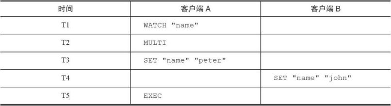
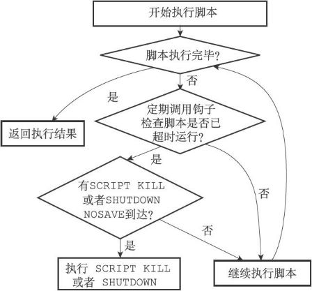
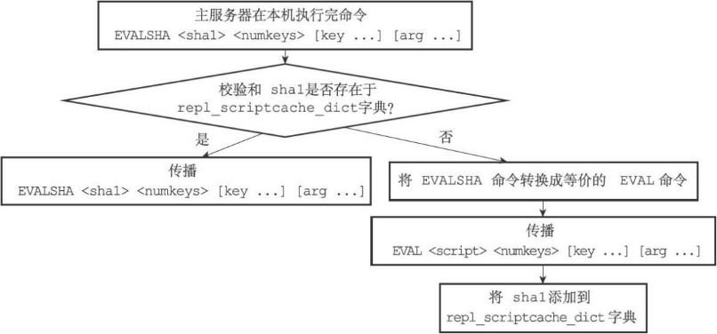

> 基于Redis 2.9，适用于Redis 2.6至Redis 3.0

## 发布与订阅
Redis的发布与订阅功能由PUBLISH、SUBSCRIBE、PSUBSCRIBE等命令组成。  
通过执行SUBSCRIBE命令，客户端可以订阅一个或多个频道，从而成为这些频道的订阅者（subscriber）：每当有其他客户端向被订阅的频道发送消息（message）时，频道的所有订阅者都会收到这条消息。

除了订阅频道之外，客户端还可以通过执行PSUBSCRIBE命令订阅一个或多个模式，从而成为这些模式的订阅者：每当有其他客户端向某个频道发送消息时，消息不仅会被发送给这个频道的所有订阅者，它还会被发送给所有与这个频道相匹配的模式的订阅者。

### 订阅与退订

###### 订阅频道
当一个客户端执行SUBSCRIBE命令订阅某个或某些频道的时候，这个客户端与被订阅频道之间就建立起了一种订阅关系。  
Redis将所有频道的订阅关系都保存在服务器状态的pubsub_channels字典里面，这个字典的键是某个被订阅的频道，而键的值则是一个链表，链表里面记录了所有订阅这个频道的客户端：
```
struct redisServer {
  // ...
  // 保存所有频道的订阅关系
  dict *pubsub_channels;
  // ...
};
```

每当客户端执行SUBSCRIBE命令订阅某个或某些频道的时候，服务器都会将客户端与被订阅的频道在pubsub_channels字典中进行关联。

- 如果频道已经有其他订阅者，那么它在pubsub_channels字典中必然有相应的订阅者链表，程序唯一要做的就是将客户端添加到订阅者链表的末尾。
- 如果频道还未有任何订阅者，那么它必然不存在于pubsub_channels字典，程序首先要在pubsub_channels字典中为频道创建一个键，并将这个键的值设置为空链表，然后再将客户端添加到链表，成为链表的第一个元素。

例如，现有客户端client-10086执行命令：
```
SUBSCRIBE "news.sport" "news.movie"
```


###### 退订频道
UNSUBSCRIBE命令的行为和SUBSCRIBE命令的行为正好相反，当一个客户端退订某个或某些频道的时候，服务器将从pubsub_channels中解除客户端与被退订频道之间的关联：
- 程序会根据被退订频道的名字，在pubsub_channels字典中找到频道对应的订阅者链表，然后从订阅者链表中删除退订客户端的信息。
- 如果删除退订客户端之后，频道的订阅者链表变成了空链表，那么说明这个频道已经没有任何订阅者了，程序将从pubsub_channels字典中删除频道对应的键。

执行命令示例：
```
UNSUBSCRIBE "news.sport" "news.movie"
```

###### 订阅模式
服务器将所有模式的订阅关系都保存在服务器状态的pubsub_patterns属性里面：
```
struct redisServer {
  // ...
  // 保存所有模式订阅关系
  list *pubsub_patterns;
  // ...
};
```
pubsub_patterns属性是一个链表，链表中的每个节点都包含着一个pubsub Pattern结构，这个结构的pattern属性记录了被订阅的模式，而client属性则记录了订阅模式的客户端：
```
typedef struct pubsubPattern {
  // 订阅模式的客户端
  redisClient *client;
  // 被订阅的模式
  robj *pattern;
} pubsubPattern;
```

每当客户端执行PSUBSCRIBE命令订阅某个或某些模式的时候，服务器会对每个被订阅的模式执行以下两个操作：  
1. 新建一个pubsubPattern结构，将结构的pattern属性设置为被订阅的模式，client属性设置为订阅模式的客户端。
2. 将pubsubPattern结构添加到pubsub_patterns链表的表尾。

执行命令示例：
```
PSUBSCRIBE "news.*"
```


###### 退订模式
当一个客户端退订某个或某些模式的时候，服务器将在pubsub_patterns链表中查找并删除那些pattern属性为被退订模式，并且client属性为执行退订命令的客户端的pubsubPattern结构。

执行命令示例：
```
PUNSUBSCRIBE "news.*"
```

### 发送消息
当一个Redis客户端执行PUBLISH \<channel> \<message>命令将消息message发送给频道channel的时候，服务器需要执行以下两个动作：
1. 将消息message发送给channel频道的所有订阅者。
2. 如果有一个或多个模式pattern与频道channel相匹配，那么将消息message发送给pattern模式的订阅者。

###### 将消息发送给频道订阅者
因为服务器状态中的pubsub_channels字典记录了所有频道的订阅关系，所以为了将消息发送给channel频道的所有订阅者，PUBLISH命令要做的就是在pubsub_channels字典里找到频道channel的订阅者名单（一个链表），然后将消息发送给名单上的所有客户端。

执行命令示例：
```
PUBLISH "news.it" "hello"
```

###### 将消息发送给模式订阅者
因为服务器状态中的pubsub_patterns链表记录了所有模式的订阅关系，所以为了将消息发送给所有与channel频道相匹配的模式的订阅者，PUBLISH命令要做的就是遍历整个pubsub_patterns链表，查找那些与channel频道相匹配的模式，并将消息发送给订阅了这些模式的客户端。

### 查看订阅信息
PUBSUB命令是Redis 2.8新增加的命令之一，客户端可以通过这个命令来查看频道或者模式的相关信息，比如某个频道目前有多少订阅者，又或者某个模式目前有多少订阅者。

###### PUBSUB CHANNELS
PUBSUB CHANNELS [pattern]子命令用于返回服务器当前被订阅的频道，其中pattern参数是可选的：  
▶ 如果不给定pattern参数，那么命令返回服务器当前被订阅的所有频道。  
▶ 如果给定pattern参数，那么命令返回服务器当前被订阅的频道中那些与pattern模式相匹配的频道。

执行PUBSUB CHANNELS命令将返回服务器目前被订阅的频道：
```
redis> PUBSUB CHANNELS
1) "news.it"
2) "news.sport"
3) "news.business"
4) "news.movie"
```

执行PUBSUB CHANNELS "news.[is]\*"命令将返回"news.it"和"news.sport"两个频道，因为只有这两个频道和"news.[is]\*"模式相匹配：
```
redis> PUBSUB CHANNELS "news.[is]*"
1) "news.it"
2) "news.sport"
```

###### PUBSUB NUMSUB
PUBSUB NUMSUB [channel-1 channel-2...channel-n]子命令接受任意多个频道作为输入参数，并返回这些频道的订阅者数量。  
这个子命令是通过在pubsub_channels字典中找到频道对应的订阅者链表，然后返回订阅者链表的长度来实现的（订阅者链表的长度就是频道订阅者的数量）。

执行命令示例：
```
redis> PUBSUB NUMSUB news.it news.sport news.business news.movie
1) "news.it"
2) "3"
3) "news.sport"
4) "2"
5) "news.business"
6) "2"
7) "news.movie"
8) "1"
```

###### PUBSUB NUMPAT
PUBSUB NUMPAT子命令用于返回服务器当前被订阅模式的数量。  
这个子命令是通过返回pubsub_patterns链表的长度来实现的，因为这个链表的长度就是服务器被订阅模式的数量。

执行命令示例：
```
redis> PUBSUB NUMPAT
(integer) 3
```


## 事务
Redis通过MULTI、EXEC、WATCH等命令来实现事务（transaction）功能。事务提供了一种将多个命令请求打包，然后一次性、按顺序地执行多个命令的机制，并且在事务执行期间，服务器不会中断事务而改去执行其他客户端的命令请求，它会将事务中的所有命令都执行完毕，然后才去处理其他客户端的命令请求。  
以下是一个事务执行的过程，该事务首先以一个MULTI命令为开始，接着将多个命令放入事务当中，最后由EXEC命令将这个事务提交（commit）给服务器执行：
```
redis> MULTI
OK
redis> SET "name" "Practical Common Lisp"
QUEUED
redis> GET "name"
QUEUED
redis> SET "author" "Peter Seibel"
QUEUED
redis> GET "author"
QUEUED
redis> EXEC
1) OK
2) "Practical Common Lisp"
3) OK
4) "Peter Seibel"
```

### 事务的实现
一个事务从开始到结束通常会经历以下三个阶段：
1. 事务开始。
2. 命令入队。
3. 事务执行。

###### 事务开始
MULTI命令的执行标志着事务的开始，MULTI命令可以将执行该命令的客户端从非事务状态切换至事务状态，这一切换是通过在客户端状态的flags属性中打开REDIS_MULTI标识来完成的：
```
redis> MULTI
OK
```

###### 命令入队
当一个客户端处于非事务状态时，这个客户端发送的命令会立即被服务器执行。  
当一个客户端切换到事务状态之后，服务器会根据这个客户端发来的不同命令执行不同的操作：
- 如果客户端发送的命令为EXEC、DISCARD、WATCH、MULTI四个命令的其中一个，那么服务器立即执行这个命令。
- 如果客户端发送的命令是EXEC、DISCARD、WATCH、MULTI四个命令以外的其他命令，那么服务器并不立即执行这个命令，而是将这个命令放入一个事务队列里面，然后向客户端返回QUEUED回复。

###### 事务队列
每个Redis客户端都有自己的事务状态，这个事务状态保存在客户端状态的mstate属性里面：
```
typedef struct redisClient {
  // ...
  // 事务状态
  multiState mstate;
  // ...
} redisClient;
```

事务状态包含一个事务队列，以及一个已入队命令的计数器（也可以说是事务队列的长度）：
```
typedef struct multiState {
  // 事务队列，FIFO顺序
  multiCmd *commands;
  // 已入队命令计数
  int count; 
} multiState;
```

事务队列是一个multiCmd类型的数组，数组中的每个multiCmd结构都保存了一个已入队命令的相关信息，包括指向命令实现函数的指针、命令的参数，以及参数的数量：
```
typedef struct multiCmd { 
  // 参数
  robj **argv;
  // 参数数量
  int argc;
  // 命令指针
  struct redisCommand *cmd;
} multiCmd;
```
事务队列以先进先出（FIFO）的方式保存入队的命令，较先入队的命令会被放到数组的前面，而较后入队的命令则会被放到数组的后面。

###### 执行事务
当一个处于事务状态的客户端向服务器发送EXEC命令时，这个EXEC命令将立即被服务器执行。服务器会遍历这个客户端的事务队列，执行队列中保存的所有命令，最后将执行命令所得的结果全部返回给客户端。

###### 取消事务
DISCARD命令可以退出事务状态，也可以取消WATCH监视。

### WATCH命令的实现
WATCH命令是一个乐观锁（optimistic locking），它可以在EXEC命令执行之前，监视任意数量的数据库键，并在EXEC命令执行时，检查被监视的键是否至少有一个已经被修改过了，如果是的话，服务器将拒绝执行事务，并向客户端返回代表事务执行失败的空回复。  
以下是一个事务执行失败的例子：  
  
在时间T4，客户端B修改了"name"键的值，当客户端A在T5执行EXEC命令时，服务器会发现WATCH监视的键"name"已经被修改，因此服务器拒绝执行客户端A的事务，并向客户端A返回空回复。

#### 使用WATCH命令监视数据库键
每个Redis数据库都保存着一个watched_keys字典，这个字典的键是某个被WATCH命令监视的数据库键，而字典的值则是一个链表，链表中记录了所有监视相应数据库键的客户端：
```
typedef struct redisDb {
  // ...
  // 正在被WATCH命令监视的键
  dict *watched_keys;
  // ...
} redisDb;
```
通过watched_keys字典，服务器可以清楚地知道哪些数据库键正在被监视，以及哪些客户端正在监视这些数据库键。  
通过执行WATCH命令，客户端可以在watched_keys字典中与被监视的键进行关联。

#### 监视机制的触发
所有对数据库进行修改的命令，比如SET、LPUSH、SADD、ZREM、DEL、FLUSHDB等等，在执行之后都会调用multi.c/touchWatchKey函数对watched_keys字典进行检查，查看是否有客户端正在监视刚刚被命令修改过的数据库键，如果有的话，那么touchWatchKey函数会将监视被修改键的客户端的REDIS_DIRTY_CAS标识打开，表示该客户端的事务安全性已经被破坏。

对于下图的watched_keys，如果键"name"被修改，那么c1、c2、c10086三个客户端的REDIS_DIRTY_CAS标识将被打开......  


#### 判断事务是否安全
当服务器接收到一个客户端发来的EXEC命令时，服务器会根据这个客户端是否打开了REDIS_DIRTY_CAS标识来决定是否执行事务：
- 如果客户端的REDIS_DIRTY_CAS标识已经被打开，那么说明客户端所监视的键当中，至少有一个键已经被修改过了，在这种情况下，客户端提交的事务已经不再安全，所以服务器会拒绝执行客户端提交的事务。
- 如果客户端的REDIS_DIRTY_CAS标识没有被打开，那么说明客户端监视的所有键都没有被修改过（或者客户端没有监视任何键），事务仍然是安全的，服务器将执行客户端提交的这个事务。

#### 一个完整的WATCH事务执行过程
1. 客户端c10086执行以下WATCH命令：
```
c10086> WATCH "name"
OK
```
c10086会被加入到watched_keys字典的"name"键所对应的链表中。

2. 客户端c10086继续向服务器发送MULTI命令，并将一个SET命令放入事务队列：
```
c10086> MULTI
OK
c10086> SET "name" "peter"
QUEUED
```

3. 另一个客户端c999向服务器发送了一条SET命令，将"name"键的值设置成了"john"：
```
c999> SET "name" "john"
OK
```

4. c999执行的这个SET命令会导致正在监视"name"的所有客户端的REDIS_DIRTY_CAS标识被打开，其中包括客户端c10086。

5. 当c10086向服务器发送EXEC命令时候，因为c10086的REDIS_DIRTY_CAS标志已经被打开，所以服务器将拒绝执行它提交的事务：
```
c10086> EXEC
(nil)
```

### 事务的ACID性质
在传统的关系式数据库中，常常用ACID性质来检验事务功能的可靠性和安全性。  
在Redis中，事务总是具有原子性（Atomicity）、一致性（Consistency）和隔离性（Isolation），并且当Redis运行在某种特定的持久化模式下时，事务也具有耐久性（Durability）。

#### 原子性
事务具有原子性指的是，数据库将事务中的多个操作当作一个整体来执行，服务器要么就执行事务中的所有操作，要么就一个操作也不执行。  
对于Redis的事务功能来说，事务队列中的命令要么就全部都执行，要么就一个都不执行，因此，Redis的事务是具有原子性的。

Redis的事务和传统的关系型数据库事务的最大区别在于，Redis不支持事务回滚机制（rollback），即使事务队列中的某个命令在执行期间出现了错误，整个事务也会继续执行下去，直到将事务队列中的所有命令都执行完毕为止。  
Redis的作者在事务功能的文档中解释说，不支持事务回滚是因为这种复杂的功能和Redis追求简单高效的设计主旨不相符，并且他认为，Redis事务的执行时错误通常都是编程错误产生的，这种错误通常只会出现在开发环境中，而很少会在实际的生产环境中出现，所以他认为没有必要为Redis开发事务回滚功能。

#### 一致性
事务具有一致性指的是，如果数据库在执行事务之前是一致的，那么在事务执行之后，无论事务是否执行成功，数据库也应该仍然是一致的。  
“一致”指的是数据符合数据库本身的定义和要求，没有包含非法或者无效的错误数据。  
Redis通过谨慎的错误检测和简单的设计来保证事务的一致性。

###### 1.入队错误
如果一个事务在入队命令的过程中，出现了命令不存在，或者命令的格式不正确等情况，那么Redis将拒绝执行这个事务。  
客户端尝试向事务入队一个不存在的命令，客户端提交的事务会被服务器拒绝执行。

###### 2.执行错误
除了入队时可能发生错误以外，事务还可能在执行的过程中发生错误：
- 执行过程中发生的错误都是一些不能在入队时被服务器发现的错误，这些错误只会在命令实际执行时被触发。
- 即使在事务的执行过程中发生了错误，服务器也不会中断事务的执行，它会继续执行事务中余下的其他命令，并且已执行的命令（包括执行命令所产生的结果）不会被出错的命令影响。

对数据库键执行了错误类型的操作是事务执行期间最常见的错误之一。

因为在事务执行的过程中，出错的命令会被服务器识别出来，并进行相应的错误处理，所以这些出错命令不会对数据库做任何修改，也不会对事务的一致性产生任何影响。

###### 3.服务器停机
如果Redis服务器在执行事务的过程中停机，那么根据服务器所使用的持久化模式，可能有以下情况出现：
- 如果服务器运行在无持久化的内存模式下，那么重启之后的数据库将是空白的，因此数据总是一致的。
- 如果服务器运行在RDB模式下，那么在事务中途停机不会导致不一致性，因为服务器可以根据现有的RDB文件来恢复数据，从而将数据库还原到一个一致的状态。如果找不到可供使用的RDB文件，那么重启之后的数据库将是空白的，而空白数据库总是一致的。
- 如果服务器运行在AOF模式下，那么在事务中途停机不会导致不一致性，因为服务器可以根据现有的AOF文件来恢复数据，从而将数据库还原到一个一致的状态。如果找不到可供使用的AOF文件，那么重启之后的数据库将是空白的，而空白数据库总是一致的。

#### 隔离性
事务的隔离性指的是，即使数据库中有多个事务并发地执行，各个事务之间也不会互相影响，并且在并发状态下执行的事务和串行执行的事务产生的结果完全相同。  
因为Redis使用单线程的方式来执行事务（以及事务队列中的命令），并且服务器保证，在执行事务期间不会对事务进行中断，因此，Redis的事务总是以串行的方式运行的，并且事务也总是具有隔离性的。

#### 耐久性
事务的耐久性指的是，当一个事务执行完毕时，执行这个事务所得的结果已经被保存到永久性存储介质（比如硬盘）里面了，即使服务器在事务执行完毕之后停机，执行事务所得的结果也不会丢失。  
因为Redis的事务不过是简单地用队列包裹起了一组Redis命令，Redis并没有为事务提供任何额外的持久化功能，所以Redis事务的耐久性由Redis所使用的持久化模式决定：
- 当服务器在无持久化的内存模式下运作时，事务不具有耐久性：一旦服务器停机，包括事务数据在内的所有服务器数据都将丢失。
- 当服务器在RDB持久化模式下运作时，服务器只会在特定的保存条件被满足时，才会执行BGSAVE命令，对数据库进行保存操作，并且异步执行的BGSAVE不能保证事务数据被第一时间保存到硬盘里面，因此RDB持久化模式下的事务也不具有耐久性。
- 当服务器运行在AOF持久化模式下，并且appendfsync选项的值为always时，程序总会在执行命令之后调用同步（sync）函数，将命令数据真正地保存到硬盘里面，因此这种配置下的事务是具有耐久性的。
- 当服务器运行在AOF持久化模式下，并且appendfsync选项的值为everysec时，程序会每秒同步一次命令数据到硬盘。因为停机可能会恰好发生在等待同步的那一秒钟之内，这可能会造成事务数据丢失，所以这种配置下的事务不具有耐久性。
- 当服务器运行在AOF持久化模式下，并且appendfsync选项的值为no时，程序会交由操作系统来决定何时将命令数据同步到硬盘。因为事务数据可能在等待同步的过程中丢失，所以这种配置下的事务不具有耐久性。

###### no-appendfsync-on-rewrite配置选项对耐久性的影响
配置选项no-appendfsync-on-rewrite可以配合appendfsync选项为always或者everysec的AOF持久化模式使用。当no-appendfsync-on-rewrite选项处于打开状态时，在执行BGSAVE命令或者BGREWRITEAOF命令期间，服务器会暂时停止对AOF文件进行同步，从而尽可能地减少I/O阻塞。但是这样一来，关于“always模式的AOF持久化可以保证事务的耐久性”这一结论将不再成立，因为在服务器停止对AOF文件进行同步期间，事务结果可能会因为停机而丢失。因此，如果服务器打开了no-appendfsync-on-rewrite选项，那么即使服务器运行在always模式的AOF持久化之下，事务也不具有耐久性。在默认配置下，no-appendfsync-on-rewrite处于关闭状态。

<span style="color: red;font-weight: bold;">Tips</span>：不论Redis在什么模式下运作，在一个事务的最后（执行EXEC命令之前）加上SAVE命令总可以保证事务的耐久性。不过因为这种做法的效率太低，所以并不具有实用性。


## Lua脚本
Redis从2.6版本开始引入对Lua脚本的支持，通过在服务器中嵌入Lua环境，Redis客户端可以使用Lua脚本，直接在服务器端原子地执行多个Redis命令。

使用EVAL命令可以直接对输入的脚本进行求值：
```
redis> EVAL "return 'hello world'" 0
"hello world"
```

使用EVALSHA命令则可以根据脚本的SHA1校验和来对脚本进行求值，但这个命令要求校验和对应的脚本必须至少被EVAL命令执行过一次，或者这个校验和对应的脚本曾经被SCRIPT LOAD命令载入过：
```
redis> EVAL "return 1+1" 0
(integer) 2
redis> EVALSHA "a27e7e8a43702b7046d4f6a7ccf5b60cef6b9bd9" 0 // 上一个脚本的校验和
(integer) 2 

redis> SCRIPT LOAD "return 2*2"
"4475bfb5919b5ad16424cb50f74d4724ae833e72"
redis> EVALSHA "4475bfb5919b5ad16424cb50f74d4724ae833e72" 0
(integer) 4
```

### 创建并修改Lua环境
为了在Redis服务器中执行Lua脚本，Redis在服务器内嵌了一个Lua环境（environ-ment），并对这个Lua环境进行了一系列修改，从而确保这个Lua环境可以满足Redis服务器的需要。

Redis服务器创建并修改Lua环境的整个过程由以下步骤组成：
1. 创建一个基础的Lua环境，之后的所有修改都是针对这个环境进行的。
2. 载入多个函数库到Lua环境里面，让Lua脚本可以使用这些函数库来进行数据操作。
3. 创建全局表格redis，这个表格包含了对Redis进行操作的函数，比如用于在Lua脚本中执行Redis命令的redis.call函数。
4. 使用Redis自制的随机函数来替换Lua原有的带有副作用的随机函数，从而避免在脚本中引入副作用。
5. 创建排序辅助函数，Lua环境使用这个辅佐函数来对一部分Redis命令的结果进行排序，从而消除这些命令的不确定性。
6. 创建redis.pcall函数的错误报告辅助函数，这个函数可以提供更详细的出错信息。
7. 对Lua环境中的全局环境进行保护，防止用户在执行Lua脚本的过程中，将额外的全局变量添加到Lua环境中。
8. 将完成修改的Lua环境保存到服务器状态的lua属性中，等待执行服务器传来的Lua脚本。

###### 1.创建Lua环境
服务器首先调用Lua的C API函数lua_open，创建一个新的Lua环境。  
lua_open函数创建的只是一个基本的Lua环境，为了让这个Lua环境可以满足Redis的操作要求，接下来服务器将对这个Lua环境进行一系列修改。

###### 2.载入函数库
- 基础库（base library）：这个库包含Lua的核心（core）函数，比如assert、error、pairs、tostring、pcall等。另外，为了防止用户从外部文件中引入不安全的代码，库中的loadfile函数会被删除。
- 表格库（table library）：这个库包含用于处理表格的通用函数，比如table.concat、table.insert、table.remove、table.sort等。
- 字符串库（string library）：这个库包含用于处理字符串的通用函数，比如用于对字符串进行查找的string.find函数，对字符串进行格式化的string.format函数，查看字符串长度的string.len函数，对字符串进行翻转的string.reverse函数等。
- 数学库（math library）：这个库是标准C语言数学库的接口，它包括计算绝对值的math.abs函数，返回多个数中的最大值和最小值的math.max函数和math.min函数，计算二次方根的math.sqrt函数，计算对数的math.log函数等。
- 调试库（debug library）：这个库提供了对程序进行调试所需的函数，比如对程序设置钩子和取得钩子的debug.sethook函数和debug.gethook函数，返回给定函数相关信息的debug.getinfo函数，为对象设置元数据的debug.setmetatable函数，获取对象元数据的debug.getmetatable函数等。
- Lua CJSON库（<http://www.kyne.com.au/~mark/software/lua-cjson.php>）：这个库用于处理UTF-8编码的JSON格式，其中cjson.decode函数将一个JSON格式的字符串转换为一个Lua值，而cjson.encode函数将一个Lua值序列化为JSON格式的字符串。
- Struct库（<http://www.inf.puc-rio.br/~roberto/struct/>）：这个库用于在Lua值和C结构（struct）之间进行转换，函数struct.pack将多个Lua值打包成一个类结构（struct-like）字符串，而函数struct.unpack则从一个类结构字符串中解包出多个Lua值。
- Lua cmsgpack库（<https://github.com/antirez/lua-cmsgpack>）：这个库用于处理MessagePack格式的数据，其中cmsgpack.pack函数将Lua值转换为MessagePack数据，而cmsgpack.unpack函数则将MessagePack数据转换为Lua值。

通过使用这些功能强大的函数库，Lua脚本可以直接对执行Redis命令获得的数据进行复杂的操作。

###### 3.创建redis全局表格
服务器将在Lua环境中创建一个redis表格（table），并将它设为全局变量。这个redis表格包含以下函数：
- 用于执行Redis命令的redis.call和redis.pcall函数。
- 用于记录Redis日志（log）的redis.log函数，以及相应的日志级别（level）常量：redis.LOG_DEBUG，redis.LOG_VERBOSE，redis.LOG_NOTICE，以及redis.LOG_WARNING。
- 用于计算SHA1校验和的redis.sha1hex函数。
- 用于返回错误信息的redis.error_reply函数和redis.status_reply函数。

最常用也最重要的要数redis.call函数和redis.pcall函数，通过这两个函数，用户可以直接在Lua脚本中执行Redis命令：
```
redis> EVAL "return redis.call('PING')" 0
PONG
```

###### 4.使用Redis自制的随机函数来替换Lua原有的随机函数
为了保证相同的脚本可以在不同的机器上产生相同的结果，Redis要求所有传入服务器的Lua脚本，以及Lua环境中的所有函数，都必须是无副作用（side effect）的纯函数（pure function）。但是，在之前载入Lua环境的math函数库中，用于生成随机数的math.random函数和math.randomseed函数都是带有副作用的，它们不符合Redis对Lua环境的无副作用要求。

Redis使用自制的函数替换了math库中原有的math.random函数和math.randomseed函数，替换之后的两个函数有以下特征：

    对于相同的seed来说，math.random总产生相同的随机数序列，这个函数是一个纯函数。
    除非在脚本中使用math.randomseed显式地修改seed，否则每次运行脚本时，Lua环境都使用固定的math.randomseed（0）语句来初始化seed。

例如，使用以下脚本可以打印seed值为0时，math.random对于输入10至1所产生的随机序列：
```
--random-with-default-seed.lua
local i = 10
local seq = {}
while (i > 0) do
    seq[i] = math.random(i)
    i = i-1
end
return seq
```

无论执行这个脚本多少次，产生的值都是相同的：
```
$ redis-cli --eval random-with-default-seed.lua
1) (integer) 1
2) (integer) 2
3) (integer) 2
4) (integer) 3
5) (integer) 4
6) (integer) 4
7) (integer) 7
8) (integer) 1
9) (integer) 7
10) (integer) 2
```

但是，如果在另一个脚本里面，调用math.randomseed将seed修改为10086：
```
--random-with-new-seed.lua
math.randomseed(10086)
local i = 10
local seq = {}
while (i > 0) do
    seq[i] = math.random(i)
    i = i-1
end
return seq
```

那么这个脚本生成的随机数序列将和使用默认seed值0时生成的随机序列不同：
```
$ redis-cli --eval random-with-new-seed.lua
1) (integer) 1
2) (integer) 1
3) (integer) 2
4) (integer) 1
5) (integer) 1
6) (integer) 3
7) (integer) 1
8) (integer) 1
9) (integer) 3
10) (integer) 1
```

###### 5.创建排序辅助函数
对于Lua脚本来说，另一个可能产生不一致数据的地方是那些带有不确定性质的命令。比如对于一个集合键来说，因为集合元素的排列是无序的，所以即使两个集合的元素完全相同，它们的输出结果也可能并不相同。  
Redis将SMEMBERS这种在相同数据集上可能会产生不同输出的命令称为“带有不确定性的命令”，这些命令包括：SINTER、SUNION、SDIFF、SMEMBERS、HKEYS、HVALS、KEYS。

为了消除这些命令带来的不确定性，服务器会为Lua环境创建一个排序辅助函数__redis__compare_helper，当Lua脚本执行完一个带有不确定性的命令之后，程序会使用__redis__compare_helper作为对比函数，自动调用table.sort函数对命令的返回值做一次排序，以此来保证相同的数据集总是产生相同的输出。

###### 6.创建redis.pcall函数的错误报告辅助函数
服务器将为Lua环境创建一个名为__redis__err__handler的错误处理函数，当脚本调用redis.pcall函数执行Redis命令，并且被执行的命令出现错误时，__redis__err__handler就会打印出错代码的来源和发生错误的行数，为程序的调试提供方便。

###### 7.保护Lua的全局环境
服务器将对Lua环境中的全局环境进行保护，确保传入服务器的脚本不会因为忘记使用local关键字而将额外的全局变量添加到Lua环境里面。

因为全局变量保护的原因，当一个脚本试图创建一个全局变量时，服务器将报告一个错误：
```
redis> EVAL "x = 10" 0
(error) ERR Error running script
(call to f_df1ad3745c2d2f078f0f41377a92bb6f8ac79af0):
@enable_strict_lua:7: user_script:1:
Script attempted to create global variable 'x'
```

试图获取一个不存在的全局变量也会引发一个错误：
```
redis> EVAL "return x" 0
(error) ERR Error running script
(call to f_03c387736bb5cc009ff35151572cee04677aa374):
@enable_strict_lua:14: user_script:1:
Script attempted to access unexisting global variable 'x'
```

不过Redis并未禁止用户修改已存在的全局变量，所以在执行Lua脚本的时候，必须非常小心，以免错误地修改了已存在的全局变量：
```
redis> EVAL "redis = 10086; return redis" 0
(integer) 10086
```

###### 8.将Lua环境保存到服务器状态的lua属性里面
服务器会将Lua环境和服务器状态的lua属性关联起来。

因为Redis使用串行化的方式来执行Redis命令，所以在任何特定时间里，最多都只会有一个脚本能够被放进Lua环境里面运行，因此，整个Redis服务器只需要创建一个Lua环境即可。

### Lua环境协作组件
Redis服务器还创建了两个用于与Lua环境进行协作的组件，它们分别是负责执行Lua脚本中的Redis命令的伪客户端，以及用于保存Lua脚本的lua_scripts字典。

#### 伪客户端
因为执行Redis命令必须有相应的客户端状态，所以为了执行Lua脚本中包含的Redis命令，Redis服务器专门为Lua环境创建了一个伪客户端，并由这个伪客户端负责处理Lua脚本中包含的所有Redis命令。

Lua脚本使用redis.call函数或者redis.pcall函数执行一个Redis命令，需要完成以下步骤：
1. Lua环境将redis.call函数或者redis.pcall函数想要执行的命令传给伪客户端。
2. 伪客户端将脚本想要执行的命令传给命令执行器。
3. 命令执行器执行伪客户端传给它的命令，并将命令的执行结果返回给伪客户端。
4. 伪客户端接收命令执行器返回的命令结果，并将这个命令结果返回给Lua环境。
5. Lua环境在接收到命令结果之后，将该结果返回给redis.call函数或者redis.pcall函数。
6. 接收到结果的redis.call函数或者redis.pcall函数会将命令结果作为函数返回值返回给脚本中的调用者。

#### lua_scripts字典
lua_scripts字典的键为某个Lua脚本的SHA1校验和（checksum），而字典的值则是SHA1校验和对应的Lua脚本。
```
struct redisServer {
    // ...
    dict *lua_scripts;
    // ...
};
```
Redis服务器会将所有被EVAL命令执行过的Lua脚本，以及所有被SCRIPT LOAD命令载入过的Lua脚本都保存到lua_scripts字典里面。

lua_scripts字典有两个作用，一个是实现SCRIPT EXISTS命令，另一个是实现脚本复制功能。

### 脚本命令的实现
#### EVAL命令的实现
EVAL命令的执行过程可以分为以下三个步骤：
1. 根据客户端给定的Lua脚本，在Lua环境中定义一个Lua函数。
2. 将客户端给定的脚本保存到lua_scripts字典，等待将来进一步使用。
3. 执行刚刚在Lua环境中定义的函数，以此来执行客户端给定的Lua脚本。

###### 定义脚本函数
当客户端向服务器发送EVAL命令，要求执行某个Lua脚本的时候，服务器首先要做的就是在Lua环境中，为传入的脚本定义一个与这个脚本相对应的Lua函数，其中，Lua函数的名字由f_前缀加上脚本的SHA1校验和（四十个字符长）组成，而函数的体（body）则是脚本本身。

举个例子，对于命令：
```
EVAL "return 'hello world'" 0
```

来说，服务器将在Lua环境中定义以下函数：
```
function f_5332031c6b470dc5a0dd9b4bf2030dea6d65de91()
    return 'hello world'
end
```
因为客户端传入的脚本为return 'hello world'，而这个脚本的SHA1校验和为5332031c6b470dc5a0dd9b4bf2030dea6d65de91，所以函数的名字为f_5332031c6b470dc5a0dd9b4bf2030dea6d65de91，而函数的体则为return 'hello world'。

使用函数来保存客户端传入的脚本有以下好处：
- 执行脚本的步骤非常简单，只要调用与脚本相对应的函数即可。
- 通过函数的局部性来让Lua环境保持清洁，减少了垃圾回收的工作量，并且避免了使用全局变量。
- 如果某个脚本所对应的函数在Lua环境中被定义过至少一次，那么只要记得这个脚本的SHA1校验和，服务器就可以在不知道脚本本身的情况下，直接通过调用Lua函数来执行脚本，这是EVALSHA命令的实现原理，稍后在介绍EVALSHA命令的实现时就会说到这一点。

###### 将脚本保存到lua_scripts字典
EVAL命令要做的第二件事是将客户端传入的脚本保存到服务器的lua_scripts字典里面。


###### 执行脚本函数
服务器还需要进行一些设置钩子、传入参数之类的准备动作，才能正式开始执行脚本。  
整个准备和执行脚本的过程如下：
1. 将EVAL命令中传入的键名（key name）参数和脚本参数分别保存到KEYS数组和ARGV数组，然后将这两个数组作为全局变量传入到Lua环境里面。
2. 为Lua环境装载超时处理钩子（hook），这个钩子可以在脚本出现超时运行情况时，让客户端通过SCRIPT KILL命令停止脚本，或者通过SHUTDOWN命令直接关闭服务器。
3. 执行脚本函数。
4. 移除之前装载的超时钩子。
5. 将执行脚本函数所得的结果保存到客户端状态的输出缓冲区里面，等待服务器将结果返回给客户端。
6. 对Lua环境执行垃圾回收操作。

#### EVALSHA命令的实现
只要脚本对应的函数曾经在Lua环境里面定义过，那么即使不知道脚本的内容本身，客户端也可以根据脚本的SHA1校验和来调用脚本对应的函数，从而达到执行脚本的目的，这就是EVALSHA命令的实现原理。

举个例子，当服务器执行完以下EVAL命令之后：
```
redis> EVAL "return 'hello world'" 0
"hello world"
```

Lua环境里面就定义了以下函数：
```
function f_5332031c6b470dc5a0dd9b4bf2030dea6d65de91()
    return 'hello world'
end
```

当客户端执行以下EVALSHA命令时：
```
redis> EVALSHA "5332031c6b470dc5a0dd9b4bf2030dea6d65de91" 0
"hello world"
```
服务器首先根据客户端输入的SHA1校验和，检查函数f_5332031c6b470dc5a0dd9b4bf2030dea6d65de91是否存在于Lua环境中，得到的回应是该函数确实存在，于是服务器执行Lua环境中的f_5332031c6b470dc5a0dd9b4bf2030dea6d65de91函数，并将结果"hello world"返回给客户端。

#### SCRIPT FLUSH
SCRIPT FLUSH命令用于清除服务器中所有和Lua脚本有关的信息，这个命令会释放并重建lua_scripts字典，关闭现有的Lua环境并重新创建一个新的Lua环境。

#### SCRIPT EXISTS
SCRIPT EXISTS命令根据输入的SHA1校验和，检查校验和对应的脚本是否存在于服务器中。这是通过检查给定的校验和是否存在于lua_scripts字典来实现的。

<span style="color: red;font-weight: bold;">Tips</span>：SCRIPT EXISTS命令允许一次传入多个SHA1校验和，不过因为SHA1校验和太长，建议分开多次来传入。

#### SCRIPT LOAD
SCRIPT LOAD命令所做的事情和EVAL命令执行脚本时所做的前两步完全一样：命令首先在Lua环境中为脚本创建相对应的函数，然后再将脚本保存到lua_scripts字典里面。

#### SCRIPT KILL
如果服务器设置了lua-time-limit配置选项，那么在每次执行Lua脚本之前，服务器都会在Lua环境里面设置一个超时处理钩子（hook）。  
超时处理钩子在脚本运行期间，会定期检查脚本已经运行了多长时间，一旦钩子发现脚本的运行时间已经超过了lua-time-limit选项设置的时长，钩子将定期在脚本运行的间隙中，查看是否有SCRIPT KILL命令或者SHUTDOWN命令到达服务器。

  
如果超时运行的脚本未执行过任何写入操作，那么客户端可以通过SCRIPT KILL命令来指示服务器停止执行这个脚本，并向执行该脚本的客户端发送一个错误回复。处理完SCRIPT KILL命令之后，服务器可以继续运行。  
如果脚本已经执行过写入操作，那么客户端只能用SHUTDOWN nosave命令来停止服务器，从而防止不合法的数据被写入数据库中。

### 脚本复制
与其他普通Redis命令一样，当服务器运行在复制模式之下时，具有写性质的脚本命令也会被复制到从服务器，这些命令包括EVAL命令、EVALSHA命令、SCRIPT FLUSH命令，以及SCRIPT LOAD命令。

#### 复制EVAL命令、SCRIPT FLUSH命令和SCRIPT LOAD命令
像复制其他普通Redis命令的方法一样，当主服务器执行完EVAL、SCRIPT FLUSH、SCRIPT LOAD三个命令其中的任何一个时，主服务器会直接将被执行的命令传播（propagate）给所有从服务器。

#### 复制EVALSHA命令
EVALSHA命令是所有与Lua脚本有关的命令中，复制操作最复杂的一个，因为主服务器与从服务器载入Lua脚本的情况可能有所不同，所以主服务器不能像复制EVAL命令、SCRIPT LOAD命令或者SCRIPT FLUSH命令那样，直接将EVALSHA命令传播给从服务器。对于一个在主服务器被成功执行的EVALSHA命令来说，相同的EVALSHA命令在从服务器执行时却可能会出现脚本未找到（not found）错误。

举个例子，假设现在有一个主服务器master，如果客户端向主服务器发送命令：
```
master> SCRIPT LOAD "return 'hello world'"
"5332031c6b470dc5a0dd9b4bf2030dea6d65de91"
```

假设一个从服务器slave1开始复制主服务器master，如果master不想办法将脚本：
```
"return 'hello world'"
```

传送给slave1载入的话，那么当客户端向主服务器发送命令的时候，master将成功执行这个EVALSHA命令：
```
master> EVALSHA "5332031c6b470dc5a0dd9b4bf2030dea6d65de91" 0
"hello world"
```

而当master将这个命令传播给slave1执行的时候，slave1却会出现脚本未找到错误：
```
slave1> EVALSHA "5332031c6b470dc5a0dd9b4bf2030dea6d65de91" 0
(error) NOSCRIPT No matching script. Please use EVAL.
```
更为复杂的是，因为多个从服务器之间载入Lua脚本的情况也可能各有不同，所以即使一个EVALSHA命令可以在某个从服务器成功执行，也不代表这个EVALSHA命令就一定可以在另一个从服务器成功执行。  
假设有主服务器master和从服务器slave1，并且slave1一直复制着master，所以master载入的所有Lua脚本，slave1也有载入（通过传播EVAL命令或者SCRIPT LOAD命令来实现）。从而master和slave1都会成功执行EVALSHA命令。如果这时，一个新的从服务器slave2开始复制主服务器master，但是还没有复制Lua脚本，那么当客户端向主服务器发送EVALSHA命令，slave2就会发生脚本未找到错误。

为了防止以上假设的情况出现，Redis要求主服务器在传播EVALSHA命令的时候，必须确保EVALSHA命令要执行的脚本已经被所有从服务器载入过，如果不能确保这一点的话，主服务器会将EVALSHA命令转换成一个等价的EVAL命令，然后通过传播EVAL命令来代替EVALSHA命令。  
传播EVALSHA命令，或者将EVALSHA命令转换成EVAL命令，都需要用到服务器状态的lua_scripts字典和repl_scriptcache_dict字典。

###### 1.判断传播EVALSHA命令是否安全的方法
主服务器使用服务器状态的repl_scriptcache_dict字典记录自己已经将哪些脚本传播给了所有从服务器：
```
struct redisServer {
    // ...
    dict *repl_scriptcache_dict;
    // ...
};
```
repl_scriptcache_dict字典的键是一个个Lua脚本的SHA1校验和，而字典的值则全部都是NULL，当一个校验和出现在repl_scriptcache_dict字典时，说明这个校验和对应的Lua脚本已经传播给了所有从服务器，主服务器可以直接向从服务器传播包含这个SHA1校验和的EVALSHA命令，而不必担心从服务器会出现脚本未找到错误。

###### 2.清空repl_scriptcache_dict字典
每当主服务器添加一个新的从服务器时，主服务器都会清空自己的repl_scriptcache_dict字典，这是因为随着新从服务器的出现，repl_scriptcache_dict字典里面记录的脚本已经不再被所有从服务器载入过，所以主服务器会清空repl_scriptcache_dict字典，强制自己重新向所有从服务器传播脚本，从而确保新的从服务器不会出现脚本未找到错误。

###### 3.EVALSHA命令转换成EVAL命令的方法
通过使用EVALSHA命令指定的SHA1校验和，以及lua_scripts字典保存的Lua脚本，服务器总可以将一个EVALSHA命令转换成一个等价的EVAL命令：
```
EVALSHA <sha1> <numkeys> [key ...] [arg ...]
EVAL <script> <numkeys> [key ...] [arg ...]
```
具体的转换方法如下：
> 1）根据SHA1校验和sha1，在lua_scripts字典中查找sha1对应的Lua脚本script。  
> 2）将原来的EVALSHA命令请求改写成EVAL命令请求，并且将校验和sha1改成脚本script，至于numkeys、key、arg等参数则保持不变。

如果一个SHA1值所对应的Lua脚本没有被所有从服务器载入过，那么主服务器可以将EVALSHA命令转换成等价的EVAL命令，然后通过传播等价的EVAL命令来代替原本想要传播的EVALSHA命令，以此来产生相同的脚本执行效果，并确保所有从服务器都不会出现脚本未找到错误。  
另外，因为主服务器在传播完EVAL命令之后，会将被传播脚本的SHA1校验和（也即是原本EVALSHA命令指定的那个校验和）添加到repl_scriptcache_dict字典里面，如果之后EVALSHA命令再次指定这个SHA1校验和，主服务器就可以直接传播EVALSHA命令，而不必再次对EVALSHA命令进行转换。

###### 4.传播EVALSHA命令的方法
当主服务器成功在本机执行完一个EVALSHA命令之后，它将根据EVALSHA命令指定的SHA1校验和是否存在于repl_scriptcache_dict字典来决定是向从服务器传播EVALSHA命令还是EVAL命令：
- 如果EVALSHA命令指定的SHA1校验和存在于repl_scriptcache_dict字典，那么主服务器直接向从服务器传播EVALSHA命令。
- 如果EVALSHA命令指定的SHA1校验和不存在于repl_scriptcache_dict字典，那么主服务器会将EVALSHA命令转换成等价的EVAL命令，然后传播这个等价的EVAL命令，并将EVALSHA命令指定的SHA1校验和添加到repl_scriptcache_dict字典里面。



<span style="color: red;font-weight: bold;">Tips</span>：《Lua 5.1 Reference Manual》对Lua语言的语法和标准库进行了很好的介绍：http://www.lua.org/manual/5.1/manual.html

## 排序
Redis的SORT命令可以对列表键、集合键或者有序集合键的值进行排序。

#### SORT \<key>
```
SORT <key>
```
可以对一个键key的值进行排序。

以下示例展示了如何使用SORT命令对一个包含三个数字值的列表键进行排序：
```
redis> RPUSH numbers 3 1 2
(integer) 3
redis> SORT numbers
1) "1"
2) "2"
3) "3"
```
服务器执行SORT numbers命令的详细步骤如下：
1. 创建一个和numbers列表长度相同的数组，该数组的每个项都是一个redis.h/redisSortObject结构。
2. 遍历数组，将各个数组项的obj指针分别指向numbers列表的各个项，构成obj指针和列表项之间的一对一关系。
3. 遍历数组，将各个obj指针所指向的列表项转换成一个double类型的浮点数，并将这个浮点数保存在相应数组项的u.score属性里面。
4. 根据数组项u.score属性的值，对数组进行数字值排序，排序后的数组项按u.score属性的值从小到大排列。
5. 遍历数组，将各个数组项的obj指针所指向的列表项作为排序结果返回给客户端，程序首先访问数组的索引0，返回u.score值为1.0的列表项"1"；然后访问数组的索引1，返回u.score值为2.0的列表项"2"；最后访问数组的索引2，返回u.score值为3.0的列表项"3"。


以下是redisSortObject结构的完整定义：
```
typedef struct _redisSortObject {
    // 被排序键的值
    robj *obj;
    // 权重
    union {
        // 排序数字值时使用
        double score;
        // 排序带有BY选项的字符串值时使用
        robj *cmpobj;
    } u;
} redisSortObject;
```
SORT命令为每个被排序的键都创建一个与键长度相同的数组，数组的每个项都是一个redisSortObject结构，根据SORT命令使用的选项不同，程序使用redisSortObject结构的方式也不同。

#### ALPHA
通过使用ALPHA选项，SORT命令可以对包含字符串值的键进行排序：
```
SORT <key> ALPHA
```

以下命令展示了如何使用SORT命令对一个包含三个字符串值的集合键进行排序：
```
redis> SADD fruits apple banana cherry
(integer) 3
# 元素在集合中是乱序存放的
redis> SMEMBERS fruits
1) "apple"
2) "cherry"
3) "banana"
# 对fruits键进行字符串排序
redis> SORT fruits ALPHA
1) "apple"
2) "banana"
3) "cherry"
```

服务器执行SORT fruits ALPHA命令的详细步骤如下：
1. 创建一个redisSortObject结构数组，数组的长度等于fruits集合的大小。
2. 遍历数组，将各个数组项的obj指针分别指向fruits集合的各个元素。
3. 根据obj指针所指向的集合元素，对数组进行字符串排序，排序后的数组项按集合元素的字符串值从小到大排列：因为"apple"、"banana"、"cherry"三个字符串的大小顺序为"apple"<"banana"<"cherry"，所以排序后数组的第一项指向"apple"元素，第二项指向"banana"元素，第三项指向"cherry"元素。
4. 遍历数组，依次将数组项的obj指针所指向的元素返回给客户端。

#### ASC和DESC
在默认情况下，SORT命令执行升序排序，排序后的结果按值的大小从小到大排列，以下两个命令是完全等价的：
```
SORT <key>
SORT <key> ASC
```

在执行SORT命令时使用DESC选项，可以让命令执行降序排序，让排序后的结果按值的大小从大到小排列：
```
SORT <key> DESC
```

升序排序和降序排序都由相同的快速排序算法执行。

#### BY
在默认情况下，SORT命令使用被排序键包含的元素作为排序的权重，元素本身决定了元素在排序之后所处的位置。  
通过使用BY选项，SORT命令可以指定某些字符串键，或者某个哈希键所包含的某些域（field）来作为元素的权重，对一个键进行排序。
```
redis> MSET apple-price 8 banana-price 5.5 cherry-price 7
OK
redis> SORT fruits BY *-price
1) "banana"
2) "cherry"
3) "apple"
```

服务器执行SORT fruits BY \*-price命令的详细步骤如下：
1. 创建一个redisSortObject结构数组，数组的长度等于fruits集合的大小。
2. 遍历数组，将各个数组项的obj指针分别指向fruits集合的各个元素。
3. 遍历数组，根据各个数组项的obj指针所指向的集合元素，以及BY选项所给定的模式 \*-price，查找相应的权重键：

    对于"apple"元素，查找程序返回权重键"apple-price"。  
    对于"banana"元素，查找程序返回权重键"banana-price"。  
    对于"cherry"元素，查找程序返回权重键"cherry-price"。

4. 将各个权重键的值转换成一个double类型的浮点数，然后保存在相应数组项的u.score属性里面：

    "apple"元素的权重键"apple-price"的值转换之后为8.0。  
    "banana"元素的权重键"banana-price"的值转换之后为5.5。  
    "cherry"元素的权重键"cherry-price"的值转换之后为7.0。

5. 以数组项u.score属性的值为权重，对数组进行排序，得到一个按u.score属性的值从小到大排序的数组：

    权重为5.5的"banana"元素位于数组的索引0位置上。  
    权重为7.0的"cherry"元素位于数组的索引1位置上。  
    权重为8.0的"apple"元素位于数组的索引2位置上。

6. 遍历数组，依次将数组项的obj指针所指向的集合元素返回给客户端。

##### 带有ALPHA选项的BY
BY选项默认假设权重键保存的值为数字值，如果权重键保存的是字符串值的话，那么就需要在使用BY选项的同时，配合使用ALPHA选项。
```
redis> SADD fruits "apple" "banana" "cherry"
(integer) 3
redis> MSET apple-id "FRUIT-25" banana-id "FRUIT-79" cherry-id "FRUIT-13"
OK
redis> SORT fruits BY *-id ALPHA
1)"cherry"
2)"apple"
3)"banana"
```

服务器执行SORT fruits BY \*-id ALPHA命令的详细步骤如下：
1. 创建一个redisSortObject结构数组，数组的长度等于fruits集合的大小。
2. 遍历数组，将各个数组项的obj指针分别指向fruits集合的各个元素。
3. 遍历数组，根据各个数组项的obj指针所指向的集合元素，以及BY选项所给定的模式 \*-id，查找相应的权重键：

    对于"apple"元素，查找程序返回权重键"apple-id"。  
    对于"banana"元素，查找程序返回权重键"banana-id"。  
    对于"cherry"元素，查找程序返回权重键"cherry-id"。

4. 将各个数组项的u.cmpobj指针分别指向相应的权重键（一个字符串对象）。
5. 以各个数组项的权重键的值为权重，对数组执行字符串排序：

    权重为"FRUIT-13"的"cherry"元素位于数组的索引0位置上。  
    权重为"FRUIT-25"的"apple"元素位于数组的索引1位置上。  
    权重为"FRUIT-79"的"banana"元素位于数组的索引2位置上。

6. 遍历数组，依次将数组项的obj指针所指向的集合元素返回给客户端。

#### LIMIT
在默认情况下，SORT命令总会将排序后的所有元素都返回给客户端。  
通过LIMIT选项，我们可以让SORT命令只返回其中一部分已排序的元素。  
LIMIT选项的格式为LIMIT \<offset> \<count>：
- offset参数表示要跳过的已排序元素数量。
- count参数表示跳过给定数量的已排序元素之后，要返回的已排序元素数量。

服务器执行 SORT alphabet ALPHA LIMIT 0 4 命令的详细步骤如下：
1. 创建一个redisSortObject结构数组，数组的长度等于alphabet集合的大小。
2. 遍历数组，将各个数组项的obj指针分别指向alphabet集合的各个元素。
3. 根据obj指针所指向的集合元素，对数组进行字符串排序。
4. 根据选项LIMIT 0 4，将指针移动到数组的索引0上面，然后依次访问array[0]、array[1]、array[2]、array[3]这4个数组项，并将数组项的obj指针所指向的4个元素返回给客户端。

#### GET
在默认情况下，SORT命令在对键进行排序之后，总是返回被排序键本身所包含的元素。  
通过使用GET选项，我们可以让SORT命令在对键进行排序之后，根据被排序的元素，以及GET选项所指定的模式，查找并返回某些键的值。
```
# 设置peter、jack、tom的全名
redis> SET peter-name "Peter White"
OK
redis> SET jack-name "Jack Snow"
OK
redis> SET tom-name "Tom Smith"
OK
# SORT命令首先对students集合进行排序，得到排序结果
# 然后根据这些结果，获取并返回键jack-name、peter-name和tom-name的值
redis> SORT students ALPHA GET *-name
1) "Jack Snow"
2) "Peter White"
3) "Tom Smith"
```

服务器执行SORT students ALPHA GET \*-name命令的详细步骤如下：
1. 创建一个redisSortObject结构数组，数组的长度等于students集合的大小。
2. 遍历数组，将各个数组项的obj指针分别指向students集合的各个元素。
3. 根据obj指针所指向的集合元素，对数组进行字符串排序：

    被排序到数组索引0位置的是"jack"元素。  
    被排序到数组索引1位置的是"peter"元素。  
    被排序到数组索引2位置的是"tom"元素。

4. 遍历数组，根据数组项obj指针所指向的集合元素，以及GET选项所给定的 \*-name模式，查找相应的键：

    对于"jack"元素和 \*-name模式，查找程序返回键jack-name。  
    对于"peter"元素和 \*-name模式，查找程序返回键peter-name。  
    对于"tom"元素和 \*-name模式，查找程序返回键tom-name。

5. 遍历查找程序返回的三个键，并向客户端返回它们的值：

    首先返回的是jack-name键的值"Jack Snow"。  
    然后返回的是peter-name键的值"Peter White"。  
    最后返回的是tom-name键的值"Tom Smith"。

因为一个SORT命令可以带有多个GET选项，所以随着GET选项的增多，命令要执行的查找操作也会增多。
```
# 排序students集合，并获取相应的全名和出生日期
redis> SORT students ALPHA GET *-name GET *-birth
```

#### STORE
在默认情况下，SORT命令只向客户端返回排序结果，而不保存排序结果。  
通过使用STORE选项，我们可以将排序结果保存在指定的键里面，并在有需要时重用这个排序结果：
```
redis> SORT students ALPHA STORE sorted_students
(integer) 3
redis> LRANGE sorted_students 0-1
1) "jack"
2) "peter"
3) "tom"
```

服务器执行SORT students ALPHA STORE sorted_students命令的详细步骤如下：
1. 创建一个redisSortObject结构数组，数组的长度等于students集合的大小。
2. 遍历数组，将各个数组项的obj指针分别指向students集合的各个元素。
3. 根据obj指针所指向的集合元素，对数组进行字符串排序：

    被排序到数组索引0位置的是"jack"元素。  
    被排序到数组索引1位置的是"peter"元素。  
    被排序到数组索引2位置的是"tom"元素。

4. 检查sorted_students键是否存在，如果存在的话，那么删除该键。
5. 设置sorted_students为空白的列表键。
6. 遍历数组，将排序后的三个元素"jack"、"peter"和"tom"依次推入sorted_students列表的末尾，相当于执行命令RPUSH sorted_students "jack"、"peter"、"tom"。
7. 遍历数组，向客户端返回"jack"、"peter"、"tom"三个元素。

#### 选项的执行顺序
如果按照选项来划分的话，一个SORT命令的执行过程可以分为以下步骤：
1. 排序：在这一步，命令会使用ALPHA、ASC或DESC、BY这几个选项，对输入键进行排序，并得到一个排序结果集。
2. 限制排序结果集的长度：在这一步，命令会使用LIMIT选项，对排序结果集的长度进行限制，只有LIMIT选项指定的那部分元素会被保留在排序结果集中。
3. 获取外部键：在这一步，命令会使用GET选项，根据排序结果集中的元素，以及GET选项指定的模式，查找并获取指定键的值，并用这些值来作为新的排序结果集。
4. 保存排序结果集：在这一步，命令会使用STORE选项，将排序结果集保存到指定的键上面去。
5. 向客户端返回排序结果集：在最后这一步，命令遍历排序结果集，并依次向客户端返回排序结果集中的元素。

用客户端执行下面的SORT命令的顺序：
```
SORT <key> ALPHA DESC BY <by-pattern> LIMIT <offset> <count> GET <get-pattern> STORE <store_key>
# 命令会首先执行
SORT <key> ALPHA DESC BY <by-pattern>
# 接着执行
LIMIT <offset> <count>
# 然后执行
GET <get-pattern>
# 之后执行
STORE <store_key>
```

#### 选项的摆放顺序
调用SORT命令时，除了GET选项之外，改变选项的摆放顺序并不会影响SORT命令执行这些选项的顺序。  
如果命令包含了多个GET选项，那么在调整选项的位置时，必须保证多个GET选项的摆放顺序不变，这才可以让排序结果集保持不变。
```
# 这两个命令产生的排序结果集不同
SORT <key> STORE <store_key> GET <pattern-a> GET <pattern-b>
SORT <key> STORE <store_key> GET <pattern-b> GET <pattern-a>
```


## 二进制位数组


## 慢查询日志


## 监视器

