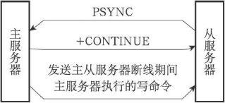
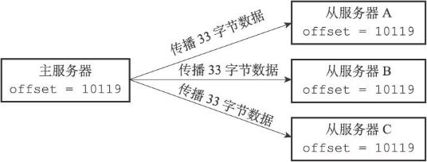
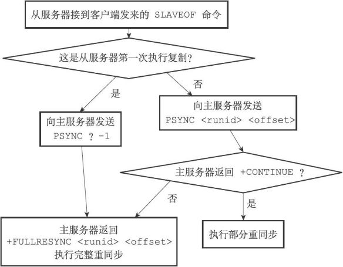
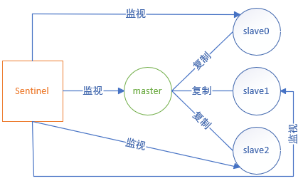
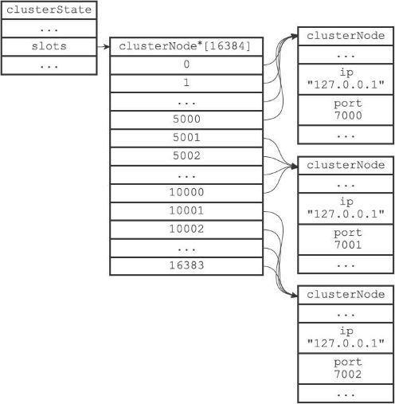
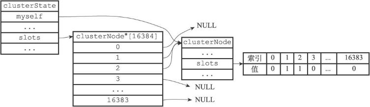
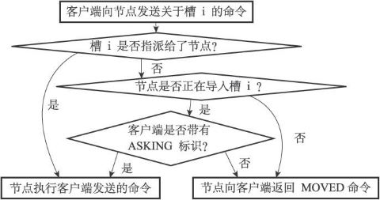

> 基于Redis 2.9，适用于Redis 2.6至Redis 3.0

## 复制
在Redis中，用户可以通过执行SLAVEOF命令或者设置slaveof选项，让一个服务器去复制（replicate）另一个服务器，我们称呼被复制的服务器为主服务器（master），而对主服务器进行复制的服务器则被称为从服务器（slave）。

假设现在有两个Redis服务器，地址分别为127.0.0.1:6379和127.0.0.1:12345，向服务器127.0.0.1:12345发送以下命令：

```bash
127.0.0.1:12345> SLAVEOF 127.0.0.1 6379
OK
```

那么服务器127.0.0.1:12345将成为127.0.0.1:6379的从服务器，而服务器127.0.0.1:6379则会成为127.0.0.1:12345的主服务器。  
进行复制中的主从服务器双方的数据库将保存相同的数据，概念上将这种现象称作“数据库状态一致”，或者简称“一致”。

详细内容可以参考官方文档：https://redis.io/docs/management/replication/

### 旧版复制功能
Redis的复制功能分为 同步（sync）和 命令传播（command propagate）两个操作。
- 同步操作用于将从服务器的数据库状态更新至主服务器当前所处的数据库状态。
- 命令传播操作则用于在主服务器的数据库状态被修改，导致主从服务器的数据库状态出现不一致时，让主从服务器的数据库重新回到一致状态。

#### 同步
当客户端向从服务器发送SLAVEOF命令，要求从服务器复制主服务器时，从服务器首先需要执行同步操作，也即是，将从服务器的数据库状态更新至主服务器当前所处的数据库状态。

从服务器对主服务器的同步操作需要通过向主服务器发送SYNC命令来完成，以下是SYNC命令的执行步骤：  
1）从服务器向主服务器发送SYNC命令。  
2）收到SYNC命令的主服务器执行BGSAVE命令，在后台生成一个RDB文件，并使用一个缓冲区记录从现在开始执行的所有写命令。  
3）当主服务器的BGSAVE命令执行完毕时，主服务器会将BGSAVE命令生成的RDB文件发送给从服务器，从服务器接收并载入这个RDB文件，将自己的数据库状态更新至主服务器执行BGSAVE命令时的数据库状态。  
4）主服务器将记录在缓冲区里面的所有写命令发送给从服务器，从服务器执行这些写命令，将自己的数据库状态更新至主服务器数据库当前所处的状态。

#### 命令传播
在同步操作执行完毕之后，主从服务器两者的数据库将达到一致状态，但这种一致并不是一成不变的，每当主服务器执行客户端发送的写命令时，主服务器的数据库就有可能会被修改，并导致主从服务器状态不再一致。

为了让主从服务器再次回到一致状态，主服务器需要对从服务器执行命令传播操作：主服务器会将自己执行的写命令，也即是造成主从服务器不一致的那条写命令，发送给从服务器执行，当从服务器执行了相同的写命令之后，主从服务器将再次回到一致状态。

#### 旧版复制功能的缺陷
在Redis中，从服务器对主服务器的复制可以分为以下两种情况：

    初次复制：从服务器以前没有复制过任何主服务器，或者从服务器当前要复制的主服务器和上一次复制的主服务器不同。
    断线后重复制：处于命令传播阶段的主从服务器因为网络原因而中断了复制，但从服务器通过自动重连接重新连上了主服务器，并继续复制主服务器。

对于初次复制来说，旧版复制功能能够很好地完成任务，但对于断线后重复制来说，旧版复制功能虽然也能让主从服务器重新回到一致状态，但效率却非常低。  
在主从服务器断线期间，主服务器执行的写命令可能会有成百上千个之多，而不仅仅是几个写命令。但总的来说，主从服务器断开的时间越短，主服务器在断线期间执行的写命令就越少，而执行少量写命令所产生的数据量通常比整个数据库的数据量要少得多，在这种情况下，为了让从服务器补足一小部分缺失的数据，却要让主从服务器重新执行一次SYNC命令，这种做法无疑是非常低效的。

###### SYNC命令是一个非常耗费资源的操作
每次执行SYNC命令，主从服务器需要执行以下动作：  
1）主服务器需要执行BGSAVE命令来生成RDB文件，这个生成操作会耗费主服务器大量的CPU、内存和磁盘I/O资源。  
2）主服务器需要将自己生成的RDB文件发送给从服务器，这个发送操作会耗费主从服务器大量的网络资源（带宽和流量），并对主服务器响应命令请求的时间产生影响。  
3）接收到RDB文件的从服务器需要载入主服务器发来的RDB文件，并且在载入期间，从服务器会因为阻塞而没办法处理命令请求。

### 新版复制功能
为了解决旧版复制功能在处理断线重复制情况时的低效问题，Redis从2.8版本开始，使用PSYNC命令代替SYNC命令来执行复制时的同步操作。

PSYNC命令具有 完整重同步（full resynchronization）和 部分重同步（partial resynchronization）两种模式：  
- **完整重同步**用于处理初次复制情况：完整重同步的执行步骤和SYNC命令的执行步骤基本一样，它们都是通过让主服务器创建并发送RDB文件，以及向从服务器发送保存在缓冲区里面的写命令来进行同步。  
- **部分重同步**用于处理断线后重复制情况：当从服务器在断线后重新连接主服务器时，如果条件允许，主服务器可以将主从服务器连接断开期间执行的写命令发送给从服务器，从服务器只要接收并执行这些写命令，就可以将数据库更新至主服务器当前所处的状态。

执行SYNC命令需要生成、传送和载入整个RDB文件，而部分重同步只需要将从服务器缺少的写命令发送给从服务器执行即可。

###### 主从服务器在执行部分重同步时的通信过程
主从服务器重新连接后，从服务器向主服务器发送PSYNC命令，主服务器向从服务器返回+CONTINUE命令，表示执行部分重同步，从服务接收到+CONTINUE命令，准备执行部分重同步。之后，主服务器发送断线期间的写命令给从服务器，再次完成同步。  


#### 部分重同步的实现
部分重同步功能由以下三个部分构成：

    主服务器的复制偏移量（replication offset）和从服务器的复制偏移量。
    主服务器的复制积压缓冲区（replication backlog）。
    服务器的运行ID（run ID）。

##### 复制偏移量
执行复制的双方——主服务器和从服务器会分别维护一个复制偏移量：
    
    主服务器每次向从服务器传播N个字节的数据时，就将自己的复制偏移量的值加上N。
    从服务器每次收到主服务器传播来的N个字节的数据时，就将自己的复制偏移量的值加上N。

  
通过对比主从服务器的复制偏移量，程序可以很容易地知道主从服务器是否处于一致状态：

    如果主从服务器处于一致状态，那么主从服务器两者的偏移量总是相同的。
    如果主从服务器两者的偏移量并不相同，那么说明主从服务器并未处于一致状态。

##### 复制积压缓冲区
复制积压缓冲区是由主服务器维护的一个固定长度（fixed-size）先进先出（FIFO）队列，默认大小为1MB。

当主服务器进行命令传播时，它不仅会将写命令发送给所有从服务器，还会将写命令入队到复制积压缓冲区里面。  
主服务器的复制积压缓冲区里面会保存着一部分最近传播的写命令，并且复制积压缓冲区会为队列中的每个字节记录相应的复制偏移量。  
当从服务器重新连上主服务器时，从服务器会通过PSYNC命令将自己的复制偏移量offset发送给主服务器，主服务器会根据这个复制偏移量来决定对从服务器执行何种同步操作：

    如果offset偏移量之后的数据（也即是偏移量offset+1开始的数据）仍然存在于复制积压缓冲区里面，那么主服务器将对从服务器执行部分重同步操作。
    如果offset偏移量之后的数据已经不存在于复制积压缓冲区，那么主服务器将对从服务器执行完整重同步操作。

###### 根据需要调整复制积压缓冲区的大小
Redis为复制积压缓冲区设置的默认大小为1MB，如果主服务器需要执行大量写命令，又或者主从服务器断线后重连接所需的时间比较长，那么这个大小也许并不合适。如果复制积压缓冲区的大小设置得不恰当，那么PSYNC命令的复制重同步模式就不能正常发挥作用，因此，正确估算和设置复制积压缓冲区的大小非常重要。  
复制积压缓冲区的最小大小可以根据公式second*write_size_per_second来估算：

    其中second为从服务器断线后重新连接上主服务器所需的平均时间（以秒计算）。
    write_size_per_second则是主服务器平均每秒产生的写命令数据量（协议格式的写命令的长度总和）。

为了安全起见，可以将复制积压缓冲区的大小设为2\*second*write_size_per_second，这样可以保证绝大部分断线情况都能用部分重同步来处理。  
至于复制积压缓冲区大小的修改方法，可以参考配置文件中关于repl-backlog-size选项的说明。

##### 服务器运行ID
除了复制偏移量和复制积压缓冲区之外，实现部分重同步还需要用到服务器运行ID（run ID）：

    每个Redis服务器，不论主服务器还是从服务，都会有自己的运行ID。
    运行ID在服务器启动时自动生成，由40个随机的十六进制字符组成，例如53b9b28df8042fdc9ab5e3fcbbbabff1d5dce2b3。

当从服务器对主服务器进行初次复制时，主服务器会将自己的运行ID传送给从服务器，而从服务器则会将这个运行ID保存起来。  
当从服务器断线并重新连上一个主服务器时，从服务器将向当前连接的主服务器发送之前保存的运行ID：

    如果从服务器保存的运行ID和当前连接的主服务器的运行ID相同，那么说明从服务器断线之前复制的就是当前连接的这个主服务器，主服务器可以继续尝试执行部分重同步操作。
    如果从服务器保存的运行ID和当前连接的主服务器的运行ID并不相同，那么说明从服务器断线之前复制的主服务器并不是当前连接的这个主服务器，主服务器将对从服务器执行完整重同步操作。

### PSYNC
PSYNC命令的调用方法有两种：
- 如果从服务器以前没有复制过任何主服务器，或者之前执行过SLAVEOF no one命令，那么从服务器在开始一次新的复制时将向主服务器发送PSYNC ? -1命令，主动请求主服务器进行完整重同步（因为这时不可能执行部分重同步）。
- 如果从服务器已经复制过某个主服务器，那么从服务器在开始一次新的复制时将向主服务器发送PSYNC <runid> <offset>命令：其中runid是上一次复制的主服务器的运行ID，而offset则是从服务器当前的复制偏移量，接收到这个命令的主服务器会通过这两个参数来判断应该对从服务器执行哪种同步操作。

接收到PSYNC命令的主服务器会向从服务器返回以下三种回复的其中一种：
- 如果主服务器返回+FULLRESYNC <runid> <offset>回复，那么表示主服务器将与从服务器执行完整重同步操作：其中runid是这个主服务器的运行ID，从服务器会将这个ID保存起来，在下一次发送PSYNC命令时使用；而offset则是主服务器当前的复制偏移量，从服务器会将这个值作为自己的初始化偏移量。
- 如果主服务器返回+CONTINUE回复，那么表示主服务器将与从服务器执行部分重同步操作，从服务器只要等着主服务器将自己缺少的那部分数据发送过来就可以了。
- 如果主服务器返回-ERR回复，那么表示主服务器的版本低于Redis 2.8，它识别不了PSYNC命令，从服务器将向主服务器发送SYNC命令，并与主服务器执行完整同步操作。

PSYNC命令执行完整重同步或部分重同步的流程图：  


### 复制的实现
向从服务器发送SLAVEOF命令，可以让一个从服务器去复制一个主服务器：

```bash
SLAVEOF <master_ip> <master_port>
```

###### 1.设置主服务器的地址和端口
当客户端向从服务器发送以下命令时：
```bash
127.0.0.1:12345> SLAVEOF 127.0.0.1 6379
OK
```
从服务器首先要做的就是将客户端给定的主服务器IP地址127.0.0.1以及端口6379保存到服务器状态的masterhost属性和masterport属性里面：
```c
struct redisServer {
    // ...
    // 主服务器的地址
    char *masterhost;
    // 主服务器的端口
    int masterport;
    // ...
};
```
SLAVEOF命令是一个异步命令，在完成masterhost属性和masterport属性的设置工作之后，从服务器将向发送SLAVEOF命令的客户端返回OK，表示复制指令已经被接收，而实际的复制工作将在OK返回之后才真正开始执行。

###### 2.建立套接字连接
在SLAVEOF命令执行之后，从服务器将根据命令所设置的IP地址和端口，创建连向主服务器的套接字连接。  
如果从服务器创建的套接字能成功连接（connect）到主服务器，那么从服务器将为这个套接字关联一个专门用于处理复制工作的文件事件处理器，这个处理器将负责执行后续的复制工作，比如接收RDB文件，以及接收主服务器传播来的写命令，诸如此类。  
而主服务器在接受（accept）从服务器的套接字连接之后，将为该套接字创建相应的客户端状态，并将从服务器看作是一个连接到主服务器的客户端来对待，这时从服务器将同时具有服务器（server）和客户端（client）两个身份：从服务器可以向主服务器发送命令请求，而主服务器则会向从服务器返回命令回复。

因为复制工作接下来的几个步骤都会以从服务器向主服务器发送命令请求的形式来进行，所以理解“从服务器是主服务器的客户端”这一点非常重要。

###### 3.发送PING命令
从服务器成为主服务器的客户端之后，做的第一件事就是向主服务器发送一个PING命令。  
PING命令有两个作用：

    虽然主从服务器成功建立起了套接字连接，但双方并未使用该套接字进行过任何通信，通过发送PING命令可以检查套接字的读写状态是否正常。
    因为复制工作接下来的几个步骤都必须在主服务器可以正常处理命令请求的状态下才能进行，通过发送PING命令可以检查主服务器能否正常处理命令请求。

从服务器在发送PING命令之后将遇到以下三种情况的其中一种：
- 如果主服务器向从服务器返回了一个命令回复，但从服务器却不能在规定的时限（timeout）内读取出命令回复的内容，那么表示主从服务器之间的网络连接状态不佳，不能继续执行复制工作的后续步骤。当出现这种情况时，从服务器断开并重新创建连向主服务器的套接字。
- 如果主服务器向从服务器返回一个错误，那么表示主服务器暂时没办法处理从服务器的命令请求，不能继续执行复制工作的后续步骤。当出现这种情况时，从服务器断开并重新创建连向主服务器的套接字。比如说，如果主服务器正在处理一个超时运行的脚本，那么当从服务器向主服务器发送PING命令时，从服务器将收到主服务器返回的BUSY Redisis busy running a script.You can only call SCRIPT KILL or SHUTDOWN NOSAVE.错误。
- 如果从服务器读取到"PONG"回复，那么表示主从服务器之间的网络连接状态正常，并且主服务器可以正常处理从服务器（客户端）发送的命令请求，在这种情况下，从服务器可以继续执行复制工作的下个步骤。

###### 4.身份验证
- 如果从服务器设置了masterauth选项，那么进行身份验证。
- 如果从服务器没有设置masterauth选项，那么不进行身份验证。

在需要进行身份验证的情况下，从服务器将向主服务器发送一条AUTH命令，命令的参数为从服务器masterauth选项的值。  
从服务器在身份验证阶段可能遇到的情况有以下几种：
- 如果主服务器没有设置requirepass选项，并且从服务器也没有设置masterauth选项，那么主服务器将继续执行从服务器发送的命令，复制工作可以继续进行。
- 如果从服务器通过AUTH命令发送的密码和主服务器requirepass选项所设置的密码相同，那么主服务器将继续执行从服务器发送的命令，复制工作可以继续进行。与此相反，如果主从服务器设置的密码不相同，那么主服务器将返回一个invalid password错误。
- 如果主服务器设置了requirepass选项，但从服务器却没有设置masterauth选项，那么主服务器将返回一个NOAUTH错误。另一方面，如果主服务器没有设置requirepass选项，但从服务器却设置了masterauth选项，那么主服务器将返回一个no password is set错误。

所有错误情况都会令从服务器中止目前的复制工作，并从创建套接字开始重新执行复制，直到身份验证通过，或者从服务器放弃执行复制为止。

###### 5.发送端口信息
从服务器将执行命令 REPLCONF listening-port <port-number>，向主服务器发送从服务器的监听端口号。

例如，从服务器的监听端口为12345，那么从服务器将向主服务器发送命令 REPLCONF listening-port 12345  
主服务器在接收到这个命令之后，会将端口号记录在从服务器所对应的客户端状态的slave_listening_port属性中：
```c
typedef struct redisClient {
    // ...
    // 从服务器的监听端口号
    int slave_listening_port;
    // ...
} redisClient;
```
slave_listening_port属性目前唯一的作用就是在主服务器执行INFO replication命令时打印出从服务器的端口号。

以下是客户端向例子中的主服务器发送INFO replication命令时得到的回复，其中slave0行的port域显示的就是从服务器所对应客户端状态的slave_listening_port属性的值：
```bash
127.0.0.1:6379> INFO replication
# Replication
role:master
connected_slaves:1
slave0:ip=127.0.0.1,port=12345,status=online,offset=1289,lag=1
master_repl_offset:1289
repl_backlog_active:1
repl_backlog_size:1048576
repl_backlog_first_byte_offset:2
repl_backlog_histlen:1288
```

###### 6.同步
从服务器将向主服务器发送PSYNC命令，执行同步操作，并将自己的数据库更新至主服务器数据库当前所处的状态。  
在同步操作执行之前，只有从服务器是主服务器的客户端，但是在执行同步操作之后，主服务器也会成为从服务器的客户端：

    如果PSYNC命令执行的是完整重同步操作，那么主服务器需要成为从服务器的客户端，才能将RDB文件发送给从服务器执行。
    如果PSYNC命令执行的是部分重同步操作，那么主服务器需要成为从服务器的客户端，才能向从服务器发送保存在复制积压缓冲区里面的写命令。

因此，在同步操作执行之后，主从服务器双方都是对方的客户端，它们可以互相向对方发送命令请求，也可以互相向对方返回命令回复。  
正因为主服务器成为了从服务器的客户端，所以主服务器才可以通过发送写命令来改变从服务器的数据库状态，不仅同步操作需要用到这一点，这也是主服务器对从服务器执行命令传播操作的基础。

###### 7.命令传播
主从服务器进入命令传播阶段，这时主服务器只要一直将自己执行的写命令发送给从服务器，而从服务器只要一直接收并执行主服务器发来的写命令，就可以保证主从服务器一直保持一致了。

### 心跳检测
在命令传播阶段，从服务器默认会以每秒一次的频率，向主服务器发送命令：
```bash
REPLCONF ACK <replication_offset>
```
其中replication_offset是从服务器当前的复制偏移量。

发送REPLCONF ACK命令对于主从服务器有三个作用：

    检测主从服务器的网络连接状态。
    辅助实现min-slaves选项。
    检测命令丢失。

#### 检测主从服务器的网络连接状态
主从服务器可以通过发送和接收REPLCONF ACK命令来检查两者之间的网络连接是否正常：如果主服务器超过一秒钟没有收到从服务器发来的REPLCONF ACK命令，那么主服务器就知道主从服务器之间的连接出现问题了。  
通过向主服务器发送INFO replication命令，在列出的从服务器列表的lag一栏中，可以看到相应从服务器最后一次向主服务器发送REPLCONF ACK命令距离现在过了多少秒：
```bash
127.0.0.1:6379> INFO replication
# Replication
role:master
connected_slaves:2
slave0:ip=127.0.0.1,port=12345,state=online,offset=211,lag=0  # 刚刚发送过 REPLCONF ACK命令
slave1:ip=127.0.0.1,port=56789,state=online,offset=197,lag=15   # 15秒之前发送过REPLCONF ACK命令
master_repl_offset:211
repl_backlog_active:1
repl_backlog_size:1048576
repl_backlog_first_byte_offset:2
repl_backlog_histlen:210 
```

在一般情况下，lag的值应该在0秒或者1秒之间跳动，如果超过1秒的话，那么说明主从服务器之间的连接出现了故障。

#### 辅助实现min-slaves配置选项
Redis的min-slaves-to-write和min-slaves-max-lag两个选项可以防止主服务器在不安全的情况下执行写命令。

如果向主服务器提供以下设置：
```text
min-slaves-to-write 3
min-slaves-max-lag 10
```
在从服务器的数量少于3个，或者三个从服务器的延迟（lag）值都大于或等于10秒时，主服务器将拒绝执行写命令，这里的延迟值就是上面提到的INFO replication命令的lag值。

#### 检测命令丢失
如果因为网络故障，主服务器传播给从服务器的写命令在半路丢失，那么当从服务器向主服务器发送REPLCONF ACK命令时，主服务器将发觉从服务器当前的复制偏移量少于自己的复制偏移量，然后主服务器就会根据从服务器提交的复制偏移量，在复制积压缓冲区里面找到从服务器缺少的数据，并将这些数据重新发送给从服务器。

<span style="color: red;font-weight: bold;">Tips</span>：主服务器向从服务器补发缺失数据这一操作的原理和部分重同步操作的原理非常相似，这两个操作的区别在于，补发缺失数据操作在主从服务器没有断线的情况下执行，而部分重同步操作则在主从服务器断线并重连之后执行。

###### Redis 2.8版本以前的命令丢失
REPLCONF ACK命令和复制积压缓冲区都是Redis 2.8版本新增的，在Redis 2.8版本以前，即使命令在传播过程中丢失，主服务器和从服务器都不会注意到，主服务器更不会向从服务器补发丢失的数据，所以为了保证复制时主从服务器的数据一致性，最好使用2.8或以上版本的Redis。


## Sentinel
Sentinel（哨岗、哨兵）是Redis的高可用性（high availability）解决方案：由一个或多个Sentinel实例（instance）组成的Sentinel系统（system）可以监视任意多个主服务器，以及这些主服务器属下的所有从服务器，并在被监视的主服务器进入下线状态时，自动将下线主服务器属下的某个从服务器升级为新的主服务器，然后由新的主服务器代替已下线的主服务器继续处理命令请求。

  
当server1的下线时长超过用户设定的下线时长上限时，Sentinel系统就会对server1执行故障转移操作：  
1. Sentinel系统会挑选server1属下的其中一个从服务器，并将这个被选中的从服务器升级为新的主服务器。
2. Sentinel系统会向server1属下的所有从服务器发送新的复制指令，让它们成为新的主服务器的从服务器，当所有从服务器都开始复制新的主服务器时，故障转移操作执行完毕。
3. Sentinel还会继续监视已下线的server1，并在它重新上线时，将它设置为新的主服务器的从服务器。

### 启动并初始化Sentinel
启动一个Sentinel可以使用如下两个命令，效果完全相同。
```bash
$ redis-sentinel /path/to/your/sentinel.conf
$ redis-server /path/to/your/sentinel.conf --sentinel
```

当一个Sentinel启动时，它需要执行以下步骤：

    1）初始化服务器。
    2）将普通Redis服务器使用的代码替换成Sentinel专用代码。
    3）初始化Sentinel状态。
    4）根据给定的配置文件，初始化Sentinel的监视主服务器列表。
    5）创建连向主服务器的网络连接。

###### 1.初始化服务器
Sentinel本质上只是一个运行在特殊模式下的Redis服务器。  
因为Sentinel执行的工作和普通Redis服务器执行的工作不同，所以Sentinel的初始化过程和普通Redis服务器的初始化过程并不完全相同。  
例如，普通服务器在初始化时会通过载入RDB文件或者AOF文件来还原数据库状态，但是因为Sentinel并不使用数据库，所以初始化Sentinel时就不会载入RDB文件或者AOF文件。

Sentinel模式下Redis服务器主要功能的使用情况：

功能 | 使用情况
 :---- | :----
数据库和键值对相关的命令，比如SET、DEL、FLUSHDB | 不使用
事务命令，比如MULTI、WATCH | 不使用
脚本命令，比如EVAL | 不使用
RDB持久化命令，比如SAVE和BGSAVE | 不使用
AOF持久化命令，比如BGREWRITEAOF | 不使用
复制命令，比如SLAVEOF | Sentinel内部可以使用，但客户端不能使用
发布与订阅命令，比如PUBLISH、SUBSCRIBE | SUBSCRIBE、PSUBSCRIBE、UNSUBSCRIBE、PUNSUBSCRIBE四个命令在Sentinel和客户端都可以使用，但PUBLISH只能在Sentinel内部使用
文件事件处理器（发送命令请求、处理命令回复） | Sentinel内部使用，但关联的文件事件处理器与Redis服务器的不同
时间事件处理器（负责serverCron函数） | Sentinel内部使用，serverCron函数调用sentinel.c/sentinelTimer函数

###### 2.使用Sentinel专用代码
启动Sentinel的第二个步骤就是将一部分普通Redis服务器使用的代码替换成Sentinel专用代码。  
比如说，普通Redis服务器使用redis.h/REDIS_SERVERPORT常量的值作为服务器端口，而Sentinel则使用sentinel.c/REDIS_SENTINEL_PORT常量的值作为服务器端口：
```bash
#define REDIS_SENTINEL_PORT 26379
```

普通Redis服务器使用redis.c/redisCommandTable作为服务器的命令表：
```c
struct redisCommand redisCommandTable[] = {
    {"get",getCommand,2,"r",0,NULL,1,1,1,0,0},
    {"set",setCommand,-3,"wm",0,noPreloadGetKeys,1,1,1,0,0},
    {"setnx",setnxCommand,3,"wm",0,noPreloadGetKeys,1,1,1,0,0},
    // ...
    {"script",scriptCommand,-2,"ras",0,NULL,0,0,0,0,0},
    {"time",timeCommand,1,"rR",0,NULL,0,0,0,0,0},
    {"bitop",bitopCommand,-4,"wm",0,NULL,2,-1,1,0,0},
    {"bitcount",bitcountCommand,-2,"r",0,NULL,1,1,1,0,0}
}
```

而Sentinel则使用sentinel.c/sentinelcmds作为服务器的命令表，并且其中的INFO命令会使用Sentinel模式下的专用实现sentinel.c/sentinelInfoCommand函数，而不是普通Redis服务器使用的实现redis.c/infoCommand函数：
```c
struct redisCommand sentinelcmds[] = {
    {"ping",pingCommand,1,"",0,NULL,0,0,0,0,0},
    {"sentinel",sentinelCommand,-2,"",0,NULL,0,0,0,0,0},
    {"subscribe",subscribeCommand,-2,"",0,NULL,0,0,0,0,0},
    {"unsubscribe",unsubscribeCommand,-1,"",0,NULL,0,0,0,0,0},
    {"psubscribe",psubscribeCommand,-2,"",0,NULL,0,0,0,0,0},
    {"punsubscribe",punsubscribeCommand,-1,"",0,NULL,0,0,0,0,0},
    {"info",sentinelInfoCommand,-1,"",0,NULL,0,0,0,0,0}
};
```
sentinelcmds命令表也解释了为什么在Sentinel模式下，Redis服务器不能执行诸如SET、DBSIZE、EVAL等等这些命令，因为服务器根本没有在命令表中载入这些命令。PING、SENTINEL、INFO、SUBSCRIBE、UNSUBSCRIBE、PSUBSCRIBE和PUNSUBSCRIBE这七个命令就是客户端可以对Sentinel执行的全部命令了。

###### 3.初始化Sentinel状态
服务器会初始化一个sentinel.c/sentinelState结构（后面简称“Sentinel状态”），这个结构保存了服务器中所有和Sentinel功能有关的状态（服务器的一般状态仍然由redis.h/redisServer结构保存）：
```c
struct sentinelState {
    // 当前纪元，用于实现故障转移
    uint64_t current_epoch;
    // 保存了所有被这个sentinel监视的主服务器
    // 字典的键是主服务器的名字，字典的值则是一个指向sentinelRedisInstance结构的指针
    dict *masters;
    // 是否进入了TILT模式？
    int tilt;
    // 目前正在执行的脚本的数量
    int running_scripts;
    // 进入TILT模式的时间
    mstime_t tilt_start_time;
    // 最后一次执行时间处理器的时间
    mstime_t previous_time;
    // 一个FIFO队列，包含了所有需要执行的用户脚本
    list *scripts_queue;
} sentinel;
```

###### 4.初始化Sentinel状态的masters属性
Sentinel状态中的masters字典记录了所有被Sentinel监视的主服务器的相关信息，其中：

    字典的键是被监视主服务器的名字。
    字典的值则是被监视主服务器对应的sentinel.c/sentinelRedisInstance结构。

每个sentinelRedisInstance结构（后面简称“实例结构”）代表一个被Sentinel监视的Redis服务器实例（instance），这个实例可以是主服务器、从服务器，或者另外一个Sentinel。

实例结构在表示主服务器时的部分属性如下：
```c
typedef struct sentinelRedisInstance {
    // 标识值，记录了实例的类型，以及该实例的当前状态
    int flags;
    // 实例的名字
    // 主服务器的名字由用户在配置文件中设置
    // 从服务器以及Sentinel的名字由Sentinel自动设置，格式为ip:port，例如"127.0.0.1:26379"
    char *name;
    // 实例的运行ID
    char *runid;
    // 配置纪元，用于实现故障转移
    uint64_t config_epoch;
    // 实例的地址
    sentinelAddr *addr;
    // SENTINEL down-after-milliseconds选项设定的值
    // 实例无响应多少毫秒之后才会被判断为主观下线（subjectively down）
    mstime_t down_after_period;
    // SENTINEL monitor <master-name> <IP> <port> <quorum>选项中的quorum参数
    // 判断这个实例为客观下线（objectively down）所需的支持投票数量
    int quorum;
    // SENTINEL parallel-syncs <master-name> <number>选项的值
    // 在执行故障转移操作时，可以同时对新的主服务器进行同步的从服务器数量
    int parallel_syncs;
    // SENTINEL failover-timeout <master-name> <ms>选项的值
    // 刷新故障迁移状态的最大时限
    mstime_t failover_timeout;
    // ...
} sentinelRedisInstance;
```
sentinelRedisInstance.addr属性是一个指向sentinel.c/sentinelAddr结构的指针，这个结构保存着实例的IP地址和端口号：
```c
typedef struct sentinelAddr {
    char *ip;
    int port;
} sentinelAddr;
```

###### 5.创建连向主服务器的网络连接
创建连接后，Sentinel将成为主服务器的客户端，它可以向主服务器发送命令，并从命令回复中获取相关的信息。

对于每个被Sentinel监视的主服务器来说，Sentinel会创建两个连向主服务器的异步网络连接：
- 一个是命令连接，这个连接专门用于向主服务器发送命令，并接收命令回复。
- 另一个是订阅连接，这个连接专门用于订阅主服务器的\__sentinel__:hello频道。

**为什么有两个连接？**  
在Redis目前的发布与订阅功能中，被发送的信息都不会保存在Redis服务器里面，如果在信息发送时，想要接收信息的客户端不在线或者断线，那么这个客户端就会丢失这条信息。因此，为了不丢失\__sentinel__:hello频道的任何信息，Sentinel必须专门用一个订阅连接来接收该频道的信息。  
另一方面，除了订阅频道之外，Sentinel还必须向主服务器发送命令，以此来与主服务器进行通信，所以Sentinel还必须向主服务器创建命令连接。  
因为Sentinel需要与多个实例创建多个网络连接，所以Sentinel使用的是异步连接。

### 与服务器的信息交互
#### 获取主服务器信息
Sentinel默认会以每十秒一次的频率，通过命令连接向被监视的主服务器发送INFO命令，并通过分析INFO命令的回复来获取主服务器的当前信息。

假设主服务器master有三个从服务器slave0、slave1和slave2，并且一个Sentinel正在连接主服务器，那么Sentinel将持续地向主服务器发送INFO命令，并获得类似于以下内容的回复：
```bash
# Server
...
run_id:7611c59dc3a29aa6fa0609f841bb6a1019008a9c
...
# Replication
role:master
...
slave0:ip=127.0.0.1,port=11111,state=online,offset=43,lag=0
slave1:ip=127.0.0.1,port=22222,state=online,offset=43,lag=0
slave2:ip=127.0.0.1,port=33333,state=online,offset=43,lag=0
...
# Other sections
...
```
通过分析主服务器返回的INFO命令回复，Sentinel可以获取以下两方面的信息：  
▶ 一方面是关于主服务器本身的信息，包括run_id域记录的服务器运行ID，以及role域记录的服务器角色；  
▶ 另一方面是关于主服务器属下所有从服务器的信息，每个从服务器都由一个"slave"字符串开头的行记录，每行的ip=域记录了从服务器的IP地址，而port=域则记录了从服务器的端口号。根据这些IP地址和端口号，Sentinel无须用户提供从服务器的地址信息，就可以自动发现从服务器。

根据run_id域和role域记录的信息，Sentinel将对主服务器的实例结构进行更新，例如，主服务器重启之后，它的运行ID就会和实例结构之前保存的运行ID不同，Sentinel检测到这一情况之后，就会对实例结构的运行ID进行更新。  
主服务器返回的从服务器信息，则会被用于更新主服务器实例结构的slaves字典，这个字典记录了主服务器属下从服务器的名单：  
▶ 字典的键是由Sentinel自动设置的从服务器名字，格式为ip:port，例如127.0.0.1:11111。  
▶ 字典的值则是从服务器对应的实例结构。

Sentinel在分析INFO命令中包含的从服务器信息时，会检查从服务器对应的实例结构是否已经存在于slaves字典：  
▶ 如果从服务器对应的实例结构已经存在，那么Sentinel对从服务器的实例结构进行更新。  
▶ 如果从服务器对应的实例结构不存在，那么说明这个从服务器是新发现的从服务器，Sentinel会在slaves字典中为这个从服务器新创建一个实例结构。

主服务器实例结构和从服务器实例结构之间的区别：
- 主服务器实例结构的flags属性的值为SRI_MASTER，而从服务器实例结构的flags属性的值为SRI_SLAVE。
- 主服务器实例结构的name属性的值是用户使用Sentinel配置文件设置的，而从服务器实例结构的name属性的值则是Sentinel根据从服务器的IP地址和端口号自动设置的。

#### 获取从服务器信息
当Sentinel发现主服务器有新的从服务器出现时，Sentinel除了会为这个新的从服务器创建相应的实例结构之外，Sentinel还会创建连接到从服务器的命令连接和订阅连接。  
在创建命令连接之后，Sentinel在默认情况下，会以每十秒一次的频率通过命令连接向从服务器发送INFO命令，并获得类似于以下内容的回复：
```bash
# Server
...
run_id:32be0699dd27b410f7c90dada3a6fab17f97899f
...
# Replication
role:slave
master_host:127.0.0.1
master_port:6379
master_link_status:up
slave_repl_offset:11887
slave_priority:100
# Other sections
...
```

根据INFO命令的回复，Sentinel会提取出以下信息：

    从服务器的运行ID run_id。
    从服务器的角色role。
    主服务器的IP地址master_host，以及主服务器的端口号master_port。
    主从服务器的连接状态master_link_status。
    从服务器的优先级slave_priority。
    从服务器的复制偏移量slave_repl_offset。

#### 向主服务器和从服务器发送信息
在默认情况下，Sentinel会以每两秒一次的频率，通过命令连接向所有被监视的主服务器和从服务器发送以下格式的命令：
```bash
PUBLISH __sentinel__:hello "<s_ip>,<s_port>,<s_runid>,<s_epoch>,<m_name>,<m_ip>,<m_port>,<m_epoch>"
```
这条命令向服务器的\__sentinel__:hello频道发送了一条信息，信息的内容由多个参数组成：  
▶ s_开头的参数记录的是Sentinel本身的信息。  
▶ m_开头的参数记录的则是主服务器的信息。如果Sentinel正在监视的是主服务器，那么这些参数记录的就是主服务器的信息；如果Sentinel正在监视的是从服务器，那么这些参数记录的就是从服务器正在复制的主服务器的信息。

参数 | 意义
 :---- | :----
s_ip | Sentinel的IP地址
s_port | Sentinel的端口号
s_runid | Sentinel的运行ID
s_epoch | Sentinel当前的配置纪元（configuration epoch）
m_name | 主服务器的名字
m_ip | 主服务的IP
m_port | 主服务的端口号
m_epoch | 主服务当前的配置纪元

#### 接收来自主服务器和从服务器的频道信息
当Sentinel与一个主服务器或者从服务器建立起订阅连接之后，Sentinel就会通过订阅连接，向服务器发送以下命令：
```bash
SUBSCRIBE __sentinel__:hello
```

Sentinel对\_\_sentinel__:hello 频道的订阅会一直持续到Sentinel与服务器的连接断开为止。  
也就是说，对于每个与Sentinel连接的服务器，Sentinel既通过命令连接向服务器的\_\_sentinel__:hello频道发送信息，又通过订阅连接从服务器的\__sentinel__:hello频道接收信息。

对于监视同一个服务器的多个Sentinel来说，一个Sentinel发送的信息会被其他Sentinel接收到，这些信息会被用于更新其他Sentinel对发送信息Sentinel的认知，也会被用于更新其他Sentinel对被监视服务器的认知。

举个例子，假设现在有sentinel1、sentinel2、sentinel3三个Sentinel在监视同一个服务器，那么当sentinel1向服务器的\_\_sentinel__:hello频道发送一条信息时，所有订阅了\_\_sentinel__:hello频道的Sentinel（包括sentinel1自己在内）都会收到这条信息。

当一个Sentinel从\__sentinel__:hello频道收到一条信息时，Sentinel会对这条信息进行分析，提取出信息中的Sentinel IP地址、Sentinel端口号、Sentinel运行ID等八个参数，并进行以下检查：  
▶ 如果信息中记录的Sentinel运行ID和接收信息的Sentinel的运行ID相同，那么说明这条信息是Sentinel自己发送的，Sentinel将丢弃这条信息，不做进一步处理。  
▶ 如果信息中记录的Sentinel运行ID和接收信息的Sentinel的运行ID不相同，那么说明这条信息是监视同一个服务器的其他Sentinel发来的，接收信息的Sentinel将根据信息中的各个参数，对相应主服务器的实例结构进行更新。

##### 更新sentinels字典
Sentinel为主服务器创建的实例结构中的sentinels字典保存了除Sentinel本身之外，所有同样监视这个主服务器的其他Sentinel的资料：  
▶ sentinels字典的键是其中一个Sentinel的名字，格式为ip:port，比如对于IP地址为127.0.0.1，端口号为26379的Sentinel来说，这个Sentinel在sentinels字典中的键就是"127.0.0.1:26379"。  
▶ sentinels字典的值则是键所对应Sentinel的实例结构，比如对于键"127.0.0.1:26379"来说，这个键在sentinels字典中的值就是IP为127.0.0.1，端口号为26379的Sentinel的实例结构。

当一个Sentinel接收到其他Sentinel发来的信息时（我们称呼发送信息的Sentinel为源Sentinel，接收信息的Sentinel为目标Sentinel），目标Sentinel会从信息中分析并提取出以下两方面参数：  
▶ 与Sentinel有关的参数：源Sentinel的IP地址、端口号、运行ID和配置纪元。  
▶ 与主服务器有关的参数：源Sentinel正在监视的主服务器的名字、IP地址、端口号和配置纪元。

根据信息中提取出的主服务器参数，目标Sentinel会在自己的Sentinel状态的masters字典中查找相应的主服务器实例结构，然后根据提取出的Sentinel参数，检查主服务器实例结构的sentinels字典中，源Sentinel的实例结构是否存在：  
▶ 如果源Sentinel的实例结构已经存在，那么对源Sentinel的实例结构进行更新。  
▶ 如果源Sentinel的实例结构不存在，那么说明源Sentinel是刚刚开始监视主服务器的新Sentinel，目标Sentinel会为源Sentinel创建一个新的实例结构，并将这个结构添加到sentinels字典里面。

##### 创建连向其他Sentinel的命令连接
当Sentinel通过频道信息发现一个新的Sentinel时，它不仅会为新Sentinel在sentinels字典中创建相应的实例结构，还会创建一个连向新Sentinel的命令连接，而新Sentinel也同样会创建连向这个Sentinel的命令连接，最终监视同一主服务器的多个Sentinel将形成相互连接的网络。

**Sentinel之间不会创建订阅连接**  
Sentinel在连接主服务器或者从服务器时，会同时创建命令连接和订阅连接，但是在连接其他Sentinel时，却只会创建命令连接，而不创建订阅连接。这是因为Sentinel需要通过接收主服务器或者从服务器发来的频道信息来发现未知的新Sentinel，所以才需要建立订阅连接，而相互已知的Sentinel只要使用命令连接来进行通信就足够了。

### 检测主观下线状态
在默认情况下，Sentinel会以每秒一次的频率向所有与它创建了命令连接的实例（包括主服务器、从服务器、其他Sentinel在内）发送PING命令，并通过实例返回的PING命令回复来判断实例是否在线。  
实例对PING命令的回复可以分为以下两种情况：  
▶ 有效回复：实例返回+PONG、-LOADING、-MASTERDOWN三种回复的其中一种。  
▶ 无效回复：实例返回除+PONG、-LOADING、-MASTERDOWN三种回复之外的其他回复，或者在指定时限内没有返回任何回复。

Sentinel配置文件中的down-after-milliseconds选项指定了Sentinel判断实例进入主观下线所需的时间长度：如果一个实例在down-after-milliseconds毫秒内，连续向Sentinel返回无效回复，那么Sentinel会修改这个实例所对应的实例结构，在结构的flags属性中打开SRI_S_DOWN标识，以此来表示这个实例已经进入主观下线状态。

###### 主观下线时长选项的作用范围
用户设置的down-after-milliseconds选项的值，不仅会被Sentinel用来判断主服务器的主观下线状态，还会被用于判断主服务器属下的所有从服务器，以及所有同样监视这个主服务器的其他Sentinel的主观下线状态。举个例子，如果用户向Sentinel设置了以下配置：
```bash
sentinel monitor master 127.0.0.1 6379 2
sentinel down-after-milliseconds master 50000
```
那么50000毫秒不仅会成为Sentinel判断master进入主观下线的标准，还会成为Sentinel判断master属下所有从服务器，以及所有同样监视master的其他Sentinel进入主观下线的标准。

###### 多个Sentinel设置的主观下线时长可能不同
down-after-milliseconds选项另一个需要注意的地方是，对于监视同一个主服务器的多个Sentinel来说，这些Sentinel所设置的down-after-milliseconds选项的值也可能不同，因此，当一个Sentinel将主服务器判断为主观下线时，其他Sentinel可能仍然会认为主服务器处于在线状态。举个例子，如果Sentinel1载入了以下配置：
```bash
sentinel monitor master 127.0.0.1 6379 2
sentinel down-after-milliseconds master 50000
```
而Sentinel2则载入了以下配置：
```bash
sentinel monitor master 127.0.0.1 6379 2
sentinel down-after-milliseconds master 10000
```
那么当master的断线时长超过10000毫秒之后，Sentinel2会将master判断为主观下线，而Sentinel1却认为master仍然在线。只有当master的断线时长超过50000毫秒之后，Sentinel1才会认为master进入了主观下线状态。

### 检查客观下线状态
当Sentinel将一个主服务器判断为主观下线之后，为了确认这个主服务器是否真的下线了，它会向同样监视这一主服务器的其他Sentinel进行询问，看它们是否也认为主服务器已经进入了下线状态（可以是主观下线或者客观下线）。当Sentinel从其他Sentinel那里接收到足够数量的已下线判断之后，Sentinel就会将从服务器判定为客观下线，并对主服务器执行故障转移操作。

1. Sentinel使用如下命令询问其他Sentinel是否同意主服务器已下线：
```bash
SENTINEL is-master-down-by-addr <ip> <port> <current_epoch> <runid>
```

参数 | 意义
 :--- | :---
ip | 被Sentinel判断为主观下线的主服务器的IP地址
port | 被Sentinel判断为主观下线的主服务器的端口号
current_epoch | Sentinel当前的配置纪元，用于选举领头Sentinel
runid | 可以是 * 符号或者Sentinel的运行ID：* 符号代表命令用于检测主服务器的客观下线状态；Sentinel的运行ID用于选举领头Sentinel

2. 当一个Sentinel（目标Sentinel）接收到另一个Sentinel（源Sentinel）发来的SENTINEL is-master-down-by命令时，目标Sentinel会分析并取出命令请求中包含的各个参数，并根据其中的主服务器IP和端口号，检查主服务器是否已下线，然后向源Sentinel返回一条包含三个参数的Multi Bulk回复作为SENTINEL is-master-down-by命令的回复：

```text
1) <down_state>
2) <leader_runid>
3) <leader_epoch>
```

参数 | 意义
 :--- | :---
down_state | 返回目标Sentinel对主服务器的检查结果：1代表主服务器已下线；0代表主服务器未下线
leader_runid | 可以是 * 符号或者目标Sentinel的局部领头Sentinel的运行ID：* 符号代表命令用于检测主服务器的下线状态；局部领头Sentinel的运行ID用于选举领头Sentinel
leader_epoch | 目标Sentinel的局部领头Sentinel的配置纪元，用于选举领头Sentinel。仅在leader_runid不为 * 时有效，如果leader_runid的值为 *，那么leader_epoch总为0

3. 根据其他Sentinel发回的SENTINEL is-master-down-by-addr命令回复，Sentinel将统计其他Sentinel同意主服务器已下线的数量，当这一数量达到配置指定的判断客观下线所需的数量时，Sentinel会将主服务器实例结构flags属性的SRI_O_DOWN标识打开，表示主服务器已经进入客观下线状态。

##### 客观下线状态的判断条件
当认为主服务器已经进入下线状态的Sentinel的数量，超过Sentinel配置中设置的quorum参数的值，那么该Sentinel就会认为主服务器已经进入客观下线状态。比如说，如果Sentinel在启动时载入了以下配置：
```bash
sentinel monitor master 127.0.0.1 6379 2
```
那么包括当前Sentinel在内，只要总共有两个Sentinel认为主服务器已经进入下线状态，那么当前Sentinel就将主服务器判断为客观下线。

##### 不同Sentinel判断客观下线的条件可能不同
监视同一个主服务器的多个Sentinel，它们将主服务器标判断为客观下线的条件可能也不同：当一个Sentinel将主服务器判断为客观下线时，其他Sentinel可能并不是那么认为的。  
比如说，对于监视同一个主服务器的五个Sentinel来说，如果Sentinel1在启动时载入了以下配置：
```bash
sentinel monitor master 127.0.0.1 6379 2
```
那么当五个Sentinel中有两个Sentinel认为主服务器已经下线时，Sentinel1就会将主服务器标判断为客观下线。  
而对于载入了以下配置的Sentinel2来说：
```bash
sentinel monitor master 127.0.0.1 6379 5
```
仅有两个Sentinel认为主服务器已下线，并不会令Sentinel2将主服务器判断为客观下线。

### 选举领头Sentinel
当一个主服务器被判断为客观下线时，监视这个下线主服务器的各个Sentinel会进行协商，选举出一个领头Sentinel，并由领头Sentinel对下线主服务器执行故障转移操作。

以下是Redis选举领头Sentinel的规则和方法：
- 所有在线的Sentinel都有被选为领头Sentinel的资格。
- 每次进行领头Sentinel选举之后，不论选举是否成功，所有Sentinel的配置纪元（configuration epoch）的值都会自增一次。配置纪元实际上就是一个计数器，并没有什么特别的。
- 在一个配置纪元里面，所有Sentinel都有一次将某个Sentinel设置为局部领头Sentinel的机会，并且局部领头一旦设置，在这个配置纪元里面就不能再更改。
- 每个发现主服务器进入客观下线的Sentinel都会要求其他Sentinel将自己设置为局部领头Sentinel。
- 当一个Sentinel（源Sentinel）向另一个Sentinel（目标Sentinel）发送SENTINEL is-master-down-by-addr命令，并且命令中的runid参数不是*符号而是源Sentinel的运行ID时，这表示源Sentinel要求目标Sentinel将前者设置为后者的局部领头Sentinel。
- Sentinel设置局部领头Sentinel的规则是先到先得：最先向目标Sentinel发送设置要求的源Sentinel将成为目标Sentinel的局部领头Sentinel，而之后接收到的所有设置要求都会被目标Sentinel拒绝。
- 目标Sentinel在接收到SENTINEL is-master-down-by-addr命令之后，将向源Sentinel返回一条命令回复，回复中的leader_runid参数和leader_epoch参数分别记录了目标Sentinel的局部领头Sentinel的运行ID和配置纪元。
- 源Sentinel在接收到目标Sentinel返回的命令回复之后，会检查回复中leader_epoch参数的值和自己的配置纪元是否相同，如果相同的话，那么源Sentinel继续取出回复中的leader_runid参数，如果leader_runid参数的值和源Sentinel的运行ID一致，那么表示目标Sentinel将源Sentinel设置成了局部领头Sentinel。
- 如果有某个Sentinel被半数以上的Sentinel设置成了局部领头Sentinel，那么这个Sentinel成为领头Sentinel。
- 因为领头Sentinel的产生需要半数以上Sentinel的支持，并且每个Sentinel在每个配置纪元里面只能设置一次局部领头Sentinel，所以在一个配置纪元里面，只会出现一个领头Sentinel。
- 如果在给定时限内，没有一个Sentinel被选举为领头Sentinel，那么各个Sentinel将在一段时间之后再次进行选举，直到选出领头Sentinel为止。

根据命令请求发送的先后顺序不同，可能会有某个Sentinel的SENTINEL is-master-down-by-addr命令比起其他Sentinel发送的相同命令都更快到达，并最终胜出领头Sentinel的选举，然后这个领头Sentinel就可以开始对主服务器执行故障转移操作了。

### 故障转移
1. 在已下线主服务器属下的所有从服务器里面，挑选出一个从服务器，并将其转换为主服务器。
2. 让已下线主服务器属下的所有从服务器改为复制新的主服务器。
3. 将已下线主服务器设置为新的主服务器的从服务器，当这个旧的主服务器重新上线时，它就会成为新的主服务器的从服务器。

##### 选出新的主服务器
在已下线主服务器属下的所有从服务器中，挑选出一个状态良好、数据完整的从服务器，然后向这个从服务器发送SLAVEOF no one命令，将这个从服务器转换为主服务器。  
在发送SLAVEOF no one命令之后，领头Sentinel会以每秒一次的频率（平时是每十秒一次），向被升级的从服务器发送INFO命令，并观察命令回复中的角色（role）信息，当被升级服务器的role从原来的slave变为master时，领头Sentinel就知道被选中的从服务器已经顺利升级为主服务器了。

###### 挑选新的主服务器的规则
一.领头Sentinel会将已下线主服务器的所有从服务器保存到一个列表里面，然后按照以下规则，一项一项地对列表进行过滤：  
1. 删除列表中所有处于下线或者断线状态的从服务器，这可以保证列表中剩余的从服务器都是正常在线的。
2. 删除列表中所有最近五秒内没有回复过领头Sentinel的INFO命令的从服务器，这可以保证列表中剩余的从服务器都是最近成功进行过通信的。
3. 删除所有与已下线主服务器连接断开超过down-after-milliseconds\*10毫秒的从服务器：down-after-milliseconds选项指定了判断主服务器下线所需的时间，而删除断开时长超过down-after-milliseconds\*10毫秒的从服务器，则可以保证列表中剩余的从服务器都没有过早地与主服务器断开连接，换句话说，列表中剩余的从服务器保存的数据都是比较新的。

二.领头Sentinel将根据从服务器的优先级，对列表中剩余的从服务器进行排序，并选出其中优先级最高的从服务器。  
如果有多个具有相同最高优先级的从服务器，那么领头Sentinel将按照从服务器的复制偏移量，对具有相同最高优先级的所有从服务器进行排序，并选出其中偏移量最大的从服务器（复制偏移量最大的从服务器就是保存着最新数据的从服务器）。

三.如果有多个优先级最高、复制偏移量最大的从服务器，那么领头Sentinel将按照运行ID对这些从服务器进行排序，并选出其中运行ID最小的从服务器。

<span style="color: red;font-weight: bold;">Tips</span>：Sentinel系统选举领头Sentinel的方法是对Raft算法的领头选举方法的实现：  
http://v.youku.com/v_show/id_XNjQxOTk5MTk2.html

##### 修改从服务器的复制目标
当新的主服务器出现之后，领头Sentinel下一步要做的就是，让已下线主服务器属下的所有从服务器去复制新的主服务器，这一动作可以通过向从服务器发送SLAVEOF命令来实现。

##### 将旧的主服务器变为从服务器
将已下线的主服务器设置为新的主服务器的从服务器。  
因为旧的master已经下线，当旧的master重新上线时，Sentinel就会向它发送SLAVEOF命令，让它成为slave。


## 集群
Redis集群是Redis提供的分布式数据库方案，集群通过分片（sharding）来进行数据共享，并提供复制和故障转移功能。

### 节点
一个Redis集群通常由多个节点（node）组成。  
连接各个节点构成集群的工作可以使用CLUSTER MEET命令来完成：
```bash
CLUSTER MEET <ip> <port>
```
向一个节点node发送CLUSTER MEET命令，可以让node节点与ip和port所指定的节点进行握手（handshake），当握手成功时，node节点就会将ip和port所指定的节点添加到node节点当前所在的集群中。

假设现在有三个独立的节点127.0.0.1:7000、127.0.0.1:7001、127.0.0.1:7002，首先使用客户端连上节点7000，通过发送CLUSTER NODE命令可以查看集群的节点：
```bash
$ redis-cli -c -p 7000
127.0.0.1:7000> CLUSTER NODES
51549e625cfda318ad27423a31e7476fe3cd2939 :0 myself,master - 0 0 0 connected

127.0.0.1:7000> CLUSTER MEET 127.0.0.1 7001
OK
127.0.0.1:7000> CLUSTER MEET 127.0.0.1 7002
OK
127.0.0.1:7000> CLUSTER NODES
68eef66df23420a5862208ef5b1a7005b806f2ff 127.0.0.1:7001 master - 0 1388204848376 0 connected
9dfb4c4e016e627d9769e4c9bb0d4fa208e65c26 127.0.0.1:7002 master - 0 1388204847977 0 connected
51549e625cfda318ad27423a31e7476fe3cd2939 :0 myself,master - 0 0 0 connected
```

##### 启动节点
一个节点就是一个运行在集群模式下的Redis服务器，Redis服务器在启动时会根据cluster-enabled配置选项是否为yes来决定是否开启服务器的集群模式，如果为no则开启服务器的单机（standalone）模式。

节点（运行在集群模式下的Redis服务器）会继续使用所有在单机模式中使用的服务器组件，比如说：
- 节点会继续使用文件事件处理器来处理命令请求和返回命令回复。
- 节点会继续使用时间事件处理器来执行serverCron函数，而serverCron函数又会调用集群模式特有的clusterCron函数。clusterCron函数负责执行在集群模式下需要执行的常规操作，例如向集群中的其他节点发送Gossip消息，检查节点是否断线，或者检查是否需要对下线节点进行自动故障转移等。
- 节点会继续使用数据库来保存键值对数据，键值对依然会是各种不同类型的对象。
- 节点会继续使用RDB持久化模块和AOF持久化模块来执行持久化工作。
- 节点会继续使用发布与订阅模块来执行PUBLISH、SUBSCRIBE等命令。
- 节点会继续使用复制模块来进行节点的复制工作。
- 节点会继续使用Lua脚本环境来执行客户端输入的Lua脚本。

节点会继续使用redisServer结构来保存服务器的状态，使用redisClient结构来保存客户端的状态。  
只有在集群模式下才会用到的数据，节点将它们保存到了cluster.h/clusterNode结构、cluster.h/clusterLink结构，以及cluster.h/clusterState结构里面。

##### 集群数据结构
clusterNode结构保存了一个节点的当前状态，比如节点的创建时间、节点的名字、节点当前的配置纪元、节点的IP地址和端口号等。  
每个节点都会使用一个clusterNode结构来记录自己的状态，并为集群中的所有其他节点（包括主节点和从节点）都创建一个相应的clusterNode结构，以此来记录其他节点的状态：
```c
struct clusterNode {
  // 创建节点的时间
  mstime_t ctime;
  // 节点的名字，由40个十六进制字符组成，例如68eef66df23420a5862208ef5b1a7005b806f2ff
  char name[REDIS_CLUSTER_NAMELEN];
  // 节点标识
  // 使用各种不同的标识值记录节点的角色（比如主节点或者从节点），以及节点目前所处的状态（比如在线或者下线）。
  int flags;
  // 节点当前的配置纪元，用于实现故障转移
  uint64_t configEpoch;
  // 节点的IP地址
  char ip[REDIS_IP_STR_LEN];
  // 节点的端口号
  int port;
  // 保存连接节点所需的有关信息
  clusterLink *link;
  // ...
};
```

clusterNode结构的link属性是一个clusterLink结构，该结构保存了连接节点所需的有关信息，比如套接字描述符，输入缓冲区和输出缓冲区。
```c
typedef struct clusterLink {
  // 连接的创建时间
  mstime_t ctime;
  // TCP 套接字描述符
  int fd;
  // 输出缓冲区，保存着等待发送给其他节点的消息（message）
  sds sndbuf;
  // 输入缓冲区，保存着从其他节点接收到的消息。
  sds rcvbuf;
  // 与这个连接相关联的节点，如果没有的话就为NULL 
  struct clusterNode *node;
} clusterLink;
```

**redisClient结构和clusterLink结构的相同和不同之处**  
redisClient结构和clusterLink结构都有自己的套接字描述符和输入、输出缓冲区，这两个结构的区别在于，redisClient结构中的套接字和缓冲区是用于连接客户端的，而clusterLink结构中的套接字和缓冲区则是用于连接节点的。

每个节点都保存着一个clusterState结构，这个结构记录了在当前节点的视角下，集群目前所处的状态，例如集群是在线还是下线，集群包含多少个节点，集群当前的配置纪元，诸如此类：
```c
typedef struct clusterState {
  // 指向当前节点的指针
  clusterNode *myself;
  // 集群当前的配置纪元，用于实现故障转移
  uint64_t currentEpoch;
  // 集群当前的状态：是在线还是下线
  int state;
  // 集群中至少处理着一个槽的节点的数量
  int size;
  // 集群节点名单（包括myself节点）
  // 字典的键为节点的名字，字典的值为节点对应的clusterNode结构
  dict *nodes;
  // ...
} clusterState;
```

##### CLUSTER MEET命令的实现
通过向节点A发送CLUSTER MEET命令，客户端可以让接收命令的节点A将另一个节点B添加到节点A当前所在的集群里面：
```bash
CLUSTER MEET <ip> <port>
```
收到命令的节点A将与节点B进行握手（handshake），以此来确认彼此的存在，并为将来的进一步通信打好基础：
1. 节点A会为节点B创建一个clusterNode结构，并将该结构添加到自己的clusterState.nodes字典里面。
2. 之后，节点A将根据CLUSTER MEET命令给定的IP地址和端口号，向节点B发送一条MEET消息（message）。
3. 如果一切顺利，节点B将接收到节点A发送的MEET消息，节点B会为节点A创建一个clusterNode结构，并将该结构添加到自己的clusterState.nodes字典里面。
4. 之后，节点B将向节点A返回一条PONG消息。
5. 如果一切顺利，节点A将接收到节点B返回的PONG消息，通过这条PONG消息节点A可以知道节点B已经成功地接收到了自己发送的MEET消息。
6. 之后，节点A将向节点B返回一条PING消息。
7. 如果一切顺利，节点B将接收到节点A返回的PING消息，通过这条PING消息节点B可以知道节点A已经成功地接收到了自己返回的PONG消息，握手完成。

之后，节点A会将节点B的信息通过Gossip协议传播给集群中的其他节点，让其他节点也与节点B进行握手，最终，经过一段时间之后，节点B会被集群中的所有节点认识。

### 槽指派
Redis集群通过分片的方式来保存数据库中的键值对：集群的整个数据库被分为16384个槽（slot），数据库中的每个键都属于这16384个槽的其中一个，集群中的每个节点可以处理0个或最多16384个槽。  
当数据库中的16384个槽都有节点在处理时，集群处于上线状态（ok）；相反地，如果数据库中有任何一个槽没有得到处理，那么集群处于下线状态（fail）。

CLUSTER MEET命令将7000、7001、7002三个节点连接到了同一个集群里，不过这个集群目前仍然处于下线状态，因为集群中的三个节点都没有在处理任何槽：
```bash
127.0.0.1:7000> CLUSTER INFO
cluster_state:fail
cluster_slots_assigned:0
cluster_slots_ok:0
cluster_slots_pfail:0
cluster_slots_fail:0
cluster_known_nodes:3
cluster_size:0
cluster_current_epoch:0
cluster_stats_messages_sent:110
cluster_stats_messages_received:28
```
通过向节点发送CLUSTER ADDSLOTS命令，可以将一个或多个槽指派（assign）给节点负责：
```bash
CLUSTER ADDSLOTS <slot> [slot ...]
```

使用CLUSTER ADDSLOTS命令将数据库中的16384个槽分别指派给7000、7001、7002三个节点，使集群进入上线状态：
```bash
127.0.0.1:7000> CLUSTER ADDSLOTS 0 1 2 3 4 ... 5000
OK
127.0.0.1:7001> CLUSTER ADDSLOTS 5001 5002 5003 5004 ... 10000
OK
127.0.0.1:7002> CLUSTER ADDSLOTS 10001 10002 10003 10004 ... 16383
OK
127.0.0.1:7000> CLUSTER INFO
cluster_state:ok
cluster_slots_assigned:16384
cluster_slots_ok:16384
cluster_slots_pfail:0
cluster_slots_fail:0
cluster_known_nodes:3
cluster_size:3
cluster_current_epoch:0
cluster_stats_messages_sent:2699
cluster_stats_messages_received:2617
127.0.0.1:7000> CLUSTER NODES
9dfb4c4e016e627d9769e4c9bb0d4fa208e65c26 127.0.0.1:7002 master - 0 1388317426165 0 connected 10001-16383
68eef66df23420a5862208ef5b1a7005b806f2ff 127.0.0.1:7001 master - 0 1388317427167 0 connected 5001-10000
51549e625cfda318ad27423a31e7476fe3cd2939 :0 myself,master - 0 0 0 connected 0-5000
```

#### 记录节点的槽指派信息
clusterNode结构的slots属性和numslot属性记录了节点负责处理哪些槽：
```c
struct clusterNode {
  // ...
  unsigned char slots[16384/8];
  int numslots;
  // ...
};
```
**slots**属性是一个二进制位数组（bit array），这个数组的长度为16384/8=2048个字节，共包含16384个二进制位。  
Redis以0为起始索引，16383为终止索引，对slots数组中的16384个二进制位进行编号，并根据索引i上的二进制位的值来判断节点是否负责处理槽i：

    如果slots数组在索引i上的二进制位的值为1，那么表示节点负责处理槽i。
    如果slots数组在索引i上的二进制位的值为0，那么表示节点不负责处理槽i。

因为取出和设置slots数组中的任意一个二进制位的值的复杂度仅为O(1)，所以对于一个给定节点的slots数组来说，程序检查节点是否负责处理某个槽，又或者将某个槽指派给节点负责，这两个动作的复杂度都是O(1)。

**numslots**属性则记录节点负责处理的槽的数量，也即是slots数组中值为1的二进制位的数量。

#### 传播节点的槽指派信息
一个节点除了会将自己负责处理的槽记录在clusterNode结构的slots属性和numslots属性之外，它还会将自己的slots数组通过消息发送给集群中的其他节点，以此来告知其他节点自己目前负责处理哪些槽。  
当节点A通过消息从节点B那里接收到节点B的slots数组时，节点A会在自己的clusterState.nodes字典中查找节点B对应的clusterNode结构，并对结构中的slots数组进行保存或者更新。  
集群中的每个节点都会知道数据库中的16384个槽分别被指派给了集群中的哪些节点。

#### 记录集群所有槽的指派信息
clusterState结构中的slots数组记录了集群中所有16384个槽的指派信息：
```c
typedef struct clusterState {
  // ...
  clusterNode *slots[16384];
  // ...
} clusterState;
```
slots数组包含16384个项，每个数组项都是一个指向clusterNode结构的指针：

    如果slots[i]指针指向NULL，那么表示槽i尚未指派给任何节点。
    如果slots[i]指针指向一个clusterNode结构，那么表示槽i已经指派给了clusterNode结构所代表的节点。

对于7000、7001、7002三个节点来说，它们的clusterState结构的slots数组如下：  


如果只将槽指派信息保存在各个节点的clusterNode.slots数组里，会出现一些无法高效地解决的问题，而clusterState.slots数组的存在解决了这些问题：  
▶ 如果节点只使用clusterNode.slots数组来记录槽的指派信息，那么为了知道槽i是否已经被指派，或者槽i被指派给了哪个节点，程序需要遍历clusterState.nodes字典中的所有clusterNode结构，检查这些结构的slots数组，直到找到负责处理槽i的节点为止，这个过程的复杂度为O(N)，其中N为clusterState.nodes字典保存的clusterNode结构的数量。  
▶ 而通过将所有槽的指派信息保存在clusterState.slots数组里面，程序要检查槽i是否已经被指派，又或者取得负责处理槽i的节点，只需要访问clusterState.slots[i]的值即可，这个操作的复杂度仅为O(1)。

使用clusterNode结构的slots数组来记录单个节点的槽指派信息仍然是有必要的：  
▶ 因为当程序需要将某个节点的槽指派信息通过消息发送给其他节点时，程序只需要将相应节点的clusterNode.slots数组整个发送出去就可以了。  
▶ 如果Redis不使用clusterNode.slots数组，而单独使用clusterState.slots数组的话，那么每次要将节点A的槽指派信息传播给其他节点时，程序必须先遍历整个clusterState.slots数组，记录节点A负责处理哪些槽，然后才能发送节点A的槽指派信息，这比直接发送clusterNode.slots数组要麻烦和低效得多。

clusterNode.slots与clusterState.slots的示例：  


### 在集群中执行命令
当客户端向节点发送与数据库键有关的命令时，接收命令的节点会计算出命令要处理的数据库键属于哪个槽，并检查这个槽是否指派给了自己：
- 如果键所在的槽正好就指派给了当前节点，那么节点直接执行这个命令。
- 如果键所在的槽并没有指派给当前节点，那么节点会向客户端返回一个MOVED错误，指引客户端转向（redirect）至正确的节点，并再次发送之前想要执行的命令。

在7000、7001、7002三个节点组成的集群中执行如下命令：
```bash
127.0.0.1:7000> SET date "2013-12-31"
OK

127.0.0.1:7000> SET msg "happy new year!"
-> Redirected to slot [6257] located at 127.0.0.1:7001
OK
127.0.0.1:7001> GET msg
"happy new year!"
```
SET date执行成功是因为键date所在的槽2022正是由节点7000负责处理的。  
SET msg会先被转向至节点7001再执行，是因为键msg所在的槽6257是由节点7001负责处理的。

##### 计算键属于哪个槽
节点使用以下算法来计算给定键key属于哪个槽：
```c
def slot_number(key):
    return CRC16(key) & 16383
```
其中CRC16（key）语句用于计算键key的CRC-16校验和，而&16383语句则用于计算出一个介于0至16383之间的整数作为键key的槽号。

使用CLUSTER KEYSLOT \<key>命令可以查看一个给定键属于哪个槽：
```bash
127.0.0.1:7000> CLUSTER KEYSLOT "date"
(integer) 2022
127.0.0.1:7000> CLUSTER KEYSLOT "msg"
(integer) 6257
127.0.0.1:7000> CLUSTER KEYSLOT "name"
(integer) 5798
```

##### 判断槽是否由当前节点负责处理
当节点计算出键所属的槽i之后，节点就会检查自己在clusterState.slots数组中的项i，判断键所在的槽是否由自己负责：
1. 如果clusterState.slots[i]等于clusterState.myself，那么说明槽i由当前节点负责，节点可以执行客户端发送的命令。
2. 如果clusterState.slots[i]不等于clusterState.myself，那么说明槽i并非由当前节点负责，节点会根据clusterState.slots[i]指向的clusterNode结构所记录的节点IP和端口号，向客户端返回MOVED错误，指引客户端转向至正在处理槽i的节点。

##### MOVED错误
当节点发现键所在的槽并非由自己负责处理的时候，节点就会向客户端返回一个MOVED错误，指引客户端转向至正在负责槽的节点。

一个集群客户端通常会与集群中的多个节点创建套接字连接，而所谓的节点转向实际上就是换一个套接字来发送命令。如果客户端尚未与想要转向的节点创建套接字连接，那么客户端会先根据MOVED错误提供的IP地址和端口号来连接节点，然后再进行转向。

###### 被隐藏的MOVED错误
集群模式的redis-cli客户端在接收到MOVED错误时，并不会打印出MOVED错误，而是根据MOVED错误自动进行节点转向，并打印出转向信息，所以我们是看不见节点返回的MOVED错误的：
```bash
$ redis-cli -c -p 7000 
# 集群模式
127.0.0.1:7000> SET msg "happy new year!"
-> Redirected to slot [6257] located at 127.0.0.1:7001
OK
127.0.0.1:7001>
```
但是，如果我们使用单机（stand alone）模式的redis-cli客户端，再次向节点7000发送相同的命令，那么MOVED错误就会被客户端打印出来：
```bash
$ redis-cli -p 7000 
# 单机模式
127.0.0.1:7000> SET msg "happy new year!"
(error) MOVED 6257 127.0.0.1:7001
127.0.0.1:7000>
```
这是因为单机模式的redis-cli客户端不清楚MOVED错误的作用，所以它只会直接将MOVED错误直接打印出来，而不会进行自动转向。

##### 节点数据库的实现
节点和单机服务器在数据库方面的一个区别是，节点只能使用0号数据库，而单机Redis服务器则没有这一限制。

除了将键值对保存在数据库里面之外，节点还会用clusterState结构中的slots_to_keys跳跃表来保存槽和键之间的关系：
```c
typedef struct clusterState {
  // ...
  zskiplist *slots_to_keys;
  // ...
} clusterState;
```
slots_to_keys跳跃表每个节点的分值（score）都是一个槽号，而每个节点的成员（member）都是一个数据库键：

    每当节点往数据库中添加一个新的键值对时，节点就会将这个键以及键的槽号关联到slots_to_keys跳跃表。
    当节点删除数据库中的某个键值对时，节点就会在slots_to_keys跳跃表解除被删除键与槽号的关联。

通过在slots_to_keys跳跃表中记录各个数据库键所属的槽，节点可以很方便地对属于某个或某些槽的所有数据库键进行批量操作，例如命令CLUSTER GETKEYSINSLOT \<slot> \<count>命令可以返回最多count个属于槽slot的数据库键，而这个命令就是通过遍历slots_to_keys跳跃表来实现的。

### 重新分片
Redis集群的重新分片操作可以将任意数量已经指派给某个节点（源节点）的槽改为指派给另一个节点（目标节点），并且相关槽所属的键值对也会从源节点被移动到目标节点。

重新分片操作可以在线（online）进行，在重新分片的过程中，集群不需要下线，并且源节点和目标节点都可以继续处理命令请求。

##### 重新分片的实现原理
Redis集群的重新分片操作是由Redis的集群管理软件redis-trib负责执行的，Redis提供了进行重新分片所需的所有命令，而redis-trib则通过向源节点和目标节点发送命令来进行重新分片操作。

redis-trib对集群的单个槽slot进行重新分片的步骤如下：
1. redis-trib对目标节点发送CLUSTER SETSLOT \<slot> IMPORTING \<source_id>命令，让目标节点准备好从源节点导入（import）属于槽slot的键值对。
2. redis-trib对源节点发送CLUSTER SETSLOT \<slot> MIGRATING \<target_id>命令，让源节点准备好将属于槽slot的键值对迁移（migrate）至目标节点。
3. redis-trib向源节点发送CLUSTER GETKEYSINSLOT \<slot> \<count>命令，获得最多count个属于槽slot的键值对的键名（key name）。
4. 对于步骤3获得的每个键名，redis-trib都向源节点发送一个MIGRATE \<target_ip> \<target_port> \<key_name> 0 \<timeout>命令，将被选中的键原子地从源节点迁移至目标节点。
5. 重复执行步骤3和步骤4，直到源节点保存的所有属于槽slot的键值对都被迁移至目标节点为止。
6. redis-trib向集群中的任意一个节点发送CLUSTER SETSLOT \<slot> NODE \<target_id>命令，将槽slot指派给目标节点，这一指派信息会通过消息发送至整个集群，最终集群中的所有节点都会知道槽slot已经指派给了目标节点。

### ASK错误
在进行重新分片期间，源节点向目标节点迁移一个槽的过程中，可能会出现这样一种情况：属于被迁移槽的一部分键值对保存在源节点里面，而另一部分键值对则保存在目标节点里面。

当客户端向源节点发送一个与数据库键有关的命令，并且命令要处理的数据库键恰好就属于正在被迁移的槽时：  
▶ 源节点会先在自己的数据库里面查找指定的键，如果找到的话，就直接执行客户端发送的命令。
▶ 如果源节点没能在自己的数据库里面找到指定的键，那么这个键有可能已经被迁移到了目标节点，源节点将向客户端返回一个ASK错误，指引客户端转向正在导入槽的目标节点，并再次发送之前想要执行的命令。

###### 被隐藏的ASK错误
集群模式的redis-cli在接到ASK错误时也不会打印错误，而是自动根据错误提供的IP地址和端口进行转向动作。如果想看到节点发送的ASK错误的话，可以使用单机模式的redis-cli客户端：
```bash
$ redis-cli -p 7002
127.0.0.1:7002> GET "love"
(error) ASK 16198 127.0.0.1:7003
```

#### 导入槽
clusterState结构的importing_slots_from数组记录了当前节点正在从其他节点导入的槽：
```c
typedef struct clusterState {
  // ...
  clusterNode *importing_slots_from[16384];
  // ...
} clusterState;
```
如果importing_slots_from[i]的值不为NULL，而是指向一个clusterNode结构，那么表示当前节点正在从clusterNode所代表的节点导入槽i。

在对集群进行重新分片的时候，向目标节点发送命令：
```bash
CLUSTER SETSLOT <i> IMPORTING <source_id>
```
可以将目标节点clusterState.importing_slots_from[i]的值设置为source_id所代表节点的clusterNode结构。

#### 迁移槽
clusterState结构的migrating_slots_to数组记录了当前节点正在迁移至其他节点的槽：
```c
typedef struct clusterState {
   // ...
   clusterNode *migrating_slots_to[16384];
   // ...
} clusterState;
```
如果migrating_slots_to[i]的值不为NULL，而是指向一个clusterNode结构，那么表示当前节点正在将槽i迁移至clusterNode所代表的节点。

在对集群进行重新分片的时候，向源节点发送命令：
```bash
CLUSTER SETSLOT <i> MIGRATING <target_id>
```
可以将源节点clusterState.migrating_slots_to[i]的值设置为target_id所代表节点的clusterNode结构。

#### ASK错误
如果节点收到一个关于键key的命令请求，并且键key所属的槽i正好就指派给了这个节点，那么节点会尝试在自己的数据库里查找键key，如果找到了的话，节点就直接执行客户端发送的命令。  
如果节点没有在自己的数据库里找到键key，那么节点会检查自己的clusterState.migrating_slots_to[i]，看键key所属的槽i是否正在进行迁移，如果槽i的确在进行迁移的话，那么节点会向客户端发送一个ASK错误，引导客户端到正在导入槽i的节点去查找键key。

接到ASK错误的客户端会根据错误提供的IP地址和端口号，转向至正在导入槽的目标节点，然后首先向目标节点发送一个ASKING命令，之后再重新发送原本想要执行的命令。

#### ASKING命令
ASKING命令唯一要做的就是打开发送该命令的客户端的REDIS_ASKING标识。

在一般情况下，如果客户端向节点发送一个关于槽i的命令，而槽i又没有指派给这个节点的话，那么节点将向客户端返回一个MOVED错误；但是，如果节点的clusterState.importing_slots_from[i]显示节点正在导入槽i，并且发送命令的客户端带有REDIS_ASKING标识，那么节点将破例执行这个关于槽i的命令一次。  
当客户端接收到ASK错误并转向至正在导入槽的节点时，客户端会先向节点发送一个ASKING命令，然后才重新发送想要执行的命令，这是因为如果客户端不发送ASKING命令，而直接发送想要执行的命令的话，那么客户端发送的命令将被节点拒绝执行，并返回MOVED错误。



客户端的REDIS_ASKING标识是一个一次性标识，当节点执行了一个带有REDIS_ASKING标识的客户端发送的命令之后，客户端的REDIS_ASKING标识就会被移除。

##### ASK错误和MOVED错误的区别
- MOVED错误代表槽的负责权已经从一个节点转移到了另一个节点：在客户端收到关于槽i的MOVED错误之后，客户端每次遇到关于槽i的命令请求时，都可以直接将命令请求发送至MOVED错误所指向的节点，因为该节点就是目前负责槽i的节点。
- ASK错误只是两个节点在迁移槽的过程中使用的一种临时措施：在客户端收到关于槽i的ASK错误之后，客户端只会在接下来的一次命令请求中将关于槽i的命令请求发送至ASK错误所指示的节点，但这种转向不会对客户端今后发送关于槽i的命令请求产生任何影响，客户端仍然会将关于槽i的命令请求发送至目前负责处理槽i的节点，除非ASK错误再次出现。

### 复制与故障转移
Redis集群中的节点分为主节点（master）和从节点（slave），其中主节点用于处理槽，而从节点则用于复制某个主节点，并在被复制的主节点下线时，代替下线主节点继续处理命令请求。

#### 设置从节点
向一个节点发送如下命令可以让接收命令的节点成为node_id所指定节点的从节点，并开始对主节点进行复制：
```bash
CLUSTER REPLICATE <node_id>
```
1. 接收到该命令的节点首先会在自己的clusterState.nodes字典中找到node_id所对应节点的clusterNode结构，并将自己的clusterState.myself.slaveof指针指向这个结构，以此来记录这个节点正在复制的主节点：
```c
   struct clusterNode {
     // ...
     // 如果这是一个从节点，那么指向主节点
     struct clusterNode *slaveof;
     // ...
   };
```
2. 节点会修改自己在clusterState.myself.flags中的属性，关闭原本的REDIS_NODE_MASTER标识，打开REDIS_NODE_SLAVE标识，表示这个节点已经由原来的主节点变成了从节点。
3. 节点会调用复制代码，并根据clusterState.myself.slaveof指向的clusterNode结构所保存的IP地址和端口号，对主节点进行复制。因为节点的复制功能和单机Redis服务器的复制功能使用了相同的代码，所以让从节点复制主节点相当于向从节点发送命令SLAVEOF。

一个节点成为从节点，并开始复制某个主节点这一信息会通过消息发送给集群中的其他节点，最终集群中的所有节点都会知道某个从节点正在复制某个主节点。  
集群中的所有节点都会在代表主节点的clusterNode结构的slaves属性和numslaves属性中记录正在复制这个主节点的从节点名单：
```c
struct clusterNode {
    // ...
    // 正在复制这个主节点的从节点数量
    int numslaves;
    // 一个数组，每个数组项指向一个正在复制这个主节点的从节点的clusterNode结构
    struct clusterNode **slaves;
    // ...
};
```

#### 故障检测
集群中的每个节点都会定期地向集群中的其他节点发送PING消息，以此来检测对方是否在线，如果接收PING消息的节点没有在规定的时间内，向发送PING消息的节点返回PONG消息，那么发送PING消息的节点就会将接收PING消息的节点标记为疑似下线（probable fail，PFAIL）。

集群中的各个节点会通过互相发送消息的方式来交换集群中各个节点的状态信息，例如某个节点是处于在线状态、疑似下线状态（PFAIL），还是已下线状态（FAIL）。

当一个主节点A通过消息得知主节点B认为主节点C进入了疑似下线状态时，主节点A会在自己的clusterState.nodes字典中找到主节点C所对应的clusterNode结构，并将主节点B的下线报告（failure report）添加到clusterNode结构的fail_reports链表里面：
```c
struct clusterNode {
  // ...
  // 一个链表，记录了所有其他节点对该节点的下线报告
  list *fail_reports;
  // ...
};
// 每个下线报告由一个clusterNodeFailReport结构表示
struct clusterNodeFailReport {
  // 报告目标节点已经下线的节点
  struct clusterNode *node;
  // 最后一次从node节点收到下线报告的时间
  // 程序使用这个时间戳来检查下线报告是否过期（与当前时间相差太久的下线报告会被删除）
  mstime_t time;
} typedef clusterNodeFailReport;
```

如果在一个集群里面，半数以上负责处理槽的主节点都将某个主节点x报告为疑似下线，那么这个主节点x将被标记为已下线（FAIL），将主节点x标记为已下线的节点会向集群广播一条关于主节点x的FAIL消息，所有收到这条FAIL消息的节点都会立即将主节点x标记为已下线。

#### 故障转移
当一个从节点发现自己正在复制的主节点进入了已下线状态时，从节点将开始对下线主节点进行故障转移，以下是故障转移的执行步骤：
1. 复制下线主节点的所有从节点里面，会有一个从节点被选中。
2. 被选中的从节点会执行SLAVEOF no one命令，成为新的主节点。
3. 新的主节点会撤销所有对已下线主节点的槽指派，并将这些槽全部指派给自己。
4. 新的主节点向集群广播一条PONG消息，这条PONG消息可以让集群中的其他节点立即知道这个节点已经由从节点变成了主节点，并且这个主节点已经接管了原本由已下线节点负责处理的槽。
5. 新的主节点开始接收和自己负责处理的槽有关的命令请求，故障转移完成。

#### 选举新的主节点
以下是集群选举新的主节点的方法：
1. 集群的配置纪元是一个自增计数器，它的初始值为0。
2. 当集群里的某个节点开始一次故障转移操作时，集群配置纪元的值会被增一。
3. 对于每个配置纪元，集群里每个负责处理槽的主节点都有一次投票的机会，而第一个向主节点要求投票的从节点将获得主节点的投票。
4. 当从节点发现自己正在复制的主节点进入已下线状态时，从节点会向集群广播一条CLUSTERMSG_TYPE_FAILOVER_AUTH_REQUEST消息，要求所有收到这条消息、并且具有投票权的主节点向这个从节点投票。
5. 如果一个主节点具有投票权（它正在负责处理槽），并且这个主节点尚未投票给其他从节点，那么主节点将向要求投票的从节点返回一条CLUSTERMSG_TYPE_FAILOVER_AUTH_ACK消息，表示这个主节点支持从节点成为新的主节点。
6. 每个参与选举的从节点都会接收CLUSTERMSG_TYPE_FAILOVER_AUTH_ACK消息，并根据自己收到了多少条这种消息来统计自己获得了多少主节点的支持。
7. 如果集群里有N个具有投票权的主节点，那么当一个从节点收集到大于等于N/2+1张支持票时，这个从节点就会当选为新的主节点。
8. 因为在每一个配置纪元里面，每个具有投票权的主节点只能投一次票，所以如果有N个主节点进行投票，那么具有大于等于N/2+1张支持票的从节点只会有一个，这确保了新的主节点只会有一个。
9. 如果在一个配置纪元里面没有从节点能收集到足够多的支持票，那么集群进入一个新的配置纪元，并再次进行选举，直到选出新的主节点为止。

选举新主节点的方法和选举领头Sentinel的方法非常相似，两者都是基于Raft算法的领头选举（leader election）方法来实现的。

### 消息
集群中的各个节点通过发送和接收消息（message）来进行通信，我们称发送消息的节点为发送者（sender），接收消息的节点为接收者（receiver）。

节点发送的消息主要有以下五种：
- MEET消息：当发送者接到客户端发送的CLUSTER MEET命令时，发送者会向接收者发送MEET消息，请求接收者加入到发送者当前所处的集群里面。
- PING消息：集群里的每个节点默认每隔一秒钟就会从已知节点列表中随机选出五个节点，然后对这五个节点中最长时间没有发送过PING消息的节点发送PING消息，以此来检测被选中的节点是否在线。除此之外，如果节点A最后一次收到节点B发送的PONG消息的时间，距离当前时间已经超过了节点A的cluster-node-timeout选项设置时长的一半，那么节点A也会向节点B发送PING消息，这可以防止节点A因为长时间没有随机选中节点B作为PING消息的发送对象而导致对节点B的信息更新滞后。
- PONG消息：当接收者收到发送者发来的MEET消息或者PING消息时，为了向发送者确认这条MEET消息或者PING消息已到达，接收者会向发送者返回一条PONG消息。另外，一个节点也可以通过向集群广播自己的PONG消息来让集群中的其他节点立即刷新关于这个节点的认识，例如当一次故障转移操作成功执行之后，新的主节点会向集群广播一条PONG消息，以此来让集群中的其他节点立即知道这个节点已经变成了主节点，并且接管了已下线节点负责的槽。
- FAIL消息：当一个主节点A判断另一个主节点B已经进入FAIL状态时，节点A会向集群广播一条关于节点B的FAIL消息，所有收到这条消息的节点都会立即将节点B标记为已下线。
- PUBLISH消息：当节点接收到一个PUBLISH命令时，节点会执行这个命令，并向集群广播一条PUBLISH消息，所有接收到这条PUBLISH消息的节点都会执行相同的PUBLISH命令。

一条消息由消息头（header）和消息正文（data）组成。

#### 消息头
节点发送的所有消息都由一个消息头包裹，消息头除了包含消息正文之外，还记录了消息发送者自身的一些信息，因为这些信息也会被消息接收者用到，所以严格来讲，我们可以认为消息头本身也是消息的一部分。  
每个消息头都由一个cluster.h/clusterMsg结构表示：
```c
typedef struct {
  // 消息的长度（包括这个消息头的长度和消息正文的长度）
  uint32_t totlen;
  // 消息的类型
  uint16_t type;
  // 消息正文包含的节点信息数量
  // 只在发送MEET、PING、PONG这三种Gossip协议消息时使用
  uint16_t count;
  // 发送者所处的配置纪元
  uint64_t currentEpoch;
  // 如果发送者是一个主节点，那么这里记录的是发送者的配置纪元
  // 如果发送者是一个从节点，那么这里记录的是发送者正在复制的主节点的配置纪元
  uint64_t configEpoch;
  // 发送者的名字（ID） 
  char sender[REDIS_CLUSTER_NAMELEN];
  // 发送者目前的槽指派信息
  unsigned char myslots[REDIS_CLUSTER_SLOTS/8];
  // 如果发送者是一个从节点，那么这里记录的是发送者正在复制的主节点的名字
  // 如果发送者是一个主节点，那么这里记录的是REDIS_NODE_NULL_NAME（一个40字节长，值全为0的字节数组）
  char slaveof[REDIS_CLUSTER_NAMELEN];
  // 发送者的端口号
  uint16_t port;
  // 发送者的标识值
  uint16_t flags;
  // 发送者所处集群的状态
  unsigned char state;
  // 消息的正文（或者说，内容）
  union clusterMsgData data;
} clusterMsg;
```
clusterMsg结构的currentEpoch、sender、myslots等属性记录了发送者自身的节点信息，接收者会根据这些信息，在自己的clusterState.nodes字典里找到发送者对应的clusterNode结构，并对结构进行更新。

clusterMsg.data属性指向联合cluster.h/clusterMsgData，这个联合就是消息的正文：
```c
union clusterMsgData {
  // MEET、PING、PONG消息的正文
  struct {
    // 每条MEET、PING、PONG消息都包含两个clusterMsgDataGossip结构
    clusterMsgDataGossip gossip[1];
  } ping;
  // FAIL消息的正文
  struct {
    clusterMsgDataFail about;
  } fail;
  // PUBLISH消息的正文
  struct {
    clusterMsgDataPublish msg;
  } publish;
  // 其他消息的正文... 
};
```

#### MEET、PING、PONG消息的实现
Redis集群中的各个节点通过Gossip协议来交换各自关于不同节点的状态信息，其中Gossip协议由MEET、PING、PONG三种消息实现，这三种消息的正文都由两个cluster.h/clusterMsgDataGossip结构组成。  
因为MEET、PING、PONG三种消息都使用相同的消息正文，所以节点通过消息头的type属性来判断一条消息是MEET消息、PING消息还是PONG消息。

每次发送MEET、PING、PONG消息时，发送者都从自己的已知节点列表中随机选出两个节点（可以是主节点或者从节点），并将这两个被选中节点的信息分别保存到两个clusterMsgDataGossip结构里面。  
clusterMsgDataGossip结构记录了被选中节点的名字，发送者与被选中节点最后一次发送和接收PING消息和PONG消息的时间戳，被选中节点的IP地址和端口号，以及被选中节点的标识值：
```c
typedef struct {
  // 节点的名字
  char nodename[REDIS_CLUSTER_NAMELEN];
  // 最后一次向该节点发送PING消息的时间戳
  uint32_t ping_sent;
  // 最后一次从该节点接收到PONG消息的时间戳
  uint32_t pong_received;
  // 节点的IP地址
  char ip[16];
  // 节点的端口号
  uint16_t port;
  // 节点的标识值
  uint16_t flags;
} clusterMsgDataGossip;
```

当接收者收到MEET、PING、PONG消息时，接收者会访问消息正文中的两个clusterMsgDataGossip结构，并根据自己是否认识clusterMsgDataGossip结构中记录的被选中节点来选择进行哪种操作：
▶ 如果被选中节点不存在于接收者的已知节点列表，那么说明接收者是第一次接触到被选中节点，接收者将根据结构中记录的IP地址和端口号等信息，与被选中节点进行握手。
▶ 如果被选中节点已经存在于接收者的已知节点列表，那么说明接收者之前已经与被选中节点进行过接触，接收者将根据clusterMsgDataGossip结构记录的信息，对被选中节点所对应的clusterNode结构进行更新。

#### FAIL消息的实现
当集群里的主节点A将主节点B标记为已下线（FAIL）时，主节点A将向集群广播一条关于主节点B的FAIL消息，所有接收到这条FAIL消息的节点都会将主节点B标记为已下线。

在集群的节点数量比较大的情况下，单纯使用Gossip协议来传播节点的已下线信息会给节点的信息更新带来一定延迟，因为Gossip协议消息通常需要一段时间才能传播至整个集群，而发送FAIL消息可以让集群里的所有节点立即知道某个主节点已下线，从而尽快判断是否需要将集群标记为下线，又或者对下线主节点进行故障转移。

FAIL消息的正文由cluster.h/clusterMsgDataFail结构表示，这个结构只包含一个nodename属性，该属性记录了已下线节点的名字：
```c
typedef struct {
    char nodename[REDIS_CLUSTER_NAMELEN];
} clusterMsgDataFail;
```
因为集群里的所有节点都有一个独一无二的名字，所以FAIL消息里面只需要保存下线节点的名字，接收到消息的节点就可以根据这个名字来判断是哪个节点下线了。

#### PUBLISH消息的实现
客户端向集群中的某个节点发送命令：
```bash
PUBLISH <channel> <message>
```
接收到PUBLISH命令的节点不仅会向channel频道发送消息message，它还会向集群广播一条PUBLISH消息，所有接收到这条PUBLISH消息的节点都会向channel频道发送message消息。

PUBLISH消息的正文由cluster.h/clusterMsgDataPublish结构表示：
```c
typedef struct {
  uint32_t channel_len;
  uint32_t message_len;
  // 定义为8 字节只是为了对齐其他消息结构，实际的长度由保存的内容决定
  unsigned char bulk_data[8];
} clusterMsgDataPublish;
```
clusterMsgDataPublish结构的bulk_data属性是一个字节数组，这个字节数组保存了客户端通过PUBLISH命令发送给节点的channel参数和message参数，而结构的channel_len和message_len则分别保存了channel参数的长度和message参数的长度：  
▶ bulk_data的0字节至channel_len-1字节保存的是channel参数。  
▶ bulk_data的channel_len字节至channel_len+message_len-1字节保存的则是message参数。

###### 为什么不直接向节点广播PUBLISH命令
实际上，要让集群的所有节点都执行相同的PUBLISH命令，最简单的方法就是向所有节点广播相同的PUBLISH命令，这也是Redis在复制PUBLISH命令时所使用的方法，不过因为这种做法并不符合Redis集群的“各个节点通过发送和接收消息来进行通信”这一规则，所以节点没有采取广播PUBLISH命令的做法。
