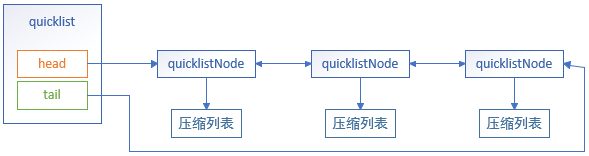
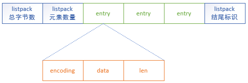
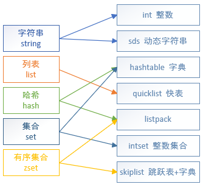

### SDS
- Redis 5.0修改了SDS的数据结构：  


> - len：记录了字符串的长度
> - alloc：分配给字符数组的空间长度。可以通过 alloc - len 计算出未使用的空间大小
> - flags：表示不同类型的 SDS。共5种类型，分别是 sdshdr5、sdshdr8、sdshdr16、sdshdr32 和 sdshdr64
> - buf[]：字符数组，用来保存实际数据

- 节省内存空间  
通过不同的flags类型，SDS的结构体也会不同。能灵活保存不同大小的字符串，从而有效节省内存空间。  
主要区别就在于，不同flags类型的数据结构中的len和alloc成员变量的数据类型不同。  
比如 sdshdr16 和 sdshdr32 这两个类型，它们的定义分别如下：

```
struct _attribute_((_packed_)) sdshdr16 {
    uint16_t len;
    uint16_t alloc;
    unsigned char flags;
    char buf[];
}

struct _attribute_((_packed_)) sdshdr32 {
    uint32_t len;
    uint32_t alloc;
    unsigned char flags;
    char buf[];
}
```

sdshdr16 类型的 len 和 alloc 的数据类型都是 uint16_t，表示字符数组长度和分配空间大小不能超过 2 的 16 次方。  
sdshdr32 则都是 uint32_t，表示表示字符数组长度和分配空间大小不能超过 2 的 32 次方。

Redis 在编程上还使用了专门的编译优化来节省内存空间，即在 struct 声明了 \_attribute\_((packed)) ，它的作用是：告诉编译器取消结构体在编译过程中的优化对齐，按照实际占用字节数进行对齐。


### quicklist
在 Redis 3.0 之前，List 对象的底层数据结构是双向链表或者压缩列表。然后在 Redis 3.2 的时候，List 对象的底层改由 quicklist 数据结构实现。

其实 quicklist 就是「双向链表 + 压缩列表」组合，如图，一个 quicklist 就是一个链表，而链表中的每个元素又是一个压缩列表。  


**quicklist**的结构定义：
```
typedef struct quicklist {
    //表头指针
    quicklistNode *head;
    //表尾指针
    quicklistNode *tail;
    //所有压缩列表中的总元素个数
    unsigned long count;
    //quicklistNodes的个数
    unsigned long len;
    //...
} quicklist;
```

**quicklistNode**的结构定义：
```
typedef struct quicklistNode {
    //前置节点
    struct quicklistNode *prev;
    //后置节点
    struct quicklistNode *next;
    //quicklistNode指向的压缩列表
    unsigned char *zl;
    //压缩列表的的字节大小
    unsigned int sz;
    //压缩列表的元素个数
    unsigned int count : 16;
    //...
} quicklistNode;
```

quicklistNode通过指针形成一个双向链表。链表节点不保存元素值，而是保存了一个压缩列表，所以有个指向压缩列表的指针 *zl。  
在向 quicklist 添加一个元素的时候，会先检查插入位置的压缩列表是否能容纳该元素，如果能容纳就直接保存到 quicklistNode 结构里的压缩列表；如果不能容纳，才会新建一个新的 quicklistNode 结构。


### listpack
quicklist 虽然通过控制 quicklistNode 结构里的压缩列表的大小或者元素个数，来减少连锁更新带来的性能影响，但是并没有完全解决连锁更新的问题。因为 quicklistNode 还是用了压缩列表来保存元素，压缩列表连锁更新的问题来源于它的结构设计，所以要想彻底解决这个问题，需要设计一个新的数据结构。

Redis 5.0种新设计一个数据结构叫 listpack，目的是替代压缩列表。  
listpack 中每个节点不再包含前一个节点的长度，压缩列表每个节点正因为需要保存前一个节点的长度，才会有连锁更新的隐患。  
listpack 只记录当前节点的长度，当向 listpack 加入一个新元素的时候，不会影响其他节点的长度字段的变化，从而避免了压缩列表的连锁更新问题。

listpack 采用了压缩列表的很多优秀的设计，比如还是用一块连续的内存空间来紧凑地保存数据，并且为了节省内存的开销，listpack 节点会采用不同的编码方式保存不同大小的数据。  


> encoding：定义该元素的编码类型，会对不同长度的整数和字符串进行编码；  
data：实际保存的元素数据；  
len：entry节点的长度。


### 字符串
- 当字符串对象的长度小于等于 44 字节时，Redis会使用 embstr 编码来存储这个字符串。当字符串对象的长度大于 44 字节时，Redis会改为使用 raw 编码。


### 类型与编码的关系图
