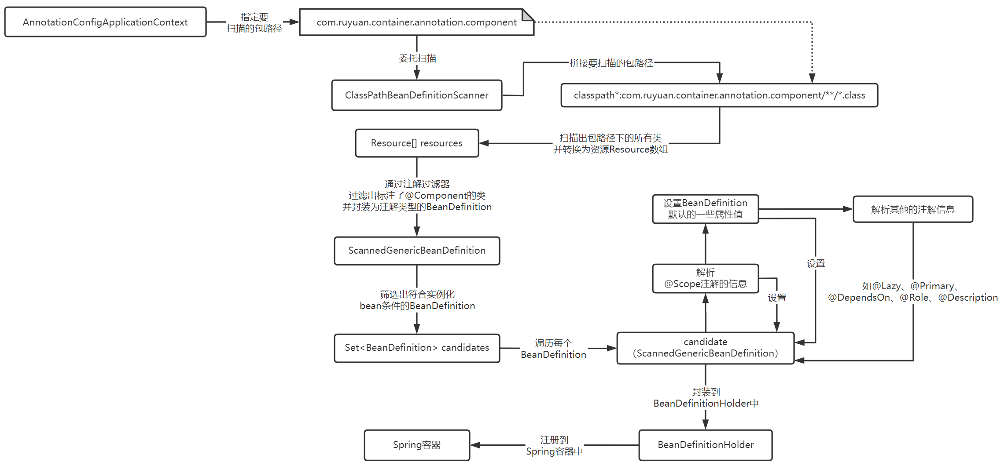
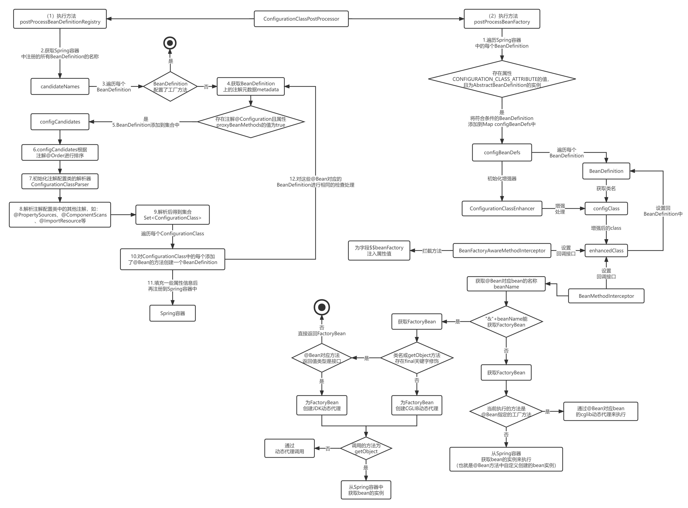
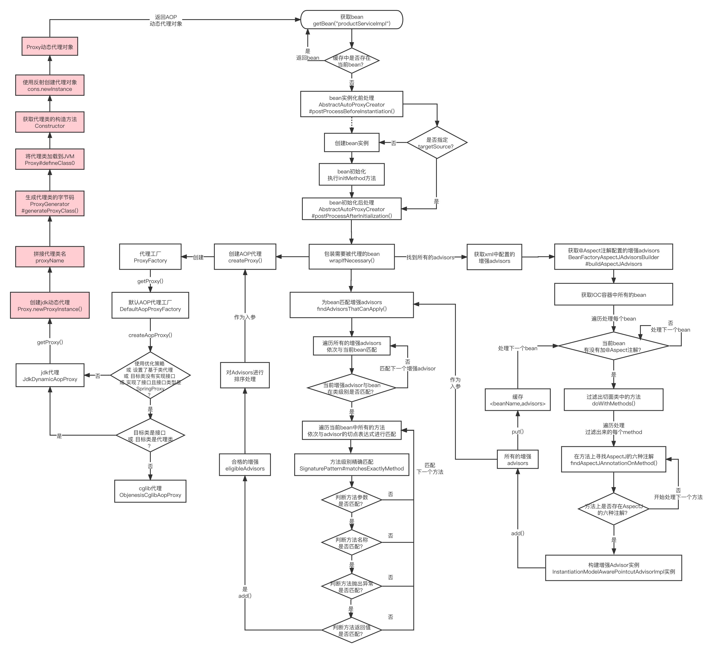

> Spring源码版本为v5.2.6.RELEASE
### XmlBeanFactory的工作原理分析
  
首先，通过ClassPathResource将applicationContext.xml配置文件封装起来，ClassPathResource会从resources目录下解析配置文件，从配置文件中解析bean标签，并获取bean标签上的id属性和class属性的值。通过class属性的值(即类全限定名称)，就可以通过反射创建bean，也就是创建了一个Player对象出来，然后再将Player对象放到Spring容器当中，Player对象在容器中的名称为属性id的值，Spring容器的初始化简单来说也就是干这些事。  
然后，当调用getBean方法时就会从Spring容器中加载bean了，Spring会根据给定bean的名称到Spring容器中获取bean，比如图中就是通过Player这个名称从Spring容器中获取Player对象。

### Resource

Resource类的继承图  
 
Spring统一把所有使用到的资源都抽象成了Resource，不同来源的资源对应着不同的Resource实现类。  

Resouece类中的方法  
Resource接口中提供了对资源状态判断的方法，还提供了资源到File、URI、URL的转换方法。  
Resource接口还提供了获取文件名称的getFilename方法，获取资源的描述信息的getDescription方法，getDescription方法一般它可以用于日志信息的打印。  

#### InputStreamSource
InputStreamSource接口中只有一个方法getInputStream():InputStream，而且方法返回的就是一个输入流InputStream。

### BeanDefinition
在Spring容器中的每一个对象都称为bean，每个bean在Spring容器中都是以BeanDefinition的形式存在的，BeanDefinition设计的初衷就是为了存放了bean的信息的，也就是bean的定义。  
  

BeanDefinition类继承图  
实现BeanDefinition接口的为抽象类AbstractBeanDefinition，而继承抽象类AbstractBeanDefinition的有三个类，分别是RootBeanDefinition、ChildrenBeanDefinition和GenericBeanDefinition，它们都用来封装从xml中解析来的bean信息。从Spring 2.5版本开始，Spring就推荐我们使用GenericBeanDefinition来替代RootBeanDefinition和ChildBeanDefinition。而AnnotatedGenericBeanDefinition用来封装与注解相关的bean。

### Spring初级容器初始化
  
&emsp;&emsp;首先通过ClassPathResource封装applicationContext.xml，在XmlBeanFactory的构造方法中，会将一些感知接口添加到ignoreDependencyInterfaces集合中，还会将Resource的加载任务委托给XmlBeanDefinitionReader。XmlBeanDefinitionReader首先会将Resource封装为EncodedResource，EncodedResource相比于传进来的Resource只不过多了一些字符集和编码相关的设置，然后通过Resource中的输入流创建了InputSource，接下来进入到真正加载资源的方法doLoadBeanDefinitions中。在doLoadBeanDefinitions方法中运用DOM解析技术创建Document对象。  
&emsp;&emsp;在解析之前，如果xml文件中存在字符串“DOCTYPE”就是DTD校验方式，否则就是XSD校验方式。对不同校验类型的xml文件，Spring分别准备了不同的解析器去校验它们，BeansDtdResolver负责获取DTD的声明文件，PluggableSchemaResolver负责获取XSD的声明文件。具体如何根据DTD或XSD的解析器去校验xml文件，那就要交给DOM相关的API去校验了。  
&emsp;&emsp;Document中的元素解析任务都交给BeanDefinitionParserDelegate来处理，对默认标签和自定义标签的解析需要分别处理。首先会初步解析bean标签的一些属性（如id、name、class、parent）并创建BeanDefinition的实现类GenericBeanDefinition，用于存放bean标签解析结果。然后Spring会解析bean标签的其它属性（如singleton、lazy-init、depends-on等）和bean的子标签及属性。  
&emsp;&emsp;Spring容器其实就是Map（beanDefinitionMap），它是多线程安全类型的ConcurrentHashMap，将bean注册到Spring容器中的过程，就是以bean的名称为key，以bean对应的BeanDefinition为value注册到beanDefinitionMap中。  

### ApplicationContext初始化的核心方法
.png ':size=70%')

### Spring高级容器初始化

### bean加载流程

### bean的作用域
Spring 中定义了多种 Bean 的作用域，用来控制 Bean 实例在容器中的生命周期和可见范围。以下是 Spring 提供的主要作用域：

1. singleton（单例）： 这是默认的作用域。在 Spring IoC 容器中，对于一个指定的 Bean 定义，容器只会创建一个共享的实例，并且所有对这个 Bean 的请求都会返回这个唯一的实例。这意味着在整个 ApplicationContext 生命周期内，单例 Bean 只会被初始化一次。
2. prototype（原型）： 对于 prototype 作用域的 Bean，Spring IoC 容器在每次客户端请求时都会创建一个新的 Bean 实例。因此，每次通过 getBean() 方法请求一个 prototype 类型的 Bean 时，容器都会生成一个新的对象实例。
3. request： 在 Web 应用程序环境下，每次 HTTP 请求都会创建一个新的 Bean 实例，请求完成后，该 Bean 就会被销毁。此作用域仅适用于 Web-aware Spring ApplicationContexts，例如 WebApplicationContext。
4. session： 同样仅适用于 Web 应用程序环境，对于每个 HTTP Session，Spring 容器会为该 Session 创建一个单独的 Bean 实例，该实例仅在该 Session 内有效，当 Session 被废弃时，相应的 Bean 实例也会被销毁。
5. global session： 类似于 session 作用域，但主要用于portlet环境，这里的全局 Session 是指portlet容器的概念，而不是标准的HTTP Session。
6. application 或者 singleton（在Servlet环境中的另一种表述方式）： 在 Servlet 环境中，有时也被称为 "application scope"，这样的 Bean 实例在全局的 ServletContext 范围内只有一个实例，即在整个 Web 应用生命周期内只创建一次，所有用户共享。

注意，request、session 和 global session 这三个作用域只在基于 Web 的 Spring 应用程序中适用，如果你使用的不是 WebApplicationContext，那么这些作用域是不可用的。而在非 Web 应用程序或普通的 Spring 应用程序中，主要关注的是 singleton 和 prototype 两种作用域。

### 注解

##### 注解的本质
注解的本质就是继承了Annotation接口的接口。  

### Spring解析@Component

### Spring解析@Configuration和@Bean

### Spring AOP代理的创建流程

### Spring中的设计模式
- 工厂模式：Spring使用工厂模式，通过BeanFactory和ApplicationContext来创建对象。
- 单例模式：Bean默认为单例模式。
- 策略模式：例如Resource的实现类，针对不同的资源文件，实现了不同方式的资源获取策略；在选择JDK动态代理或cglib动态代理时，会根据配置的启用优化策略、目标没有基于代理类、目标没有实现接口这几个条件，采用cglib动态代理，这也是策略模式。
- 代理模式：Spring AOP通过JDK的动态代理或CGLIB实现AOP代理，从而实现代理的功能。
- 模板方法：可以将相同部分的代码放在父类中，而将不同的代码放入不同的子类中，用来解决代码重复的问题。比如RestTemplate, JmsTemplate, JpaTemplate；Spring AOP在Advice中使用了模板方法模式，每个Advice都是一个模板方法，具体的业务逻辑需要用户自定义并重写其中的方法。
- 观察者模式: 在Spring AOP中，拦截器和通知之间就应用了观察者模式。
- 前置处理器模式: Spring AOP支持基于注解的切面声明，通过使用@Aspect注解和@Component注解组合使用，就可以实现一个简单的前置处理器模式。
- 责任链模式：Spring AOP通过递归调用ReflectiveMethodInvocation的方式，将所有的拦截器组成了一条调用链。

### SpringMVC工作流程
  

1.用户发送请求至前端控制器DispatcherServlet  
2.DispatcherServlet收到请求调用处理器映射器HandlerMapping  
3.处理器映射器根据请求url找到具体的处理器，生成处理器执行链HandlerExecutionChain(包括处理器对象和处理器拦截器)一并返回给DispatcherServlet  
4.DispatcherServlet根据处理器Handler获取处理器适配器HandlerAdapter执行HandlerAdapter处理一系列的操作，如：参数封装，数据格式转换，数据验证等操作  
5.执行处理器Handler(Controller，也叫页面控制器)  
6.Handler执行完成返回ModelAndView  
7.HandlerAdapter将Handler执行结果ModelAndView返回到DispatcherServlet  
8.DispatcherServlet将ModelAndView传给ViewResolver视图解析器  
9.ViewResolver解析后返回具体View  
10.DispatcherServlet对View进行渲染视图（即将模型数据model填充至视图中），再把结果响应给用户  