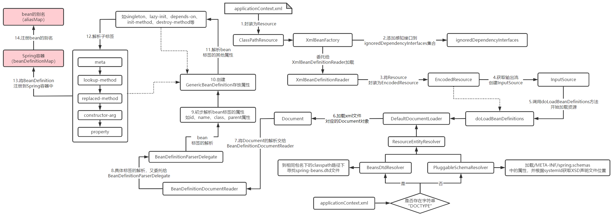
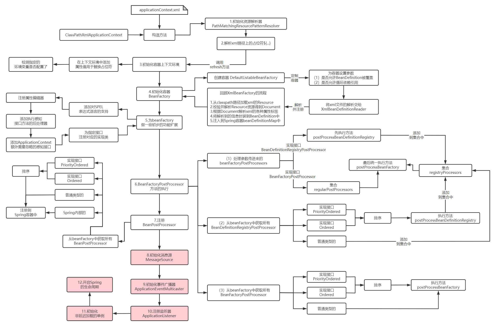
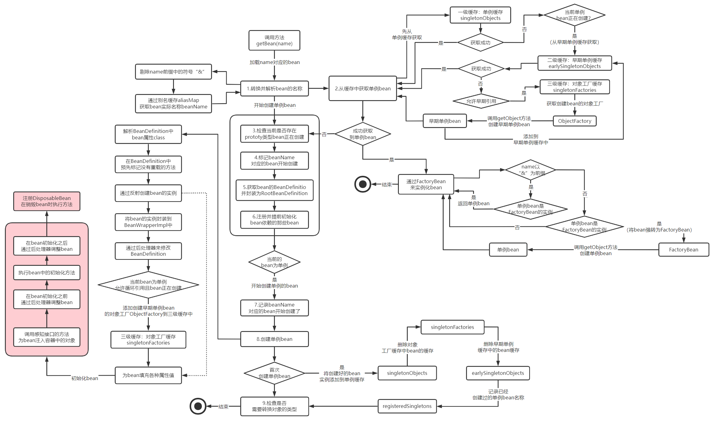

> Spring源码版本为v5.2.6.RELEASE
### XmlBeanFactory的工作原理分析
  
首先，通过ClassPathResource将applicationContext.xml配置文件封装起来，ClassPathResource会从resources目录下解析配置文件，从配置文件中解析bean标签，并获取bean标签上的id属性和class属性的值。通过class属性的值(即类全限定名称)，就可以通过反射创建bean，也就是创建了一个Player对象出来，然后再将Player对象放到Spring容器当中，Player对象在容器中的名称为属性id的值，Spring容器的初始化简单来说也就是干这些事。  
然后，当调用getBean方法时就会从Spring容器中加载bean了，Spring会根据给定bean的名称到Spring容器中获取bean，比如图中就是通过Player这个名称从Spring容器中获取Player对象。

### Resource

Resource类的继承图  
 
Spring统一把所有使用到的资源都抽象成了Resource，不同来源的资源对应着不同的Resource实现类。  

Resouece类中的方法  
Resource接口中提供了对资源状态判断的方法，还提供了资源到File、URI、URL的转换方法。  
Resource接口还提供了获取文件名称的getFilename方法，获取资源的描述信息的getDescription方法，getDescription方法一般它可以用于日志信息的打印。  

#### InputStreamSource
InputStreamSource接口中只有一个方法getInputStream():InputStream，而且方法返回的就是一个输入流InputStream。

### BeanDefinition
在Spring容器中的每一个对象都称为bean，每个bean在Spring容器中都是以BeanDefinition的形式存在的，BeanDefinition设计的初衷就是为了存放了bean的信息的，也就是bean的定义。  
  

BeanDefinition类继承图  
实现BeanDefinition接口的为抽象类AbstractBeanDefinition，而继承抽象类AbstractBeanDefinition的有三个类，分别是RootBeanDefinition、ChildrenBeanDefinition和GenericBeanDefinition，它们都用来封装从xml中解析来的bean信息。从Spring 2.5版本开始，Spring就推荐我们使用GenericBeanDefinition来替代RootBeanDefinition和ChildBeanDefinition。而AnnotatedGenericBeanDefinition用来封装与注解相关的bean。

### Spring初级容器初始化
  
&emsp;&emsp;首先通过ClassPathResource封装applicationContext.xml，在XmlBeanFactory的构造方法中，会将一些感知接口添加到ignoreDependencyInterfaces集合中，还会将Resource的加载任务委托给XmlBeanDefinitionReader。XmlBeanDefinitionReader首先会将Resource封装为EncodedResource，EncodedResource相比于传进来的Resource只不过多了一些字符集和编码相关的设置，然后通过Resource中的输入流创建了InputSource，接下来进入到真正加载资源的方法doLoadBeanDefinitions中。在doLoadBeanDefinitions方法中运用DOM解析技术创建Document对象。  
&emsp;&emsp;在解析之前，如果xml文件中存在字符串“DOCTYPE”就是DTD校验方式，否则就是XSD校验方式。对不同校验类型的xml文件，Spring分别准备了不同的解析器去校验它们，BeansDtdResolver负责获取DTD的声明文件，PluggableSchemaResolver负责获取XSD的声明文件。具体如何根据DTD或XSD的解析器去校验xml文件，那就要交给DOM相关的API去校验了。  
&emsp;&emsp;Document中的元素解析任务都交给BeanDefinitionParserDelegate来处理，对默认标签和自定义标签的解析需要分别处理。首先会初步解析bean标签的一些属性（如id、name、class、parent）并创建BeanDefinition的实现类GenericBeanDefinition，用于存放bean标签解析结果。然后Spring会解析bean标签的其它属性（如singleton、lazy-init、depends-on等）和bean的子标签及属性。  
&emsp;&emsp;Spring容器其实就是Map（beanDefinitionMap），它是多线程安全类型的ConcurrentHashMap，将bean注册到Spring容器中的过程，就是以bean的名称为key，以bean对应的BeanDefinition为value注册到beanDefinitionMap中。  

### ApplicationContext初始化的核心方法
.png ':size=70%')

### Spring高级容器初始化

### bean加载流程
